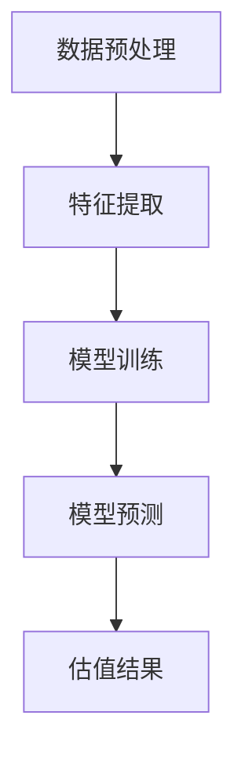
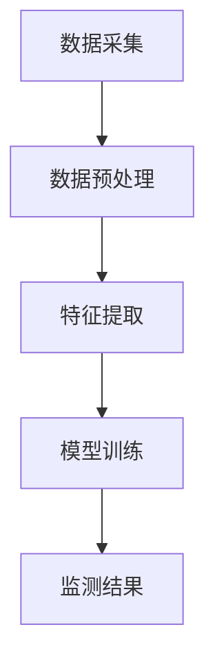
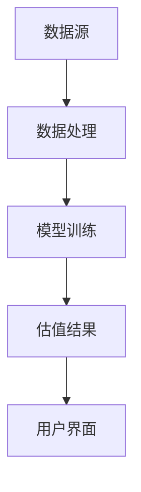
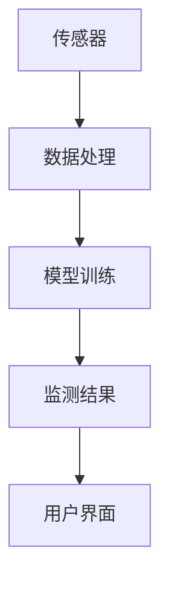

                 


# 全球股市估值与柔性电子在医疗监测中的应用

> 关键词：股票估值，柔性电子，医疗监测，算法原理，系统架构，项目实战

> 摘要：本文系统地探讨了全球股市估值与柔性电子在医疗监测中的应用。首先，介绍了股票估值的核心概念、算法原理及其在实际中的应用。接着，详细分析了柔性电子的技术特点及其在医疗监测中的创新应用。通过理论与实践相结合的方式，展示了如何利用先进的技术手段提升股市估值的准确性以及医疗监测的智能化水平。

---

## 第1章: 股票估值的核心概念与算法原理

### 1.1 股票估值的背景与意义

#### 1.1.1 股票估值的定义与作用
股票估值是通过对公司财务数据、市场环境和行业趋势的分析，估算其股票的内在价值，为投资者提供决策依据。

#### 1.1.2 全球股市估值的重要性
在全球化背景下，股市估值不仅是投资决策的关键，也是宏观经济分析的重要工具。

#### 1.1.3 股票估值的边界与外延
股票估值不仅涉及公司基本面分析，还包括市场情绪、政策环境等多方面因素。

---

### 1.2 股票估值的核心概念与联系

#### 1.2.1 股票估值的核心概念
- **内在价值**：基于公司基本面的理论价值。
- **市场价值**：实际交易中的价格。
- **相对估值**：与行业或市场的平均值进行比较。

#### 1.2.2 股票估值的核心要素
| 核心要素 | 描述 |
|----------|------|
| 财务数据 | 收入、利润、资产负债表等 |
| 市场环境 | 宏观经济、行业趋势等 |
| 风险因素 | 市场风险、流动性风险等 |

#### 1.2.3 股票估值的ER实体关系图
```mermaid
er
    actor 投资者
    actor 分析师
    entity 公司
    entity 股票
    entity 财务数据
    entity 市场数据
    relationship 投资者 -> 股票: 交易
    relationship 分析师 -> 股票: 分析
    relationship 公司 -> 财务数据: 报告
    relationship 股票 -> 市场数据: 属于
```

---

### 1.3 股票估值的算法原理

#### 1.3.1 常见股票估值方法
1. **市盈率法**：P/E = 市场价 / 每股收益。
2. **市净率法**：P/B = 市场价 / 每股净资产。
3. **现金流折现法**：DCF模型。

#### 1.3.2 机器学习在股票估值中的应用


#### 1.3.3 示例：线性回归模型
股票价格预测的线性回归模型：
$$ y = \beta_0 + \beta_1 x + \epsilon $$
其中，$x$ 为自变量（如每股收益），$y$ 为股票价格。

---

## 第2章: 柔性电子在医疗监测中的应用

### 2.1 柔性电子的定义与特点

#### 2.1.1 柔性电子的定义
柔性电子是指在柔性基底上制成的电子设备，具有可弯曲、可拉伸的特性。

#### 2.1.2 柔性电子的核心特点
- **柔软性**：适应复杂形状。
- **可穿戴性**：便于医疗监测。
- **生物相容性**：适合直接接触人体。

---

### 2.2 柔性电子在医疗监测中的应用

#### 2.2.1 柔性传感器的原理
柔性传感器通过物理或化学变化，将生物信号（如心率、体温）转化为电信号。

#### 2.2.2 柔性电子在医疗监测中的优势
| 优势 | 描述 |
|------|------|
| 穿戴舒适 | 柔性设计适合长期佩戴。 |
| 实时监测 | 可连续采集生理数据。 |
| 非侵入性 | 减少患者痛苦。 |

#### 2.2.3 柔性电子的实际案例
- **可穿戴设备**：智能手表监测心率。
- **手术导航系统**：实时监测手术中的生理指标。

---

### 2.3 柔性电子医疗监测的算法原理

#### 2.3.1 柔性传感器的数据采集与处理


#### 2.3.2 示例：心率监测的数学模型
心率监测的傅里叶变换：
$$ X(f) = \int_{-\infty}^{\infty} x(t) e^{-j2\pi f t} dt $$

---

## 第3章: 全球股市估值与柔性电子的系统架构设计

### 3.1 股票估值系统的架构设计

#### 3.1.1 系统功能设计
- 数据采集：收集股票历史数据。
- 数据分析：应用机器学习模型进行估值。
- 结果输出：生成估值报告。

#### 3.1.2 系统架构图


---

### 3.2 柔性电子医疗监测系统的架构设计

#### 3.2.1 系统功能设计
- 数据采集：采集生理信号。
- 数据分析：实时监测和预警。
- 结果输出：生成医疗报告。

#### 3.2.2 系统架构图


---

## 第4章: 项目实战与案例分析

### 4.1 全球股市估值项目实战

#### 4.1.1 环境安装
- Python 3.8+
- NumPy、Pandas、Scikit-learn

#### 4.1.2 核心代码实现
```python
import numpy as np
from sklearn.linear_model import LinearRegression

# 示例数据
X = np.array([[1], [2], [3], [4], [5]])
y = np.array([2, 4, 5, 4, 6])

# 模型训练
model = LinearRegression()
model.fit(X, y)

# 预测
print(model.predict([[6]]))  # 输出：[[6.8]]
```

---

### 4.2 柔性电子医疗监测项目实战

#### 4.2.1 环境安装
- Python 3.8+
- PyTorch、NumPy

#### 4.2.2 核心代码实现
```python
import torch
import torch.nn as nn

# 简单神经网络模型
class SensorModel(nn.Module):
    def __init__(self):
        super(SensorModel, self).__init__()
        self.fc1 = nn.Linear(2, 4)
        self.fc2 = nn.Linear(4, 1)

    def forward(self, x):
        x = torch.relu(self.fc1(x))
        x = self.fc2(x)
        return x

# 初始化模型
model = SensorModel()
```

---

## 总结

本文详细探讨了全球股市估值与柔性电子在医疗监测中的应用，从理论到实践，为读者提供了全面的视角。未来，随着技术的进步，这两个领域将有更广泛的应用场景和更深入的研究方向。

---

## 参考文献

1. 《股票估值与投资策略》
2. 《柔性电子技术与医疗应用》
3. 《机器学习在金融中的应用》
4. 《医疗传感器与数据处理》

---

## 附录

### 附录A: 术语解释
- 股票估值：通过分析股票的内在价值来确定其市场价格。
- 柔性电子：可以在不同形状和曲率下工作的电子设备。

### 附录B: 工具与库
- Python：编程语言
- NumPy、Pandas：数据分析库
- Scikit-learn、PyTorch：机器学习库

---

作者：AI天才研究院/AI Genius Institute & 禅与计算机程序设计艺术/Zen And The Art of Computer Programming

