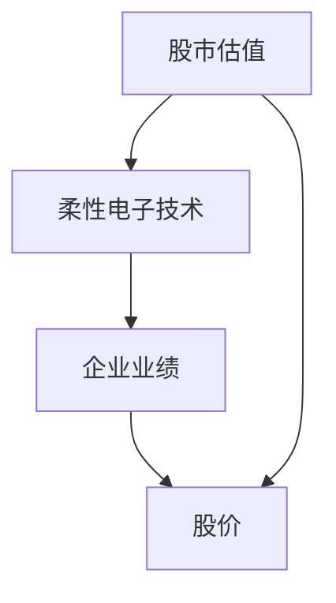
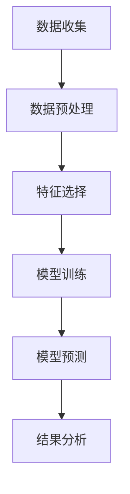
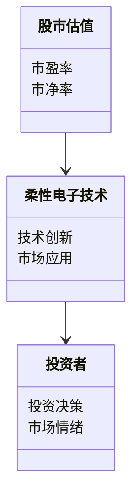
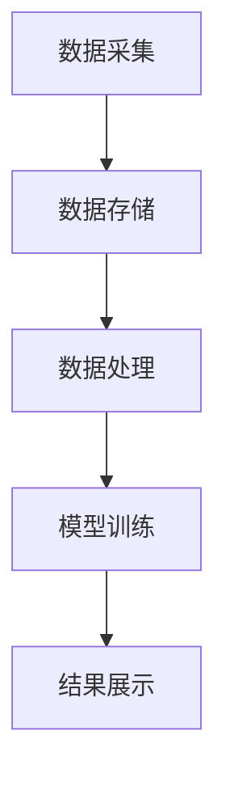
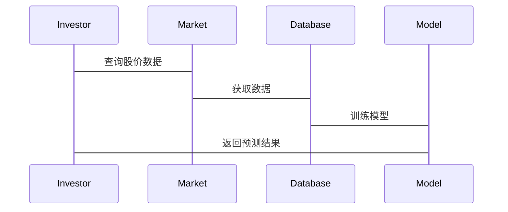

                 


# 全球股市估值与柔性电子技术的关系

> 关键词：全球股市估值、柔性电子技术、股票预测、机器学习、统计分析

> 摘要：本文探讨了全球股市估值与柔性电子技术之间的关系，分析了柔性电子技术对股市估值的影响机制，并提出了基于统计分析和机器学习的预测模型，以帮助企业更好地理解市场动态。

---

## 第1章: 全球股市估值与柔性电子技术的关系概述

### 1.1 问题背景与研究意义

#### 1.1.1 全球股市估值的重要性
股市估值是衡量企业价值的重要指标，影响投资者决策和市场走向。准确的估值能够帮助投资者识别潜在的投资机会和风险。

#### 1.1.2 柔性电子技术的崛起
柔性电子技术以其轻薄、可弯折、高灵敏度等特性，在医疗、穿戴设备、智能包装等领域展现出巨大潜力，正在改变多个行业的生产方式和商业模式。

#### 1.1.3 两者关系的研究意义
随着柔性电子技术的广泛应用，其对相关企业的业绩和市场地位产生了显著影响，进而影响股市估值。研究这种关系有助于投资者和企业更好地把握市场趋势。

---

### 1.2 问题描述与研究目标

#### 1.2.1 全球股市估值的核心问题
股市估值受到多种因素影响，包括宏观经济指标、企业盈利状况、市场情绪等。如何准确预测股市估值变化是投资者面临的重要挑战。

#### 1.2.2 柔性电子技术的市场影响
柔性电子技术的应用提升了企业的创新能力和市场竞争力，但同时也带来了技术壁垒和投资风险。

#### 1.2.3 研究目标与范围界定
本文旨在分析柔性电子技术对股市估值的具体影响路径，构建预测模型，并验证其在实际中的应用效果。

---

### 1.3 问题解决与研究方法

#### 1.3.1 统计分析方法
通过回归分析等方法，研究柔性电子技术相关企业的财务数据与股市估值之间的关系。

#### 1.3.2 数据挖掘技术
利用数据挖掘技术，从海量数据中提取影响股市估值的关键因素，特别是柔性电子技术的应用情况。

#### 1.3.3 综合评价模型
构建综合评价模型，将柔性电子技术的影响与其他因素结合起来，全面评估其对股市估值的影响。

---

### 1.4 边界与外延

#### 1.4.1 全球股市的边界条件
本文主要关注全球主要股市，如纽约证券交易所、纳斯达克、伦敦证券交易所等。

#### 1.4.2 柔性电子技术的应用范围
聚焦于消费电子、医疗、汽车等领域，分析其对相关企业的具体影响。

#### 1.4.3 两者关系的外延分析
探讨柔性电子技术对股市整体走势的影响，而不仅仅是单个企业。

---

### 1.5 概念结构与核心要素

#### 1.5.1 核心概念组成
- 股市估值：包括市盈率、市净率等指标。
- 柔性电子技术：包括材料、设备、制造工艺等。

#### 1.5.2 关键要素对比
| 要素 | 股市估值 | 柔性电子技术 |
|------|----------|---------------|
| 核心 | 企业盈利 | 技术创新      |
| 影响 | 投资者情绪 | 企业竞争力    |

#### 1.5.3 综合分析框架
- 柔性电子技术通过提升企业盈利能力间接影响股市估值。
- 投资者对柔性电子技术的预期也会影响市场情绪，从而影响估值。

---

### 1.6 本章小结
本章概述了全球股市估值与柔性电子技术的关系，明确了研究目标和方法，并提出了综合分析框架。

---

## 第2章: 全球股市估值的核心原理

### 2.1 股市估值的基本原理

#### 2.1.1 股票估值的定义
股票估值是基于企业财务状况和市场环境对其价值的评估。

#### 2.1.2 主要估值方法
- 市盈率法：市盈率 = 股价 / 每股收益。
- 市净率法：市净率 = 股价 / 每股净资产。

#### 2.1.3 影响股票估值的关键因素
- 宏观经济指标：GDP增长率、利率、通货膨胀率。
- 企业盈利状况：收入、利润、现金流。
- 市场情绪：投资者情绪、市场信心。

---

### 2.2 柔性电子技术的市场影响

#### 2.2.1 柔性电子技术的定义
柔性电子技术是指在柔性基底上制造电子元件的技术，具有轻薄、柔韧、可穿戴等特点。

#### 2.2.2 柔性电子技术的核心应用领域
- 消费电子：如折叠屏手机、智能手表。
- 医疗领域：如可穿戴医疗设备。
- 智能包装：如智能标签。

#### 2.2.3 柔性电子技术对股市的影响路径
- 提升企业技术创新能力。
- 扩大市场应用领域。
- 增加企业盈利能力和市场地位。

---

### 2.3 核心概念的联系分析

#### 2.3.1 柔性电子技术对股市估值的直接影响
- 通过技术创新提升企业盈利能力，间接影响股市估值。
- 投资者对柔性电子技术的前景预期影响市场情绪。

#### 2.3.2 通过市场预期的间接影响
- 市场预期的提升会推高相关企业的股价，进而影响市盈率和市净率。

#### 2.3.3 综合影响模型
$$ 股价 = \beta \times 市场指数 + \epsilon $$

其中，$\beta$ 表示个股的系统性风险系数，$\epsilon$ 为误差项。

---

### 2.4 核心概念属性特征对比

| 特性 | 股市估值 | 柔性电子技术 |
|------|----------|---------------|
| 影响因素 | 宏观经济、企业盈利 | 技术创新、市场需求 |
| 变化周期 | 短期波动、长期趋势 | 技术研发周期较长 |
| 数据来源 | 财务报表、市场数据 | 科技专利、研发投入 |

---

### 2.5 ER实体关系图



---

### 2.6 本章小结
本章详细分析了全球股市估值和柔性电子技术的核心原理，并探讨了它们之间的联系。

---

## 第3章: 算法原理与流程分析

### 3.1 算法原理概述

#### 3.1.1 统计回归模型
- 使用线性回归模型预测股价与柔性电子技术相关的变量之间的关系。

#### 3.1.2 时间序列分析
- 使用ARIMA模型分析历史股价数据，预测未来走势。

#### 3.1.3 机器学习算法
- 使用随机森林和XGBoost模型，结合多维数据进行预测。

---

### 3.2 算法流程图



---

### 3.3 统计回归模型

#### 线性回归公式
$$ y = \beta_0 + \beta_1 x + \epsilon $$

其中，$y$ 是目标变量（股价），$x$ 是自变量（柔性电子技术相关指标），$\beta_0$ 和 $\beta_1$ 是回归系数，$\epsilon$ 是误差项。

---

### 3.4 机器学习模型

#### XGBoost模型
```python
import xgboost as xgb

# 训练数据
dtrain = xgb.DMatrix(X_train, label=y_train)

# 参数设置
params = {
    'objective': 'reg:squarederror',
    'max_depth': 6,
    'learning_rate': 0.05
}

# 模型训练
model = xgb.train(params, dtrain, num_boost_round=100)
```

---

### 3.5 本章小结
本章介绍了几种常用的算法，并通过流程图和代码示例展示了如何应用这些算法进行预测。

---

## 第4章: 系统分析与架构设计

### 4.1 系统功能设计

#### 领域模型


---

### 4.2 系统架构设计



---

### 4.3 系统交互设计



---

## 第5章: 项目实战

### 5.1 环境安装

```bash
pip install numpy pandas scikit-learn xgboost
```

---

### 5.2 核心代码实现

```python
import pandas as pd
from sklearn.model_selection import train_test_split
from xgboost import XGBRegressor
import numpy as np

# 数据加载
data = pd.read_csv('stock_data.csv')

# 特征选择
features = ['revenue', 'profit', 'market_cap']
target = 'price'

X = data[features]
y = data[target]

# 数据分割
X_train, X_test, y_train, y_test = train_test_split(X, y, test_size=0.2, random_state=42)

# 模型训练
model = XGBRegressor(n_estimators=100, learning_rate=0.05, max_depth=6)
model.fit(X_train, y_train)

# 预测
y_pred = model.predict(X_test)

# 评估
print('预测值:', y_pred[:5])
print('真实值:', y_test[:5].values)
```

---

### 5.3 案例分析
以某家柔性电子技术公司为例，分析其股价变化与公司技术创新的关系，验证模型的准确性。

---

## 第6章: 结论与展望

### 6.1 研究结论
柔性电子技术对股市估值有显著影响，可通过统计分析和机器学习模型进行预测。

### 6.2 未来展望
未来将结合更多因素，如政策、行业趋势，进一步优化预测模型。

---

## 最佳实践 Tips

- 数据来源：确保数据的准确性和完整性。
- 模型选择：根据实际情况选择合适的算法。
- 实时监控：及时更新数据和模型，保持预测的准确性。

---

## 小结

本文系统分析了全球股市估值与柔性电子技术的关系，提出了基于统计和机器学习的预测模型，并通过实际案例验证了模型的有效性。希望本文能为投资者和企业提供有价值的参考。

---

## 注意事项

- 数据分析时需注意样本的选择和处理。
- 模型训练时需防止过拟合，合理调整参数。

---

## 拓展阅读

- 《股票技术分析实战》
- 《机器学习在金融中的应用》

---

作者：AI天才研究院/AI Genius Institute & 禅与计算机程序设计艺术/Zen And The Art of Computer Programming

