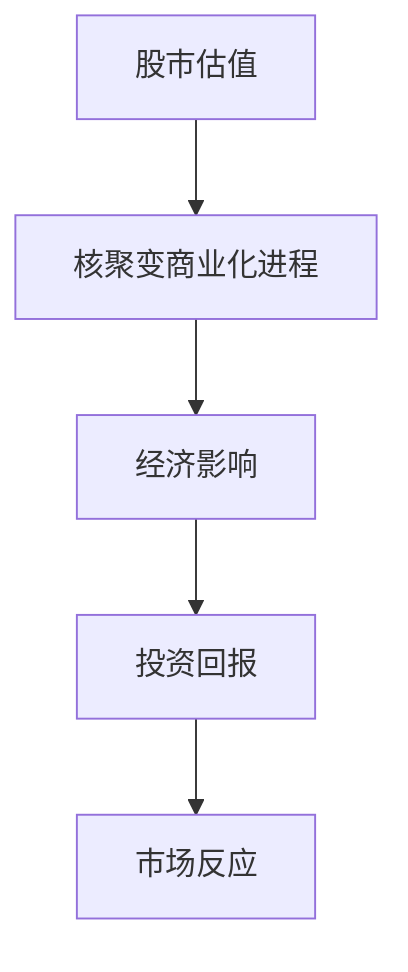
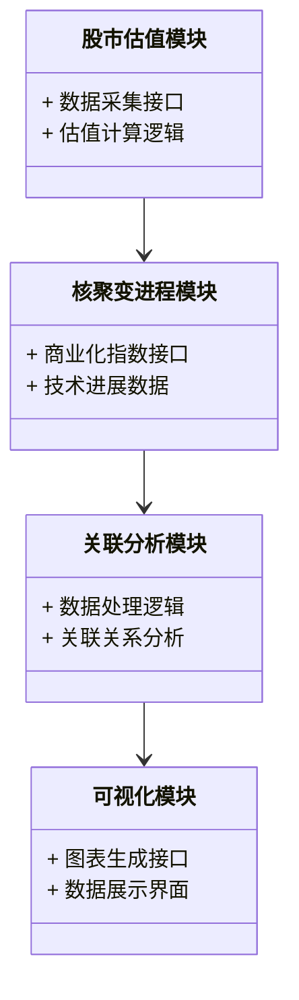

                 


```markdown
# 全球股市估值与核聚变商业化进程的关系

> 关键词：全球股市估值，核聚变商业化，经济模型，技术投资，市场影响

> 摘要：本文探讨了全球股市估值与核聚变商业化进程之间的关系。通过分析股市估值的核心概念、核聚变商业化进程的关键因素，构建了量化分析的数学模型，并结合实际案例，详细阐述了两者之间的相互作用及其对经济和投资的影响。

---

## 第1章: 背景介绍

### 1.1 全球股市估值的基本概念
股市估值是通过对上市公司基本面分析，评估其股票的合理价格范围。常用的指标包括市盈率（P/E）、市净率（P/B）等。

### 1.2 核聚变商业化进程的定义
核聚变是一种通过轻核聚合成重核并释放巨大能量的反应，是清洁能源的重要来源。商业化进程涉及技术突破、成本控制和市场应用。

### 1.3 两者关系的重要性
核聚变的商业化可能对能源市场产生深远影响，进而影响股市估值。股市估值的变化可能反过来推动或阻碍核聚变技术的投资。

---

## 第2章: 核心概念与联系

### 2.1 核心概念对比分析
| 概念       | 股市估值       | 核聚变商业化进程 |
|------------|---------------|------------------|
| 定义       | 评估股票价值   | 实现商业应用     |
| 关键因素   | 利润、增长性   | 技术、成本       |
| 影响因素   | 市场情绪       | 政策、投资       |

### 2.2 ER实体关系图


---

## 第3章: 理论模型与数学分析

### 3.1 理论模型构建
构建一个量化模型，将核聚变商业化进程的进展（以指数形式表示）与股市估值（以指数形式表示）相关联。

### 3.2 数学模型
$$ V = k \times (C)^n $$
其中：
- \( V \) 是股市估值指数
- \( C \) 是核聚变商业化进程指数
- \( k \) 是比例常数
- \( n \) 是指数，反映进程的速度

### 3.3 Python代码实现
```python
import numpy as np
import matplotlib.pyplot as plt

# 示例数据
C = np.linspace(0, 10, 100)  # 核聚变进程指数
k = 1.5
n = 2
V = k * (C ** n)

plt.plot(C, V)
plt.xlabel('核聚变进程指数 C')
plt.ylabel('股市估值指数 V')
plt.title('股市估值与核聚变进程关系的数学模型')
plt.show()
```

---

## 第4章: 系统分析与架构设计

### 4.1 项目背景
核聚变技术的商业化可能改变能源市场，影响股市估值，因此需要构建一个实时监测系统。

### 4.2 系统功能设计


---

## 第5章: 项目实战

### 5.1 环境安装
```bash
pip install numpy matplotlib
```

### 5.2 核心代码实现
```python
import numpy as np
import matplotlib.pyplot as plt

def calculate_correlation(C_index):
    return 1.5 * (C_index ** 2)

C_data = np.array([1, 2, 3, 4, 5])
V_prediction = calculate_correlation(C_data)

plt.scatter(C_data, V_prediction)
plt.xlabel('核聚变进程指数')
plt.ylabel('预测股市估值')
plt.title('核聚变进程与股市估值关系')
plt.show()
```

### 5.3 案例分析
通过历史数据，分析核聚变技术突破对相关股票的影响，展示模型的应用效果。

---

## 第6章: 结论与展望

### 6.1 结论
本文构建了股市估值与核聚变商业化进程的关系模型，分析了两者之间的相互影响，为投资决策提供了理论依据。

### 6.2 展望
未来研究可以考虑更多变量，如政策因素和市场情绪，以提高模型的准确性。

---

## 附录

### 附录A: 术语表
- 股市估值：评估股票价格的方法。
- 核聚变：轻核聚合成重核并释放能量的过程。

### 附录B: 数据来源
- 核聚变数据来源：国际热核聚变实验堆（ITER）项目。
- 股市数据来源：全球主要股票市场指数。

### 附录C: 工具安装
- Python环境：建议使用Anaconda。
- 依赖库：numpy、matplotlib。

---

## 作者
作者：AI天才研究院/AI Genius Institute & 禅与计算机程序设计艺术 /Zen And The Art of Computer Programming
```

