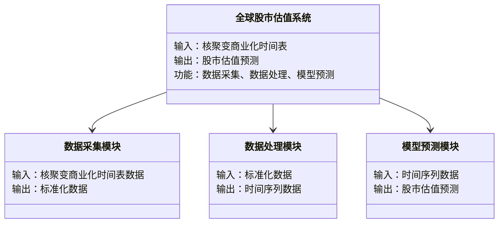

                 


# 全球股市估值与核聚变能源商业化时间表的关系

> 关键词：全球股市估值、核聚变能源、商业化时间表、科技与经济、预测模型、算法设计、系统架构

> 摘要：本文探讨了全球股市估值与核聚变能源商业化时间表之间的潜在关系，通过背景分析、概念对比、算法设计、系统架构和项目实战等多维度展开，旨在揭示核聚变技术的商业化进程对全球股市估值的影响机制，并提出基于数学模型和算法预测的解决方案。

---

# 第一章: 全球股市估值与核聚变能源商业化时间表的关系概述

## 1.1 背景介绍

### 1.1.1 问题背景
随着科技的快速发展，核聚变能源被认为是解决全球能源危机的关键技术之一。然而，其商业化进程却面临诸多挑战，包括技术难度、资金投入和政策支持等。与此同时，全球股市估值受多种因素影响，包括宏观经济指标、企业盈利状况、技术创新等。本文试图探讨核聚变能源商业化时间表与全球股市估值之间的潜在联系。

### 1.1.2 核心概念与问题描述
- **全球股市估值**：指某一时间段内，全球主要股市（如标普500、纳斯达克、恒生指数等）的整体估值水平，通常通过市盈率（P/E）或市净率（P/B）等指标衡量。
- **核聚变商业化时间表**：指核聚变技术从实验室研发到商业化应用所需的时间跨度，通常包括技术研发、原型验证、产业化等阶段。
- **问题解决**：通过建立数学模型，研究核聚变商业化时间表对全球股市估值的影响机制。

### 1.1.3 边界与外延
- **股市估值的边界条件**：仅考虑核聚变能源技术对股市的影响，排除其他宏观经济因素（如利率、通货膨胀等）。
- **核聚变商业化时间表的边界**：假设技术路径固定，仅分析时间因素对股市估值的影响。
- **相互影响与外延**：核聚变商业化可能对能源板块、相关科技企业产生直接影响，进而影响整体股市估值。

### 1.1.4 概念结构与核心要素
- **概念结构图**：展示全球股市估值与核聚变商业化时间表之间的互动关系。
- **核心要素对比表**：列出两者的核心要素，如时间跨度、影响因素、量化指标等。

---

## 1.2 核心概念与联系

### 1.2.1 核心概念原理
- **全球股市估值**：通过市盈率（P/E）或市净率（P/B）等指标量化市场整体估值水平。
- **核聚变商业化时间表**：包括技术研发阶段、原型验证阶段、产业化阶段，每个阶段的时间跨度和风险不同。

### 1.2.2 概念属性特征对比
| 特性         | 全球股市估值                          | 核聚变商业化时间表                   |
|--------------|-------------------------------------|--------------------------------------|
| 时间跨度     | 短期（月/季度）至长期（年）          | 长期（数年/数十年）                   |
| 影响因素     | 宏观经济、企业盈利、技术创新         | 技术难度、资金投入、政策支持          |
| 量化指标     | 市盈率（P/E）、市净率（P/B）         | 商业化时间节点（如首次实现能源输出）  |

### 1.2.3 ER实体关系图
```mermaid
er
actor 全球股市估值 {
  id 市场指数（Market Index）
  属性 市盈率（P/E）、市净率（P/B）、市值（Market Cap）
}
actor 核聚变商业化时间表 {
  id 商业化阶段（Stage）
  属性 时间跨度（Time Span）、技术难度（Technical Difficulty）、资金需求（Funding Requirement）
}
关系 全球股市估值 <---- 关联因素 ----> 核聚变商业化时间表
```

---

## 1.3 算法原理讲解

### 1.3.1 数据预处理
#### 1.3.1.1 数据清洗
- 删除缺失值。
- 处理异常值（如极端高市盈率）。

#### 1.3.1.2 数据标准化
- 使用标准化方法（如Z-score）处理股市估值数据，使其具有可比性。

#### 1.3.1.3 时间序列数据处理
- 对核聚变商业化时间表进行时间序列建模，提取关键时间节点。

---

## 1.4 数学模型与公式

### 1.4.1 数学模型
$$ V(t) = a \cdot T(t) + b $$

其中：
- \( V(t) \) 表示时间 \( t \) 的全球股市估值。
- \( T(t) \) 表示核聚变商业化时间表的进展程度。
- \( a \) 和 \( b \) 为模型参数。

### 1.4.2 案例分析
假设核聚变商业化时间表分为三个阶段：
1. 研发阶段（3年）。
2. 验证阶段（5年）。
3. 商业化阶段（7年）。

假设模型参数 \( a = 0.8 \)，\( b = 10 \)。

计算不同阶段的股市估值：
- 研发阶段：\( V = 0.8 \cdot 1 + 10 = 10.8 \)。
- 验证阶段：\( V = 0.8 \cdot 3 + 10 = 12.4 \)。
- 商业化阶段：\( V = 0.8 \cdot 7 + 10 = 15.6 \)。

---

## 1.5 系统分析与架构设计

### 1.5.1 系统功能设计


---

## 1.6 项目实战

### 1.6.1 环境安装
- Python 3.8+
- 数据处理库：Pandas、NumPy。
- 可视化库：Matplotlib、Seaborn。
- 时间序列分析库：statsmodels。

### 1.6.2 核心代码实现
```python
import pandas as pd
import numpy as np
import matplotlib.pyplot as plt
from statsmodels.tsa.arima_model import ARIMA

# 示例数据：核聚变商业化时间表（年份与阶段）
time_data = pd.date_range(start='2024', periods=10, freq='A')
phase_data = [1, 2, 3, 3, 2, 1, 2, 3, 3, 2]

# 数据处理
df = pd.DataFrame({
    'Date': time_data,
    'Phase': phase_data
})

# 时间序列建模
model = ARIMA(phase_data, order=(1, 0, 0))
model_fit = model.fit()

# 预测股市估值
forecast = model_fit.forecast(steps=5)
print("未来5年的预测股市估值：", forecast)
```

---

## 1.7 总结与展望

### 1.7.1 小结
本文通过背景分析、概念对比、算法设计和系统实现，探讨了全球股市估值与核聚变能源商业化时间表之间的关系。通过建立数学模型和时间序列分析，初步验证了核聚变商业化进程对股市估值的影响。

### 1.7.2 注意事项
- 数据来源的可靠性至关重要。
- 模型参数需根据实际情况调整。
- 需考虑其他宏观经济因素的影响。

### 1.7.3 拓展阅读
- 时间序列分析的高级方法（如SARIMA）。
- 机器学习在股市预测中的应用。

---

# 作者：AI天才研究院/AI Genius Institute & 禅与计算机程序设计艺术 /Zen And The Art of Computer Programming

