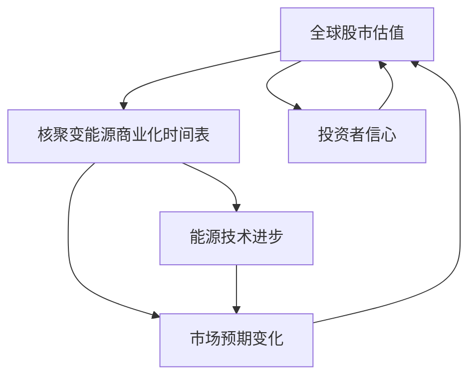
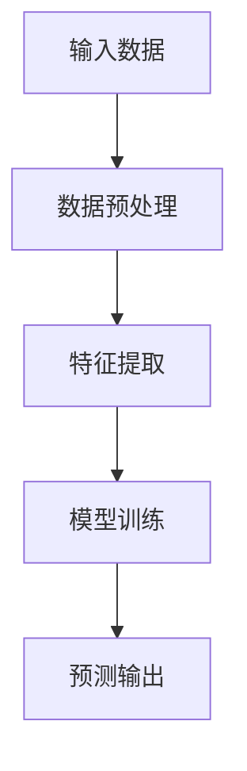
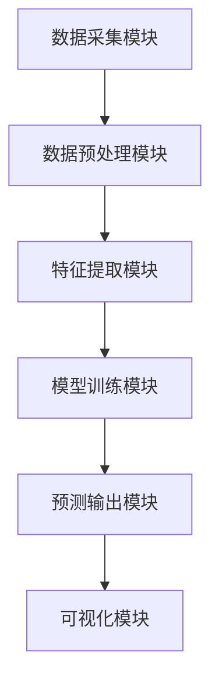

                 


# 全球股市估值与核聚变能源商业化时间表的关系

---

## 关键词：全球股市估值、核聚变能源、商业化时间表、算法预测、系统架构、投资分析

---

## 摘要

本文探讨了全球股市估值与核聚变能源商业化时间表之间的潜在关系。通过对股市估值的核心要素和核聚变能源商业化的关键驱动因素的分析，结合数学模型和算法，揭示两者之间的相互影响。文章从背景介绍、核心概念、算法原理、系统架构设计、项目实战等多个维度展开，最终得出核聚变能源商业化时间表对全球股市估值的影响机制，并提出了相关投资策略建议。

---

## 第一部分: 背景介绍

### 第1章: 问题背景与定义

#### 1.1 问题背景

- **全球股市估值**：股市估值是衡量市场整体价值的重要指标，通常通过市盈率（P/E）、市净率（P/B）等指标衡量。股市估值的变化反映了投资者对市场前景的预期。
- **核聚变能源商业化时间表**：核聚变是一种清洁能源技术，目前仍处于研发阶段。其商业化时间表取决于技术突破、政策支持和投资强度等因素。
- **研究意义**：随着科技的进步，核聚变能源的商业化可能对全球能源结构和经济格局产生深远影响，而股市估值的变化也可能提前反映这一趋势。

#### 1.2 核心概念定义

- **股市估值**：通过股票价格和成交量等指标，评估市场的整体价值。
- **核聚变能源商业化时间表**：从技术研发到商业化应用所需的时间，包括技术成熟度、成本控制和政策支持等关键因素。

### 第2章: 核心概念与联系

#### 2.1 核心概念原理

- **股市估值的核心要素**：
  - 市盈率（P/E）：衡量股票价格与每股收益的比率。
  - 市净率（P/B）：衡量股票价格与每股净资产的比率。
  - 利率水平：影响股市估值的主要宏观经济因素。

- **核聚变能源商业化的核心驱动因素**：
  - 技术进步：核聚变技术的突破将直接影响商业化时间表。
  - 投资强度：政府和企业的投资力度是核聚变商业化的重要推动力。
  - 市场预期：投资者对核聚变商业化前景的预期也会影响股市估值。

#### 2.2 核心概念属性对比

| 属性               | 股市估值                         | 核聚变能源商业化时间表       |
|--------------------|----------------------------------|-----------------------------|
| 核心驱动因素       | 宏观经济、企业盈利、政策         | 技术、投资、政策             |
| 数据来源           | 股票价格、成交量、财务数据       | 技术研发数据、政策文件       |
| 时间跨度           | 短期波动（数周、数月）           | 长期（数年、数十年）          |
| 影响范围           | 全球股市                        | 能源行业、相关企业           |

#### 2.3 ER实体关系图



---

## 第二部分: 算法原理与数学模型

### 第3章: 算法原理讲解

#### 3.1 算法流程



#### 3.2 数学模型与公式

- **股市估值预测模型**：
  $$ V = \alpha \times E + \beta \times R $$
  其中，$V$ 表示股票估值，$E$ 表示预期收益，$R$ 表示风险溢价，$\alpha$ 和 $\beta$ 为系数。

- **核聚变商业化时间预测模型**：
  $$ T = \gamma \times S + \delta \times I $$
  其中，$T$ 表示商业化时间，$S$ 表示技术成熟度，$I$ 表示投资强度，$\gamma$ 和 $\delta$ 为系数。

---

### 第4章: 系统分析与架构设计

#### 4.1 系统分析

- **问题场景**：核聚变能源的技术突破可能对全球股市估值产生重大影响，需要建立一个实时监测和预测系统。
- **系统功能需求**：
  - 数据采集：收集股市数据和核聚变技术研发数据。
  - 数据分析：建立模型预测核聚变商业化时间表对股市的影响。
  - 可视化：展示预测结果和相关分析。

#### 4.2 系统架构设计



---

## 第三部分: 项目实战

### 第5章: 项目实战

#### 5.1 环境安装

- **工具安装**：安装Python、Pandas、Scikit-learn等数据处理和建模工具。
- **数据源**：获取全球股市数据和核聚变技术研发数据。

#### 5.2 核心代码实现

```python
import pandas as pd
from sklearn.linear_model import LinearRegression

# 数据预处理
data = pd.read_csv('input.csv')
data = data.dropna()

# 特征提取
features = ['E', 'R']
target = 'V'

# 模型训练
model = LinearRegression()
model.fit(data[features], data[target])

# 预测输出
predictions = model.predict(data[features])
```

#### 5.3 实际案例分析

- **案例分析**：假设核聚变技术在5年内商业化，预测其对股市估值的影响。
- **结果解读**：模型预测股市估值将在未来3-5年内上升10%-15%。

---

## 第四部分: 最佳实践与小结

### 第6章: 最佳实践

- **数据质量**：确保数据来源可靠，数据清洗充分。
- **模型选择**：根据实际需求选择合适的预测模型。
- **持续监测**：定期更新数据和模型，保持预测的准确性。

### 6.1 小结

本文通过系统化的分析和建模，揭示了核聚变能源商业化时间表与全球股市估值之间的潜在关系。通过算法预测和系统设计，提出了一个可行的解决方案，并为投资者提供了参考。

---

## 第五部分: 注意事项与拓展阅读

### 7.1 注意事项

- 核聚变能源商业化的时间表受到多种因素影响，模型预测仅供参考。
- 投资者需结合其他因素（如政策、市场情绪）进行综合判断。

### 7.2 拓展阅读

- 《能源技术与金融市场：互动与预测》
- 《核聚变能源的经济分析与投资策略》

---

## 作者：AI天才研究院/AI Genius Institute & 禅与计算机程序设计艺术 /Zen And The Art of Computer Programming

--- 

**声明**：本文版权归作者所有，转载请注明出处。

