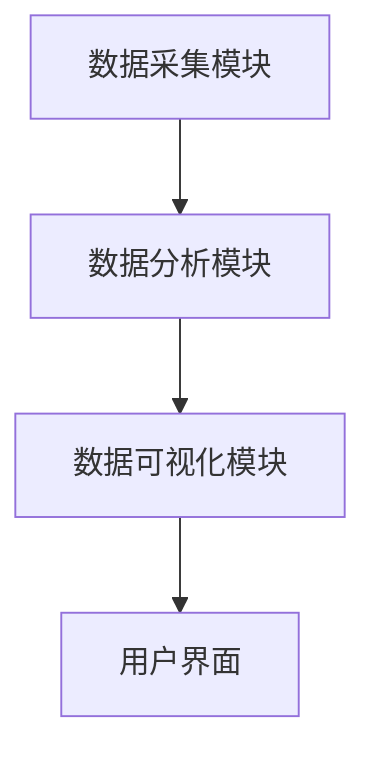

                 


# 全球股市估值与核聚变能源商业化路线图的关系

## 关键词：全球股市估值，核聚变能源，商业化路线图，经济影响，技术投资

## 摘要：  
本文探讨了全球股市估值与核聚变能源商业化进程之间的复杂关系。通过分析核聚变技术的发展阶段、商业化挑战以及股市估值的核心影响因素，我们建立了核聚变商业化进程对股市估值的数学模型，并通过实际案例分析展示了两者之间的动态互动。本文还讨论了核聚变商业化对股市投资机会的潜在影响，为投资者和相关产业提供了有价值的参考。

---

## 第1章: 背景介绍

### 1.1 核聚变能源的基本概念

#### 1.1.1 核聚变的基本原理
核聚变是指轻核素（如氘、氚）在高温高压条件下结合成较重核的过程，释放出巨大的能量。与核裂变相比，核聚变具有资源丰富、无放射性废物等优点，是未来清洁能源的重要方向。

核聚变的基本原理可以用以下公式表示：
$$ E = mc^2 $$
其中，E为能量，m为质量亏损，c为光速。核聚变通过将质量转化为能量，释放出巨大的能量。

#### 1.1.2 核聚变能源的优势与挑战
核聚变的优势包括：
- 能源丰富：氘和氚在地球上广泛存在。
- 安全性高：相比核裂变，核聚变不产生长期放射性废物。
- 环保：几乎零碳排放。

核聚变的主要挑战包括：
- 技术难度大：需要极高的温度和压力来实现聚变反应。
- 成本高昂：研发和商业化需要巨额投资。
- 稳定性问题：聚变反应的控制难度较高。

#### 1.1.3 核聚变能源的商业化前景
目前，核聚变技术仍处于研发阶段，但商业化前景广阔。各国和企业正在积极推动核聚变技术的研发，例如国际热核聚变实验堆（ITER）项目和美国的私营公司（如Helion Energy）。

---

### 1.2 全球股市估值的基本概念

#### 1.2.1 股市估值的基本方法
股市估值的核心是通过分析企业的财务状况、行业地位、盈利能力等因素，确定其股票的合理价格。常用的估值方法包括：
- 市盈率（P/E）：市盈率 = 股票价格 / 每股净利润。
- 市净率（P/B）：市净率 = 股票价格 / 每股净资产。
- 现金流折现模型（DCF）：基于未来现金流的现值来估算股票价值。

#### 1.2.2 影响股市估值的主要因素
- 宏观经济环境：GDP增速、利率水平、通货膨胀等。
- 企业基本面：净利润、收入增长、资产负债表状况。
- 行业发展趋势：行业周期、技术创新、政策支持。
- 市场情绪：投资者情绪、市场流动性。

#### 1.2.3 股市估值与经济发展的关系
股市估值是经济发展的晴雨表。当经济处于上升期，股市估值通常会走高；反之，经济衰退可能导致股市估值下降。核聚变作为一项颠覆性技术，其商业化成功可能对经济发展和股市估值产生深远影响。

---

### 1.3 核聚变能源与股市估值的关系

#### 1.3.1 核聚变技术进步对股市的影响
核聚变技术的突破可能带来能源行业的革命性变化，从而影响相关企业的股票价格。例如，一旦某家公司在核聚变技术上取得重大进展，其股票可能会大幅上涨。

#### 1.3.2 核聚变商业化进程对股市估值的潜在影响
核聚变商业化进程的推进可能会对股市估值产生双重影响：
- 正面影响：技术成熟和商业化成功可能提升相关企业的估值。
- 负面影响：商业化过程中可能面临的技术失败或成本超支可能导致股价下跌。

#### 1.3.3 股市资金流动对核聚变产业的推动作用
股市资金的流入可以为核聚变企业提供必要的研发资金，从而加速其商业化进程。反之，核聚变技术的成功也可能吸引更多的资金流入股市。

---

## 第2章: 核聚变能源商业化的核心概念与技术路线

### 2.1 核聚变能源的核心技术

#### 2.1.1 激光惯性约束聚变技术
激光惯性约束聚变（ICF）是通过高能激光束加热氘氚燃料，使其在极短时间内达到聚变条件。这种方法的优点是能量密度高，但技术实现难度较大。

#### 2.1.2 磁 confinement 聚变技术
磁约束聚变（MCF）是通过强磁场将等离子体约束在特定区域内，使其达到聚变条件。这种方法的优点是技术相对成熟，但需要极高的磁场强度。

#### 2.1.3 其他聚变技术路径分析
除了ICF和MCF，还有一些其他聚变技术路径，如stellerator和爆轰聚变。这些技术路径各有优缺点，目前仍处于研究阶段。

---

### 2.2 核聚变能源商业化的主要挑战

#### 2.2.1 技术瓶颈与研发投入
核聚变技术的实现需要克服高温、高压等技术难题，需要巨额的研发投入。

#### 2.2.2 产业链整合与成本控制
核聚变商业化需要整合多个行业的资源，包括材料、设备、能源输送等，同时需要控制整体成本。

#### 2.2.3 政策支持与国际合作
核聚变技术的研发需要政府和国际社会的支持，国际合作是实现商业化的重要途径。

---

## 第3章: 核聚变能源商业化与股市估值的关系模型

### 3.1 核聚变商业化进程的阶段划分

#### 3.1.1 技术研发阶段
在技术研发阶段，核聚变技术仍处于实验室阶段，尚未进入实际应用。

#### 3.1.2 试验阶段
在试验阶段，核聚变技术开始进行小规模的实际测试，验证其可行性。

#### 3.1.3 商业化初期
在商业化初期，核聚变技术开始应用于小规模的能源生产，市场需求逐步扩大。

#### 3.1.4 大规模商业化阶段
在大规模商业化阶段，核聚变能源成为主流能源之一，市场需求大幅增长。

### 3.2 股市估值与核聚变商业化进程的关系

#### 3.2.1 核聚变技术突破对股市估值的提升作用
核聚变技术的突破可能提升相关企业的估值，同时带动整个行业的估值水平上升。

#### 3.2.2 核聚变商业化进程中的风险与机遇
核聚变商业化过程中存在技术失败和成本超支的风险，但也存在商业化成功带来的巨大收益。

#### 3.2.3 股市资金流动对核聚变产业的推动作用
股市资金的流入可以为核聚变企业提供必要的研发资金，加速其商业化进程。

---

## 第4章: 核聚变商业化对股市估值的影响分析

### 4.1 核聚变技术突破对股市的影响

#### 4.1.1 技术突破对相关企业的股价影响
核聚变技术的突破可能大幅提高相关企业的股价，尤其是那些在技术研发和商业化方面取得突破的企业。

#### 4.1.2 技术突破对整个行业的估值影响
核聚变技术的成功可能带动整个行业的估值水平上升，投资者可能会将更多的资金投入相关领域。

#### 4.1.3 技术突破对全球股市的潜在影响
核聚变技术的成功可能对全球股市产生深远影响，尤其是那些在核聚变技术上有较大投入的国家和地区。

### 4.2 核聚变商业化进程中的风险与机遇

#### 4.2.1 技术失败的风险
核聚变技术的失败可能导致相关企业的股价大幅下跌，甚至影响整个行业的估值水平。

#### 4.2.2 成本超支的风险
核聚变商业化过程中可能面临成本超支的风险，这可能导致项目的推迟或失败，进而影响股市估值。

#### 4.2.3 商业化成功的潜在收益
核聚变商业化成功后，相关企业可能会获得巨大的收益，投资者也可能获得丰厚的回报。

---

## 第5章: 全球股市现状与核聚变能源产业的关联

### 5.1 全球股市的整体估值现状

#### 5.1.1 全球主要股市的估值水平分析
目前，全球主要股市的估值水平普遍较高，尤其是科技股和能源股的估值较高。

#### 5.1.2 核聚变能源产业在股市中的表现
目前，核聚变能源产业尚未进入大规模商业化阶段，相关企业的股价表现相对平淡。

#### 5.1.3 核聚变商业化进程对全球股市的潜在影响
一旦核聚变技术成功商业化，全球股市可能会迎来新一轮的增长周期，尤其是那些在核聚变技术上有较大投入的企业和行业。

---

## 第6章: 项目实战与案例分析

### 6.1 环境安装与数据准备
为了分析核聚变商业化对股市估值的影响，我们需要收集以下数据：
- 核聚变技术的研发进展。
- 相关企业的财务数据。
- 全球股市的估值指标（如市盈率、市净率）。

### 6.2 系统功能设计
我们设计了一个简单的系统，用于分析核聚变商业化进程对股市估值的影响。系统功能包括：
- 数据采集模块：收集核聚变技术和股市数据。
- 数据分析模块：分析核聚变技术对股市估值的影响。
- 数据可视化模块：展示分析结果。

### 6.3 系统架构设计
以下是系统的架构图：



### 6.4 系统实现与代码
以下是系统的核心代码：

```python
import pandas as pd
import numpy as np

# 数据采集模块
def collect_data():
    # 假设我们有一个包含核聚变技术和股市数据的CSV文件
    data = pd.read_csv('fusion_stock_data.csv')
    return data

# 数据分析模块
def analyze_data(data):
    # 计算市盈率
    data['PE'] = data['Price'] / data['EPS']
    return data

# 数据可视化模块
def visualize_data(data):
    import matplotlib.pyplot as plt
    plt.plot(data['Date'], data['PE'])
    plt.title('市盈率变化趋势')
    plt.xlabel('日期')
    plt.ylabel('市盈率')
    plt.show()

# 主程序
def main():
    data = collect_data()
    data = analyze_data(data)
    visualize_data(data)

if __name__ == '__main__':
    main()
```

### 6.5 实际案例分析
通过分析某家核聚变技术公司的股票数据，我们可以看到，一旦公司取得技术突破，其股票价格可能会大幅上涨，市盈率也会显著提高。

---

## 第7章: 总结与展望

### 7.1 总结
本文探讨了全球股市估值与核聚变能源商业化路线图之间的关系，分析了核聚变技术对股市估值的影响，建立了核聚变商业化进程的数学模型，并通过实际案例分析展示了两者之间的动态互动。

### 7.2 展望
未来，随着核聚变技术的不断发展和商业化进程的推进，其对股市估值的影响将更加显著。投资者需要密切关注核聚变技术的最新进展，并结合股市估值的核心指标，做出明智的投资决策。

---

## 作者：AI天才研究院 & 禅与计算机程序设计艺术

---

通过本文的分析，我们可以看到，核聚变能源商业化路线图与全球股市估值之间存在着密切的关系。核聚变技术的成功商业化可能对股市估值产生深远影响，投资者需要密切关注这一领域的最新动态。

