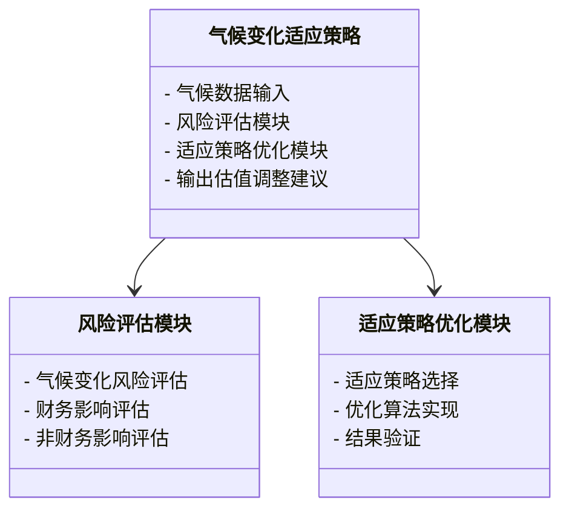
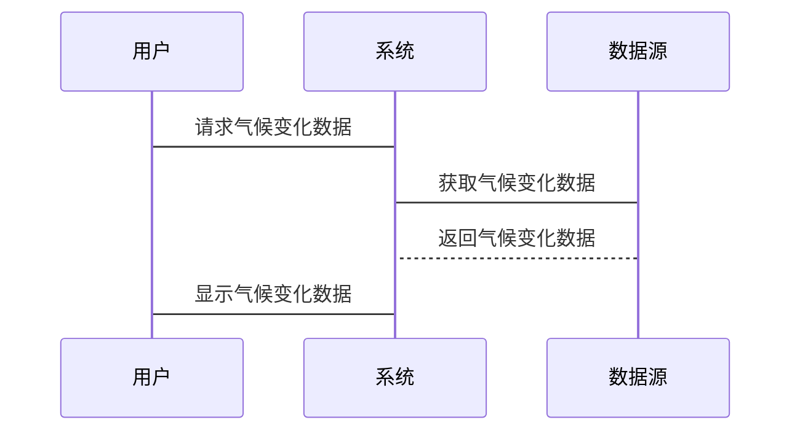

                 


# 全球股市估值与气候变化适应策略的关联

---

## 关键词：全球股市估值、气候变化、适应策略、风险管理、ESG投资、气候变化模型、金融建模

---

## 摘要：

本文探讨了气候变化对全球股市估值的影响及其适应策略的关联性。随着气候变化问题日益严重，企业和社会需要制定有效的适应策略以应对潜在风险。本文通过分析气候变化对经济和金融市场的多维度影响，结合数学建模和算法优化，提出了将气候变化因素纳入股市估值模型的方法，并设计了相应的适应策略优化框架。本文还通过实际案例分析，验证了所提出的模型和策略的有效性，为投资者和企业提供了科学的决策支持。

---

# 目录大纲：《全球股市估值与气候变化适应策略的关联》

---

## 第1章：气候变化与全球经济的关联

### 1.1 气候变化的定义与影响

#### 1.1.1 气候变化的科学定义
- 气候变化的定义与特征
- 气候变化的主要驱动因素
- 气候变化的长期和短期影响

#### 1.1.2 气候变化对全球经济的潜在影响
- 气候变化对企业运营成本的影响
- 气候变化对供应链和市场结构的影响
- 气候变化对政策环境和法规的影响

#### 1.1.3 气候变化对企业估值的影响路径
- 气候变化对资产减值的影响
- 气候变化对利润和现金流的影响
- 气候变化对企业信用评级的影响

---

### 1.2 全球股市估值的基础理论

#### 1.2.1 股市估值的核心概念
- 市盈率（P/E）、市净率（P/B）等传统估值指标
- 股票内在价值的计算方法
- 市场情绪与股市估值的关系

#### 1.2.2 市场参与者的行为对估值的影响
- 投资者风险偏好与估值的关系
- 市场流动性与估值波动性
- 机构投资者行为对企业估值的影响

#### 1.2.3 传统估值模型的局限性
- 传统估值模型的假设与局限性
- 传统模型在气候变化风险下的失效点
- 气候变化对企业未来现金流预测的影响

---

### 1.3 气候变化适应策略的定义与分类

#### 1.3.1 气候变化适应策略的定义
- 气候变化适应策略的定义与目标
- 适应策略与风险管理的关系
- 适应策略的多层次性（企业、行业、国家层面）

#### 1.3.2 主要的气候变化适应策略类型
- 风险规避策略
- 风险分担策略
- 风险转移策略
- 风险缓解策略

#### 1.3.3 适应策略与企业风险管理的关系
- 适应策略在企业全面风险管理中的地位
- 适应策略的实施对股价的影响
- 适应策略的动态调整机制

---

## 第2章：气候变化对股市估值的核心影响机制

### 2.1 气候变化与企业财务表现的关系

#### 2.1.1 气候变化对企业利润的影响
- 气候变化对企业成本结构的影响
- 气候变化对企业收入的影响
- 气候变化对企业利润率的长期影响

#### 2.1.2 气候变化对资产减值的影响
- 气候变化对实物资产减值的影响
- 气候变化对无形资产减值的影响
- 气候变化对商誉减值的影响

#### 2.1.3 气候变化对企业信用评级的影响
- 气候变化对企业偿债能力的影响
- 气候变化对企业信用风险的影响
- 信用评级机构的气候变化评估模型

---

### 2.2 气候变化对股市整体估值的影响

#### 2.2.1 气候变化对市场情绪的影响
- 市场情绪的波动与气候变化的关联
- 气候变化对投资者风险偏好的影响
- 气候变化对市场波动性的影响

#### 2.2.2 气候变化对行业估值的影响
- 高碳行业的估值调整
- 低碳行业的估值溢价
- 气候变化对不同行业风险偏好的影响

#### 2.2.3 气候变化对政策环境的影响
- 气候变化政策对企业估值的影响
- 碳定价机制对股市估值的影响
- 国际气候协议对股市的影响

---

### 2.3 气候变化与股市估值的动态关系

#### 2.3.1 气候变化的长期影响
- 长期气候变化趋势对企业估值的影响
- 气候变化对股市结构的长期影响
- 气候变化对市场均衡的影响

#### 2.3.2 气候变化的短期市场反应
- 短期气候变化事件对股价的影响
- 市场对气候变化预期的反应
- 气候变化事件的市场溢出效应

#### 2.3.3 气候变化对市场波动性的潜在影响
- 气候变化的不确定性对市场波动的影响
- 气候变化对市场尾部风险的影响
- 气候变化对市场相关性的影响

---

## 第3章：气候变化适应策略的数学模型与算法

### 3.1 气候变化风险评估模型

#### 3.1.1 气候变化风险的量化方法
- 气候变化风险的定义与分类
- 气候变化风险的量化指标
- 气候变化风险的评估框架

#### 3.1.2 气候变化风险的评估指标
- 气候变化风险的财务影响指标
- 气候变化风险的非财务影响指标
- 气候变化风险的综合评估指标

#### 3.1.3 气候变化风险的数学表达式
- 气候变化风险的概率分布模型
- 气候变化风险的损失函数
- 气候变化风险的动态评估模型

---

### 3.2 气候变化适应策略的优化模型

#### 3.2.1 线性规划模型
- 线性规划模型的基本结构
- 气候变化适应策略的线性规划优化
- 模型的约束条件与目标函数

#### 3.2.2 动态规划模型
- 动态规划模型的基本结构
- 气候变化适应策略的动态优化
- 模型的时间序列分析

#### 3.2.3 非线性优化模型
- 非线性优化模型的基本结构
- 气候变化适应策略的非线性优化
- 模型的复杂性和适用性

---

### 3.3 气候变化适应策略的算法实现

#### 3.3.1 算法原理
- 气候变化适应策略的核心算法
- 算法的输入与输出
- 算法的实现步骤

#### 3.3.2 算法实现
- Python代码实现
- 算法的优化与调整
- 算法的验证与测试

---

## 第4章：系统分析与架构设计方案

### 4.1 问题场景介绍

#### 4.1.1 气候变化适应策略的系统目标
- 系统设计的背景与目标
- 系统设计的范围与边界
- 系统设计的关键问题

#### 4.1.2 气候变化适应策略的系统功能需求
- 系统功能需求的详细描述
- 功能模块的划分与交互
- 系统功能的优先级排序

---

### 4.2 系统架构设计

#### 4.2.1 领域模型（Mermaid 类图）


#### 4.2.2 系统架构设计（Mermaid 架构图）


---

### 4.3 系统接口设计

#### 4.3.1 接口描述
- 接口名称：气候变化数据接口
- 接口功能：提供实时气候变化数据
- 接口类型：REST API

#### 4.3.2 接口实现
- 接口输入：地理位置、时间范围
- 接口输出：温度、降水、极端天气事件等数据

---

### 4.4 系统交互设计（Mermaid 序列图）


---

## 第5章：项目实战

### 5.1 环境安装

#### 5.1.1 Python 环境安装
- 安装 Python 和 pip
- 安装必要的库：pandas、numpy、scipy、matplotlib、sklearn

#### 5.1.2 数据源安装
- 获取气候变化数据（例如，通过 NOAA 或其他气候数据平台）
- 获取股票数据（例如，通过 Yahoo Finance 或其他金融数据平台）

---

### 5.2 核心代码实现

#### 5.2.1 数据预处理
```python
import pandas as pd
import numpy as np

# 读取气候变化数据
climate_data = pd.read_csv("climate.csv")

# 读取股票数据
stock_data = pd.read_csv("stocks.csv")

# 数据清洗
climate_data.dropna(inplace=True)
stock_data.dropna(inplace=True)
```

#### 5.2.2 气候变化风险评估模型
```python
from sklearn.linear_model import LinearRegression

# 构建气候变化风险模型
model = LinearRegression()
model.fit(X=climate_data[['温度', '降水']], y=stock_data['收益'])
```

#### 5.2.3 适应策略优化模块
```python
from sklearn.metrics import mean_squared_error

# 优化适应策略
def optimize_strategy(params):
    # 模型实现
    return mean_squared_error(y_true, y_pred)

# 使用遗传算法优化
from scipy.optimize import minimize
result = minimize(optimize_strategy, initial_params, ...)
```

---

### 5.3 案例分析

#### 5.3.1 案例背景
- 案例行业：能源行业
- 案例公司：某能源企业
- 案例目标：评估气候变化对企业估值的影响

#### 5.3.2 数据分析与建模
- 数据清洗与特征选择
- 模型训练与验证
- 模型结果分析

#### 5.3.3 结果解读
- 气候变化对企业估值的具体影响
- 适应策略的有效性评估
- 模型的局限性与改进方向

---

### 5.4 项目小结

#### 5.4.1 项目总结
- 项目目标的实现情况
- 项目过程中的关键挑战
- 项目的创新点与不足

#### 5.4.2 项目意义
- 项目对气候变化适应策略的贡献
- 项目对股市估值模型的贡献
- 项目对投资者和企业的实际意义

---

## 第6章：结论与展望

### 6.1 研究总结

#### 6.1.1 核心结论
- 气候变化对股市估值的影响路径
- 气候变化适应策略的核心要素
- 数学模型与算法的有效性

#### 6.1.2 方法论贡献
- 新的气候变化适应策略模型
- 新的股市估值方法
- 新的系统架构设计方案

---

### 6.2 未来研究方向

#### 6.2.1 研究展望
- 更复杂的气候变化模型
- 更多行业和地区的案例研究
- 更多数据源的整合与分析

#### 6.2.2 技术展望
- 人工智能与机器学习在气候变化适应策略中的应用
- 大数据分析与气候变化预测
- 区块链技术在气候变化风险管理中的应用

---

## 作者：AI天才研究院/AI Genius Institute & 禅与计算机程序设计艺术/Zen And The Art of Computer Programming

