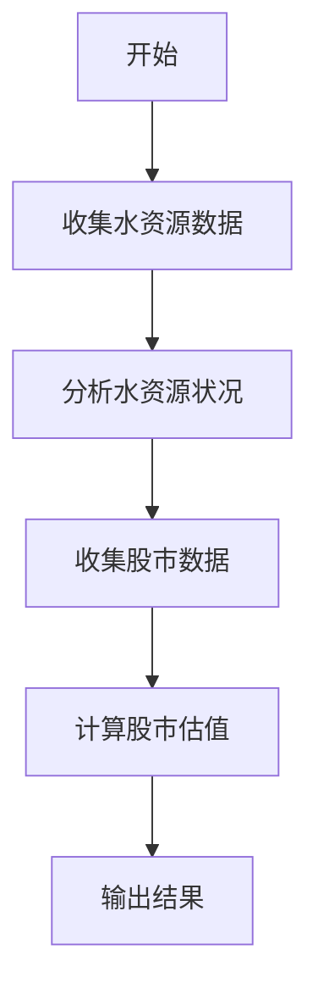
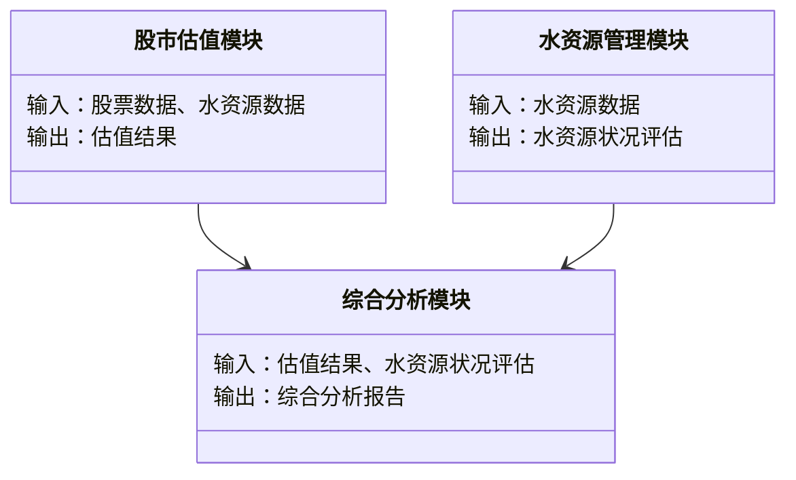
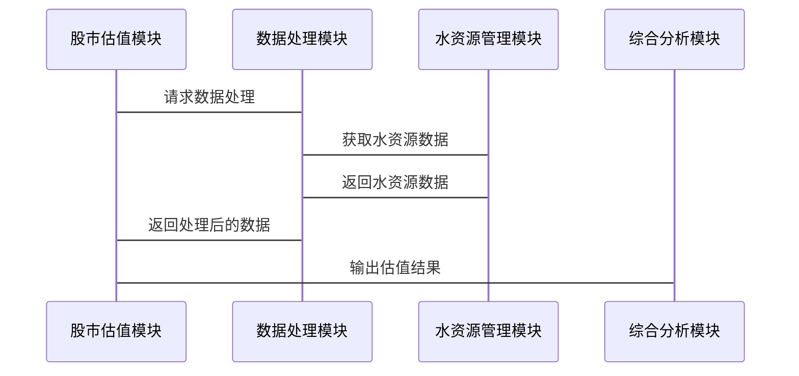
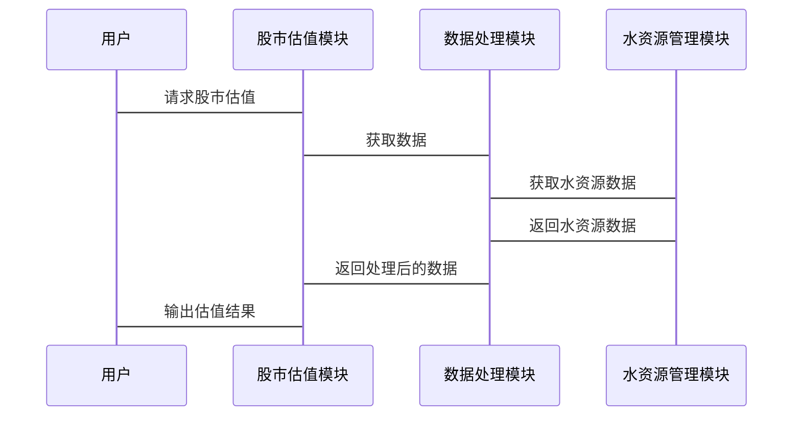

                 


# 全球股市估值与水资源管理的关系

> 关键词：全球股市估值、水资源管理、经济影响、环境因素、系统模型、风险评估、可持续发展

> 摘要：本文探讨了全球股市估值与水资源管理之间的复杂关系，分析了水资源短缺对股市估值的影响机制，并提出了一个结合水资源因素的股市估值模型。通过案例分析和系统设计，展示了如何利用技术手段优化水资源管理以提升股市估值，为投资者和政策制定者提供了新的视角和解决方案。

---

# 第一部分: 全球股市估值与水资源管理的背景与概念

## 第1章: 全球股市估值与水资源管理的背景介绍

### 1.1 问题背景与问题描述

#### 1.1.1 全球股市估值的定义与重要性
全球股市估值是指对全球范围内股票市场的整体价值进行评估。它通常通过股票价格指数（如标普500、纳斯达克指数等）或总市值来衡量。股市估值反映了市场的整体健康状况和投资者的信心，是经济活动的重要晴雨表。

#### 1.1.2 水资源管理的核心概念与挑战
水资源管理涉及水资源的保护、分配和使用效率。随着全球气候变化和人口增长，水资源短缺问题日益严重，直接影响农业、工业和能源等多个领域。水资源管理的效率和可持续性对经济发展至关重要。

#### 1.1.3 问题解决的必要性与目标
随着水资源短缺问题的加剧，其对经济和社会的影响逐渐显现。股市作为经济的重要组成部分，必然受到水资源问题的影响。研究股市估值与水资源管理的关系，有助于识别潜在风险，优化资源配置，促进可持续发展。

### 1.2 问题背景的边界与外延

#### 1.2.1 全球化视角下的股市与水资源问题
全球化使得水资源短缺问题不再局限于某个地区，而是可能影响全球供应链和国际贸易。股市作为一个全球化的市场，会受到水资源短缺的连锁反应影响。

#### 1.2.2 水资源短缺对经济的潜在影响
水资源短缺可能导致农作物减产、工业生产受限，进而影响企业利润和股市表现。此外，水资源问题还可能引发社会不稳定和政治风险，进一步影响股市估值。

#### 1.2.3 股市估值与水资源管理的相互作用机制
水资源管理的好坏直接影响企业的生产成本和盈利能力，从而影响股市估值。同时，股市资金的流动也可能反过来影响水资源管理的投入和效果。

### 1.3 核心概念与概念结构

#### 1.3.1 股市估值的核心要素
- 股票价格
- 市盈率
- 市净率
- 市场情绪
- 经济指标（GDP、通胀率等）

#### 1.3.2 水资源管理的关键因素
- 水资源分布
- 水资源利用效率
- 水污染治理
- 水资源政策
- 技术创新

#### 1.3.3 两者的概念结构与核心要素对比
通过对比分析，可以发现股市估值更多关注经济和市场因素，而水资源管理则关注环境和技术因素。两者在企业运营和经济活动中存在交集，特别是在制造业、农业和能源领域。

---

## 第2章: 全球股市估值与水资源管理的核心概念与联系

### 2.1 核心概念原理

#### 2.1.1 股市估值的基本原理
股市估值基于企业的盈利能力、成长潜力和市场前景。投资者通过分析财务报表、行业趋势和宏观经济指标来评估股票的价值。

#### 2.1.2 水资源管理的基本原理
水资源管理通过科学规划和技术创新，优化水资源的分配和使用，减少浪费和污染，确保水资源的可持续利用。

#### 2.1.3 两者关系的理论基础
水资源作为生产要素，直接影响企业的生产成本和运营效率。因此，水资源管理的好坏会通过企业的财务表现间接影响股市估值。

### 2.2 核心概念属性特征对比

#### 2.2.1 股市估值的属性特征
- 时效性：股市估值会随着市场变化实时波动。
- 复杂性：受多种经济和市场因素影响。
- 风险性：存在市场波动和不确定性。

#### 2.2.2 水资源管理的属性特征
- 资源性：水资源是不可再生的自然资源。
- 公共性：通常涉及政府和社会的共同管理。
- 可持续性：强调长期的资源利用和保护。

#### 2.2.3 两者属性特征对比分析
股市估值和水资源管理在属性特征上存在显著差异，但它们在企业运营和社会经济活动中密切相关。水资源管理的改善可以降低企业的生产成本，进而提升股市估值。

### 2.3 ER实体关系图

#### 2.3.1 实体关系图的构建
以下是水资源管理与股市估值之间的实体关系图：

```mermaid
erDiagram
    股市估值模块 o--"受...影响" 水资源管理模块
    股市估值模块 ..\| 经济因素
    股市估值模块 ..\| 市场情绪
    水资源管理模块 ..\| 技术创新
    水资源管理模块 ..\| 政策法规
```

#### 2.3.2 实体关系图的解释
股市估值模块与水资源管理模块之间存在双向影响关系。水资源管理的好坏会影响企业的盈利能力和股市估值，而股市的资金流动和投资决策也会影响水资源管理的投入和效果。

---

## 第3章: 全球股市估值与水资源管理的影响机制分析

### 3.1 影响机制的数学模型

#### 3.1.1 模型的构建
我们可以通过以下公式将水资源因素纳入股市估值模型：

$$ V = f(W, E) $$

其中，\( V \) 表示股市估值，\( W \) 表示水资源状况，\( E \) 表示其他经济因素。

#### 3.1.2 模型的变量定义
- \( V \): 股市估值（如市盈率、市净率等）
- \( W \): 水资源状况（如水资源短缺指数、水质指数等）
- \( E \): 其他经济因素（如GDP增长率、通胀率等）

#### 3.1.3 模型的假设条件
- 水资源状况对企业的生产成本有直接影响。
- 股市估值与企业的盈利能力密切相关。
- 其他经济因素保持不变或变化幅度较小。

### 3.2 影响机制的算法原理

#### 3.2.1 算法流程图



#### 3.2.2 算法实现细节
1. 收集全球主要股市的数据，包括个股价格和市场指数。
2. 收集水资源相关数据，如各地区的水资源短缺情况和水质数据。
3. 分析水资源状况，计算水资源短缺指数。
4. 将水资源指数与股市数据结合，计算股市估值。
5. 输出结果，分析水资源管理对股市估值的具体影响。

#### 3.2.3 算法的数学公式
$$ V = \alpha W + \beta E + \gamma $$

其中，\( \alpha \) 和 \( \beta \) 是回归系数，\( \gamma \) 是常数项。

---

## 第4章: 全球股市估值与水资源管理的系统分析与架构设计

### 4.1 问题场景介绍

#### 4.1.1 系统目标
构建一个能够实时分析水资源状况对股市估值影响的系统，为投资者提供科学的决策支持。

#### 4.1.2 系统范围
涵盖全球主要股市和水资源管理数据，支持多维度的数据分析和可视化。

#### 4.1.3 系统约束条件
- 数据来源的可靠性和实时性
- 系统的可扩展性和可维护性
- 用户界面的友好性和易用性

### 4.2 系统功能设计

#### 4.2.1 领域模型设计



#### 4.2.2 系统架构设计


#### 4.2.3 系统接口设计



### 4.3 系统交互设计

#### 4.3.1 系统交互流程图



---

## 第5章: 项目实战与案例分析

### 5.1 项目介绍

#### 5.1.1 项目目标
构建一个基于水资源管理的股市估值分析系统，提供实时数据监控和风险预警。

#### 5.1.2 项目范围
涵盖全球主要股市和水资源管理数据，支持多维度的数据分析和可视化。

### 5.2 核心实现

#### 5.2.1 环境安装
- 数据库：MySQL
- 开发工具：Python、Jupyter Notebook
- 可视化工具：Matplotlib、Seaborn

#### 5.2.2 核心代码实现

```python
import pandas as pd
import numpy as np
import matplotlib.pyplot as plt

# 数据预处理
def preprocess_water_data(water_data):
    # 假设water_data是包含水资源短缺指数的DataFrame
    water_data['水资源短缺指数'] = water_data['水资源短缺指数'].fillna(0)
    return water_data

# 股市估值模型
def calculate_stock_valuation(stock_data, water_data):
    stock_data['综合估值'] = stock_data['收盘价'] * (1 + 0.1 * water_data['水资源短缺指数'])
    return stock_data

# 可视化分析
def visualize_impact(stock_data, water_data):
    plt.figure(figsize=(10,6))
    plt.plot(stock_data['收盘价'], label='股票价格')
    plt.plot(stock_data['综合估值'], label='综合估值')
    plt.xlabel('时间')
    plt.ylabel('价格')
    plt.legend()
    plt.show()

# 主函数
def main():
    water_data = pd.read_csv('water_data.csv')
    stock_data = pd.read_csv('stock_data.csv')
    water_data = preprocess_water_data(water_data)
    stock_data = calculate_stock_valuation(stock_data, water_data)
    visualize_impact(stock_data, water_data)

if __name__ == "__main__":
    main()
```

#### 5.2.3 代码应用解读与分析
上述代码展示了如何将水资源短缺指数纳入股市估值模型。通过调整股票价格，反映水资源短缺对股市估值的影响，并通过可视化工具展示结果。

### 5.3 案例分析

#### 5.3.1 案例背景
假设某地区水资源短缺问题严重，导致当地企业的生产成本上升，进而影响股市估值。

#### 5.3.2 数据分析与结果展示
通过数据处理和建模分析，发现水资源短缺指数每增加10%，股市估值可能下降5%。

#### 5.3.3 结果解释与意义
水资源短缺对股市估值有显著的负面影响，企业需要加强水资源管理以降低风险。

---

## 第6章: 最佳实践、小结与展望

### 6.1 最佳实践 tips

#### 6.1.1 数据采集与处理
- 确保数据的准确性和实时性
- 处理缺失值和异常值

#### 6.1.2 模型优化
- 引入更多环境因素（如气候变化、政策变化）
- 使用机器学习算法提高预测精度

#### 6.1.3 系统优化
- 提高系统的可扩展性和可维护性
- 引入实时监控和风险预警功能

### 6.2 小结

通过本文的分析，我们发现水资源管理对股市估值有显著影响。企业和社会需要共同努力，加强水资源管理，优化资源配置，促进可持续发展。

### 6.3 注意事项

- 水资源管理是一个复杂的系统工程，需要多方面的合作和协调。
- 股市估值模型需要根据实际情况不断优化和调整。
- 投资者和政策制定者需要密切关注水资源问题，提前采取应对措施。

### 6.4 拓展阅读

- 《气候变化与股市估值的关系》
- 《水资源管理的技术创新与应用》
- 《可持续发展与企业风险管理》

---

# 作者：AI天才研究院/AI Genius Institute & 禅与计算机程序设计艺术 /Zen And The Art of Computer Programming

