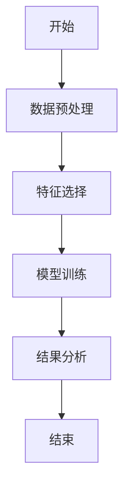
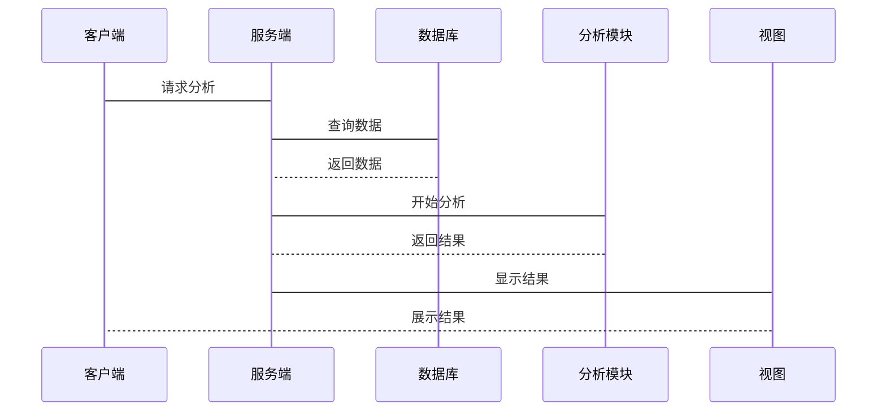

                 


```markdown
# 全球股市估值与海底资源开发的关系

> 关键词：全球股市估值、海底资源开发、经济影响、技术依赖、资源互补

> 摘要：本文探讨全球股市估值与海底资源开发之间的关系，通过分析核心概念、建立数学模型、系统设计和项目实战，深入揭示两者之间的相互影响和依赖关系，为读者提供全面的理论和实践指导。

---

## 第一部分: 全球股市估值与海底资源开发的关系概述

### 第1章: 背景介绍

#### 1.1 核心概念：全球股市估值与海底资源开发的关系

##### 1.1.1 问题背景
- 全球股市的波动性与经济周期的关系
- 海底资源开发的经济影响
- 两者之间的潜在联系

##### 1.1.2 问题描述
- 全球股市估值的定义与影响因素
- 海底资源开发的定义与关键资源
- 两者之间的相互作用机制

##### 1.1.3 问题解决
- 如何量化股市估值与海底资源开发的关系
- 建立数学模型的方法
- 实证分析的步骤

##### 1.1.4 边界与外延
- 全球股市的范围界定
- 海底资源开发的范围界定
- 两者关系的适用范围与限制

##### 1.1.5 概念结构与核心要素组成
- 股市估值的核心要素
- 海底资源开发的核心要素
- 两者关系的核心要素

### 第2章: 核心概念与联系

#### 2.1 股市估值的核心原理

##### 2.1.1 股市估值的基本方法
- 市盈率（P/E）模型
- 市净率（P/B）模型
- 股息率模型

##### 2.1.2 影响股市估值的主要因素
- 经济指标
- 行业周期
- 公司基本面

#### 2.2 海底资源开发的核心原理

##### 2.2.1 海底资源开发的基本流程
- 资源勘探
- 资源评估
- 开发决策

##### 2.2.2 影响海底资源开发的主要因素
- 技术水平
- 成本因素
- 环境因素

#### 2.3 股市估值与海底资源开发的关系

##### 2.3.1 经济影响的双向性
- 海底资源开发对股市的影响
- 股市波动对海底资源开发的影响

##### 2.3.2 技术依赖的互动性
- 技术进步对股市估值的影响
- 技术进步对海底资源开发的影响

##### 2.3.3 资源互补性
- 能源资源与股市的关系
- 矿产资源与股市的关系

#### 2.4 核心概念属性特征对比

| **属性**       | **股市估值**                | **海底资源开发**            |
|----------------|-----------------------------|-----------------------------|
| 核心目标       | 评估企业价值                | 开发海底资源                |
| 主要影响因素   | 经济指标、行业周期          | 技术水平、成本、环境因素    |
| 表现形式       | 股价波动、市盈率变化        | 资源储量、开发进度          |
| 依赖的技术     | 财务模型、大数据分析        | 深海勘探技术、采矿技术      |
| 目标受众       | 投资者、金融机构            | 石油公司、矿业公司          |

#### 2.5 ER实体关系图

```mermaid
erd
    股市估值 <----> 股市指标
    海底资源开发 <----> 资源储量
    股市指标 <----> 经济环境
    资源储量 <----> 技术水平
```

---

## 第二部分: 算法原理与实现

### 第3章: 算法原理

#### 3.1 数学模型构建

##### 3.1.1 变量定义
- 股市估值：$V$
- 海底资源储量：$R$
- 经济环境指数：$E$
- 技术水平：$T$

##### 3.1.2 模型假设
- 股市估值与海底资源储量正相关
- 经济环境和技术水平对两者有影响

##### 3.1.3 数学公式
$$ V = \beta_1 R + \beta_2 E + \beta_3 T + \epsilon $$

其中：
- $\beta_1, \beta_2, \beta_3$为回归系数
- $\epsilon$为误差项

#### 3.2 算法流程



#### 3.3 Python代码实现

##### 3.3.1 环境安装
```bash
pip install numpy pandas scikit-learn
```

##### 3.3.2 核心代码
```python
import numpy as np
import pandas as pd
from sklearn.linear_model import LinearRegression

# 数据准备
data = pd.DataFrame({
    'V': [100, 200, 300, 400],  # 股市估值
    'R': [10, 20, 30, 40],      # 海底资源储量
    'E': [1, 2, 3, 4],          # 经济环境指数
    'T': [0.5, 1.0, 1.5, 2.0]  # 技术水平
})

# 特征选择
X = data[['R', 'E', 'T']]
y = data['V']

# 模型训练
model = LinearRegression()
model.fit(X, y)

# 输出系数
print("回归系数：", model.coef_)
```

##### 3.3.3 结果解读
- 回归系数表示每个变量对股市估值的影响方向和大小
- 正系数表示正相关，负系数表示负相关

---

## 第三部分: 系统分析与架构设计

### 第4章: 系统分析

#### 4.1 项目场景介绍

##### 4.1.1 问题场景
- 如何实时监控股市估值与海底资源开发的关系
- 如何预测海底资源开发对股市的影响

#### 4.2 系统功能设计

##### 4.2.1 领域模型类图


#### 4.3 系统架构设计

##### 4.3.1 系统架构图


##### 4.3.2 系统接口设计
- 数据接口：提供实时数据查询
- 分析接口：提供预测结果

##### 4.3.3 系统交互序列图



---

## 第四部分: 项目实战

### 第5章: 项目实战

#### 5.1 环境安装

##### 5.1.1 安装依赖
```bash
pip install numpy pandas scikit-learn matplotlib
```

#### 5.2 核心代码实现

##### 5.2.1 数据准备
```python
import pandas as pd
import numpy as np
from sklearn.linear_model import LinearRegression
import matplotlib.pyplot as plt

# 数据准备
data = pd.DataFrame({
    'V': np.random.rand(100) * 100,  # 股市估值
    'R': np.random.rand(100) * 10,    # 海底资源储量
    'E': np.random.randint(1, 5, 100),  # 经济环境指数
    'T': np.random.rand(100) * 2       # 技术水平
})

# 数据可视化
plt.scatter(data['R'], data['V'])
plt.xlabel('海底资源储量')
plt.ylabel('股市估值')
plt.show()
```

##### 5.2.2 模型训练
```python
# 特征选择
X = data[['R', 'E', 'T']]
y = data['V']

# 模型训练
model = LinearRegression()
model.fit(X, y)

# 预测与可视化
predictions = model.predict(X)
plt.scatter(y, predictions)
plt.xlabel('真实值')
plt.ylabel('预测值')
plt.show()
```

#### 5.3 案例分析

##### 5.3.1 数据分析
- 计算相关系数
- 绘制散点图
- 验证模型准确性

##### 5.3.2 实际案例
- 假设某海底资源开发项目，预测其对股市的影响
- 分析经济指标和技术水平的变化对股市估值的影响

#### 5.4 小结
- 模型的有效性
- 数据分析的局限性
- 未来改进方向

---

## 第五部分: 总结与展望

### 第6章: 总结与展望

#### 6.1 总结
- 主要发现
- 研究的意义
- 实际应用价值

#### 6.2 展望
- 研究的局限性
- 未来研究方向
- 技术创新的可能性

### 第7章: 最佳实践 tips

#### 7.1 小结
- 关键点回顾
- 实践中的注意事项

#### 7.2 注意事项
- 数据质量的重要性
- 模型选择的合理性
- 结果解释的准确性

#### 7.3 拓展阅读
- 相关领域书籍推荐
- 专业期刊论文推荐
- 在线课程资源推荐

### 第8章: 参考文献与附录

#### 8.1 参考文献
- 经济学相关文献
- 石油工程相关文献
- 数据分析相关文献

#### 8.2 附录
- 数据集描述
- 代码详细说明
- 补充图表

---

## 作者信息

作者：AI天才研究院/AI Genius Institute & 禅与计算机程序设计艺术 /Zen And The Art of Computer Programming

---

感谢您的阅读！希望这篇文章能为您提供有价值的信息和启发！
```

