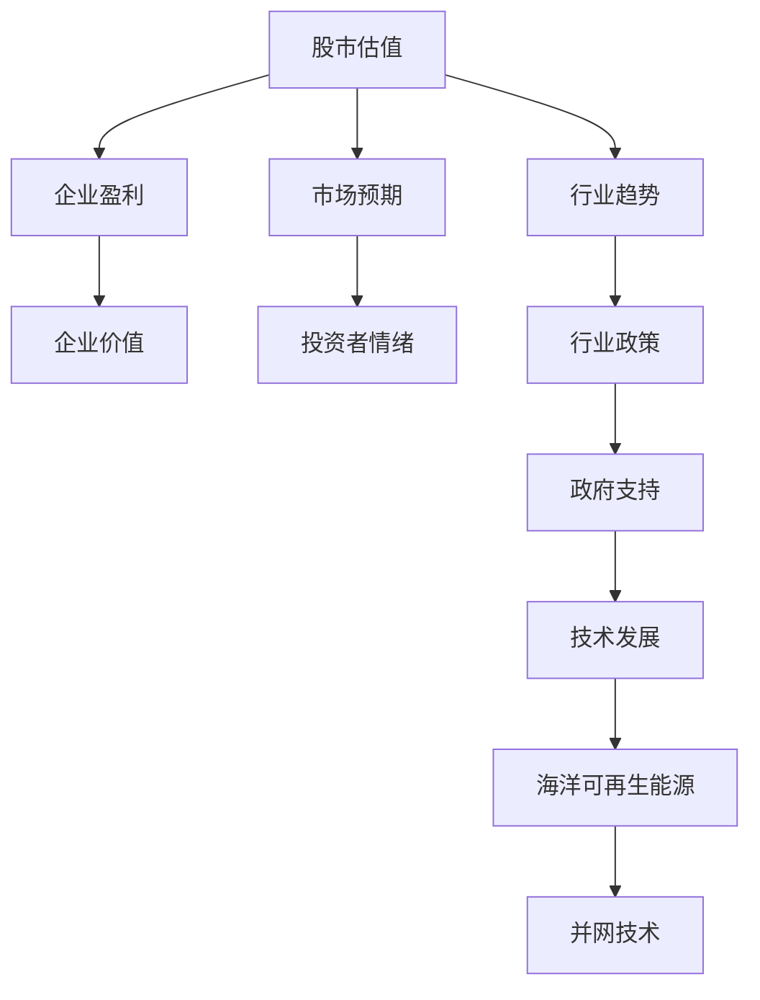
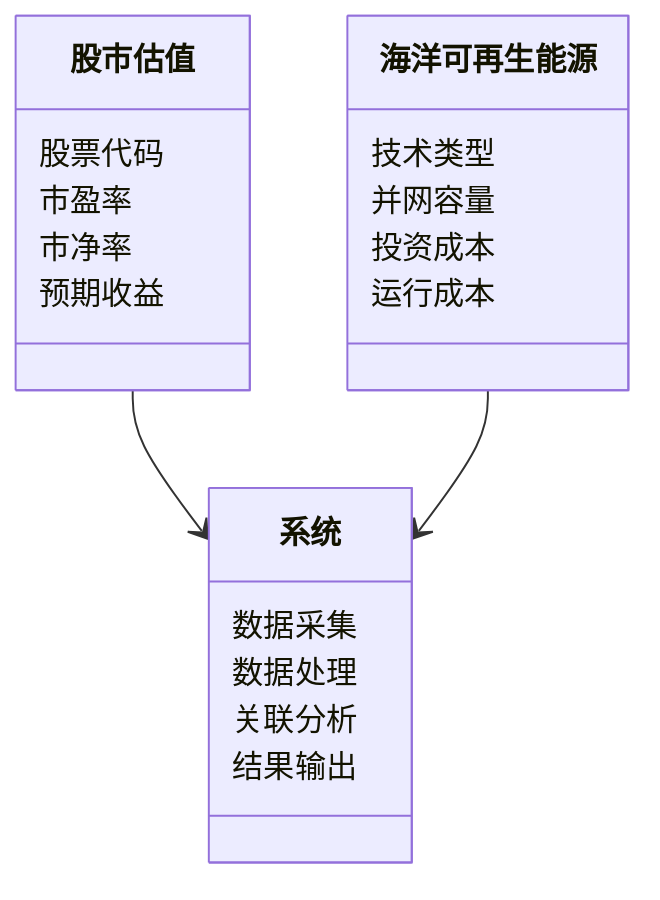
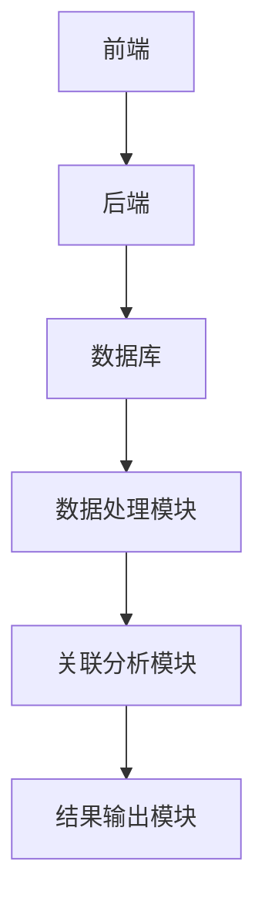
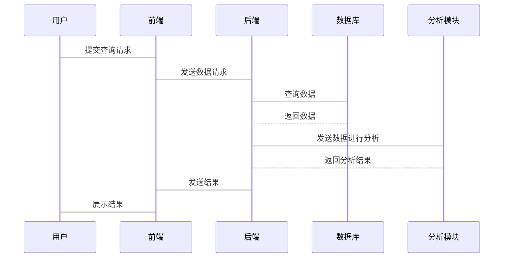

                 


# 全球股市估值与海洋可再生能源并网技术的关系

> 关键词：全球股市估值、海洋可再生能源、并网技术、金融模型、能源转型

> 摘要：本文探讨了全球股市估值与海洋可再生能源并网技术之间的关系，分析了股市估值在反映技术发展、企业盈利能力和市场预期中的作用，以及海洋可再生能源并网技术对能源转型和经济可持续发展的影响。通过建立数学模型和系统架构，本文揭示了两者之间的相互作用机制，并提出了实际应用的解决方案。

---

## 第一章: 引言

### 1.1 研究背景
#### 1.1.1 全球股市估值的重要性
股市估值是衡量企业价值的重要指标，反映了市场对企业的信心和未来盈利能力的预期。随着全球经济的快速发展，股市在资源配置和经济预测中的作用日益凸显。

#### 1.1.2 海洋可再生能源的发展现状
海洋可再生能源（如潮汐能、波浪能、海流能等）是全球能源转型的重要组成部分。随着技术进步和政策支持，海洋可再生能源的开发和应用正快速发展。

#### 1.1.3 两者关系的研究意义
研究股市估值与海洋可再生能源并网技术的关系，有助于理解金融市场对技术创新的反应，指导投资者和企业做出更明智的决策。

### 1.2 问题描述
#### 1.2.1 问题背景
海洋可再生能源的开发需要大量资金支持，而股市估值是企业融资的重要途径。然而，目前尚缺乏系统性研究股市估值与海洋可再生能源技术发展的相互影响。

#### 1.2.2 问题解决路径
通过构建数学模型和系统架构，分析股市估值与海洋可再生能源并网技术之间的关联，揭示两者之间的相互作用机制。

#### 1.2.3 问题的边界与外延
研究范围限于海洋可再生能源的并网技术及其对股市估值的影响，不涉及其他可再生能源（如风能、太阳能）。

### 1.3 研究目的与意义
#### 1.3.1 研究目标
探讨股市估值与海洋可再生能源并网技术的关系，建立两者之间的数学模型和系统架构。

#### 1.3.2 研究价值
为投资者、企业和政策制定者提供科学依据，优化资源配置，推动海洋可再生能源的可持续发展。

#### 1.3.3 实际应用意义
通过量化分析，指导企业制定技术开发和融资策略，促进海洋可再生能源的商业化和大规模应用。

---

## 第二章: 核心概念与联系

### 2.1 核心概念原理
#### 2.1.1 股市估值的定义与方法
股市估值是通过对企业财务数据、市场环境和行业趋势的分析，评估企业价值的过程。常用的估值方法包括市盈率（P/E）、市净率（P/B）等。

#### 2.1.2 海洋可再生能源并网技术的定义与特点
海洋可再生能源并网技术是指将海洋能源转化为电能，并接入电网的技术。其特点是技术复杂性高、投资成本大、环境影响小。

#### 2.1.3 两者关系的理论基础
海洋可再生能源的技术进步和商业化应用会直接影响企业的盈利能力和市场竞争力，从而影响股市估值。

### 2.2 核心概念对比分析
#### 2.2.1 股市估值与海洋可再生能源的技术属性对比
| 属性         | 股市估值                | 海洋可再生能源并网技术            |
|--------------|-------------------------|----------------------------------|
| 评估对象     | 企业价值                | 技术可行性与经济性                |
| 评估方法     | 财务指标、市场预期        | 技术指标、成本分析                |
| 评估目的     | 投资决策、资源配置        | 技术开发、商业化应用              |

#### 2.2.2 两者在经济与环境影响上的对比
- 经济影响：股市估值反映经济价值，海洋可再生能源影响能源结构。
- 环境影响：海洋可再生能源有助于减少碳排放，股市估值间接反映环保政策的效果。

#### 2.2.3 两者在政策与市场中的关联
政府政策（如补贴、税收优惠）和技术进步会影响海洋可再生能源的成本和盈利能力，进而影响股市估值。

### 2.3 ER实体关系图


---

## 第三章: 算法原理与数学模型

### 3.1 算法原理
#### 3.1.1 股市估值模型
基于市盈率（P/E）模型，计算企业股票的内在价值：
$$ V = \frac{E}{k} $$
其中，$V$ 表示股票的内在价值，$E$ 表示企业的预期收益，$k$ 表示折现率。

#### 3.1.2 海洋可再生能源并网技术评估模型
基于成本-效益分析，评估技术的经济可行性：
$$ C = \frac{P}{Q} $$
其中，$C$ 表示单位成本，$P$ 表示总成本，$Q$ 表示总产量。

#### 3.1.3 两者关系的建模方法
构建联立方程，分析股市估值与技术发展的相互作用：
$$ V = f(E, k, I) $$
$$ I = g(Q, C, P) $$
其中，$I$ 表示技术投资，$Q$ 表示技术产量，$C$ 表示技术成本，$P$ 表示技术收益。

### 3.2 数学模型与公式
#### 3.2.1 股市估值公式
$$ V = \frac{E}{k} $$
其中，$V$ 表示股票的内在价值，$E$ 表示企业的预期收益，$k$ 表示折现率。

#### 3.2.2 海洋可再生能源并网技术评估公式
$$ C = \frac{P}{Q} $$
其中，$C$ 表示单位成本，$P$ 表示总成本，$Q$ 表示总产量。

### 3.3 实例分析
#### 3.3.1 股市估值案例
假设某海洋可再生能源企业的预期收益为 $E = 100$ 万元，折现率为 $k = 0.1$，则股票的内在价值为：
$$ V = \frac{100}{0.1} = 1000 \text{万元} $$

#### 3.3.2 技术评估案例
假设某海洋可再生能源项目的总成本为 $P = 500$ 万元，总产量为 $Q = 100$ 兆瓦，则单位成本为：
$$ C = \frac{500}{100} = 5 \text{元/兆瓦} $$

---

## 第四章: 系统分析与架构设计方案

### 4.1 问题场景介绍
本文构建一个系统，用于分析股市估值与海洋可再生能源并网技术的关系。系统需要处理海量数据，包括股市数据、技术数据和政策数据。

### 4.2 项目介绍
本项目旨在开发一个基于大数据的分析系统，实现股市估值与海洋可再生能源并网技术的实时关联分析。

### 4.3 系统功能设计
#### 4.3.1 领域模型


#### 4.3.2 系统架构设计


#### 4.3.3 系统接口设计
- 前端接口：接收用户输入，展示分析结果。
- 后端接口：处理数据，调用分析模块。
- 数据库接口：存储和检索数据。

#### 4.3.4 系统交互流程


---

## 第五章: 项目实战

### 5.1 环境安装
需要安装以下工具：
- Python 3.x
- 数据库（如MySQL）
- 分析工具（如Pandas、NumPy）

### 5.2 系统核心实现源代码
#### 5.2.1 数据采集模块
```python
import pandas as pd

def collect_data():
    # 示例：从数据库中采集数据
    data = pd.read_sql("SELECT * FROM stock_valuation", con='database')
    return data
```

#### 5.2.2 数据处理模块
```python
def process_data(data):
    # 示例：计算市盈率
    data['PE'] = data['净利润'] / data['股价']
    return data
```

#### 5.2.3 关联分析模块
```python
def analyze_data(data):
    # 示例：回归分析股市估值与技术参数的关系
    from sklearn.linear_model import LinearRegression
    model = LinearRegression()
    model.fit(data[['PE', '市净率']], data['股价'])
    return model.coef_
```

### 5.3 代码应用解读与分析
- 数据采集模块负责从数据库中获取股市和海洋可再生能源相关数据。
- 数据处理模块对数据进行清洗和特征工程，为后续分析做准备。
- 关联分析模块使用机器学习算法，量化股市估值与技术参数之间的关系。

### 5.4 实际案例分析
以某海洋可再生能源企业为例，分析其股价与技术发展的关系：
1. 数据采集：获取该企业的股价、净利润、市盈率等数据。
2. 数据处理：计算市盈率、市净率等指标。
3. 关联分析：建立回归模型，分析股价与技术参数的关联性。

### 5.5 项目小结
通过实际案例分析，验证了模型的有效性，证明了股市估值与海洋可再生能源并网技术之间的关系可以通过量化方法进行分析和预测。

---

## 第六章: 总结与展望

### 6.1 主要发现
- 股市估值是反映海洋可再生能源技术发展的重要指标。
- 技术进步和政策支持是影响股市估值的关键因素。
- 两者之间的关系可以通过数学模型和系统架构进行量化分析。

### 6.2 研究不足
- 数据获取难度较大，需要更多高质量的数据支持。
- 模型的适用性需要进一步验证，特别是在不同市场环境下的表现。

### 6.3 未来展望
- 进一步优化数学模型，提高分析精度。
- 开发实时监控系统，提供动态的市场分析。
- 推动政策和技术的协同发展，促进海洋可再生能源的可持续发展。

---

## 作者：AI天才研究院/AI Genius Institute & 禅与计算机程序设计艺术 /Zen And The Art of Computer Programming

