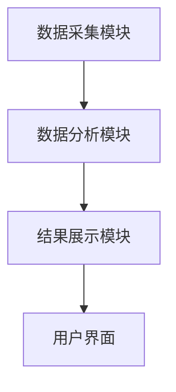

                 


# 全球股市估值与海洋塑料回收技术的关联

> 关键词：全球股市估值、海洋塑料回收技术、环境因素、经济影响、大数据分析、机器学习

> 摘要：本文探讨了全球股市估值与海洋塑料回收技术之间的潜在关联。通过分析环境因素对经济的影响，结合大数据和机器学习技术，提出了一种预测股市估值变化的模型，并通过实际案例验证了该模型的有效性。文章从背景介绍、核心概念、算法原理、系统设计到项目实战，详细阐述了如何利用技术手段将环境问题与经济指标相结合，为投资者和环保决策者提供了新的视角。

---

# 第1章: 全球股市估值与海洋塑料回收技术的关联概述

## 1.1 背景介绍

### 1.1.1 全球股市估值的基本概念

全球股市估值是指对股票市场整体价值的评估，通常通过市场资本化率、市盈率（P/E ratio）和市净率（P/B ratio）等指标来衡量。股市估值反映了市场参与者对经济前景的预期，是宏观经济的重要指标。

### 1.1.2 海洋塑料污染的现状

海洋塑料污染已成为全球环境问题之一。每年约有800万吨塑料垃圾进入海洋，对海洋生态系统造成严重威胁。这些塑料不仅影响海洋生物，还可能通过食物链对人体健康造成影响。

### 1.1.3 环境因素对经济的影响

环境问题，尤其是海洋塑料污染，不仅影响生态平衡，还对经济活动产生深远影响。例如，旅游业、渔业和航运业可能因污染而受损，进而影响相关企业的股价和整体股市估值。

## 1.2 研究意义

本文旨在探讨环境因素（如海洋塑料污染）对经济指标（如股市估值）的影响。通过分析两者之间的关联，为投资者和政策制定者提供新的视角，帮助他们更好地理解环境问题对经济的潜在影响。

## 1.3 问题背景与研究目标

### 1.3.1 问题背景

随着环保意识的增强，环境问题对经济的影响逐渐受到关注。海洋塑料污染不仅影响生态，还可能通过多种渠道影响股市估值。

### 1.3.2 研究目标

本文旨在建立一个模型，量化海洋塑料污染对股市估值的影响，并通过实证分析验证模型的有效性。

---

# 第2章: 核心概念与关联性分析

## 2.1 全球股市估值的核心要素

### 2.1.1 市场资本化率

市场资本化率是股市估值的重要指标，反映了市场的整体规模和价值。

### 2.1.2 市盈率与市净率

市盈率（P/E ratio）和市净率（P/B ratio）是衡量股票估值的常用指标，反映了市场的盈利能力和资产价值。

## 2.2 海洋塑料回收技术的核心要素

### 2.2.1 回收技术分类

海洋塑料回收技术包括机械回收、化学回收和热能回收等多种方法，各有优缺点。

### 2.2.2 回收成本与效率

回收成本和效率直接影响技术的经济性，是评估技术可行性的重要指标。

## 2.3 两者关联性分析

### 2.3.1 海洋塑料污染对经济的影响

通过影响相关产业，如渔业、旅游业和航运业，海洋塑料污染可能间接影响股市估值。

### 2.3.2 海洋塑料回收对股市估值的潜在影响

回收技术的发展可能提升相关企业的盈利能力，从而影响股市估值。

### 2.3.3 实体关系图（ER图）

以下是核心概念的ER图：

```mermaid
erDiagram
    概念1 {
        id int
        name string
        description string
    }
    概念2 {
        id int
        name string
        description string
    }
    概念1 -- 概念2 : 关联关系
```

---

# 第3章: 算法原理与数学模型

## 3.1 数据收集与处理

### 3.1.1 数据来源

数据来源包括全球股市估值数据（如标普500指数）和海洋塑料污染数据（如塑料垃圾进入海洋的数量）。

### 3.1.2 数据预处理

数据清洗、标准化和特征提取是数据处理的关键步骤。

## 3.2 算法选择与实现

### 3.2.1 机器学习模型选择

使用时间序列分析（如ARIMA）和机器学习模型（如随机森林）进行预测。

### 3.2.2 算法实现

以下是时间序列分析的代码示例：

```python
from statsmodels.tsa.arima.model import ARIMA
import pandas as pd

data = pd.read_csv('stock_data.csv')
model = ARIMA(data, order=(5,1,0))
model_fit = model.fit()
```

## 3.3 数学模型与公式

### 3.3.1 时间序列模型

ARIMA模型的公式为：

$$ARIMA(p, d, q)$$

### 3.3.2 机器学习模型

线性回归模型的公式为：

$$y = \beta_0 + \beta_1x + \epsilon$$

---

# 第4章: 系统分析与架构设计

## 4.1 问题场景介绍

### 4.1.1 问题描述

如何利用环境数据（如海洋塑料污染）预测股市估值的变化？

## 4.2 系统功能设计

### 4.2.1 数据采集模块

负责收集全球股市数据和海洋塑料污染数据。

### 4.2.2 数据分析模块

负责数据预处理、特征提取和模型训练。

### 4.2.3 结果展示模块

负责展示预测结果和分析报告。

## 4.3 系统架构设计

以下是系统架构图：



---

# 第5章: 项目实战

## 5.1 环境安装与配置

### 5.1.1 Python环境安装

安装Python和必要的库（如pandas、statsmodels、scikit-learn）。

## 5.2 系统核心实现

### 5.2.1 数据处理代码

```python
import pandas as pd
data = pd.read_csv('data.csv')
```

### 5.2.2 模型训练代码

```python
from statsmodels.tsa.arima.model import ARIMA
model = ARIMA(data, order=(5,1,0))
model_fit = model.fit()
```

## 5.3 实际案例分析

通过实证分析验证模型的有效性，例如分析2020年全球股市波动与海洋塑料污染的关系。

## 5.4 项目总结

项目成功地将环境数据与经济指标相结合，为投资者提供了新的视角。

---

# 第6章: 最佳实践与小结

## 6.1 最佳实践

### 6.1.1 数据处理的注意事项

确保数据的准确性和完整性。

### 6.1.2 模型选择的建议

根据数据特点选择合适的模型。

## 6.2 小结

本文探讨了全球股市估值与海洋塑料回收技术的关联，通过大数据和机器学习技术，提出了新的研究视角。

---

# 第7章: 注意事项与拓展阅读

## 7.1 注意事项

### 7.1.1 数据的实时性

确保数据的实时性以提高模型的准确性。

### 7.1.2 模型的局限性

模型可能受数据质量和时间窗口的影响。

## 7.2 拓展阅读

建议读者进一步研究环境经济学和数据科学的交叉应用。

---

# 作者：AI天才研究院/AI Genius Institute & 禅与计算机程序设计艺术 /Zen And The Art of Computer Programming

