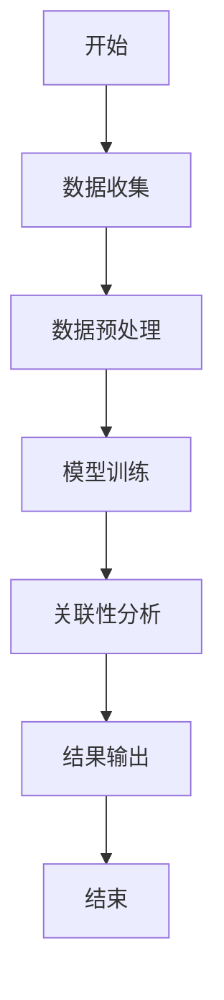

                 


# 全球股市估值与海洋塑料污染治理的关联

> 关键词：全球股市估值，海洋塑料污染，环境治理，金融模型，可持续发展

> 摘要：本文探讨全球股市估值与海洋塑料污染治理之间的关联，分析如何将环境因素纳入股市估值体系，构建数学模型，设计系统架构，并通过案例分析和项目实战，展示如何利用技术手段推动环境治理与金融市场的协同发展。

---

## 第一章: 背景介绍

### 1.1 问题背景

#### 1.1.1 全球股市估值的现状与挑战
全球股市估值是衡量企业价值的重要指标，传统的估值方法主要基于财务指标（如市盈率、市净率等）和市场情绪。然而，近年来环境问题的加剧，尤其是海洋塑料污染，对全球经济和企业价值的影响日益显著。企业若不积极应对环境挑战，可能面临估值下降的风险。

#### 1.1.2 海洋塑料污染的严重性与全球治理需求
海洋塑料污染不仅破坏生态平衡，还对渔业、旅游业等重要产业造成巨大经济损失。联合国等国际组织已将海洋塑料污染治理列为全球性任务，各国企业和政府都在寻求解决方案。

#### 1.1.3 问题解决的必要性与紧迫性
将海洋塑料污染治理纳入股市估值体系，不仅是环境治理的需要，也是金融市场可持续发展的必然选择。通过量化环境影响，投资者可以更全面地评估企业价值。

### 1.2 核心概念

#### 1.2.1 全球股市估值的核心要素
- **市盈率（P/E）**：股票价格与每股收益的比率。
- **市净率（P/B）**：股票价格与每股净资产的比率。
- **股息率**：股息与股票价格的比率。

#### 1.2.2 海洋塑料污染治理的关键因素
- **塑料污染量**：海洋中塑料垃圾的总量。
- **治理投入**：企业或政府在塑料污染治理方面的投资。
- **政策支持**：政府出台的相关法规和激励政策。

#### 1.2.3 两者之间的关联性分析
海洋塑料污染不仅影响环境，还通过企业成本、市场需求等渠道影响股市估值。例如，塑料污染治理成本上升可能导致企业盈利下降，进而影响股票估值。

---

## 第二章: 核心概念与联系

### 2.1 核心概念原理

#### 2.1.1 股市估值的数学模型
传统的股市估值模型主要基于财务数据，但忽略了环境因素。为了将环境因素纳入模型，可以引入环境影响系数 \( E \)，公式如下：
$$ V = P \times E \times G $$
其中，\( V \) 表示股票估值，\( P \) 表示市盈率，\( E \) 表示环境影响系数，\( G \) 表示增长性。

#### 2.1.2 海洋塑料污染的环境影响评估
环境影响评估模型可以量化塑料污染对企业或区域经济的影响。例如：
$$ I = \alpha \times P + \beta \times Q $$
其中，\( I \) 表示影响程度，\( P \) 表示塑料污染量，\( Q \) 表示治理投入，\( \alpha \) 和 \( \beta \) 为系数。

#### 2.1.3 两者关联的理论基础
海洋塑料污染通过影响企业成本、市场需求和政策风险间接影响股市估值。企业若能有效治理塑料污染，可能在估值上获得溢价。

### 2.2 概念属性特征对比

| 概念       | 股市估值 | 海洋塑料污染治理 |
|------------|----------|------------------|
| 核心要素   | 财务数据、市场情绪 | 塑料量、治理投入、政策支持 |
| 影响因素   | 利润、分红、行业趋势 | 环境破坏、经济损失、法规 |
| 计量方式   | 数学模型、指标分析 | 环境影响评估、成本分析 |

### 2.3 ER实体关系图

```mermaid
er
  MarinePollution {
    name: String
    severity: Integer
    location: String
    impact: String
  }
  StockMarketValuation {
    stock_name: String
    valuation: Float
    date: Date
  }
  // 关联关系
  MarinePollution -->> StockMarketValuation: 影响
```

---

## 第三章: 算法原理讲解

### 3.1 算法流程图



### 3.2 数学模型与公式

#### 3.2.1 股市估值模型
$$ V = P \times E \times G $$
其中，\( V \) 表示股票估值，\( P \) 表示市盈率，\( E \) 表示环境影响系数，\( G \) 表示增长性。

#### 3.2.2 海洋塑料污染影响模型
$$ I = \alpha \times P + \beta \times Q $$
其中，\( I \) 表示影响程度，\( P \) 表示塑料污染量，\( Q \) 表示治理投入，\( \alpha \) 和 \( \beta \) 为系数。

---

## 第四章: 系统分析与架构设计

### 4.1 问题场景介绍

#### 4.1.1 海洋塑料污染对股市的具体影响
- 塑料污染治理成本上升导致企业盈利下降，影响股市估值。
- 治理政策的出台可能导致部分行业估值波动。

#### 4.1.2 股市估值系统的需求分析
- 实时数据采集：股票数据、塑料污染数据。
- 环境影响评估：量化塑料污染对估值的影响。
- 可视化分析：展示环境因素对估值的动态影响。

### 4.2 项目实战

#### 4.2.1 环境安装
```bash
pip install pandas numpy matplotlib
```

#### 4.2.2 系统核心实现源代码

```python
import pandas as pd
import numpy as np

# 数据加载
data = pd.read_csv('stock_valuation.csv')

# 环境影响系数计算
E = np.array(data['Environment_Impact'].tolist())
P = np.array(data['PE'].tolist())
G = np.array(data['Growth'].tolist())

# 股票估值计算
V = P * E * G

# 结果保存
result = pd.DataFrame({'Stock': data['Stock'], 'Valuation': V})
result.to_csv('updated_valuation.csv', index=False)
```

#### 4.2.3 代码应用解读与分析
- 数据加载：从CSV文件加载股票数据和环境数据。
- 环境影响系数计算：提取环境影响数据并转换为数组。
- 股票估值计算：基于环境影响系数、市盈率和增长性计算股票估值。
- 结果保存：将更新后的估值保存到CSV文件。

#### 4.2.4 实际案例分析
假设某企业塑料污染治理投入增加，环境影响系数 \( E \) 上升，导致股票估值 \( V \) 上涨。

#### 4.2.5 项目小结
通过将环境因素纳入估值模型，可以更全面地评估企业价值，推动企业积极应对环境挑战。

---

## 第五章: 最佳实践 tips、小结、注意事项

### 5.1 最佳实践 tips
- 定期更新环境数据，确保模型准确性。
- 结合行业特点调整模型参数，提高适用性。
- 与政策制定者和环保组织合作，获取最新数据。

### 5.2 小结
本文通过构建数学模型和系统架构，展示了如何将海洋塑料污染治理纳入股市估值体系，为企业和社会提供可持续发展的新思路。

### 5.3 注意事项
- 数据采集和处理需确保准确性和实时性。
- 模型需根据实际情况进行调整和优化。
- 注意隐私和数据安全问题。

### 5.4 拓展阅读
- 参考文献：《环境经济学》、《金融市场分析》、《可持续发展报告》。
- 推荐书籍：《环境与经济的平衡之道》。

---

作者：AI天才研究院/AI Genius Institute & 禅与计算机程序设计艺术 /Zen And The Art of Computer Programming

