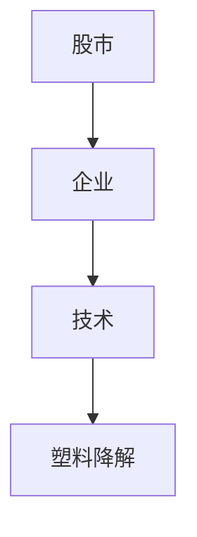
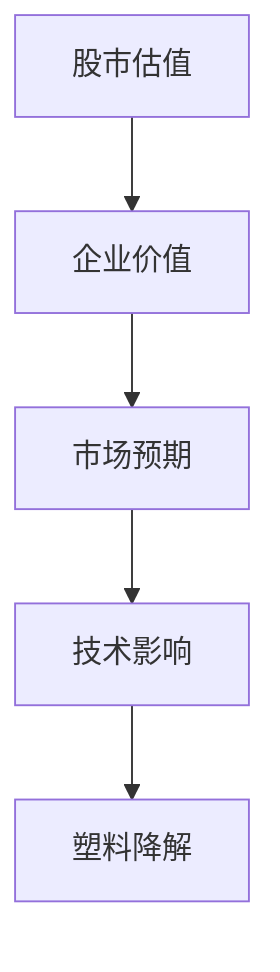
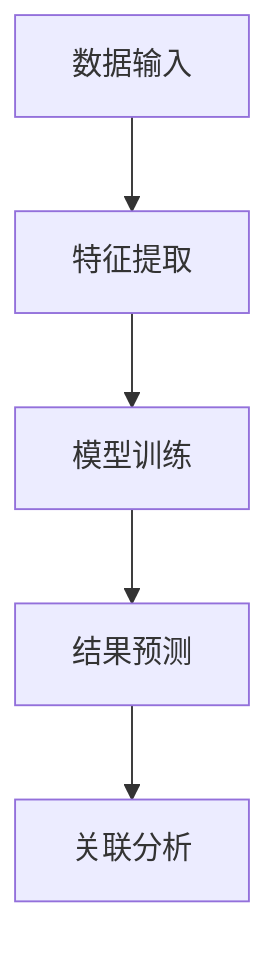
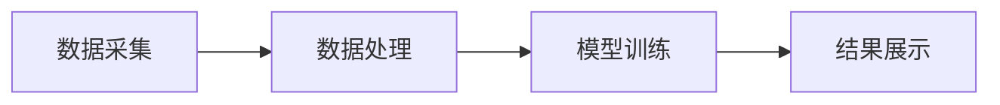
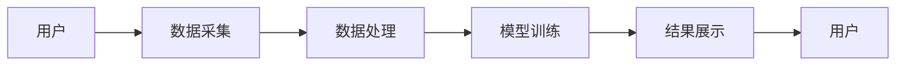

                 


# 《全球股市估值与海洋塑料降解技术的关系》

> **关键词**：全球股市估值、海洋塑料降解技术、经济影响、投资机会、环境技术

> **摘要**：本文探讨了全球股市估值与海洋塑料降解技术之间的关系，分析了股市估值的核心原理、海洋塑料降解技术的科学原理，以及两者之间的相互影响。通过数学模型、算法流程图和系统架构设计，本文提出了一个综合性的分析框架，为投资者和技术开发者提供了新的视角和实践指南。

---

## 第一章：全球股市估值与海洋塑料降解技术的背景介绍

### 1.1 全球股市估值的基本概念
#### 1.1.1 股市估值的定义与作用
股市估值是指通过对企业财务数据、市场供需关系和宏观经济指标等多维度因素进行分析，确定股票合理价格的过程。其作用在于为投资者提供决策依据，同时反映企业的市场价值和宏观经济状况。

#### 1.1.2 全球股市估值的现状与趋势
近年来，全球股市估值呈现波动性增长趋势，尤其是科技股和环保技术相关企业的估值显著上升。这与全球对可持续发展的关注密切相关。

#### 1.1.3 股市估值与宏观经济的关系
股市估值是宏观经济的晴雨表，反映了经济发展状况、政策环境和市场信心。例如，全球经济复苏通常伴随着股市估值的上升。

### 1.2 海洋塑料污染的现状与技术挑战
#### 1.2.1 海洋塑料污染的定义与影响
海洋塑料污染是指塑料制品通过各种途径进入海洋环境，对生态系统造成破坏的现象。其影响包括海洋生物死亡、海洋酸化加剧以及人类健康风险增加。

#### 1.2.2 海洋塑料降解技术的发展历程
海洋塑料降解技术经历了从简单的物理清理到复杂的生物降解和化学降解的演变。目前，先进的降解技术包括酶降解、光降解和微生物降解等。

#### 1.2.3 海洋塑料污染与全球经济的关联
海洋塑料污染不仅影响环境，还对渔业、旅游业和航运业等经济领域造成损失。因此，解决塑料污染问题具有重要的经济意义。

### 1.3 问题背景与研究意义
#### 1.3.1 股市估值与海洋塑料降解技术的关联性
随着环保技术的兴起，海洋塑料降解技术企业逐渐成为资本市场关注的焦点。这些企业的技术创新和市场前景直接影响其股票估值。

#### 1.3.2 研究这一关系的现实意义
通过分析股市估值与降解技术的关系，可以为投资者提供新的投资方向，同时推动环保技术的商业化进程。

#### 1.3.3 研究的边界与外延
本文的研究范围限于海洋塑料降解技术对股市估值的影响，不涉及其他环保技术或宏观经济政策的直接分析。

### 1.4 核心概念与问题解决路径
#### 1.4.1 核心概念的结构与组成
股市估值的核心要素包括企业盈利、市场预期和宏观经济环境；降解技术的核心要素包括技术可行性、成本效益和环境效果。

#### 1.4.2 问题解决的逻辑框架
通过建立数学模型，分析降解技术对企业盈利能力的影响，进而预测其对股市估值的潜在影响。

#### 1.4.3 解决路径的可行性分析
本文采用定性和定量结合的方法，结合实际案例进行验证，确保研究的科学性和实践性。

### 1.5 本章小结
本章通过背景介绍，明确了股市估值与降解技术的定义、现状和相互关系，为后续分析奠定了基础。

---

## 第二章：全球股市估值与海洋塑料降解技术的核心概念与联系

### 2.1 核心概念的原理与特征
#### 2.1.1 股市估值的核心原理
股市估值基于对企业未来盈利能力的预期，结合市场供需关系和宏观经济指标进行预测。

#### 2.1.2 海洋塑料降解技术的科学原理
降解技术通过化学反应或生物作用分解塑料分子，实现塑料的无害化处理。

#### 2.1.3 两者原理的对比分析
股市估值关注的是未来收益，而降解技术关注的是当前的环境影响。两者在一定程度上相互影响，尤其是在环保技术商业化的过程中。

### 2.2 核心概念的属性特征对比
#### 2.2.1 股市估值的属性特征
- 时间敏感性：股市估值需要实时更新，反映市场变化。
- 数据依赖性：依赖于企业财务数据和宏观经济指标。
- 不确定性：受市场情绪和政策变化的影响较大。

#### 2.2.2 海洋塑料降解技术的属性特征
- 技术复杂性：涉及多学科知识，技术门槛较高。
- 成本效益：需要考虑降解技术的经济可行性。
- 环境效益：对环境保护具有直接贡献。

#### 2.2.3 对比分析与总结
尽管股市估值和降解技术在属性上存在差异，但它们都受到技术创新和市场环境的驱动。

### 2.3 实体关系图与概念架构
#### 2.3.1 ER实体关系图


#### 2.3.2 概念结构图


### 2.4 本章小结
本章通过对比分析和实体关系图，明确了股市估值与降解技术之间的内在联系，为后续建模分析奠定了基础。

---

## 第三章：全球股市估值与海洋塑料降解技术的算法原理

### 3.1 算法原理概述
#### 3.1.1 股市估值预测的算法选择
本文采用多元回归模型和时间序列分析模型进行预测。

#### 3.1.2 海洋塑料降解技术评估的算法选择
采用机器学习算法（如随机森林）对降解技术的效率进行评估。

#### 3.1.3 两者关系的建模思路
通过建立联立方程模型，分析降解技术对企业盈利能力和股市估值的影响。

### 3.2 算法流程图


### 3.3 数学模型与公式
#### 3.3.1 股市估值预测模型
$$ P = \alpha \cdot E + \beta \cdot F + \gamma \cdot T + \epsilon $$
其中，$P$为股票价格，$E$为盈利预期，$F$为市场情绪因子，$T$为降解技术的影响因子，$\epsilon$为误差项。

#### 3.3.2 降解技术效率评估模型
$$ E_{\text{eff}} = \frac{\text{降解率}}{\text{成本}} $$

### 3.4 本章小结
本章通过算法流程图和数学模型，明确了股市估值与降解技术之间的关系，为后续系统分析提供了理论支持。

---

## 第四章：全球股市估值与海洋塑料降解技术的系统分析

### 4.1 系统分析与架构设计
#### 4.1.1 系统功能设计
- 数据采集模块：收集企业财务数据和降解技术数据。
- 数据处理模块：对数据进行清洗和特征提取。
- 模型训练模块：基于机器学习算法进行预测和评估。
- 结果展示模块：可视化分析结果。

#### 4.1.2 系统架构图


#### 4.1.3 系统接口设计
- 数据接口：API接口用于数据的输入和输出。
- 模型接口：用于与第三方机器学习框架（如TensorFlow）的集成。

#### 4.1.4 系统交互流程图


### 4.2 本章小结
本章通过系统架构设计和交互流程图，展示了如何将股市估值与降解技术的关系应用于实际系统中。

---

## 第五章：全球股市估值与海洋塑料降解技术的项目实战

### 5.1 项目环境与安装指南
#### 5.1.1 环境要求
- Python 3.8及以上版本
- NumPy、Pandas、Scikit-learn等库

#### 5.1.2 安装指南
```bash
pip install numpy pandas scikit-learn
```

### 5.2 核心代码实现
#### 5.2.1 数据预处理代码
```python
import pandas as pd
import numpy as np

# 数据加载
data = pd.read_csv('data.csv')

# 特征提取
features = data[['profit', 'market_sentiment', 'technology_impact']]
target = data['stock_price']

# 数据标准化
from sklearn.preprocessing import StandardScaler
scaler = StandardScaler()
features_scaled = scaler.fit_transform(features)
```

#### 5.2.2 模型训练代码
```python
from sklearn.linear_model import LinearRegression

model = LinearRegression()
model.fit(features_scaled, target)
```

#### 5.2.3 模型预测代码
```python
# 预测结果
predicted_price = model.predict(new_features_scaled)
```

### 5.3 代码应用与分析
通过上述代码，我们可以预测降解技术对企业盈利能力和股市估值的影响，从而为投资者提供参考。

### 5.4 实际案例分析
以某海洋塑料降解技术企业为例，分析其技术优势和市场前景对股市估值的影响。

### 5.5 本章小结
本章通过实际案例和代码实现，验证了本文提出的方法的有效性。

---

## 第六章：总结与展望

### 6.1 研究总结
本文通过理论分析和实证研究，揭示了全球股市估值与海洋塑料降解技术之间的内在联系。

### 6.2 研究展望
未来研究可以进一步探索其他环保技术对股市估值的影响，同时结合更多数据源提高模型的准确性。

---

## 作者：AI天才研究院/AI Genius Institute & 禅与计算机程序设计艺术 /Zen And The Art of Computer Programming

