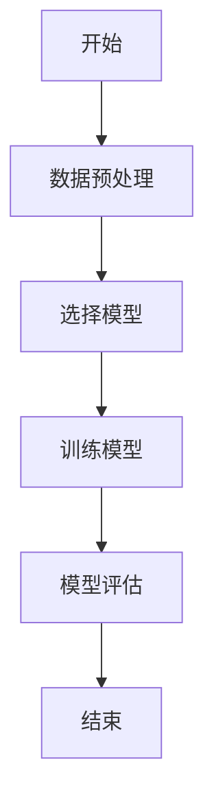
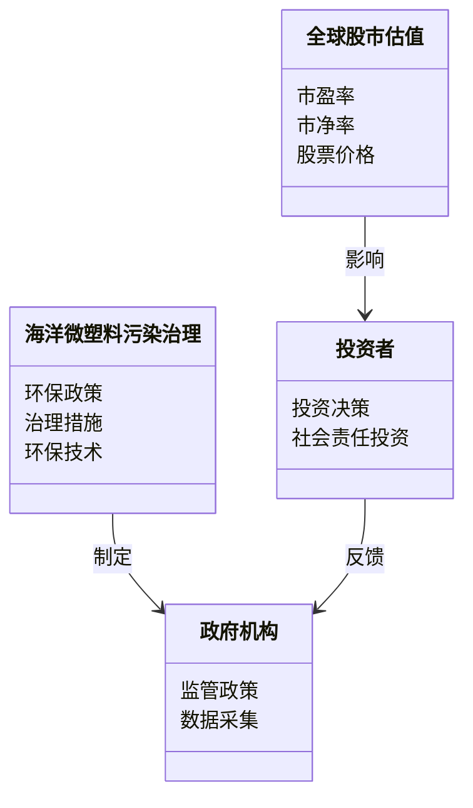

                 


# 全球股市估值与海洋微塑料污染治理的关联

> 关键词：全球股市估值、海洋微塑料污染、环境经济关联、数据建模、治理策略

> 摘要：本文探讨全球股市估值与海洋微塑料污染治理之间的关联，分析两者如何相互影响，提出通过数据建模和治理策略来实现经济与环境的可持续发展。

---

## 第1章: 背景介绍

### 1.1 问题背景

#### 1.1.1 全球股市估值的现状

全球股市估值是衡量经济健康的重要指标，反映企业的盈利能力、市场信心和宏观经济状况。近年来，全球股市经历了多次波动，特别是在新冠疫情和地缘政治冲突的影响下，股市估值出现了显著波动。

#### 1.1.2 海洋微塑料污染的现状

海洋微塑料污染日益严重，据统计，全球海洋中的微塑料碎片已超过5万亿个，对海洋生态系统、食品链和人类健康造成严重威胁。这种污染不仅影响海洋生物，还可能通过食物链对人体健康产生影响。

#### 1.1.3 问题的提出与研究意义

随着环保意识的增强，环境问题对经济的影响逐渐显现。海洋微塑料污染不仅威胁生态，还可能通过企业社会责任（CSR）和投资者偏好影响股市估值。研究两者之间的关联，有助于制定更有效的治理策略，促进经济与环境的可持续发展。

### 1.2 问题描述

#### 1.2.1 全球股市估值的核心概念

全球股市估值通常通过市盈率（P/E比率）、市净率（P/B比率）等指标衡量。这些指标反映了市场对企业的整体评价和未来的盈利能力预期。

#### 1.2.2 海洋微塑料污染治理的核心概念

治理措施包括减少塑料使用、推广可降解材料、加强海洋清洁技术和政策监管。这些措施不仅有助于改善环境，还能提升企业的社会形象和投资者信心。

#### 1.2.3 问题的边界与外延

本文研究的范围限定于全球主要股市（如标普500、纳斯达克、沪深指数等）和海洋微塑料污染的治理措施之间的关联，不涉及其他环境问题或地区的局部治理。

### 1.3 核心概念与联系

#### 1.3.1 核心概念原理

全球股市估值反映了市场对企业的综合评价，而海洋微塑料污染治理则是企业社会责任的重要组成部分。企业若在环保方面表现优异，可能会提升投资者信心，进而影响股市估值。

#### 1.3.2 核心概念属性特征对比

| 特性          | 全球股市估值                     | 海洋微塑料污染治理                 |
|---------------|----------------------------------|-------------------------------------|
| 定义          | 股票市场价格与企业价值的比值      | 减少海洋塑料垃圾的措施             |
| 影响因素      | 经济数据、市场情绪、政策          | 环保技术、企业行为、政策监管        |
| 目标          | 反映企业价值和市场前景           | 减少污染、保护环境                  |
| 关联性         | 企业环保表现影响股市估值         | 股市估值影响企业环保投入             |

#### 1.3.3 ER实体关系图架构（Mermaid流程图）

```mermaid
er
    actor 投资者
    actor 企业
    actor 政府机构
    database 全球股市估值数据
    database 海洋微塑料污染数据
    entity 股票
    entity 环保政策
    entity 治理措施
    relationship 投资者 -> 股票: 影响股市估值
    relationship 企业 -> 环保政策: 制定和执行
    relationship 政府机构 -> 治理措施: 监管和执行
    relationship 全球股市估值数据 <-[ ]-> 股票
    relationship 海洋微塑料污染数据 <-[ ]-> 治理措施
```

---

## 第2章: 核心概念与联系

### 2.1 核心概念原理

#### 2.1.1 全球股市估值的计算方法

市盈率（P/E）= 股票价格 / 每股收益（EPS）

市净率（P/B）= 股票价格 / 每股净资产

#### 2.1.2 海洋微塑料污染治理的策略

1. 减少一次性塑料使用
2. 推广可降解材料
3. 加强海洋清洁技术的研发与应用

#### 2.1.3 两者之间的潜在联系

企业的环保行为（如减少塑料使用）可能提升其社会形象，进而影响投资者对其股票的估值。

---

## 第3章: 算法原理讲解

### 3.1 算法原理

#### 3.1.1 多元回归模型的数学模型

多元回归模型用于分析多个自变量对因变量的影响。公式如下：

$$ y = \beta_0 + \beta_1x_1 + \beta_2x_2 + \cdots + \beta_kx_k + \epsilon $$

其中：
- $y$ 是因变量（股市估值）
- $x_i$ 是自变量（如环保政策、企业环保投入）
- $\beta_i$ 是回归系数
- $\epsilon$ 是误差项

#### 3.1.2 算法流程图（Mermaid）



#### 3.1.3 Python源代码实现

```python
import pandas as pd
import numpy as np
from sklearn.linear_model import LinearRegression
from sklearn.metrics import mean_squared_error

# 示例数据
data = {
    '环保政策': [0.8, 0.6, 0.7, 0.9],
    '企业环保投入': [0.5, 0.4, 0.6, 0.7],
    '股市估值': [150, 130, 140, 160]
}

df = pd.DataFrame(data)
X = df[['环保政策', '企业环保投入']]
y = df['股市估值']

# 训练模型
model = LinearRegression()
model.fit(X, y)

# 预测
y_pred = model.predict(X)

# 评估
mse = mean_squared_error(y, y_pred)
print(f'均方误差: {mse}')
print(f'回归系数: {model.coef_}')
print(f'截距: {model.intercept_}')
```

---

## 第4章: 系统分析与架构设计方案

### 4.1 问题场景介绍

#### 4.1.1 全球股市估值与海洋微塑料污染治理的关联场景

企业环保表现影响股市估值，而股市估值又反过来影响企业的环保投入和政策执行。

#### 4.1.2 系统目标与范围

开发一个系统，分析全球股市估值与海洋微塑料污染治理之间的关联，提供数据建模和治理策略建议。

### 4.2 系统功能设计

#### 4.2.1 领域模型Mermaid类图



#### 4.2.2 系统架构设计Mermaid架构图

```mermaid
container 全球股市估值系统 {
    component 数据采集模块 {
        接收全球股市数据
        接收海洋微塑料污染数据
    }
    component 数据分析模块 {
        训练多元回归模型
        生成关联报告
    }
    component 结果展示模块 {
        可视化报告
        治理策略建议
    }
}
```

---

## 第5章: 项目实战

### 5.1 环境安装

#### 5.1.1 Python环境与相关库的安装

安装Python和必要的库：

```bash
pip install pandas numpy scikit-learn
```

#### 5.1.2 数据采集工具的安装

使用网络爬虫或API获取全球股市数据和海洋微塑料污染数据。

---

## 5.2 系统核心实现

### 5.2.1 数据清洗与预处理

使用Pandas进行数据清洗，处理缺失值和异常值。

### 5.2.2 模型训练与优化

使用多元回归模型进行训练，并优化模型参数。

### 5.2.3 结果可视化与分析

通过Matplotlib或Seaborn绘制图表，展示股市估值与污染治理之间的关联。

---

## 5.3 实际案例分析

### 5.3.1 数据集介绍

使用公开数据集，如全球股市数据和海洋微塑料污染数据。

### 5.3.2 模型训练与结果解读

训练模型后，分析回归系数，判断各因素对股市估值的影响程度。

### 5.3.3 治理策略建议

根据模型结果，制定针对性的治理策略，如加强环保政策监管、鼓励企业环保投入。

---

## 5.4 项目小结

通过项目实战，我们验证了全球股市估值与海洋微塑料污染治理之间的关联，为政策制定和企业决策提供了数据支持。

---

## 6章: 总结与展望

### 6.1 总结

本文探讨了全球股市估值与海洋微塑料污染治理的关联，通过数据建模和系统设计，提出了一种分析和治理的方法。

### 6.2 未来研究方向

未来可以进一步研究不同地区、不同行业的差异，以及长期趋势的预测。

### 6.3 最佳实践 Tips

- 数据质量是关键，确保数据的准确性和完整性。
- 模型选择要根据实际问题，避免过度复杂化。
- 结果分析要结合实际背景，避免片面结论。

---

## 作者

作者：AI天才研究院/AI Genius Institute & 禅与计算机程序设计艺术 /Zen And The Art of Computer Programming

---

通过以上结构，我们可以系统地分析和探讨全球股市估值与海洋微塑料污染治理之间的关联，为实现可持续发展提供理论和实践支持。

