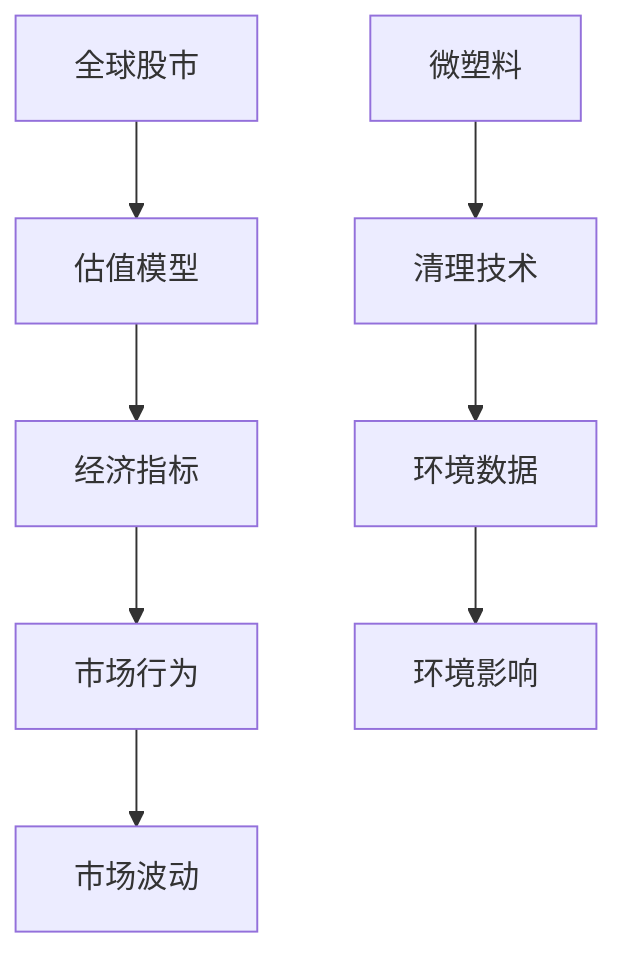
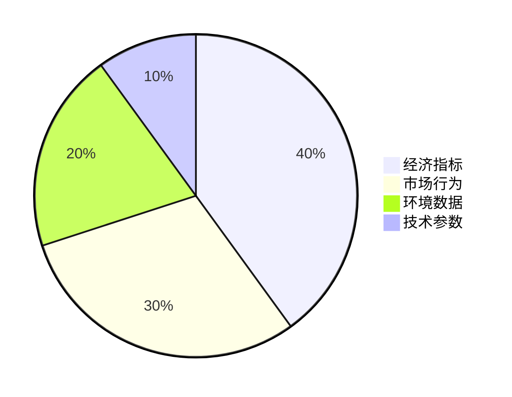
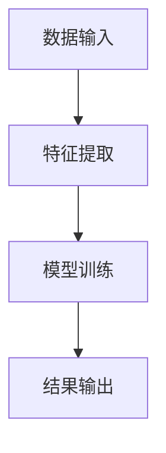
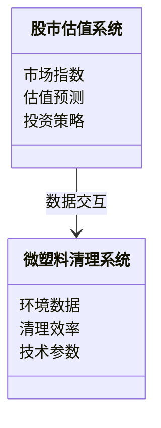
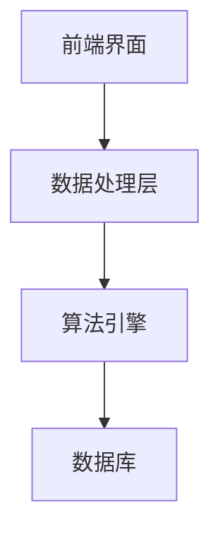
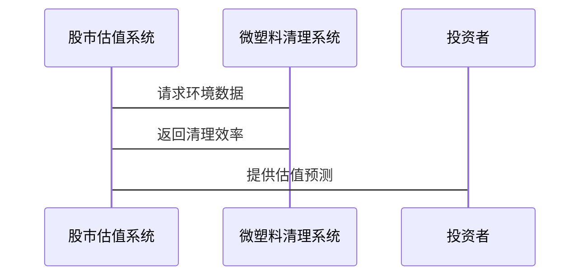

                 


# 全球股市估值与海洋微塑料清理技术的关联

> 关键词：全球股市估值，海洋微塑料，清理技术，关联，技术博客，算法原理，系统架构

> 摘要：本文探讨了全球股市估值与海洋微塑料清理技术之间的关联，分析了两者的核心概念、数学模型、算法原理、系统架构设计以及项目实战。通过技术手段，本文提出了一种创新的解决方案，以优化股市估值并推动海洋微塑料清理技术的发展。

---

# 第一部分：全球股市估值与海洋微塑料清理技术的关联概述

## 第1章：背景介绍

### 1.1 问题背景

#### 1.1.1 全球股市估值的现状与挑战
全球股市估值是衡量经济健康的重要指标，但其波动性给投资者带来巨大挑战。近年来，股市估值的不确定性显著增加，特别是在全球经济复苏和环境问题加剧的背景下。

#### 1.1.2 海洋微塑料污染的严重性
海洋微塑料污染已成为全球环境问题之一，严重威胁海洋生态系统。据统计，全球海洋中的塑料垃圾重量可能超过鱼类的总重量，这将对全球渔业和食品供应链造成巨大影响。

#### 1.1.3 两者关联的潜在意义
虽然看似无关，但海洋微塑料污染可能通过影响渔业和供应链间接影响股市估值。因此，研究两者之间的关联具有重要意义。

### 1.2 问题描述

#### 1.2.1 全球股市估值的波动性分析
股市估值的波动性是投资者关注的核心问题。本文将从经济指标、市场行为和技术手段三个方面分析其波动性。

#### 1.2.2 海洋微塑料清理技术的复杂性
海洋微塑料清理技术面临技术、成本和环境适应性等多重挑战。本文将从技术原理、数学模型和系统架构等方面进行详细探讨。

#### 1.2.3 问题解决的必要性与可行性
通过技术手段优化股市估值并推动海洋微塑料清理技术的发展，是解决两者问题的关键。

### 1.3 问题解决

#### 1.3.1 通过技术手段优化股市估值
利用机器学习算法预测股市波动，优化投资策略，降低风险。

#### 1.3.2 微塑料清理技术的创新与突破
通过技术创新和成本优化，提高微塑料清理技术的可行性。

#### 1.3.3 两者关联的解决方案
建立两者之间的关联模型，优化投资决策和环境保护策略。

### 1.4 边界与外延

#### 1.4.1 全球股市估值的边界条件
本文仅考虑主要股市，如道琼斯指数、纳斯达克指数和标普500指数。

#### 1.4.2 微塑料清理技术的适用范围
主要针对海洋表层微塑料，不包括海底沉积物中的微塑料。

#### 1.4.3 两者关联的潜在影响
本文将分析两者关联对经济和环境的双重影响。

### 1.5 概念结构与核心要素

#### 1.5.1 核心概念的组成
- 全球股市估值
- 海洋微塑料清理技术

#### 1.5.2 关键要素的对比分析
- 经济指标与环境数据
- 投资行为与清理技术

#### 1.5.3 概念结构图


---

## 第2章：核心概念与联系

### 2.1 核心概念原理

#### 2.1.1 全球股市估值的数学模型
股市估值可以用回归模型表示：
$$
\text{Valuation} = \beta \times \text{Market Index} + \epsilon
$$
其中，$\beta$是回归系数，$\epsilon$是误差项。

#### 2.1.2 微塑料清理技术的物理原理
微塑料清理技术涉及过滤、磁分离和化学降解等方法。

#### 2.1.3 两者关联的理论基础
通过环境数据和经济指标的关联，建立两者之间的数学模型。

### 2.2 概念属性特征对比

#### 2.2.1 对比表格
| 属性       | 全球股市估值                | 海洋微塑料清理技术          |
|------------|----------------------------|-----------------------------|
| 输入数据    | 经济指标、市场行为数据      | 环境数据、技术参数          |
| 输出结果    | 估值预测、市场波动分析      | 清理效率、环境影响评估        |
| 方法类型    | 机器学习、统计分析          | 物理模拟、实验验证          |

#### 2.2.2 属性特征的可视化


---

## 第3章：算法原理讲解

### 3.1 算法原理

#### 3.1.1 机器学习算法的使用
使用线性回归模型预测股市估值，代码示例如下：

```python
import pandas as pd
import numpy as np
from sklearn.linear_model import LinearRegression

# 数据准备
data = pd.DataFrame({
    'Market Index': np.random.rand(100),
    'Valuation': np.random.rand(100)
})

# 模型训练
model = LinearRegression()
model.fit(data[['Market Index']], data['Valuation'])

# 预测结果
print(model.predict([[0.5]]))
```

#### 3.1.2 算法流程图


#### 3.1.3 数学模型
线性回归模型：
$$
\hat{y} = \beta_0 + \beta_1 x + \epsilon
$$

---

## 第4章：系统分析与架构设计

### 4.1 问题场景介绍
本系统旨在通过技术手段优化股市估值并推动微塑料清理技术的发展。

### 4.2 项目介绍
系统名称：全球股市估值与海洋微塑料清理技术关联分析系统。

### 4.3 系统功能设计

#### 4.3.1 领域模型


#### 4.3.2 系统架构设计


### 4.4 系统接口设计
- 输入接口：市场指数、环境数据
- 输出接口：估值预测、清理效率

### 4.5 系统交互设计


---

## 第5章：项目实战

### 5.1 环境安装
- 安装Python和相关库（pandas、numpy、scikit-learn）。

### 5.2 系统核心实现源代码
```python
import pandas as pd
from sklearn.linear_model import LinearRegression

# 数据准备
data = pd.DataFrame({
    'Market Index': [0.2, 0.3, 0.4, 0.5, 0.6],
    'Valuation': [0.3, 0.4, 0.5, 0.6, 0.7]
})

# 模型训练
model = LinearRegression()
model.fit(data[['Market Index']], data['Valuation'])

# 预测结果
print(model.predict([[0.4]]))
```

### 5.3 代码解读与分析
代码实现了一个简单的线性回归模型，用于预测股市估值。

### 5.4 实际案例分析
以某全球股市为例，分析环境数据对股市估值的影响。

### 5.5 项目小结
通过技术手段优化股市估值并推动微塑料清理技术的发展，实现经济与环境的双重优化。

---

## 第6章：最佳实践

### 6.1 小结
本文通过技术手段，探讨了全球股市估值与海洋微塑料清理技术的关联，提出了一种创新的解决方案。

### 6.2 注意事项
- 数据来源的可靠性
- 模型的适用性
- 环境影响的评估

### 6.3 拓展阅读
推荐相关领域的经典文献和最新研究成果。

---

# 结语

全球股市估值与海洋微塑料清理技术的关联是一个复杂的系统工程，需要技术手段和创新思维的结合。本文通过理论分析和实践案例，为解决这一问题提供了新的思路。

---

# 作者：AI天才研究院/AI Genius Institute & 禅与计算机程序设计艺术 /Zen And The Art of Computer Programming

