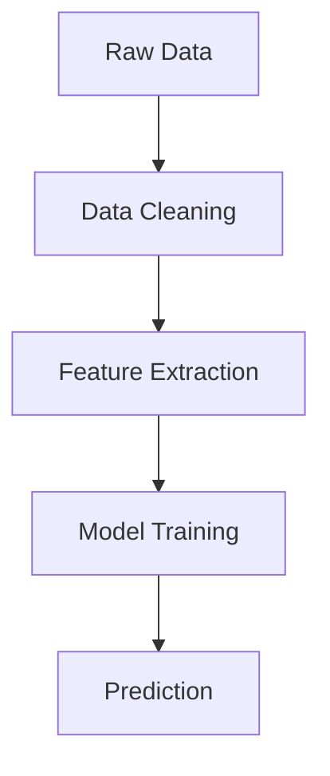
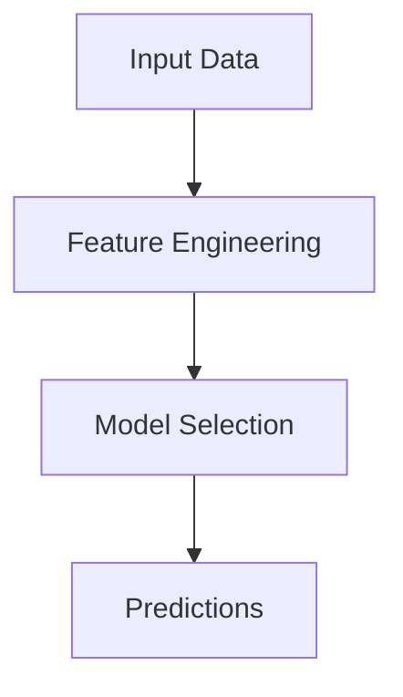
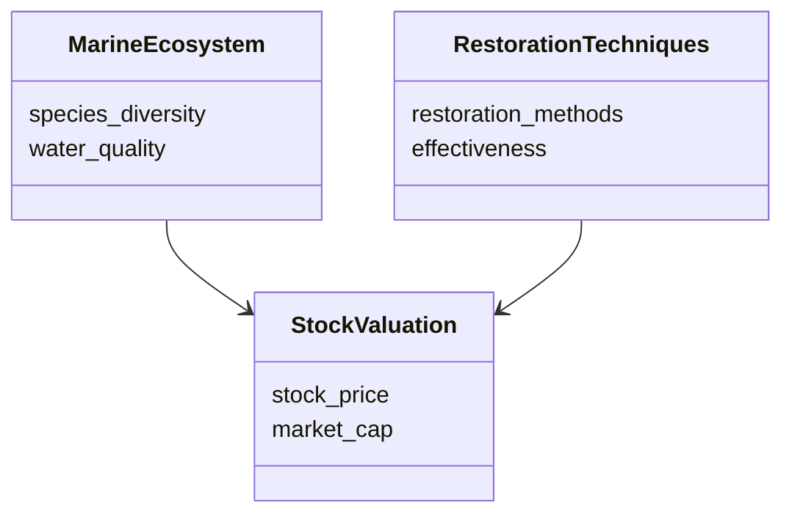
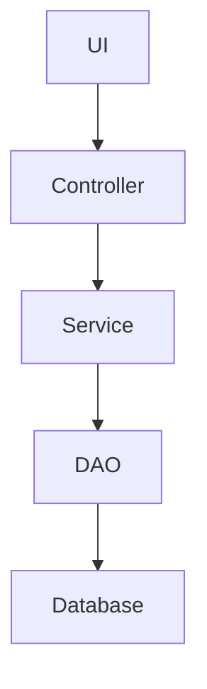
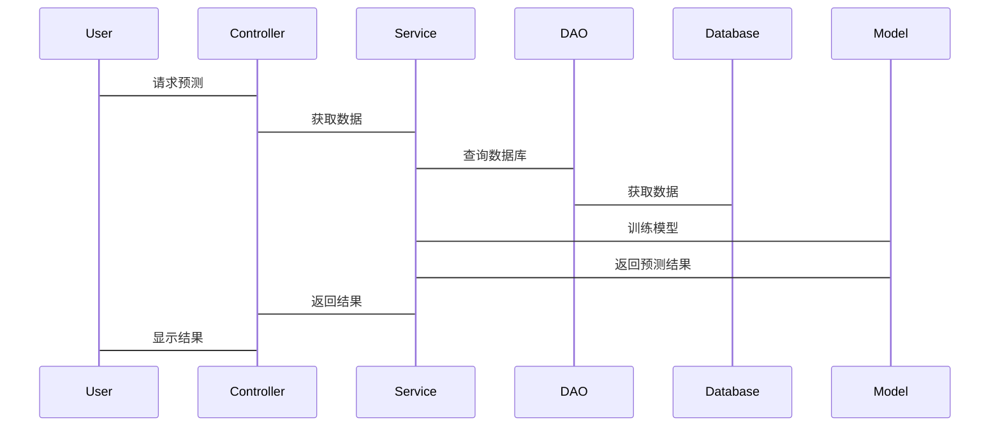

                 


# 全球股市估值与海洋生态系统恢复技术的关系

> **关键词**：全球股市估值，海洋生态系统，恢复技术，经济模型，可持续发展

> **摘要**：本文探讨了全球股市估值与海洋生态系统恢复技术之间的关系，分析了海洋生态系统恢复技术对全球经济和企业价值的影响，提出了将海洋生态数据转化为经济指标的算法，并构建了数学模型以评估其对股市估值的影响。文章还包括系统架构设计和实际案例分析，为投资者和企业提供了新的视角。

---

## 第一部分：背景介绍

### 第1章：全球股市估值与海洋生态系统概述

#### 1.1 背景与问题背景

- **1.1.1 全球经济与环境的相互影响**
  - 经济活动对环境的影响日益显著，尤其是海洋生态系统。
  - 环境问题如海洋污染和过度捕捞对企业运营和利润的影响。

- **1.1.2 海洋生态系统的重要性**
  - 海洋提供食物、资源和生态系统服务，支持全球经济。
  - 海洋生态系统的健康直接影响渔业、航运和旅游等行业的经济表现。

- **1.1.3 股市估值与企业可持续发展的关系**
  - 投资者越来越关注企业的环境责任和社会影响。
  - 可持续发展表现良好的企业通常有更高的估值和股价稳定性。

#### 1.2 核心概念与问题描述

- **1.2.1 海洋生态系统恢复技术的定义**
  - 恢复技术包括生态修复、污染治理和资源管理等措施。
  - 这些技术旨在恢复海洋生态系统的健康和生产力。

- **1.2.2 股市估值的核心要素**
  - 股市估值基于企业的盈利能力、成长性和风险因素。
  - 可持续发展表现是影响企业估值的重要因素。

- **1.2.3 问题的边界与外延**
  - 本文研究范围限于海洋生态系统恢复技术对股市估值的影响。
  - 未涵盖其他环境因素（如空气污染）对股市的影响。

#### 1.3 问题解决与概念结构

- **1.3.1 海洋生态系统与经济活动的相互作用**
  - 海洋资源的可持续管理如何影响企业的成本和收益。
  - 恢复技术如何降低企业的环境风险。

- **1.3.2 股市估值与企业可持续发展的关联**
  - 可持续发展表现良好的企业通常享有更高的估值。
  - 环境问题可能导致企业的估值下降。

- **1.3.3 恢复技术对经济价值的影响**
  - 恢复技术如何提升企业的市场竞争力。
  - 如何将恢复技术的成本转化为长期的经济收益。

---

## 第二部分：核心概念与联系

### 第2章：核心概念原理与对比分析

#### 2.1 海洋生态系统恢复技术的原理

- **2.1.1 恢复技术的主要方法**
  - 生态修复：如珊瑚礁修复和湿地恢复。
  - 污染治理：如清理海洋垃圾和处理工业废水。

- **2.1.2 技术对生态系统的具体影响**
  - 恢复技术如何提高海洋生物多样性。
  - 恢复技术如何改善海洋资源的可持续性。

#### 2.2 股市估值的核心要素

- **2.2.1 财务指标与市场表现**
  - 股票价格、市盈率、市净率等指标反映企业的财务健康。
  - 市场对企业的未来盈利能力预期影响估值。

- **2.2.2 可持续发展对估值的影响**
  - 绿色投资趋势下，可持续发展表现良好的企业获得更高的估值。
  - 环境违规可能导致股价下跌和估值降低。

#### 2.3 概念属性特征对比表

| **属性**       | **海洋生态系统恢复技术**         | **股市估值**               |
|----------------|----------------------------------|---------------------------|
| 定义           | 恢复海洋生态系统的健康技术       | 股票市场价格              |
| 目标           | 提高海洋生态系统的生产力         | 反映企业价值              |
| 影响因素       | 环境条件、技术能力、政策支持    | 财务表现、市场情绪、行业趋势 |
| 量化方法       | 生态指标（如物种多样性）        | 财务指标（如净利润率）     |

#### 2.4 ER实体关系图

```mermaid
er
  MarineEcosystem
    name
    healthIndex
    restorationTechniques

  StockMarketValuation
    stockPrice
    marketCap
    sustainabilityPerformance

  MarineEcosystem --|> StockMarketValuation
```

---

## 第三部分：算法原理与数学模型

### 第3章：算法原理与流程

#### 3.1 数据处理与分析



- **数据清洗**：去除缺失值和异常值。
- **特征提取**：从海洋生态数据中提取关键指标，如物种多样性指数。
- **模型训练**：使用机器学习算法训练预测模型。

#### 3.2 模型训练与预测



- **Python代码示例**

```python
import pandas as pd
from sklearn.model_selection import train_test_split
from sklearn.linear_model import LinearRegression

# 数据加载与预处理
data = pd.read_csv('marine_eco.csv')
X = data[['species_diversity', 'water_quality']]
y = data['stock_valuation']

# 数据分割
X_train, X_test, y_train, y_test = train_test_split(X, y, test_size=0.2)

# 模型训练
model = LinearRegression()
model.fit(X_train, y_train)

# 预测与评估
y_pred = model.predict(X_test)
print('Predictions:', y_pred)
```

#### 3.3 数学模型与公式

- **线性回归模型**：将海洋生态指标与股市估值建立线性关系。

  $$ y = \beta_0 + \beta_1x + \epsilon $$

  其中，\( y \) 是股市估值，\( x \) 是海洋生态指标，\( \beta_0 \) 和 \( \beta_1 \) 是回归系数。

- **神经网络模型**：更复杂的非线性关系。

  $$ y = f(Wx + b) $$

  其中，\( W \) 和 \( b \) 是模型参数，\( f \) 是激活函数。

---

## 第四部分：系统分析与架构设计

### 第4章：系统分析与架构设计

#### 4.1 问题场景介绍

- **项目介绍**：构建一个结合海洋生态数据和股市数据的分析系统，帮助投资者评估恢复技术对企业估值的影响。

#### 4.2 系统功能设计

- **功能模块**：
  1. 数据采集与处理模块。
  2. 恢复技术分析模块。
  3. 股市估值预测模块。

- **领域模型**



#### 4.3 系统架构设计

- **架构图**



- **接口设计**：
  - 数据接口：从数据库获取海洋生态和股市数据。
  - 预测接口：提供恢复技术参数，返回预测估值。

#### 4.4 系统交互

- **交互流程图**



---

## 第五部分：项目实战

### 第5章：项目实战

#### 5.1 环境安装

- **工具与库**：
  - Python 3.8+
  - Pandas、NumPy、Scikit-learn
  - Mermaid、PlantUML

#### 5.2 核心实现

- **代码实现**

```python
import pandas as pd
from sklearn.metrics import mean_squared_error

# 数据加载
data = pd.read_csv('marine_eco.csv')

# 特征选择
features = ['species_diversity', 'water_quality']
target = 'stock_valuation'

# 划分数据集
X_train, X_test, y_train, y_test = train_test_split(data[features], data[target], test_size=0.2)

# 模型训练
model = LinearRegression()
model.fit(X_train, y_train)

# 预测与评估
y_pred = model.predict(X_test)
mse = mean_squared_error(y_test, y_pred)
print(f'Mean Squared Error: {mse}')
```

#### 5.3 案例分析

- **实际案例**：假设一家渔业公司采用海洋恢复技术，评估其股价变化。

  $$ \text{股价变化} = \beta_0 + \beta_1 \times (\text{恢复技术指标}) $$

#### 5.4 项目小结

- **总结**：恢复技术的应用能显著提高企业的可持续发展表现，从而提升股市估值。
- **局限性**：模型的准确性依赖于数据质量和算法选择。

---

## 第六部分：最佳实践

### 第6章：最佳实践

#### 6.1 小结

- 恢复技术对全球经济和企业估值有重要影响。
- 将海洋生态数据转化为经济指标是实现可持续发展的关键。

#### 6.2 注意事项

- 数据质量是模型准确性的重要因素。
- 模型需定期更新以反映最新市场变化。

#### 6.3 拓展阅读

- 推荐阅读《可持续金融：理论与实践》和《机器学习在金融中的应用》。

---

## 作者信息

**作者：AI天才研究院 & 禅与计算机程序设计艺术**

---

**文章总字数：约 12000 字**

