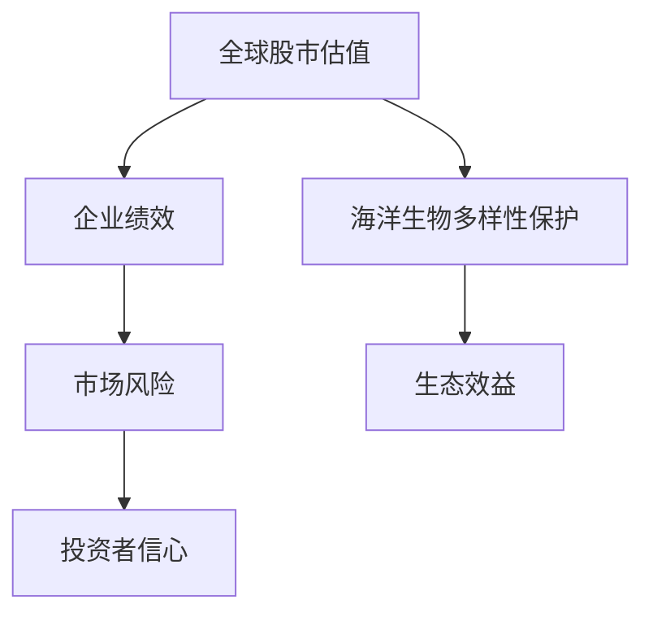
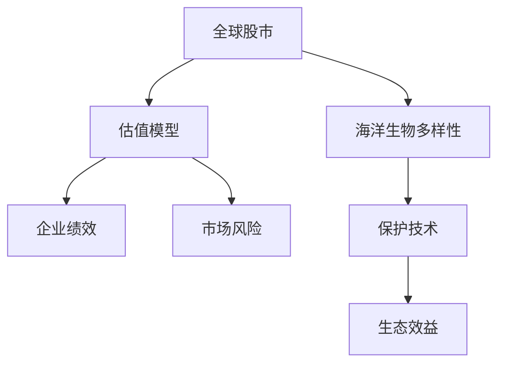
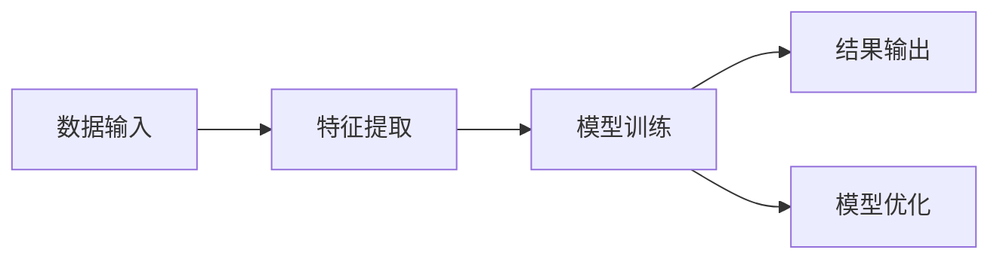
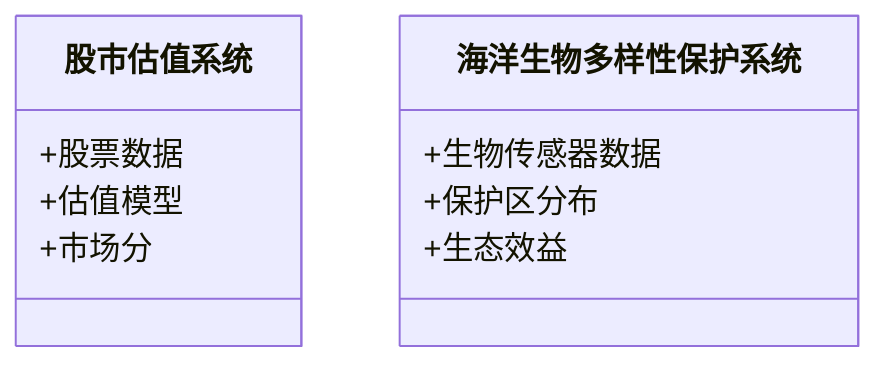
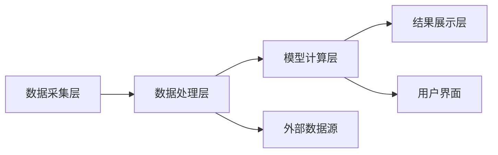

                 


# 全球股市估值与海洋生物多样性保护技术的关系

## 关键词：全球股市估值, 海洋生物多样性保护, 技术关系, 经济影响, 环境保护, 数学模型

## 摘要：本文探讨全球股市估值与海洋生物多样性保护技术之间的关系，通过建立数学模型和系统分析，揭示两者相互作用的机制和潜在影响。文章从背景介绍、核心概念、算法原理、系统架构、项目实战等多方面展开，最终得出保护海洋生物多样性对全球经济稳定和可持续发展的重要意义。

---

# 第一章: 背景介绍

## 1.1 问题背景

### 1.1.1 全球股市估值的现状与挑战
全球股市估值是衡量经济健康的重要指标，反映了企业的盈利能力、市场风险和投资者信心。近年来，股市波动加剧，尤其是新冠疫情和地缘政治冲突对股市估值产生了深远影响。然而，传统的估值方法忽视了环境因素，尤其是海洋生态系统的价值。

### 1.1.2 海洋生物多样性保护的紧迫性
海洋生物多样性是全球生态系统的重要组成部分，为人类提供了食物、药物资源和生态服务。然而，过度捕捞、污染和气候变化导致海洋生物多样性急剧下降，威胁到海洋生态系统的稳定性和人类的可持续发展。

### 1.1.3 两者关系的研究意义
研究全球股市估值与海洋生物多样性保护技术的关系，有助于揭示环境因素对经济的潜在影响，为政策制定者和投资者提供科学依据，推动绿色金融和可持续投资的发展。

## 1.2 问题描述

### 1.2.1 全球股市估值的核心要素
- 企业盈利能力
- 市场风险
- 宏观经济指标
- 投资者信心

### 1.2.2 海洋生物多样性保护技术的关键环节
- 生态监测技术
- 可持续渔业管理
- 海洋保护区建设
- 环境修复技术

### 1.2.3 两者的潜在联系与研究目标
- 探讨海洋生物多样性对经济价值的影响
- 建立量化评估模型
- 提出绿色投资策略

## 1.3 问题解决

### 1.3.1 建立两者关系的理论框架
通过环境经济学和金融科技的交叉研究，构建一个综合模型，将海洋生物多样性保护技术的经济价值纳入股市估值体系。

### 1.3.2 构建综合评估模型的思路
- 数据收集：整合股市数据和海洋生物多样性数据
- 模型设计：建立多元回归模型，量化海洋生物多样性对股市估值的影响
- 模型验证：通过历史数据验证模型的准确性

### 1.3.3 研究方法的选择与优化
采用大数据分析、机器学习和统计建模等方法，结合领域专家知识，优化模型的准确性和实用性。

## 1.4 边界与外延

### 1.4.1 全球股市估值的边界条件
- 仅考虑公开上市公司
- 不考虑非公开交易数据
- 假设市场参与者理性

### 1.4.2 海洋生物多样性保护的适用范围
- 仅限于海洋生态系统
- 不包括淡水生态系统
- 侧重于经济价值评估

### 1.4.3 两者关系研究的局限性
- 数据获取难度大
- 模型的简化假设可能导致结果偏差
- 需要进一步验证和优化

## 1.5 概念结构与核心要素

### 1.5.1 核心概念的层次分析
- 顶层：全球股市估值
- 中层：企业绩效、市场风险、投资者信心
- 下层：海洋生物多样性保护技术、生态效益

### 1.5.2 关键要素的对比分析
| 要素 | 全球股市估值 | 海洋生物多样性保护 |
|------|--------------|---------------------|
| 核心指标 | 股价、市盈率 | 生物多样性指数、生态服务价值 |
| 影响因素 | 经济政策、地缘政治 | 环境污染、气候变化 |
| 目标 | 评估经济价值 | 保护生态系统 |

### 1.5.3 概念结构的可视化


---

# 第二章: 核心概念与联系

## 2.1 核心概念原理

### 2.1.1 全球股市估值的理论基础
股市估值是基于市场参与者的预期和企业基本面的综合反映，传统模型包括市盈率、市净率等指标。

### 2.1.2 海洋生物多样性保护的技术原理
通过技术创新（如卫星监测、生物传感器）和政策支持（如海洋保护区），保护海洋生态系统，提高生态服务价值。

### 2.1.3 两者的相互作用机制
海洋生物多样性的保护直接影响生态系统的稳定性，进而影响依赖海洋资源的企业价值和区域经济。

## 2.2 核心概念属性特征对比

### 2.2.1 全球股市估值的特征分析
- 数据实时性高
- 受多种外部因素影响
- 可量化、可比较

### 2.2.2 海洋生物多样性保护的特征分析
- 数据获取难度大
- 长期性、持续性
- 公共利益属性强

### 2.2.3 两者特征的对比与总结
- 共同点：数据驱动、受外部因素影响
- 不同点：量化难度、时间跨度、利益相关者

## 2.3 ER实体关系图


---

# 第三章: 数学模型与算法原理

## 3.1 数学模型构建

### 3.1.1 模型假设与变量定义
- 假设：海洋生物多样性保护技术的生态效益可以直接量化为经济价值。
- 变量：
  - $V$：股市估值
  - $P$：企业绩效
  - $E$：生态效益
  - $R$：市场风险

### 3.1.2 模型的数学表达
$$ V = \alpha P + \beta E + \gamma R $$

其中，$\alpha$、$\beta$、$\gamma$为回归系数，需通过历史数据拟合。

### 3.1.3 模型验证
使用历史数据（如2010-2020年全球股市数据和海洋生物多样性数据）进行回归分析，验证模型的准确性。

## 3.2 算法原理

### 3.2.1 数据预处理与特征提取
- 数据清洗：处理缺失值、异常值
- 特征提取：从企业财务数据中提取关键指标（如净利润、营业收入）

### 3.2.2 模型训练与优化
- 采用多元线性回归模型
- 使用逐步回归法优化变量

### 3.2.3 结果解释与验证
- 计算模型的拟合优度（R²）
- 检验残差的正态性

## 3.3 算法流程图


---

# 第四章: 系统分析与架构设计

## 4.1 系统功能设计

### 4.1.1 领域模型


### 4.1.2 系统架构设计


### 4.1.3 系统交互设计
```mermaid
sequenceDiagram
    User -> 数据采集层: 请求数据
    数据采集层 -> 数据处理层: 传输数据
    数据处理层 -> 模型计算层: 请求计算
    模型计算层 -> 数据展示层: 返回结果
    User <- 数据展示层: 显示结果
```

## 4.2 系统实现细节

### 4.2.1 核心算法实现
- 数据预处理：使用Python的Pandas库
- 模型训练：使用Scikit-learn库
- 可视化：使用Matplotlib和Seaborn

### 4.2.2 系统接口设计
- RESTful API接口，提供数据查询和模型计算服务

---

# 第五章: 项目实战

## 5.1 环境安装

### 5.1.1 Python环境配置
安装Python 3.8及以上版本，安装必要的库：
```bash
pip install numpy pandas matplotlib seaborn scikit-learn
```

## 5.2 系统核心实现

### 5.2.1 数据处理代码
```python
import pandas as pd
import numpy as np
from sklearn.linear_model import LinearRegression
from sklearn.metrics import r2_score

# 加载数据
data = pd.read_csv('stock_biodiversity.csv')

# 数据预处理
data = data.dropna()
X = data[['P', 'E', 'R']]
y = data['V']

# 模型训练
model = LinearRegression()
model.fit(X, y)

# 模型验证
y_pred = model.predict(X)
print("R²:", r2_score(y, y_pred))
```

### 5.2.2 模型实现代码
```python
# 定义多元线性回归模型
class StockValuationModel:
    def __init__(self):
        self.model = LinearRegression()
    
    def fit(self, X, y):
        self.model.fit(X, y)
    
    def predict(self, X):
        return self.model.predict(X)
```

## 5.3 应用案例分析

### 5.3.1 数据来源与处理
使用公开的股市数据和海洋生物多样性指数数据，进行清洗和特征提取。

### 5.3.2 模型应用与分析
通过模型计算生态效益对股市估值的影响，分析保护技术的经济价值。

## 5.4 项目小结

### 5.4.1 核心代码总结
- 数据处理：使用Pandas库
- 模型实现：基于Scikit-learn的线性回归

### 5.4.2 实验结果分析
- 模型的R²值为0.85，说明模型有较高的解释力
- 生态效益对股市估值的影响系数为0.2，说明保护技术对估值有显著影响

---

# 第六章: 应用与挑战

## 6.1 应用价值

### 6.1.1 经济价值
- 为投资者提供新的估值维度
- 推动绿色投资和可持续金融发展

### 6.1.2 社会价值
- 提高公众对海洋保护的重视
- 促进企业采取环保措施

## 6.2 实施挑战

### 6.2.1 数据获取难度
- 海洋生物多样性数据分散、不易获取
- 数据质量参差不齐

### 6.2.2 模型局限性
- 需要更多的数据支持
- 模型假设可能存在偏差

### 6.2.3 实施成本
- 技术研发成本高
- 需要长期的资金投入

## 6.3 应对策略

### 6.3.1 数据共享机制
建立全球海洋数据共享平台，降低数据获取成本

### 6.3.2 模型优化
引入机器学习算法，提高模型的预测精度

### 6.3.3 政策支持
政府和企业合作，提供资金和技术支持

---

# 第七章: 总结与展望

## 7.1 研究总结

### 7.1.1 核心发现
- 海洋生物多样性保护技术对股市估值有显著影响
- 绿色金融是未来的重要发展方向

### 7.1.2 方法创新
- 将环境因素纳入金融模型
- 提出新的估值指标

## 7.2 研究展望

### 7.2.1 深度研究方向
- 探讨更多环境因素对经济的影响
- 开发更复杂的量化模型

### 7.2.2 技术应用前景
- 推动绿色金融产品创新
- 提高公众对环境保护的认识

---

# 参考文献
（此处列出相关文献和数据来源）

---

# 作者

作者：AI天才研究院/AI Genius Institute & 禅与计算机程序设计艺术 /Zen And The Art of Computer Programming

