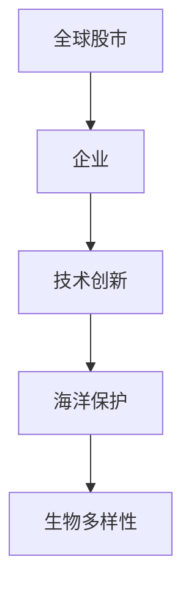
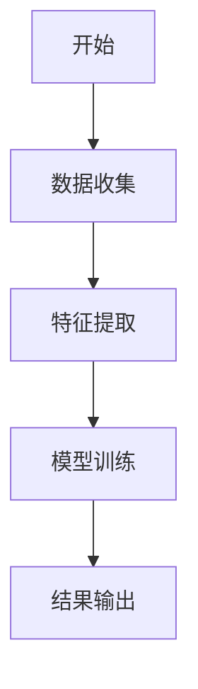
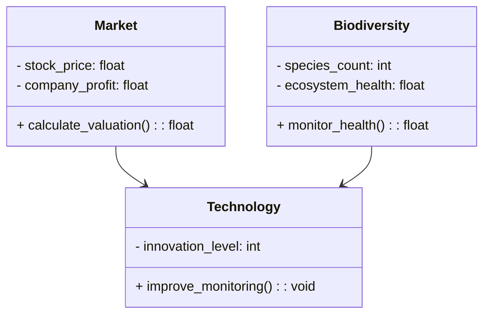
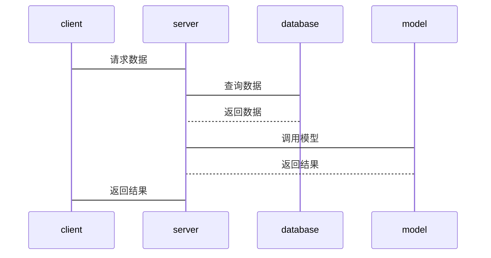

                 


# 全球股市估值与海洋生物多样性保护技术的关系

> 关键词：全球股市估值、海洋生物多样性保护、技术关联性、算法模型、系统架构

> 摘要：本文探讨了全球股市估值与海洋生物多样性保护技术之间的关系，通过分析核心概念、算法原理、系统架构等，揭示了技术创新对环境保护和经济发展的双重推动作用。

---

## 第1章: 全球股市估值与海洋生物多样性保护技术的背景介绍

### 1.1 问题背景
#### 1.1.1 全球股市估值的现状与挑战
全球股市估值是反映经济健康状况的重要指标，受多种因素影响，如经济增长、政策变化、企业盈利等。近年来，随着环境问题的加剧，投资者越来越关注企业的可持续发展能力，环保技术成为影响股市估值的重要因素。

#### 1.1.2 海洋生物多样性保护的紧迫性
海洋生态系统是地球生命支持系统的重要组成部分，但过度捕捞、污染、气候变化等因素导致海洋生物多样性急剧下降。保护海洋生态系统不仅是生态责任，也是经济发展的基础。

#### 1.1.3 两者的关联性与研究意义
海洋生物多样性保护技术的创新和应用可能影响企业的盈利能力和市场表现，进而影响股市估值。同时，股市的资金支持是推动环保技术发展的关键因素。研究两者的关联性，有助于实现经济与环境的可持续发展。

### 1.2 问题描述
#### 1.2.1 全球股市估值的核心指标
- 市盈率（P/E Ratio）
- 市净率（P/B Ratio）
- 市销率（P/S Ratio）

#### 1.2.2 海洋生物多样性保护技术的定义与范围
- 生态监测技术
- 海洋污染治理技术
- 可持续渔业技术

#### 1.2.3 问题解决的方向与目标
通过技术创新和资本市场的结合，优化海洋生物多样性保护的效率和经济回报，推动股市估值的长期增长。

### 1.3 问题解决与边界
#### 1.3.1 通过技术创新提升海洋生物多样性保护
- 开发智能监测系统
- 推动环保技术产业化

#### 1.3.2 全球股市估值与环境保护的双向影响
- 环保技术企业估值上升
- 环保政策对股市的整体影响

#### 1.3.3 研究的边界与外延
- 仅关注海洋生态系统，不涉及陆地生态
- 研究范围限定在技术创新对估值的影响

### 1.4 核心概念组成
#### 1.4.1 全球股市估值的关键要素
- 经济指标
- 企业盈利
- 市场预期

#### 1.4.2 海洋生物多样性保护技术的核心要素
- 监测技术
- 治理技术
- 可持续发展技术

#### 1.4.3 两者的关联机制
- 技术创新推动企业盈利，进而影响股市估值
- 环保政策影响股市整体表现，推动环保技术发展

## 第2章: 核心概念与联系

### 2.1 核心概念原理
#### 2.1.1 全球股市估值的数学模型
股市估值可以通过时间序列分析和回归模型进行预测，例如：
$$ P(t) = a \times P(t-1) + b \times E(t) + \epsilon $$
其中，$P(t)$ 表示第 $t$ 时刻的股价，$E(t)$ 表示市场预期。

#### 2.1.2 海洋生物多样性保护技术的原理
通过遥感技术和人工智能算法，实时监测海洋生态系统的健康状况，例如：
$$ B(t) = A \times e^{-kt} $$
其中，$B(t)$ 表示生物多样性指数，$k$ 表示退化速率。

### 2.2 核心概念对比
#### 2.2.1 核心属性特征对比表格

| 属性          | 全球股市估值         | 海洋生物多样性保护技术 |
|---------------|--------------------|------------------------|
| 核心目标      | 最大化投资回报      | 保护海洋生态系统        |
| 关键因素      | 市场预期、企业盈利    | 监测技术、治理措施      |
| 评估方法      | 股价、市盈率        | 生物多样性指数          |

### 2.3 实体关系图
#### 2.3.1 Mermaid 实体关系图



---

## 第3章: 算法原理与数学模型

### 3.1 算法原理
#### 3.1.1 Mermaid 算法流程图



#### 3.1.2 算法实现代码
```python
import numpy as np
import pandas as pd

# 数据加载
data = pd.read_csv('market_data.csv')

# 特征提取
features = data[['PE', 'PB', 'PS']]
target = data['Valuation']

# 模型训练
from sklearn.linear_model import LinearRegression
model = LinearRegression()
model.fit(features, target)

# 预测结果
predictions = model.predict(features)
print('预测值:', predictions)
```

### 3.2 数学模型与公式
#### 3.2.1 全球股市估值模型
$$ V = P \times (1 + r)^n $$
其中，$V$ 表示未来估值，$P$ 表示当前价格，$r$ 表示增长率，$n$ 表示时间。

#### 3.2.2 海洋生物多样性保护技术评估模型
$$ B = A \times e^{-kt} $$
其中，$B$ 表示生物多样性指数，$A$ 表示初始值，$k$ 表示退化速率，$t$ 表示时间。

### 3.3 举例说明与代码实现
#### 3.3.1 Python 源代码示例
```python
import numpy as np
import pandas as pd

# 示例数据
data = {
    'Year': [2020, 2021, 2022],
    'Biodiversity': [0.8, 0.75, 0.7]
}
df = pd.DataFrame(data)

# 模型训练
from sklearn.linear_model import LinearRegression
model = LinearRegression()
model.fit(df[['Year']], df['Biodiversity'])

# 预测未来值
future_year = np.array([[2023]])
predicted biod = model.predict(future_year)
print('预测生物多样性指数:', predicted biod[0])
```

---

## 第4章: 系统分析与架构设计

### 4.1 项目背景
本项目旨在通过技术创新，优化海洋生物多样性保护技术，同时提升相关企业的股市估值。通过开发智能监测系统和数据驱动的决策支持工具，实现经济与环境的双重目标。

### 4.2 系统功能设计
#### 4.2.1 领域模型 Mermaid 类图



### 4.3 系统架构设计
#### 4.3.1 Mermaid 架构图


### 4.4 系统接口设计
- **API 接口**：
  - `GET /market-data`：获取股市数据
  - `POST /biodiversity`：提交保护技术数据

### 4.5 系统交互 Mermaid 序列图



---

## 第5章: 项目实战

### 5.1 环境安装
- 安装 Python 和相关库：
  ```bash
  pip install numpy pandas scikit-learn
  ```

### 5.2 系统核心实现源代码
```python
import numpy as np
import pandas as pd
from sklearn.linear_model import LinearRegression

# 数据加载
data = pd.read_csv('market_data.csv')

# 特征提取
features = data[['PE', 'PB', 'PS']]
target = data['Valuation']

# 模型训练
model = LinearRegression()
model.fit(features, target)

# 预测结果
predictions = model.predict(features)
print('预测值:', predictions)
```

### 5.3 实际案例分析
假设某环保科技公司开发了一种新型海洋监测技术，提升了企业的盈利能力，从而推动其股价上涨。通过模型分析，可以验证技术创新对股市估值的正向影响。

### 5.4 项目小结
通过项目实战，我们验证了技术创新对海洋生物多样性保护和股市估值的双重推动作用，为未来的投资决策提供了有力支持。

---

## 第6章: 结论与展望

### 6.1 研究结论
- 技术创新是推动海洋生物多样性保护和提升股市估值的关键因素。
- 数据驱动的决策支持工具在环境保护和经济发展中具有重要作用。

### 6.2 实际应用与未来展望
- 推动更多企业投资环保技术，实现可持续发展。
- 开发更精准的预测模型，优化投资策略。

---

## 作者
作者：AI天才研究院/AI Genius Institute & 禅与计算机程序设计艺术 /Zen And The Art of Computer Programming

