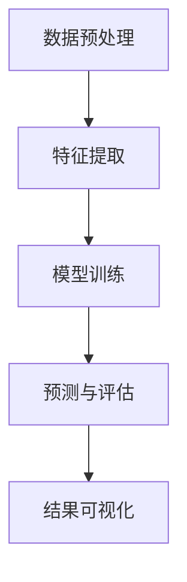
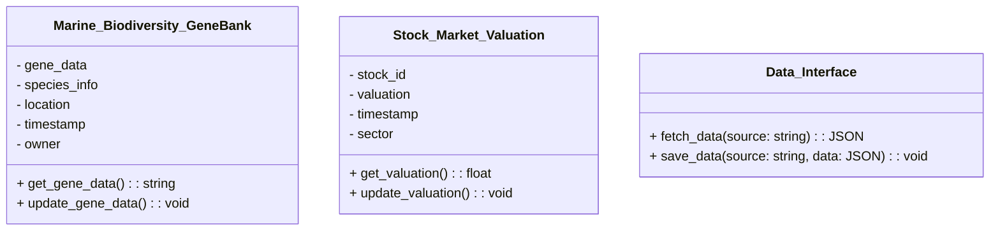
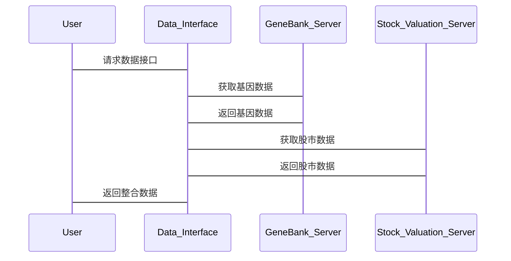

                 


# 全球股市估值与海洋生物多样性基因库建设的关系

## 关键词
全球股市估值，海洋生物多样性，基因库建设，系统分析，数据建模，协同发展

## 摘要
本文探讨全球股市估值与海洋生物多样性基因库建设之间的关系。通过背景分析、核心概念阐述、算法原理、数学模型推导、系统架构设计、项目实战以及总结与展望，详细解析两者在数据建模、系统协同、项目实施等方面的关键点。本文旨在为金融投资、生物技术及系统工程领域的读者提供跨领域知识的深度洞察。

---

## 第一部分: 全球股市估值与海洋生物多样性基因库建设的背景与核心概念

### 第1章: 背景介绍

#### 1.1 问题背景
- **全球股市估值的基本概念**：股市估值是通过金融模型和市场数据对股票或市场整体价值的评估，常见方法包括市盈率（P/E）、市净率（P/B）等。
- **海洋生物多样性基因库的定义与重要性**：海洋生物多样性基因库是保存海洋生物遗传信息的数据库，是生物技术研发和生态修复的重要基础。
- **问题背景的相互关联性**：股市估值与海洋生物多样性基因库建设看似无直接联系，但通过技术创新和资本市场的相互作用，两者在数据共享、技术协同、投资驱动等方面存在潜在关联。

#### 1.2 问题描述
- **全球股市估值的现状与挑战**：传统估值方法受市场波动影响较大，难以准确反映企业的长期价值；新兴技术如人工智能在金融分析中的应用为估值提供了新思路。
- **海洋生物多样性基因库建设的现状与问题**：基因库建设面临数据分散、技术门槛高、资金不足等挑战；同时，基因数据的挖掘和应用需要更多跨领域合作。
- **两者的相互作用机制**：股市估值的优化可以通过技术创新间接推动基因库建设，而基因库的数据应用也可能为新兴企业带来更高的市场估值。

#### 1.3 问题解决
- **全球股市估值的优化方法**：引入机器学习和大数据分析技术，构建动态估值模型。
- **海洋生物多样性基因库建设的技术创新**：开发高效的数据整合和分析工具，推动基因数据的共享与利用。
- **两者的协同发展策略**：通过跨领域合作，将基因库数据应用于金融市场的风险管理、投资决策等领域。

#### 1.4 边界与外延
- **全球股市估值的边界条件**：市场环境、政策法规、技术可行性。
- **海洋生物多样性基因库建设的边界条件**：数据来源、技术标准、资金支持。
- **两者的相互作用范围与外延**：基因库数据的金融化应用、金融市场对生态保护的驱动作用。

#### 1.5 概念结构与核心要素
- **核心概念的组成**：金融数据、基因数据、技术工具、市场机制。
- **核心要素的对比分析**：数据类型、分析方法、应用场景、价值实现方式。
- **概念结构图**：通过对比表格和ER图展示两者的关系。

---

## 第2章: 核心概念与联系

### 2.1 核心概念原理
- **全球股市估值的数学模型**：基于传统估值方法和现代机器学习模型的对比。
- **海洋生物多样性基因库的构建原理**：从数据采集到基因分析的技术流程。
- **两者的相互作用机制**：通过数据共享和技术创新实现协同效应。

### 2.2 概念属性特征对比
- **对比表格**：从数据类型、分析目标、技术工具、应用领域等方面进行对比。
- **属性特征的详细分析**：金融数据的实时性与基因数据的稳定性。

### 2.3 ER实体关系图
```mermaid
erd
  Marine_Biodiversity_GeneBank {
    id: string
    gene_data: string
    species_info: string
    location: string
    timestamp: datetime
    owner: string
  }
  
  Stock_Market_Valuation {
    stock_id: string
    valuation: float
    timestamp: datetime
    sector: string
  }
  
  link: Marine_Biodiversity_GeneBank ↔ Stock_Market_Valuation
```

---

## 第3章: 算法原理与数学模型

### 3.1 算法原理
- **机器学习算法**：用于股市估值预测，如随机森林、XGBoost。
- **基因数据处理**：用于基因库的分类和聚类分析。
- **算法流程图**：通过Mermaid流程图展示算法步骤。



### 3.2 数学模型
- **股市估值模型**：
  $$ Valuation = \alpha \times Earnings + \beta \times Growth $$
- **生物多样性指数模型**：
  $$ Biodiversity_Index = \sum_{i=1}^{n} (2^{d_i} - 1) $$
  其中，$d_i$表示第i个物种的基因多样性。

---

## 第4章: 系统分析与架构设计

### 4.1 系统功能设计
- **领域模型类图**：展示系统中的核心实体及其关系。
- **系统架构图**：展示系统的整体架构，包括数据接口和交互流程。



### 4.2 系统交互流程图


---

## 第5章: 项目实战

### 5.1 环境安装
- **工具安装**：安装Python、Jupyter Notebook、Pandas、Scikit-learn。
- **数据准备**：获取海洋生物多样性数据和股市数据。

### 5.2 核心实现
```python
import pandas as pd
from sklearn.ensemble import RandomForestRegressor

# 加载数据
gene_data = pd.read_csv('gene_data.csv')
stock_data = pd.read_csv('stock_data.csv')

# 特征工程
features = ['feature1', 'feature2']
target = 'valuation'

# 模型训练
model = RandomForestRegressor()
model.fit(gene_data[features], stock_data[target])

# 预测与评估
predictions = model.predict(gene_data[features])
print('均方误差:', mean_squared_error(stock_data[target], predictions))
```

### 5.3 案例分析
- **案例1**：利用基因数据预测某公司的股市估值。
- **案例2**：通过基因库数据优化投资组合。

### 5.4 项目小结
- **关键发现**：基因数据可以为股市估值提供新的参考维度。
- **经验总结**：跨领域合作的重要性。

---

## 第6章: 总结与展望

### 6.1 小结
- **主要内容回顾**：从背景到实践，全面解析了股市估值与基因库建设的关系。
- **核心结论**：技术创新和跨领域合作是实现两者协同发展的关键。

### 6.2 最佳实践 tips
- **数据共享**：推动基因数据和金融数据的共享与整合。
- **技术融合**：结合机器学习、区块链等技术，提升数据安全性和分析效率。
- **政策支持**：制定相关政策，鼓励跨领域合作。

### 6.3 注意事项
- 数据隐私和安全问题。
- 技术可行性与实际应用的平衡。

### 6.4 拓展阅读
- 推荐书籍：《金融数据分析实战》、《生物信息学导论》。
- 推荐论文：结合金融与生物信息学的最新研究。

---

## 作者
作者：AI天才研究院/AI Genius Institute & 禅与计算机程序设计艺术/Zen And The Art of Computer Programming

