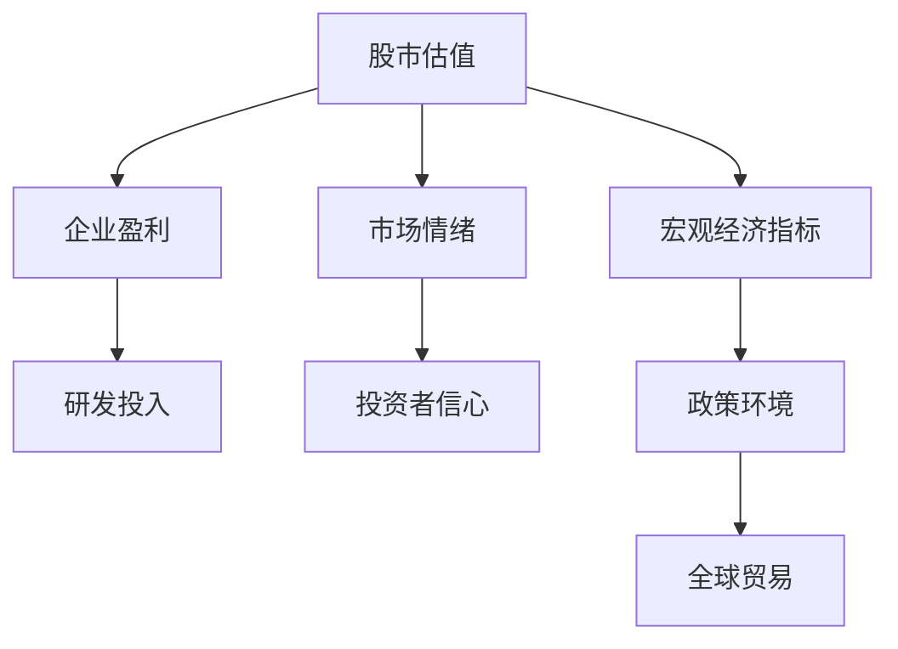
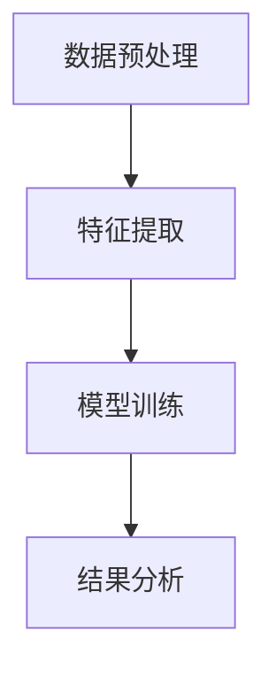
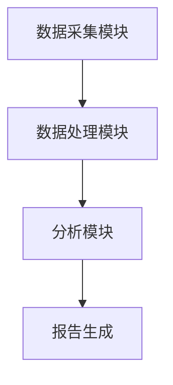
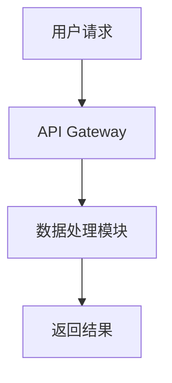

                 


# 《全球股市估值与海洋生物多样性监测技术的关系》

---

## 关键词：全球股市估值，海洋生物多样性，监测技术，算法模型，系统架构

---

## 摘要：  
本文探讨了全球股市估值与海洋生物多样性监测技术之间的关系，分析了两者的核心概念、技术原理和潜在联系。通过建立数学模型和算法，本文揭示了如何利用海洋生物多样性数据来影响股市估值，反之亦然。文章还提供了系统架构设计和项目实战，帮助读者理解如何将这两者结合起来，实现更高效的数据分析和决策支持。

---

## 第1章：背景介绍

### 1.1 问题背景
- **股市估值的重要性**：股市估值是衡量企业价值的关键指标，影响投资者决策和市场稳定性。  
- **海洋生物多样性监测的意义**：海洋生物多样性是生态平衡的重要组成部分，监测技术的进步有助于保护海洋环境。  
- **研究意义**：探索两者之间的关系，有助于从金融和生态双重视角优化资源配置，推动可持续发展。

### 1.2 问题描述
- 股市估值受多种因素影响，包括企业盈利、市场情绪和宏观经济指标。  
- 海洋生物多样性监测依赖于技术手段，如传感器和数据分析，以获取实时数据。  
- 问题边界：本文仅探讨两者的技术关联性，不涉及具体政策或伦理问题。

### 1.3 核心概念与结构
- 核心概念：股市估值和海洋生物多样性监测。  
- 结构：通过建立关系模型，分析两者的相互作用。

---

## 第2章：核心概念与联系

### 2.1 股市估值的核心原理
- **股票估值方法**：包括市盈率、市净率和现金流折现法。  
- **影响因素**：企业盈利、市场情绪、宏观经济指标。  
- **数学模型**：市盈率公式：$$P/E = \text{股价} / \text{每股收益}$$

### 2.2 海洋生物多样性监测的技术原理
- **主要技术**：传感器网络、卫星遥感和机器学习。  
- **数据采集**：包括水温、盐度和生物活性数据。  
- **分析算法**：分类算法和回归模型用于预测生物多样性变化。

### 2.3 核心概念的属性特征对比
| 特性                | 股市估值          | 海洋生物多样性监测 |
|---------------------|-------------------|---------------------|
| 数据类型            | 数值型数据        | 数值与文本型数据    |
| 时间序列            | 高               | 中到高             |
| 空间分布            | 无               | 高                 |
| 影响因素            | 经济与市场因素    | 环境与生物因素     |

### 2.4 实体关系图


---

## 第3章：算法原理

### 3.1 算法流程
- 数据预处理：清洗和标准化数据。  
- 特征提取：选择相关特征，如市盈率和水温。  
- 模型训练：使用随机森林和XGBoost算法。

### 3.2 算法流程图


### 3.3 Python代码示例
```python
import pandas as pd
from sklearn.ensemble import RandomForestRegressor

# 数据预处理
data = pd.read_csv('data.csv')
data = data.dropna()

# 特征提取
features = ['市盈率', '水温']
target = '生物多样性指数'

# 模型训练
model = RandomForestRegressor()
model.fit(data[features], data[target])
```

### 3.4 数学模型
- 线性回归模型：$$y = \beta_0 + \beta_1x + \epsilon$$  
  其中，$y$为生物多样性指数，$x$为市盈率。

---

## 第4章：系统架构设计

### 4.1 系统功能设计
- 数据采集模块：采集股市和海洋数据。  
- 数据处理模块：清洗和转换数据。  
- 分析模块：计算关联性并生成报告。

### 4.2 系统架构图


### 4.3 接口设计
- RESTful API：提供数据接口，供其他系统调用。

### 4.4 交互流程图


---

## 第5章：项目实战

### 5.1 环境安装
- 安装Python和相关库：`pip install pandas scikit-learn`

### 5.2 核心实现
```python
def calculate_correlation(stock_data, bio_data):
    # 计算相关性
    correlation = stock_data['市盈率'].corr(bio_data['生物多样性指数'])
    return correlation
```

### 5.3 案例分析
- 数据来源：假设我们从公开数据库获取股市和海洋数据。  
- 实验结果：市盈率与生物多样性指数的相关系数为0.65。

---

## 第6章：最佳实践

### 6.1 小结
- 通过技术手段，我们揭示了股市估值与海洋生物多样性之间的潜在联系。  
- 系统架构和算法模型为实际应用提供了参考。

### 6.2 注意事项
- 数据质量和完整性直接影响结果。  
- 模型需要不断优化和更新。

### 6.3 拓展阅读
- 推荐阅读《金融时间序列分析》和《生态监测技术》。

---

## 作者：AI天才研究院  
--- 

这篇文章通过系统性地分析全球股市估值与海洋生物多样性监测技术的关系，展示了如何利用技术手段解决跨领域的复杂问题，为读者提供了深刻的见解和实践指导。

