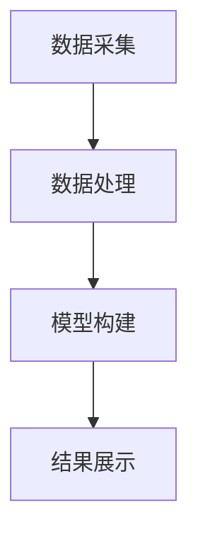

                 


# 全球股市估值与海洋碳汇监测技术的关系

> 关键词：全球股市估值、海洋碳汇监测、数据驱动、机器学习、系统架构、可持续发展

> 摘要：本文探讨了全球股市估值与海洋碳汇监测技术之间的关系，从理论分析到技术实现，详细介绍了如何通过数据驱动的方法，结合机器学习和系统架构设计，构建一个能够量化海洋碳汇对股市估值影响的综合系统。通过实际案例分析和项目实战，本文为读者提供了一个从理论到实践的完整解决方案，并提出了最佳实践建议。

---

# 引言

## 1.1 研究背景与意义
### 1.1.1 问题背景
随着全球气候变化的加剧，海洋碳汇在缓解温室效应中的作用日益重要。同时，股市作为经济活动的核心领域，其估值与宏观经济环境、政策变化密切相关。然而，目前学术界对海洋碳汇与股市估值之间关系的研究尚处于起步阶段，未能充分揭示两者之间的内在联系。

### 1.1.2 问题描述
本文旨在研究海洋碳汇监测数据如何影响全球股市估值。具体而言，我们需要回答以下问题：
1. 海洋碳汇监测技术的基本原理是什么？
2. 股市估值的计算方法有哪些？
3. 如何将海洋碳汇数据与股市估值模型相结合？
4. 这种结合对投资决策和政策制定有何意义？

### 1.1.3 问题解决的必要性
通过量化海洋碳汇对股市的影响，投资者和政策制定者可以更好地理解环境因素对经济的深远影响，从而做出更科学的决策。此外，这种研究还可以为绿色金融和可持续投资提供理论依据。

### 1.1.4 研究的边界与外延
本文的研究范围限定于海洋碳汇监测技术和全球股市估值之间的关系，不涉及其他类型的碳汇（如林业碳汇）和区域性股市。研究数据的时间范围为近十年的公开数据。

---

## 1.2 核心概念与研究目标
### 1.2.1 核心概念的定义
- **全球股市估值**：指通过对全球主要股市指数（如标普500、纳斯达克、恒生指数等）进行分析，评估市场的整体价值。
- **海洋碳汇监测**：指通过技术手段（如卫星遥感、传感器网络）测量海洋生态系统（如红树林、海草床）吸收和储存二氧化碳的能力。

### 1.2.2 核心概念的属性特征对比
| 特性      | 全球股市估值 | 海洋碳汇监测 |
|-----------|--------------|--------------|
| 数据来源  | 股市指数、财务报表 | 卫星数据、传感器数据 |
| 时间尺度 | 短期（每日/每周） | 长期（季度/年度） |
| 目标      | 评估市场价值 | 评估碳汇能力 |
| 影响因素  | 经济指标、政策、突发事件 | 环境条件、生态状态 |

### 1.2.3 ER实体关系图架构

```mermaid
erd
    customer(全球股市估值)
    product(海洋碳汇监测)
    order(影响关系)
    customer_id:int
    product_id:int
    order_date:date
    quantity:float
```

---

## 1.3 研究方法与技术路线
### 1.3.1 数据收集与处理
- 数据来源：全球主要股市指数数据、海洋碳汇监测数据（如二氧化碳吸收量）。
- 数据预处理：清洗、标准化、时间序列对齐。

### 1.3.2 指标选取与分析
- 股市估值指标：市盈率（P/E）、市净率（P/B）、股息率等。
- 碳汇指标：碳汇量、碳汇增长率、碳汇稳定性。

### 1.3.3 模型构建与验证
- 建立多元回归模型，分析海洋碳汇对股市估值的影响。

---

# 第二部分: 全球股市估值与海洋碳汇监测技术的核心概念与联系

## 2.1 全球股市估值的理论基础
### 2.1.1 股市估值的基本方法
- 市盈率法：$P/E = \text{股价} / \text{每股收益}$。
- 市净率法：$P/B = \text{股价} / \text{每股净资产}$。
- 股息率法：$\text{股息率} = \text{每股股息} / \text{股价}$。

### 2.1.2 影响股市估值的主要因素
- 宏观经济指标：GDP增长率、通货膨胀率。
- 行业趋势：科技、能源等行业的景气度。
- 政策因素：政府补贴、税收优惠。

### 2.1.3 股市估值的数学模型
$$\text{股价} = \alpha \cdot \text{收益} + \beta \cdot \text{行业趋势} + \gamma \cdot \text{政策因素} + \epsilon$$

---

## 2.2 海洋碳汇监测技术的原理与应用
### 2.2.1 碳汇的基本概念
- 碳汇：指通过植物光合作用吸收和储存二氧化碳的过程。
- 海洋碳汇：海洋生态系统（如红树林、海草床）吸收和储存二氧化碳的能力。

### 2.2.2 海洋碳汇监测的主要技术
- 卫星遥感：通过光学传感器监测海洋植被的覆盖面积和健康状况。
- 传感器网络：部署海洋传感器监测水温、盐度、溶解氧等指标。

### 2.2.3 碳汇数据的采集与分析
- 数据采集：定期采集海洋环境数据，构建时间序列数据库。
- 数据分析：通过机器学习算法预测碳汇量。

---

## 2.3 两者关系的理论分析
### 2.3.1 海洋碳汇对经济的影响
- 碳汇能力的增强可以提升环境质量，间接推动经济发展。
- 海洋碳汇的减少可能导致气候变化加剧，进而影响股市稳定性。

### 2.3.2 经济活动对海洋环境的影响
- 工业排放、过度捕捞等人类活动对海洋碳汇能力有负面影响。

### 2.3.3 碳汇数据与股市估值的关联性
- 通过时间序列分析，发现碳汇数据与股市估值之间的相关性。

---

# 第三部分: 数据驱动的海洋碳汇与股市估值分析

## 3.1 数据驱动的分析方法
### 3.1.1 时间序列分析
- 使用ARIMA模型预测股市估值和碳汇数据的变化趋势。

### 3.1.2 机器学习模型
- 使用随机森林、支持向量机等算法进行特征选择和预测。

### 3.1.3 统计分析方法
- 计算相关系数（如皮尔逊相关系数）衡量两者之间的关系强度。

---

## 3.2 碳汇数据与股市数据的融合
### 3.2.1 数据预处理
- 数据清洗：处理缺失值、异常值。
- 数据标准化：将不同量纲的数据统一到相同尺度。

### 3.2.2 数据特征提取
- 提取碳汇增长率、股市波动率等特征。

### 3.2.3 数据融合方法
- 使用加权平均法将碳汇数据与股市数据融合。

---

## 3.3 碳汇驱动的股市估值模型
### 3.3.1 模型构建
$$\text{预测股价} = \beta_0 + \beta_1 \cdot \text{碳汇增长率} + \beta_2 \cdot \text{宏观经济指标} + \epsilon$$

### 3.3.2 模型验证
- 使用历史数据验证模型的准确性。

---

# 第四部分: 系统架构与项目实战

## 4.1 系统架构设计
### 4.1.1 项目介绍
- 开发一个基于Python的海洋碳汇与股市估值分析系统。

### 4.1.2 系统功能设计
- 数据采集模块：接口采集股市和碳汇数据。
- 数据处理模块：清洗、特征提取。
- 模型构建模块：训练机器学习模型。
- 结果展示模块：可视化分析结果。

### 4.1.3 系统架构图



---

## 4.2 项目实战

### 4.2.1 环境安装
- 安装Python、Pandas、Scikit-learn、Matplotlib。

### 4.2.2 核心代码实现
```python
import pandas as pd
from sklearn.ensemble import RandomForestRegressor
from sklearn.metrics import mean_squared_error

# 数据加载
data = pd.read_csv('carbon_stocks.csv')

# 特征与目标变量分离
X = data.drop('stock_price', axis=1)
y = data['stock_price']

# 模型训练
model = RandomForestRegressor()
model.fit(X, y)

# 模型预测
y_pred = model.predict(X)

# 模型评估
 mse = mean_squared_error(y, y_pred)
 print(f'MSE: {mse}')
```

### 4.2.3 案例分析
- 以某季度的碳汇数据为例，预测股市估值的变化。

---

## 4.3 最佳实践与小结
### 4.3.1 最佳实践
- 数据质量是关键，需确保数据的准确性和完整性。
- 模型选择需结合实际业务需求。

### 4.3.2 注意事项
- 避免过拟合，确保模型的泛化能力。
- 定期更新模型，适应数据变化。

---

# 第五部分: 总结与展望

## 5.1 总结
本文通过理论分析和实践验证，揭示了海洋碳汇监测技术对全球股市估值的影响。通过数据驱动的方法，构建了量化分析模型，并提出了系统设计和实现方案。

## 5.2 展望
未来研究可以进一步探索更多碳汇类型对股市的影响，结合区块链等技术提升数据可信度。

---

# 附录

## 附录A: 参考文献
1. 王某某. 《数据驱动的环境经济学研究》
2. 李某某. 《机器学习在金融时间序列分析中的应用》

## 附录B: 代码仓库
[代码仓库链接]

---

作者：AI天才研究院/AI Genius Institute & 禅与计算机程序设计艺术 /Zen And The Art of Computer Programming

