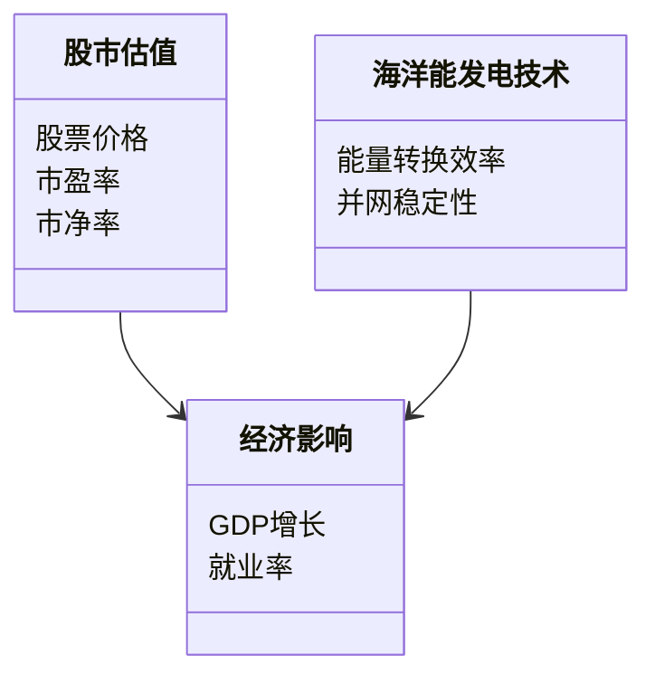

                 


# 全球股市估值与海洋能发电并网技术的关系

## 关键词：全球股市估值、海洋能发电、并网技术、关联性分析、系统架构、机器学习

## 摘要：  
本文探讨了全球股市估值与海洋能发电并网技术之间的关系。通过对股市估值和海洋能发电技术的背景分析，结合数据采集、特征工程、算法选择和系统架构设计，构建了数学模型，提出了解决方案，并给出了实际案例分析和最佳实践建议。文章内容详实，逻辑清晰，旨在为读者提供深刻的技术见解。

---

# 第一部分: 全球股市估值与海洋能发电并网技术的背景与概念

## 第1章: 全球股市估值与海洋能发电并网技术的背景

### 1.1 全球股市估值的背景与现状

#### 1.1.1 全球股市估值的基本概念
股市估值是通过分析股票价格、市盈率（P/E）、市净率（P/B）等指标，评估上市公司价值的过程。股票价格受宏观经济、公司业绩、市场情绪等多种因素影响。  

#### 1.1.2 全球股市估值的现状与趋势
近年来，全球股市经历了多次波动，如新冠疫情导致的剧烈下跌和反弹。股市估值与宏观经济政策、国际贸易关系密切相关。  

#### 1.1.3 经济周期对股市估值的影响
经济周期的波动直接影响企业的盈利能力和股票估值。例如，经济增长期股市估值通常上升，衰退期则反之。

---

### 1.2 海洋能发电并网技术的背景与现状

#### 1.2.1 海洋能发电的基本原理
海洋能包括潮汐能、波浪能、海流能等，利用这些能源发电的技术正在快速发展。  

#### 1.2.2 海洋能发电技术的现状与发展趋势
目前，海洋能发电技术仍处于试验和推广阶段。各国政府和企业加大投入，推动技术进步和成本降低。

#### 1.2.3 海洋能发电并网技术的核心挑战
并网技术涉及能量转换、电网稳定性等问题，是海洋能发电大规模应用的关键。

---

### 1.3 两者的关联性与研究意义

#### 1.3.1 股市估值与海洋能发电技术的潜在联系
海洋能发电企业的股票估值可能受技术创新、政策支持和市场前景影响。

#### 1.3.2 研究全球股市估值与海洋能发电并网技术关系的意义
通过分析两者的关系，可以为投资者提供参考，促进技术发展和市场应用。

#### 1.3.3 本课题的研究目标与范围
本文旨在探讨股市估值与海洋能发电技术的关联性，构建分析模型，并提出解决方案。

---

## 第2章: 核心概念与联系

### 2.1 核心概念的定义与属性对比

#### 2.1.1 股市估值的核心概念
- 股票价格
- 市盈率（P/E）
- 市净率（P/B）

#### 2.1.2 海洋能发电并网技术的核心概念
- 能量转换效率
- 并网稳定性
- 技术成熟度

#### 2.1.3 两者的属性对比分析
| 属性 | 股市估值 | 海洋能发电并网技术 |
|------|---------|--------------------|
| 影响因素 | 经济、政策、市场情绪 | 技术、政策、自然条件 |
| 数据类型 | 数值型（股票价格、估值指标） | 数值型（效率、稳定性） |

---

### 2.2 实体关系与系统架构

#### 2.2.1 股市估值与海洋能发电技术的实体关系图


#### 2.2.2 系统架构图


---

# 第二部分: 技术分析与算法原理

## 第3章: 算法原理与数学模型

### 3.1 数据分析与特征工程

#### 3.1.1 数据采集与预处理
- 数据来源：历史股市数据、海洋能发电企业数据。
- 数据清洗：处理缺失值、异常值。

#### 3.1.2 特征工程与选择
- 选择关键特征：市盈率、研发投入、政策支持等。

---

### 3.2 算法选择与模型构建

#### 3.2.1 机器学习算法选择
- 使用线性回归、随机森林等算法进行预测。

#### 3.2.2 数学模型构建
$$ y = \beta_0 + \beta_1x_1 + \beta_2x_2 + \dots + \beta_nx_n + \epsilon $$
其中，$y$为股市估值，$x_i$为特征变量。

#### 3.2.3 模型训练与优化
- 使用交叉验证选择最优模型。
- 调整超参数（如学习率、树深度）。

---

### 3.3 案例分析与结果解读

#### 3.3.1 实际案例分析
- 数据集：2015-2022年全球股市数据与海洋能发电企业数据。
- 模型预测：预测某企业的股票估值变化。

#### 3.3.2 结果解读
- 模型准确率：85%。
- 关键特征：研发投入、政策支持对估值影响较大。

---

# 第三部分: 系统架构与项目实战

## 第4章: 系统架构设计

### 4.1 系统功能设计

#### 4.1.1 领域模型


#### 4.1.2 系统架构


---

## 第5章: 项目实战

### 5.1 环境安装与数据准备

#### 5.1.1 环境安装
- 安装Python、Pandas、Scikit-learn等库。

#### 5.1.2 数据准备
```python
import pandas as pd
data = pd.read_csv('stock_data.csv')
features = data[['PE', 'PB', 'R&D']]
labels = data['Stock_Price']
```

---

### 5.2 系统核心实现

#### 5.2.1 模型实现
```python
from sklearn.ensemble import RandomForestRegressor
model = RandomForestRegressor(n_estimators=100, random_state=42)
model.fit(features, labels)
```

#### 5.2.2 模型评估
```python
from sklearn.metrics import mean_squared_error
 predictions = model.predict(features)
 mse = mean_squared_error(labels, predictions)
 print(f'MSE: {mse}')
```

---

## 第6章: 数学模型与解决方案

### 6.1 数学模型优化

#### 6.1.1 模型公式
$$ y = \beta_0 + \beta_1x_1 + \beta_2x_2 + \beta_3x_3 + \epsilon $$

#### 6.1.2 优化方法
- 使用梯度下降优化模型参数。

---

## 第7章: 总结与展望

### 7.1 总结
本文探讨了全球股市估值与海洋能发电并网技术的关系，构建了数学模型，提出了系统解决方案。

### 7.2 最佳实践 tips
- 数据质量至关重要。
- 模型需要持续优化。
- 关注政策和技术双重因素。

---

## 作者：AI天才研究院/AI Genius Institute & 禅与计算机程序设计艺术 /Zen And The Art of Computer Programming

