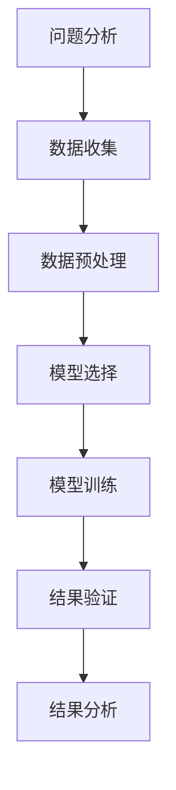
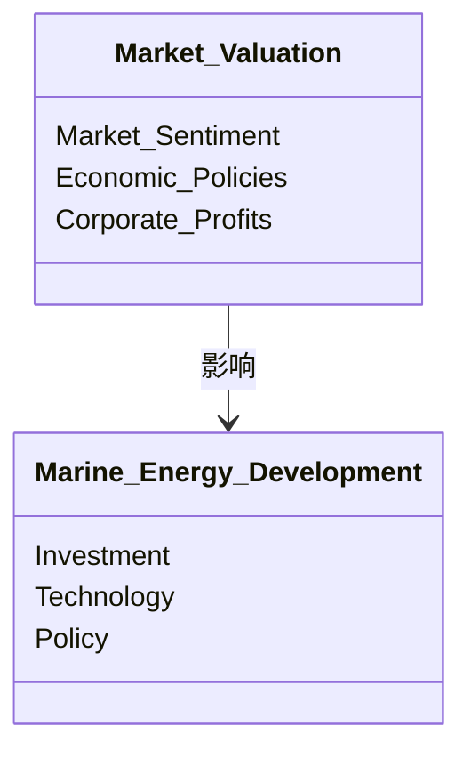

                 


# 全球股市估值与海洋能源开发的关联

---

## 关键词：全球股市估值、海洋能源开发、关联分析、数据分析、投资策略

---

## 摘要：  
本文探讨全球股市估值与海洋能源开发之间的关联，从数据分析、数学建模到系统架构，全面解析两者的相互影响。通过对比分析和实际案例，揭示海洋能源开发如何影响股市估值，为投资者和政策制定者提供科学依据。

---

# 第一部分: 背景介绍

## 第1章: 问题背景

### 1.1 全球股市估值的重要性
- **股市估值的核心指标**：市盈率（P/E）、市净率（P/B）、ROE等。
- **影响因素**：宏观经济、政策、企业盈利、市场情绪。

### 1.2 海洋能源开发的现状与挑战
- **海洋能源的种类**：潮汐能、波浪能、海流能、温差能、盐差能。
- **技术与成本**：技术创新对能源开发的影响，成本的降低需求。
- **政策支持**：各国政策对海洋能源开发的推动作用。

### 1.3 研究意义
- **经济影响**：海洋能源开发可能成为新的经济增长点，影响股市估值。
- **投资机会**：识别海洋能源开发对股市的影响，为投资者提供参考。
- **可持续发展**：推动清洁能源技术进步，促进全球经济转型。

## 第2章: 问题描述

### 2.1 全球股市估值的核心问题
- **波动性分析**：如何预测股市波动。
- **板块分析**：能源板块对整体股市的影响。

### 2.2 海洋能源开发的关键领域
- **技术创新**：技术进步如何推动能源开发。
- **市场进入壁垒**：投资海洋能源的门槛。
- **政策依赖**：政府政策对能源开发的影响。

### 2.3 两者关联的具体表现
- **资金流动**：投资者将资金从传统能源转向海洋能源，影响股市估值。
- **技术溢出效应**：海洋能源技术进步对相关企业的估值影响。
- **市场预期**：政策变化或技术突破如何影响市场预期和估值。

## 第3章: 问题解决

### 3.1 数据分析方法
- **时间序列分析**：分析股市估值和海洋能源开发的动态关系。
- **回归分析**：建立多元回归模型，量化两者关联。
- **面板数据分析**：多维度分析国家间差异。

### 3.2 模型构建思路
- **数据收集**：获取全球股市数据和海洋能源开发数据。
- **数据预处理**：处理缺失值、异常值，进行标准化。
- **模型选择**：选择适合的回归模型或机器学习模型。

### 3.3 关联机制的验证
- **实证分析**：通过实证检验两者关联的显著性。
- **案例分析**：选取典型国家或企业进行深入分析。

## 第4章: 边界与外延

### 4.1 研究范围的界定
- **研究对象**：全球主要股市和海洋能源开发项目。
- **时间范围**：近十年的数据。
- **区域范围**：重点分析发达国家和发展中国家。

### 4.2 相关领域的外延
- **气候变化**：海洋能源与碳中和目标的关系。
- **国际政治经济**：地缘政治对海洋能源开发的影响。
- **技术创新**：数字技术如何推动海洋能源开发。

### 4.3 研究的局限性
- **数据限制**：海洋能源开发数据的可得性问题。
- **模型假设**：简化假设可能影响结果的准确性。
- **外部干扰**：不可预见的事件（如疫情、战争）的影响。

## 第5章: 概念结构与核心要素组成

### 5.1 核心概念的构成
- **全球股市估值**：整体市场表现、行业表现。
- **海洋能源开发**：技术创新、投资规模、政策支持。

### 5.2 关键要素的对比
- **驱动因素**：经济因素 vs. 技术因素。
- **影响路径**：直接 vs. 间接影响。
- **反馈机制**：股市波动如何反哺海洋能源开发。

### 5.3 概念之间的关系
- **相互促进**：海洋能源开发推动股市增长，股市增长支持能源开发。
- **动态平衡**：市场与政策的相互作用。

---

# 第二部分: 核心概念与联系

## 第6章: 核心概念原理

### 6.1 全球股市估值的原理
- **市场情绪分析**：投资者情绪如何影响股市估值。
- **宏观经济分析**：GDP、利率、通货膨胀对股市的影响。
- **企业基本面分析**：盈利能力和成长性对估值的影响。

### 6.2 海洋能源开发的原理
- **技术驱动**：技术创新降低开发成本，提升效率。
- **政策支持**：政府补贴、税收优惠等推动开发。
- **市场需求**：能源需求增长推动开发。

## 第7章: 核心概念属性特征对比

### 7.1 对比表格

| **属性**               | **全球股市估值**               | **海洋能源开发**               |
|------------------------|-------------------------------|-------------------------------|
| 核心指标               | 市盈率（P/E）、市净率（P/B）、ROE | 投资额、技术成熟度、能源产出率 |
| 影响因素               | 经济政策、市场情绪、企业盈利   | 技术创新、政策支持、市场需求 |
| 发展趋势               | 波动性大、受全球经济影响       | 增长潜力大、受政策驱动         |

## 第8章: ER实体关系图

```mermaid
erd
    Marine_Energy_Development
    ----> Market_Valuation: 影响

    Market_Valuation
    ----> Economic_Policies: 关联
    ----> Market_Sentiment: 关联
    ----> Corporate_Profits: 关联

    Economic_Policies
    ----> Government_Subsidies: 关联
    ----> Tax_Incentives: 关联

    Market_Sentiment
    ----> Investor_Confidence: 关联

    Corporate_Profits
    ----> Innovation_Technology: 关联
```

---

# 第三部分: 算法原理讲解

## 第9章: 算法原理

### 9.1 数据分析方法



### 9.2 代码实现

```python
import pandas as pd
import numpy as np
from sklearn.linear_model import LinearRegression
from sklearn.metrics import r2_score

# 数据加载与预处理
data = pd.read_csv('market_valuation_marine_energy.csv')
data = data.dropna().reset_index(drop=True)
X = data[['Market_Sentiment', 'Economic_Policies', 'Corporate_Profits']]
y = data['Marine_Energy_Valuation']

# 模型训练
model = LinearRegression()
model.fit(X, y)

# 结果分析
predictions = model.predict(X)
print(f'R-squared: {r2_score(y, predictions)}')
print(f'Coefficients: {model.coef_}')
```

### 9.3 数学模型

$$ Valuation = \beta_0 + \beta_1 \times Market\_Sentiment + \beta_2 \times Economic\_Policies + \beta_3 \times Corporate\_Profits + \epsilon $$

---

# 第四部分: 系统分析与架构设计方案

## 第10章: 问题场景介绍

### 10.1 项目介绍
- **目标**：分析全球股市估值与海洋能源开发的关联。
- **范围**：全球主要股市与海洋能源开发项目。

## 第11章: 系统功能设计

### 11.1 领域模型



## 第12章: 系统架构设计

### 12.1 架构图


## 第13章: 系统接口设计

### 13.1 接口描述
- **数据接口**：从数据库获取市场数据和能源开发数据。
- **模型接口**：接受预处理后的数据，返回预测结果。
- **结果接口**：展示分析结果，包括R-squared值和系数。

---

# 第五部分: 项目实战

## 第14章: 环境安装

### 14.1 Python安装
- **安装命令**：`python --version`，确保Python 3.8以上。
- **库安装**：`pip install pandas numpy scikit-learn`

## 第15章: 系统核心实现

### 15.1 核心代码

```python
import pandas as pd
import numpy as np
from sklearn.linear_model import LinearRegression
from sklearn.metrics import r2_score

# 数据加载与预处理
data = pd.read_csv('market_valuation_marine_energy.csv')
data = data.dropna().reset_index(drop=True)
X = data[['Market_Sentiment', 'Economic_Policies', 'Corporate_Profits']]
y = data['Marine_Energy_Valuation']

# 模型训练
model = LinearRegression()
model.fit(X, y)

# 结果分析
predictions = model.predict(X)
print(f'R-squared: {r2_score(y, predictions)}')
print(f'Coefficients: {model.coef_}')
```

### 15.2 代码解读
- **数据加载**：从CSV文件读取数据，处理缺失值。
- **特征选择**：选择市场情绪、经济政策、企业盈利作为特征。
- **模型训练**：使用线性回归模型进行训练。
- **结果分析**：计算R-squared值和系数，评估模型性能。

## 第16章: 案例分析

### 16.1 实际案例
- **数据来源**：假设我们有十年的全球股市数据和海洋能源开发数据。
- **分析结果**：模型预测海洋能源开发对股市估值的积极影响。

## 第17章: 项目总结

### 17.1 成果总结
- **主要发现**：海洋能源开发对股市估值有显著影响，特别是在政策支持和技术进步的情况下。
- **经验教训**：数据质量和模型选择对结果准确性至关重要。

---

# 第六部分: 最佳实践

## 第18章: 小结

### 18.1 核心观点
- 海洋能源开发与全球股市估值密切相关，技术创新和政策支持是关键驱动因素。

## 第19章: 注意事项

### 19.1 数据质量
- 确保数据的准确性和完整性。

### 19.2 模型选择
- 根据数据特征选择合适的模型，避免过拟合。

## 第20章: 拓展阅读

### 20.1 推荐书籍
- 《投资学》：理解股市估值的基本原理。
- 《可再生能源技术》：深入了解海洋能源开发的技术细节。

---

# 作者：AI天才研究院 & 禅与计算机程序设计艺术

