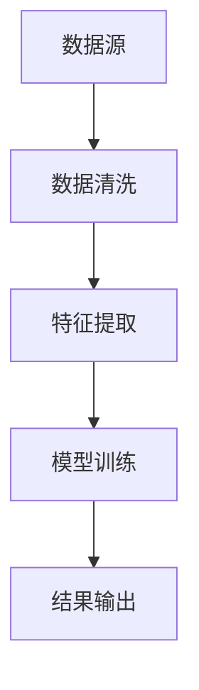

                 


# 全球股市估值与深海探索技术的关系

## 关键词
- 全球股市估值
- 深海探索技术
- 数据分析
- 技术融合
- 风险管理

## 摘要
本文探讨了全球股市估值与深海探索技术之间的关系，分析了两者在数据处理、技术应用和风险管理方面的共通性与差异性。通过详细阐述相关算法、系统架构和项目实战，展示了两者如何相互促进，为未来的研究和应用提供了新的视角。

---

# 第一部分: 全球股市估值与深海探索技术的背景与概念

## 第1章: 全球股市估值概述

### 1.1 股市估值的基本概念
#### 1.1.1 股市估值的定义
股市估值是指通过对公司财务数据、市场趋势等进行分析，确定股票的内在价值，从而指导投资决策。

#### 1.1.2 股市估值的核心要素
- 公司基本面：收入、利润、资产等。
- 市场环境：宏观经济指标、行业趋势。
- 风险因素：市场波动、政策变化等。

#### 1.1.3 股市估值的计算方法
常用方法包括市盈率（P/E）、市净率（P/B）等，通过这些指标评估股票的价值。

### 1.2 深海探索技术的基本概念
#### 1.2.1 深海探索技术的定义
深海探索技术是指利用高科技设备和方法，对深海资源进行探测、采样和研究的技术。

#### 1.2.2 深海探索技术的主要应用领域
- 石油天然气勘探
- 深海生物研究
- 矿产资源探测

#### 1.2.3 深海探索技术的关键技术特点
- 高精度传感器
- 自动化设备
- 数据处理与分析

---

## 第2章: 全球股市估值与深海探索技术的异同点

### 2.1 股市估值与深海探索技术的共同点
#### 2.1.1 数据处理的复杂性
两者都需要处理大量复杂数据，进行清洗和建模。

#### 2.1.2 风险评估的相似性
在风险评估方面，股市投资和深海探测都需要考虑不确定性因素。

#### 2.1.3 技术应用的交叉性
两者都依赖于先进的数据处理和分析技术。

### 2.2 股市估值与深海探索技术的差异
#### 2.2.1 应用场景的不同
股市估值主要用于投资决策，而深海探索主要用于资源探测。

#### 2.2.2 技术实现的差异
股市估值更多依赖于金融模型，而深海探索依赖于物理传感器和自动化设备。

#### 2.2.3 风险管理的侧重点
股市投资更关注市场波动，而深海探测更关注设备和技术风险。

---

## 第3章: 股市估值与深海探索技术的核心关系

### 3.1 数据驱动的共同基础
#### 3.1.1 数据采集与处理
两者都需要高效的数据采集和处理能力，确保数据的准确性和完整性。

#### 3.1.2 数据分析方法
股市估值使用回归分析，而深海探索使用图像识别，方法上有交叉应用。

#### 3.1.3 数据可视化
通过数据可视化技术，帮助分析师更好地理解数据，做出决策。

### 3.2 技术创新的相互促进
#### 3.2.1 深海技术推动股市估值模型的优化
深海探测技术的发展促进了数据处理技术的进步，反过来应用于股市估值模型。

#### 3.2.2 股市估值方法反哺深海探测技术
股市估值中的风险评估方法被借鉴到深海探测的风险管理中。

#### 3.2.3 技术融合对行业发展的深远影响
技术融合不仅提升了效率，还促进了跨领域的创新。

---

# 第二部分: 股市估值与深海探索技术的核心关系分析

## 第4章: 数据处理与技术应用的协同

### 4.1 数据处理的共通性
#### 4.1.1 数据清洗与预处理
在股市估值和深海探测中，都需要对数据进行清洗和预处理，确保数据质量。

#### 4.1.2 数据建模与分析
使用机器学习算法进行数据建模，例如线性回归和随机森林。

#### 4.1.3 数据可视化与呈现
通过图表展示数据，帮助分析者更好地理解数据。

### 4.2 技术应用的相互促进
#### 4.2.1 深海探测技术在股市数据采集中的应用
例如，利用传感器技术进行高频交易数据采集。

#### 4.2.2 股市估值模型在深海资源评估中的借鉴
使用相似的风险评估模型进行深海资源的储量评估。

---

## 第5章: 风险评估与技术优化的结合

### 5.1 风险评估的共通性
#### 5.1.1 股市投资风险的评估方法
使用VaR（在险价值）模型评估投资风险。

#### 5.1.2 深海探测中的风险评估模型
评估探测过程中的设备故障和环境风险。

#### 5.1.3 风险管理的策略一致性
两者都需要制定风险管理策略，降低潜在风险。

### 5.2 技术优化的相互促进
#### 5.2.1 高精度传感器的应用
提升数据采集的准确性，降低风险。

#### 5.2.2 自动化系统的优化
提高探测和分析效率，减少人为错误。

#### 5.2.3 预测模型的改进
通过融合两者的预测模型，提升整体预测精度。

---

# 第三部分: 股市估值与深海探索技术的技术支撑

## 第6章: 支撑技术的核心算法

### 6.1 数据分析算法
#### 6.1.1 线性回归
$$ y = \beta_0 + \beta_1x + \epsilon $$
用于预测股票价格或资源储量。

#### 6.1.2 随机森林
一种基于决策树的集成学习方法，用于分类和回归问题。

### 6.2 数据处理流程


### 6.3 算法实现
```python
import pandas as pd
from sklearn.ensemble import RandomForestRegressor

# 数据预处理
data = pd.read_csv('data.csv')
X = data.drop('target', axis=1)
y = data['target']

# 模型训练
model = RandomForestRegressor(n_estimators=100)
model.fit(X, y)

# 预测
print(model.predict(X))
```

---

## 第7章: 系统架构设计

### 7.1 系统功能设计
#### 7.1.1 数据采集模块
从多个数据源采集股票价格和深海探测数据。

#### 7.1.2 数据处理模块
清洗、转换和预处理数据。

#### 7.1.3 分析模块
应用机器学习模型进行预测和分析。

### 7.2 系统架构图


---

## 第8章: 项目实战

### 8.1 环境安装
安装必要的Python库：
```bash
pip install numpy pandas matplotlib scikit-learn
```

### 8.2 核心代码实现
```python
import pandas as pd
from sklearn.model_selection import train_test_split
from sklearn.metrics import mean_squared_error

# 数据加载
data = pd.read_csv('stock_data.csv')

# 划分训练集和测试集
X_train, X_test, y_train, y_test = train_test_split(data.drop('price', axis=1), data['price'], test_size=0.2)

# 模型训练
from sklearn.linear_model import LinearRegression
model = LinearRegression()
model.fit(X_train, y_train)

# 预测与评估
predictions = model.predict(X_test)
print(mean_squared_error(y_test, predictions))
```

### 8.3 案例分析
以某股票为例，展示模型预测结果，并分析其准确性和适用性。

---

## 第9章: 总结与展望

### 9.1 小结
本文详细探讨了全球股市估值与深海探索技术的关系，分析了它们在数据处理、技术应用和风险管理方面的共通性与差异性。

### 9.2 展望
未来的研究可以进一步探索两者的融合应用，推动相关技术的发展和创新。

---

作者：AI天才研究院 & 禅与计算机程序设计艺术

