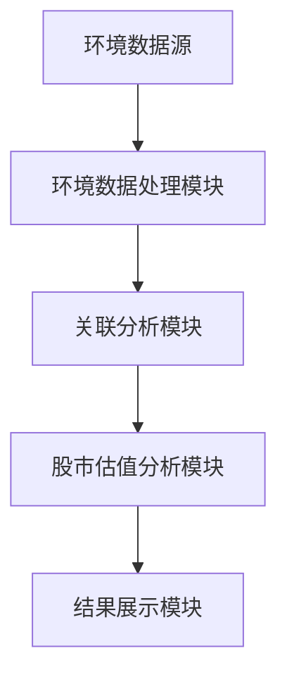

                 


# 全球股市估值与环境风险的长期关联

## 关键词：环境风险、股市估值、长期关联、回归分析、时间序列分析、机器学习、系统架构

## 摘要：本文章系统探讨全球股市估值与环境风险之间的长期关联，通过分析环境风险的定义、分类及其对股市估值的影响机制，结合数学模型和算法原理，深入探讨两者之间的互动关系。文章从问题背景、核心概念、算法原理、系统架构、项目实战等多维度展开，提供全面而深入的分析。

---

## 第1章: 全球股市估值与环境风险的背景介绍

### 1.1 环境风险的定义与分类
- 1.1.1 环境风险的概念
  - 环境风险是由于自然或人为因素导致的环境变化对经济和社会造成的影响，主要体现在资源枯竭、生态破坏、气候变化等方面。
- 1.1.2 环境风险的分类
  - 按照影响范围：局部环境风险、全球性环境风险。
  - 按照时间维度：短期环境风险、长期环境风险。
  - 按照来源：自然环境风险、人为环境风险。
- 1.1.3 环境风险的度量方法
  - 环境影响评价指数（EPI）、环境风险指数（ERI）、环境影响因子（EAF）。

### 1.2 全球股市估值的基本方法
- 1.2.1 市盈率（P/E）分析
  - 市盈率 = 股票价格 / 每股收益，反映市场对公司的盈利能力预期。
- 1.2.2 市净率（P/B）分析
  - 市净率 = 股票价格 / 每股净资产，衡量资产的市场价值。
- 1.2.3 股息率分析
  - 股息率 = 每股股息 / 股票价格，反映投资回报率。

### 1.3 环境风险与股市估值的关联
- 1.3.1 环境风险对股市估值的影响机制
  - 环境风险直接影响企业的生产成本、市场需求和政策风险，从而影响股票估值。
- 1.3.2 环境风险的长期影响
  - 长期环境问题如气候变化、资源枯竭可能引发企业利润下降，进而影响股市估值。
- 1.3.3 环境风险与股市估值的互动关系
  - 环境风险的加剧可能导致股市估值下降，而股市估值的变化反过来影响企业的投资行为。

---

## 第2章: 环境风险与股市估值的核心概念与联系

### 2.1 环境风险的核心原理
- 2.1.1 环境风险的形成机制
  - 环境问题由自然因素或人类活动引发，通过影响经济和社会结构，最终反映到金融市场。
- 2.1.2 环境风险的传播路径
  - 企业层面：生产成本增加、市场需求变化。
  - 宏观层面：政策变化、市场信心波动。
- 2.1.3 环境风险的量化模型
  - 环境风险指数模型：结合多种环境指标进行量化评估。

### 2.2 环境风险与股市估值的属性特征对比
- 2.2.1 环境风险的属性特征
  - 不确定性：环境风险难以准确预测。
  - 长期性：环境问题的影响往往是长期的。
  - 广泛性：影响范围广，涉及多个行业和市场。
- 2.2.2 股市估值的属性特征
  - 变化性：受多种因素影响，波动频繁。
  - 可量化：通过具体指标进行量化评估。
  - 预期性：反映市场对未来收益的预期。
- 2.2.3 两者属性特征的对比分析
  - 环境风险具有长期性和不确定性，而股市估值具有变化性和可量化性。

### 2.3 环境风险与股市估值的ER实体关系图
```mermaid
er
  entity 环境风险 {
    环境指标
    风险类型
  }
  entity 股市估值 {
    估值指标
    时间序列
  }
  环境风险 --> 股市估值: 影响关系
```

---

## 第3章: 环境风险与股市估值的算法原理

### 3.1 环境风险评估的算法模型
- 3.1.1 环境风险评估的回归分析模型
  - 线性回归模型：用于分析环境指标与股市估值之间的线性关系。
  - 多元回归模型：考虑多个环境指标对股市估值的影响。
- 3.1.2 时间序列分析模型
  - ARIMA模型：用于预测环境风险对股市估值的未来影响。
  - GARCH模型：分析环境风险的波动性对股市估值的影响。
- 3.1.3 机器学习算法在环境风险评估中的应用
  - 支持向量机（SVM）：分类环境风险类型。
  - 随机森林（Random Forest）：预测环境风险对股市估值的影响。

### 3.2 股市估值的数学模型
- 3.2.1 市盈率模型
  - 市盈率 = 股票价格 / 每股收益。
- 3.2.2 市净率模型
  - 市净率 = 股票价格 / 每股净资产。
- 3.2.3 股息率模型
  - 股息率 = 每股股息 / 股票价格。

### 3.3 环境风险与股市估值的关联算法
- 3.3.1 环境风险对股市估值的影响路径
  - 环境风险影响企业盈利，进而影响市盈率和市净率。
- 3.3.2 环境风险与股市估值的协整关系
  - 协整分析用于验证环境风险与股市估值之间的长期均衡关系。
- 3.3.3 环境风险与股市估值的Granger因果关系
  - Granger因果检验用于验证环境风险是否是股市估值变化的因变量。

---

## 第4章: 环境风险与股市估值的系统分析与架构设计

### 4.1 问题场景介绍
- 4.1.1 环境风险对股市估值的影响
  - 环境问题导致企业生产成本增加，影响利润，从而影响股市估值。
- 4.1.2 股市估值与环境风险的动态关系
  - 环境风险的变化会引起股市估值的波动，反之亦然。
- 4.1.3 系统设计的目标与范围
  - 建立一个实时监测和预测环境风险及其对股市估值影响的系统。

### 4.2 系统功能设计
- 4.2.1 环境风险数据采集模块
  - 从环境监测机构获取环境数据，如PM2.5、CO2浓度等。
- 4.2.2 股市估值数据采集模块
  - 获取股票价格、市盈率、市净率等数据。
- 4.2.3 关联分析模块
  - 使用回归分析、时间序列分析等方法分析环境风险与股市估值的关联。

### 4.3 系统架构设计
- 4.3.1 系统架构图


---

## 第5章: 项目实战

### 5.1 环境安装
- 安装Python、Pandas、Scikit-learn等工具。
- 安装Jupyter Notebook用于数据分析和可视化。

### 5.2 核心代码实现
```python
import pandas as pd
import numpy as np
from sklearn.linear_model import LinearRegression

# 数据预处理
data = pd.read_csv('environment_and_stock.csv')
X = data[['PM2.5', 'CO2', 'GDP']]
y = data['stock_price']

# 训练线性回归模型
model = LinearRegression()
model.fit(X, y)

# 预测股市估值
predictions = model.predict(X)
```

### 5.3 案例分析
- 分析某地区环境风险对当地股市估值的影响，展示数据处理、建模和预测的全过程。

---

## 第6章: 最佳实践与总结

### 6.1 最佳实践
- 定期更新环境数据和股市数据，保持模型的准确性。
- 结合多种算法进行综合分析，提高预测的准确性。

### 6.2 小结
- 环境风险与股市估值之间的关联复杂且动态变化，需要结合多种方法进行综合分析。

### 6.3 注意事项
- 数据质量对分析结果影响重大，需确保数据的准确性和完整性。
- 模型的选择应根据具体问题和数据特点进行调整。

### 6.4 拓展阅读
- 推荐阅读相关领域的学术论文和书籍，深入理解环境风险与股市估值的内在联系。

---

## 作者：AI天才研究院/AI Genius Institute & 禅与计算机程序设计艺术 /Zen And The Art of Computer Programming

