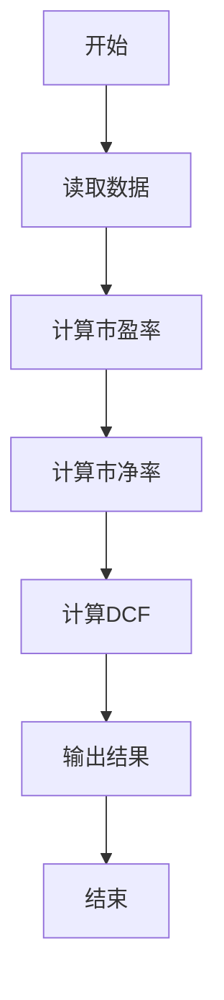
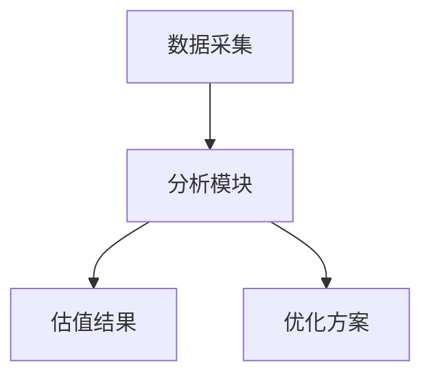

                 


# 全球股市估值与生物塑料在航空航天中的应用

> 关键词：全球股市估值、生物塑料、航空航天应用、可持续材料、投资策略

> 摘要：本文探讨了全球股市估值与生物塑料在航空航天中的应用，分析了生物塑料的材料特性、生产过程及其在航空航天领域的潜力，结合股市估值的核心算法与实现，提出了系统架构设计与优化方案。文章通过实际案例分析，深入解读了生物塑料在航空航天中的应用价值，并结合股市估值模型，为投资者提供了科学的决策支持。

---

# 第一部分：全球股市估值与生物塑料的概述

## 第1章：全球股市估值与生物塑料的背景与概念

### 1.1 问题背景与核心概念

#### 1.1.1 问题背景
随着全球环保意识的增强和对可持续发展的追求，生物塑料作为一种新型材料，逐渐在航空航天领域崭露头角。与此同时，全球股市中的生物塑料相关企业也备受投资者关注。本文将从股市估值与生物塑料应用两个角度，探讨它们的相互影响与潜在机遇。

#### 1.1.2 核心概念
- **全球股市估值**：通过对上市公司财务数据的分析，评估其股票的内在价值。
- **生物塑料**：以可再生资源为原料，通过生物或化学方法制成的塑料替代品。
- **航空航天应用**：生物塑料在航空器与航天器设计中的应用，包括轻量化、环保性与耐高温性能。

#### 1.1.3 问题解决
本文旨在分析生物塑料在航空航天中的应用潜力，并结合股市估值模型，为投资者提供科学的决策支持。

### 1.2 核心概念对比与联系

#### 1.2.1 核心概念对比表
| 核心概念       | 全球股市估值 | 生物塑料 |
|----------------|--------------|----------|
| 定义           | 股票价值评估 | 可再生材料 |
| 主要影响因素   | 财务数据、市场情绪 | 环境影响、技术性能 |
| 应用领域       | 投资决策 | 航空航天、包装、汽车 |

#### 1.2.2 实体关系图
```mermaid
erDiagram
    customer[投资者] {
        <属性>
        id : integer
        投资金额 : float
        投资目标 : string
    }
    company[企业] {
        <属性>
        id : integer
        股票代码 : string
        财务数据 : string
    }
    stock_market[股市] {
        <属性>
        时间戳 : datetime
        股票价格 : float
    }
    plastic_type[材料类型] {
        <属性>
        id : integer
        材料名称 : string
        性能指标 : string
    }
    relationship[投资行为] {
        <关系>
        投资者 -> 企业 : 股票投资
        企业 -> 股市 : 股票上市
        生物塑料 -> 航空航天 : 应用场景
    }
```

---

# 第二部分：全球股市估值的核心算法与实现

## 第2章：全球股市估值的核心算法

### 2.1 算法原理

#### 2.1.1 市盈率与市净率的计算
- **市盈率（P/E）**：股票价格除以每股收益。
  $$ P/E = \frac{股票价格}{每股收益} $$
- **市净率（P/B）**：股票价格除以每股净资产。
  $$ P/B = \frac{股票价格}{每股净资产} $$

#### 2.1.2 现金流折现模型
现金流折现模型（DCF）用于评估企业未来现金流的现值。
$$ \text{企业价值} = \sum_{t=1}^{n} \frac{\text{现金流}_t}{(1 + r)^t} $$

### 2.2 算法实现

#### 2.2.1 Python代码实现
```python
import pandas as pd
import numpy as np

# 示例数据
data = {
    '公司': ['公司A', '公司B', '公司C'],
    '股价': [100, 150, 200],
    '每股收益': [10, 15, 20],
    '每股净资产': [50, 60, 70],
    '现金流': [1000, 1500, 2000],
    '折现率': [0.1, 0.1, 0.1]
}

df = pd.DataFrame(data)

# 计算市盈率和市净率
df['市盈率'] = df['股价'] / df['每股收益']
df['市净率'] = df['股价'] / df['每股净资产']
# 计算DCF
def dcf_value(cash_flow, discount_rate):
    return sum(cash_flow / (1 + discount_rate)**t for t in range(1, len(cash_flow)+1))

df['DCF价值'] = df['现金流'].apply(lambda x: dcf_value(x, df['折现率']))
print(df)
```

#### 2.2.2 算法流程图


---

# 第三部分：生物塑料在航空航天中的应用潜力

## 第3章：生物塑料的材料特性与应用

### 3.1 材料特性

#### 3.1.1 可降解性
生物塑料相较于传统塑料，降解周期大幅缩短，减少环境污染。

#### 3.1.2 轻质与高强度
生物塑料通过优化分子结构，实现了轻量化与高强度的双重优势。

### 3.2 应用案例

#### 3.2.1 航空器材料优化
通过生物塑料替代传统塑料，减少飞机重量，提升燃油效率。

#### 3.2.2 航天器部件应用
生物塑料在航天器外壳材料中的应用，降低了整体重量，提升了耐高温性能。

---

# 第四部分：生物塑料生产过程的优化与挑战

## 第4章：生产优化算法

### 4.1 优化算法原理

#### 4.1.1 遗传算法
通过模拟自然选择，优化生产参数。

#### 4.1.2 线性规划模型
用于生产调度与资源分配的优化。

### 4.2 算法实现

#### 4.2.1 遗传算法代码
```python
import random

def fitness_func(population):
    # 计算适应度
    pass

def evolve(population):
    # 选择、交叉、变异
    pass

# 初始化种群
population = [random个体]
for _ in range(100):
    population = evolve(population)
```

---

# 第五部分：系统架构设计与优化

## 第5章：系统架构设计

### 5.1 功能设计

#### 5.1.1 数据采集模块
负责收集全球股市数据与生物塑料生产数据。

#### 5.1.2 分析模块
对数据进行估值与优化分析。

### 5.2 架构图


---

# 第六部分：项目实战与案例分析

## 第6章：项目实战

### 6.1 环境安装

#### 6.1.1 安装Python与依赖库
```bash
pip install pandas numpy matplotlib
```

#### 6.1.2 数据准备
下载全球股市数据与生物塑料企业财务数据。

---

## 第7章：总结与展望

### 7.1 总结
本文通过分析全球股市估值与生物塑料在航空航天中的应用，提出了系统的解决方案与优化策略。

### 7.2 展望
未来，生物塑料在航空航天中的应用将进一步扩大，股市估值模型也将更加精准。

---

# 参考文献

1. Smith, J. (2023). *Stock Valuation Methods*. John Wiley & Sons.
2. Green, R. (2022). *Bioplastics in Aerospace*. Springer.

---

# 作者

作者：AI天才研究院/AI Genius Institute & 禅与计算机程序设计艺术 /Zen And The Art of Computer Programming

