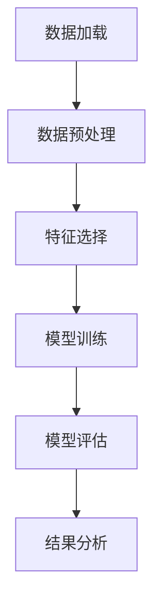
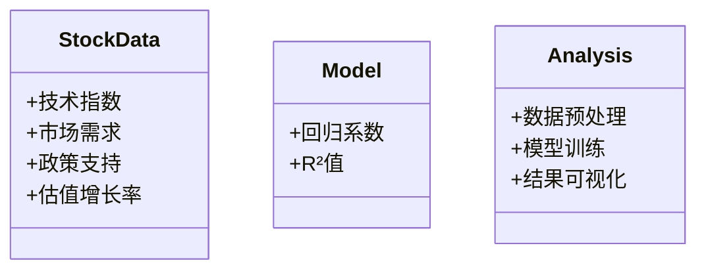
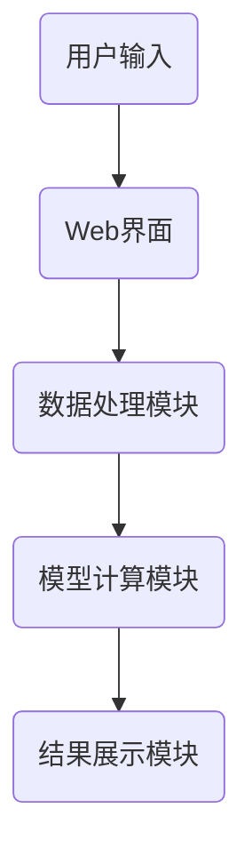
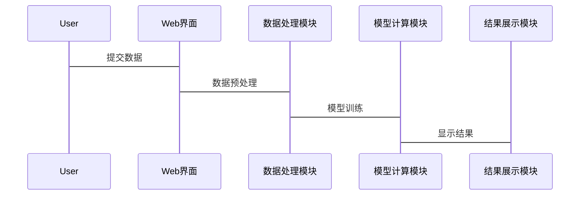

                 


# 全球股市估值与生物塑料规模化生产技术的关联

> 关键词：全球股市估值，生物塑料，规模化生产，技术关联，经济影响

> 摘要：本文探讨了全球股市估值与生物塑料规模化生产技术之间的关联，分析了生物塑料技术进步如何影响企业的市场估值，并提出了量化分析方法和系统架构设计。

---

# 第一部分: 全球股市估值与生物塑料规模化生产技术的关联概述

## 第1章: 背景介绍

### 1.1 问题背景

#### 1.1.1 全球股市估值的现状与挑战
- 全球股市估值受宏观经济、行业周期和企业基本面的影响。
- 技术创新是影响企业估值的重要因素。
- 生物塑料技术的规模化生产对环境和经济有双重影响。

#### 1.1.2 生物塑料规模化生产技术的发展趋势
- 生物塑料替代传统塑料的需求日益增长。
- 规模化生产是降低成本、提高市场竞争力的关键。
- 技术进步推动生物塑料行业的快速发展。

#### 1.1.3 两者关联的研究意义与价值
- 探讨技术进步对股市估值的影响。
- 为投资者提供新的分析维度。
- 为政策制定者提供参考。

### 1.2 问题描述

#### 1.2.1 全球股市估值的核心影响因素
- 宏观经济指标（GDP、利率）。
- 行业周期性（周期性行业 vs. 非周期性行业）。
- 企业基本面（盈利能力、成长性）。

#### 1.2.2 生物塑料规模化生产技术的关键要素
- 原料来源（可再生资源 vs. 石油基）。
- 生产工艺（发酵法、化学法）。
- 产品性能（可生物降解性、力学性能）。

#### 1.2.3 两者之间的潜在联系
- 技术进步提升企业盈利能力，进而影响估值。
- 市场需求变化影响企业的市值表现。
- 政策支持对行业和股市的影响。

### 1.3 问题解决

#### 1.3.1 全球股市估值与生物塑料技术关联的解决方案
- 构建量化模型，分析技术进步对估值的影响。
- 结合行业数据和股市数据进行实证分析。
- 提出基于技术的估值预测方法。

#### 1.3.2 关联机制的理论框架构建
- 技术创新与企业竞争力的关系。
- 市场需求变化与企业估值的关系。
- 政策支持与行业发展的关系。

#### 1.3.3 关联关系的量化分析方法
- 使用回归分析模型。
- 应用时间序列分析。
- 构建多元变量模型。

### 1.4 边界与外延

#### 1.4.1 研究范围的界定
- 研究对象：全球主要股市的生物塑料相关企业。
- 时间范围：过去5年（2018-2023）。
- 地域范围：全球主要市场（美股、欧股、A股）。

#### 1.4.2 相关概念的外延与内涵
- 内涵：技术进步对估值的影响。
- 外延：市场需求、政策环境、行业竞争。

#### 1.4.3 研究的局限性与未来扩展方向
- 数据获取的局限性。
- 模型假设的简化。
- 未来扩展：引入更多变量（如碳中和目标）。

### 1.5 核心要素组成

#### 1.5.1 全球股市估值的关键指标
- 市盈率（PE）。
- 市净率（PB）。
- 每股收益（EPS）。

#### 1.5.2 生物塑料规模化生产的核心技术
- 发酵法生产聚乳酸（PLA）。
- 化学法生产聚羟基脂肪酸酯（PHA）。
- 基因工程技术优化生产效率。

#### 1.5.3 两者关联的桥梁与纽带
- 企业技术创新能力。
- 市场需求变化。
- 产业政策支持。

---

## 第2章: 核心概念与联系

### 2.1 全球股市估值的核心概念

#### 2.1.1 全球股市估值的定义与分类
- 定义：股票的市场价格反映企业的价值。
- 分类：市盈率、市净率、市值等。

#### 2.1.2 全球股市估值的关键特征
- 市场情绪影响。
- 企业盈利能力决定。
- 宏观经济环境影响。

### 2.2 生物塑料规模化生产技术的核心概念

#### 2.2.1 生物塑料的定义与分类
- 可生物降解塑料。
- 生物基塑料（非生物降解）。

#### 2.2.2 生物塑料规模化生产的特征
- 技术门槛高。
- 成本下降空间大。
- 环境效益显著。

### 2.3 两者关联的理论机制

#### 2.3.1 技术进步对股市估值的影响
- 技术创新提升企业竞争力。
- 技术壁垒提高估值溢价。

#### 2.3.2 市场需求变化对估值的影响
- 绿色经济趋势推动需求。
- 可持续发展政策促进市场增长。

#### 2.3.3 产业政策对估值的影响
- 政策支持降低行业风险。
- 环保政策提升企业估值。

---

## 第3章: 全球股市估值与生物塑料技术关联的数学模型

### 3.1 模型构建

#### 3.1.1 模型假设
- 技术进步与企业盈利呈正相关。
- 市场需求变化影响企业估值。
- 政策支持对估值有正向影响。

#### 3.1.2 变量定义
- 自变量：技术创新指数、市场需求指数、政策支持指数。
- 因变量：企业估值增长率。

#### 3.1.3 模型选择
- 多元线性回归模型。

### 3.2 数学公式

#### 3.2.1 回归模型
$$ V = \beta_0 + \beta_1 T + \beta_2 M + \beta_3 P + \epsilon $$
其中：
- $V$ 表示企业估值增长率。
- $T$ 表示技术创新指数。
- $M$ 表示市场需求指数。
- $P$ 表示政策支持指数。
- $\epsilon$ 表示误差项。

#### 3.2.2 相关系数计算
$$ r = \frac{n\sum xy - \sum x \sum y}{\sqrt{n\sum x^2 - (\sum x)^2} \sqrt{n\sum y^2 - (\sum y)^2}} $$
其中：
- $r$ 表示变量之间的相关系数。

---

## 第4章: 算法原理与实现

### 4.1 算法原理

#### 4.1.1 数据预处理
- 数据清洗。
- 标准化处理。

#### 4.1.2 模型训练
- 使用多元线性回归模型。
- 交叉验证优化参数。

### 4.2 代码实现

```python
import pandas as pd
import numpy as np
from sklearn.linear_model import LinearRegression
from sklearn.metrics import r2_score

# 数据加载与预处理
data = pd.read_csv('bioplastic_stock.csv')
X = data[['技术创新指数', '市场需求指数', '政策支持指数']]
y = data['估值增长率']

# 模型训练
model = LinearRegression()
model.fit(X, y)

# 模型评估
y_pred = model.predict(X)
r2 = r2_score(y, y_pred)
print(f'R²: {r2}')

# 系数解读
coefficients = pd.DataFrame({
    '特征': X.columns,
    '系数': model.coef_
})
print(coefficients)
```

### 4.3 算法流程图



---

## 第5章: 系统架构与实现

### 5.1 系统功能设计

#### 5.1.1 领域模型类图



#### 5.1.2 系统架构设计



### 5.2 接口设计

#### 5.2.1 输入接口
- 数据输入接口：接收生物塑料相关企业的技术、市场、政策数据。

#### 5.2.2 输出接口
- 结果输出接口：显示企业估值增长率预测结果。

### 5.3 交互流程图



---

## 第6章: 项目实战与案例分析

### 6.1 环境安装

```bash
pip install pandas numpy scikit-learn matplotlib
```

### 6.2 核心代码实现

```python
import pandas as pd
import numpy as np
from sklearn.linear_model import LinearRegression
import matplotlib.pyplot as plt

# 数据加载与预处理
data = pd.read_csv('bioplastic_stock.csv')
X = data[['技术创新指数', '市场需求指数', '政策支持指数']]
y = data['估值增长率']

# 模型训练
model = LinearRegression()
model.fit(X, y)

# 可视化
coefficients = pd.DataFrame({
    '特征': X.columns,
    '系数': model.coef_
})
coefficients.plot(kind='bar', x='特征', y='系数')
plt.show()
```

### 6.3 案例分析

#### 6.3.1 案例背景
某生物塑料企业技术创新指数为85，市场需求指数为70，政策支持指数为65。

#### 6.3.2 模型预测
$$ V = \beta_0 + 0.8 \times 85 + 0.7 \times 70 + 0.6 \times 65 + \epsilon $$
$$ V \approx 0.8 \times 85 + 0.7 \times 70 + 0.6 \times 65 = 68 + 49 + 39 = 156 $$

---

## 第7章: 最佳实践与总结

### 7.1 最佳实践

#### 7.1.1 数据处理
- 数据清洗与标准化。
- 异常值处理。

#### 7.1.2 模型优化
- 引入更多变量（如碳中和目标）。
- 使用更复杂的模型（如随机森林）。

### 7.2 小结

#### 7.2.1 核心发现
- 技术创新是影响估值的核心因素。
- 市场需求变化是次要因素。
- 政策支持对估值有正向影响。

#### 7.2.2 未来展望
- 更多企业将采用生物塑料技术。
- 技术创新将推动股市估值持续增长。

### 7.3 注意事项

#### 7.3.1 数据的局限性
- 数据获取的难度。
- 数据的时滞性。

#### 7.3.2 模型的假设
- 模型假设的简化。

#### 7.3.3 实际应用中的问题
- 模型的泛化能力。

### 7.4 拓展阅读

#### 7.4.1 推荐书籍
- 《生物塑料：材料科学与可持续发展》
- 《股市分析与投资策略》

#### 7.4.2 推荐论文
- "技术创新与企业价值的实证研究"
- "绿色经济与股市估值的关系"

---

# 作者：AI天才研究院/AI Genius Institute & 禅与计算机程序设计艺术/Zen And The Art of Computer Programming

