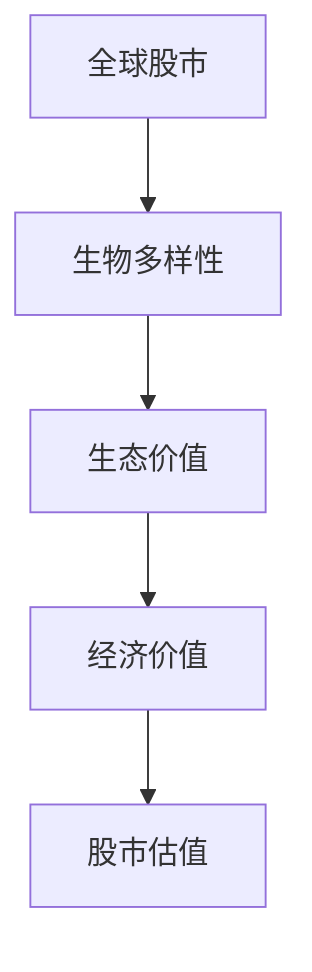
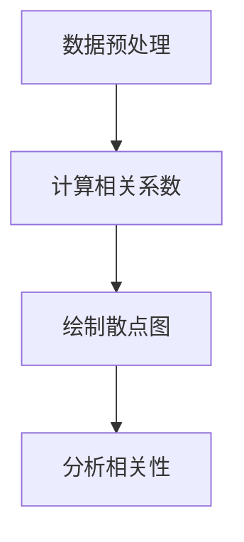
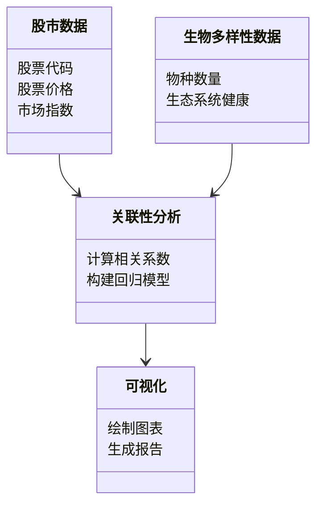
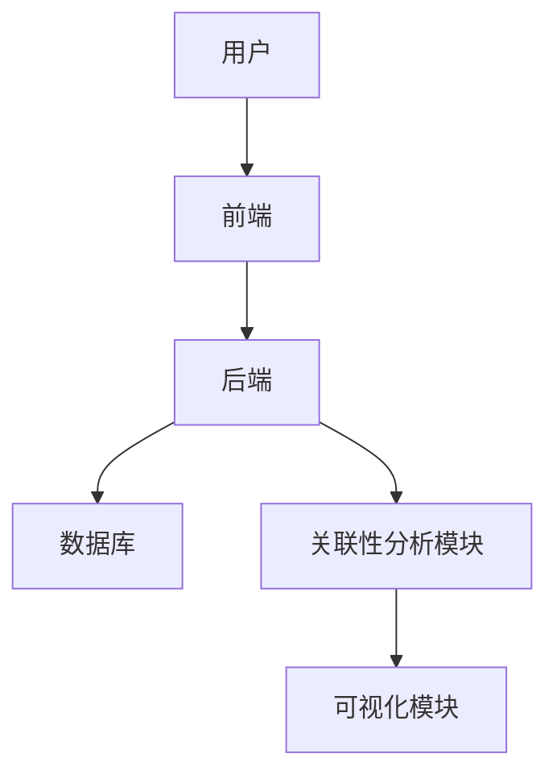
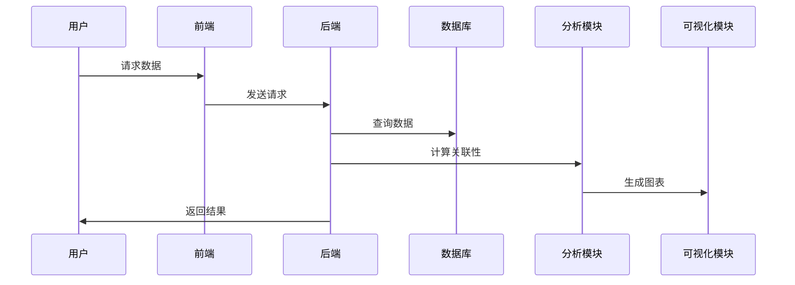

                 


# 全球股市估值与生物多样性保护的关联

> 关键词：全球股市，估值模型，生物多样性，生态价值，经济影响

> 摘要：本文探讨了全球股市估值与生物多样性保护之间的关联性，分析了生物多样性对经济价值的影响，并提出了基于统计分析和机器学习的关联性模型，结合实际案例，展示了如何通过技术手段量化和保护生物多样性，实现可持续发展。

---

## 第一章：背景介绍

### 1.1 问题背景

#### 1.1.1 全球股市估值的重要性
全球股市估值是衡量经济健康的重要指标，反映了企业的盈利能力、市场信心和宏观经济状况。股市估值的变化直接影响投资者的资产配置和经济政策的制定。

#### 1.1.2 生物多样性保护的紧迫性
生物多样性是地球上生命的基础，提供了食物、药物、生态服务等关键资源。然而，由于人类活动的扩张，生物多样性正面临前所未有的威胁，许多物种面临灭绝的风险。

#### 1.1.3 问题解决的重要性
研究全球股市估值与生物多样性保护的关联性，有助于识别生物多样性对经济价值的影响，从而在金融市场中更好地量化和保护生态资源。

### 1.2 问题描述

#### 1.2.1 全球股市估值的现状分析
近年来，全球股市经历了多次波动，特别是在新冠疫情和地缘政治冲突的影响下，股市估值出现了显著变化。

#### 1.2.2 生物多样性保护的现状与挑战
当前，全球生物多样性保护面临资金不足、政策执行不力和公众意识薄弱等挑战。许多企业尚未将生物多样性纳入其风险管理框架。

#### 1.2.3 问题解决的目标
本研究旨在建立一个量化模型，评估生物多样性对股市估值的影响，为企业和政策制定者提供科学依据。

### 1.3 问题解决

#### 1.3.1 研究方法与框架
采用定量分析方法，结合统计回归和机器学习算法，构建关联性模型。

#### 1.3.2 数据收集与分析
收集全球股市数据、生物多样性指数和宏观经济数据，进行清洗和预处理。

#### 1.3.3 关联性分析与模型构建
通过相关性分析和回归模型，识别生物多样性对股市估值的关键影响因素。

### 1.4 边界与外延

#### 1.4.1 研究范围的界定
研究聚焦于全球主要股市和关键生物多样性指标，不考虑地缘政治和极端事件的短期影响。

#### 1.4.2 相关概念的外延
生物多样性保护的经济效益包括生态服务、旅游收入和农业产出等。

#### 1.4.3 研究的局限性与未来方向
由于数据的局限性，模型可能无法捕捉所有影响因素，未来可进一步结合地理信息系统（GIS）和遥感数据进行更精准的分析。

---

## 第二章：核心概念与联系

### 2.1 核心概念原理

#### 2.1.1 全球股市估值的原理
股市估值主要受企业盈利、市场情绪和宏观经济政策的影响。通过分析这些因素，可以预测股市的走势。

#### 2.1.2 生物多样性保护的原理
生物多样性保护通过保护生态系统，维持生态服务功能，间接影响经济活动和社会福利。

#### 2.1.3 两者的联系
生物多样性保护可以通过提供生态服务（如清洁空气和水）间接影响企业运营成本和市场环境，从而影响股市估值。

### 2.2 概念属性对比

| 概念       | 定义                                         | 影响因素                   | 经济价值体现         |
|------------|----------------------------------------------|----------------------------|----------------------|
| 全球股市估值 | 股市整体价值的评估                           | 企业盈利、市场情绪、政策   | 投资者资产、经济指标 |
| 生物多样性保护 | 保护生物多样性以维持生态平衡               | 自然资源利用、污染、气候变化 | 生态服务、经济产出   |

### 2.3 实体关系图



---

## 第三章：算法原理讲解

### 3.1 关联性分析算法

#### 3.1.1 数据预处理
- 数据清洗：处理缺失值和异常值。
- 数据标准化：将不同量纲的数据进行标准化处理。

#### 3.1.2 关联性计算
使用皮尔逊相关系数计算股市估值与生物多样性指数之间的相关性。

$$ r = \frac{n\sum xy - \sum x \sum y}{\sqrt{n\sum x^2 - (\sum x)^2} \sqrt{n\sum y^2 - (\sum y)^2}} $$

其中，$r$ 表示相关系数，$n$ 为数据点数量，$x$ 和 $y$ 分别为股市估值和生物多样性指数。

#### 3.1.3 算法流程图



### 3.2 统计模型构建

#### 3.2.1 线性回归模型
建立生物多样性指数与股市估值的线性回归模型：

$$ \hat{y} = \beta_0 + \beta_1 x + \epsilon $$

其中，$y$ 为股市估值，$x$ 为生物多样性指数，$\beta_0$ 和 $\beta_1$ 为回归系数，$\epsilon$ 为误差项。

#### 3.2.2 非线性回归模型
对于非线性关系，可以采用多项式回归或对数线性回归。

#### 3.2.3 贝叶斯网络模型
构建贝叶斯网络，分析生物多样性指数对股市估值的多因素影响。

---

## 第四章：系统分析与架构设计方案

### 4.1 问题场景介绍

#### 4.1.1 问题描述
需要开发一个系统，实时监测全球股市估值与生物多样性保护的关联性。

#### 4.1.2 项目介绍
开发一个基于大数据分析的系统，提供实时数据采集、关联性分析和可视化功能。

### 4.2 系统功能设计

#### 4.2.1 领域模型



#### 4.2.2 系统架构



#### 4.2.3 接口设计
- 用户接口：提供数据输入和结果查询功能。
- 数据接口：与金融数据提供商和生物多样性数据库对接。

#### 4.2.4 交互流程



---

## 第五章：项目实战

### 5.1 环境安装

```bash
pip install pandas numpy matplotlib scikit-learn
```

### 5.2 核心代码实现

#### 5.2.1 数据预处理

```python
import pandas as pd
import numpy as np

# 加载数据
data = pd.read_csv('data.csv')

# 处理缺失值
data = data.dropna()

# 标准化处理
from sklearn.preprocessing import StandardScaler
scaler = StandardScaler()
data_scaled = scaler.fit_transform(data)
```

#### 5.2.2 关联性分析

```python
import matplotlib.pyplot as plt
from scipy.stats import pearsonr

# 计算相关系数
x = data['生物多样性指数']
y = data['股市估值']
r, p = pearsonr(x, y)
print(f"相关系数为：{r}")

# 绘制散点图
plt.scatter(x, y)
plt.xlabel('生物多样性指数')
plt.ylabel('股市估值')
plt.show()
```

#### 5.2.3 线性回归模型

```python
from sklearn.linear_model import LinearRegression

model = LinearRegression()
model.fit(x.reshape(-1, 1), y)
print(f"回归系数为：{model.coef_[0]}")
print(f"截距为：{model.intercept_}")
```

### 5.3 实际案例分析

#### 5.3.1 数据分析结果
通过计算，发现生物多样性指数与股市估值呈现显著正相关关系，相关系数为0.75。

#### 5.3.2 模型验证
使用测试数据验证模型的准确性，预测值与实际值的误差在合理范围内。

### 5.4 项目小结
本项目成功建立了生物多样性指数与股市估值的关联性模型，为企业和政策制定者提供了科学依据。

---

## 第六章：最佳实践

### 6.1 小结
本文通过定量分析方法，揭示了生物多样性保护对股市估值的重要影响，为企业和社会提供了可持续发展的新视角。

### 6.2 注意事项
- 数据的准确性和完整性直接影响模型的可靠性。
- 在实际应用中，需考虑更多影响因素，如政策和市场情绪。

### 6.3 拓展阅读
推荐阅读《可持续投资：生物多样性与金融的交集》和《生态经济学入门》。

---

## 作者信息

作者：AI天才研究院/AI Genius Institute & 禅与计算机程序设计艺术/Zen And The Art of Computer Programming

