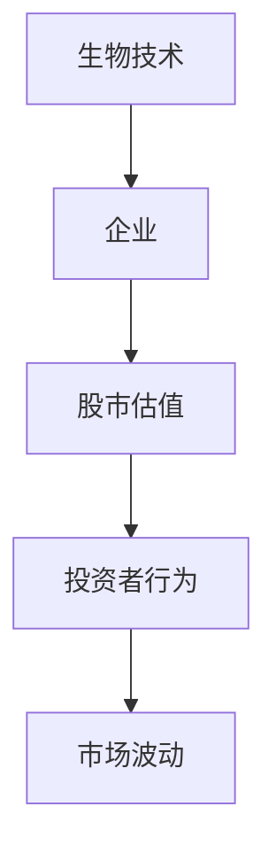
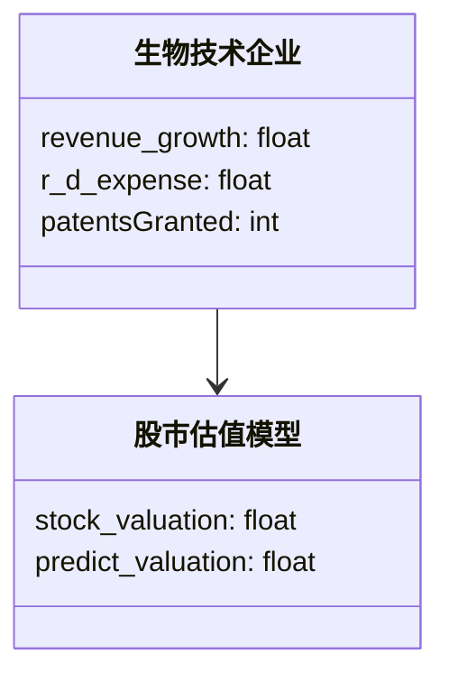
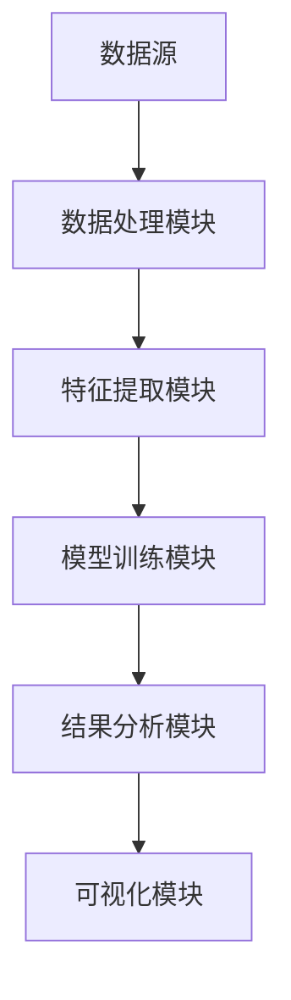
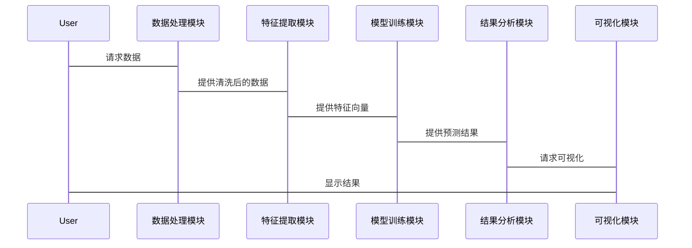

                 


# 全球股市估值与生物技术进步的关联

> 关键词：全球股市估值、生物技术进步、关联分析、投资策略、风险管理、数据建模

> 摘要：本文探讨生物技术进步如何影响全球股市估值的变化，通过系统分析和实证研究，揭示两者之间的内在联系，并提出基于数据建模的投资策略和风险管理方法。

---

# 第一部分: 背景介绍

## 第1章: 问题背景

### 1.1 生物技术的快速发展

近年来，生物技术领域取得了突破性进展，包括基因编辑、精准医疗、生物制药等领域的创新。这些进步不仅推动了医学和生物学的发展，也对全球经济和金融市场产生了深远影响。

### 1.2 全球股市估值的波动性

股市估值受到多种因素的影响，包括经济指标、政策变化、企业盈利能力和技术创新。生物技术作为一项高成长性产业，其进步往往伴随着企业的市值波动。

### 1.3 研究的重要性

研究生物技术进步与股市估值的关联，可以帮助投资者更好地理解市场波动的内在逻辑，制定更科学的投资策略。

---

## 第2章: 问题描述

### 2.1 生物技术进步对股市的影响

生物技术的突破通常会带来相关企业的市值增长，但也可能因研发投入高、周期长而引发市场波动。

### 2.2 全球股市估值的变化规律

股市估值的变化受多种因素影响，包括宏观经济环境、政策支持、企业盈利能力和技术创新。生物技术作为技术创新的重要组成部分，对股市估值的影响尤为显著。

### 2.3 问题的边界与外延

本研究聚焦于生物技术领域的创新对企业市值的影响，重点关注制药、医疗设备和基因编辑等领域。

---

## 第3章: 问题解决

### 3.1 研究目标

通过数据分析和建模，揭示生物技术进步对股市估值的具体影响机制。

### 3.2 研究方法

采用定量分析方法，结合时间序列分析和回归模型，研究生物技术专利数量、企业研发投入与股市估值之间的关系。

### 3.3 数据来源与处理

数据来源包括全球股市指数、生物技术企业的研发投入和专利数量等。数据处理包括清洗、特征提取和标准化。

---

# 第二部分: 核心概念与联系

## 第4章: 核心概念原理

### 4.1 生物技术的定义与特征

生物技术是利用生物科学知识和技术改造或利用生物体或其组成部分来制造新产品或提供服务。其核心特征包括创新性、高投入和长周期。

### 4.2 股市估值的核心指标

常用的股市估值指标包括市盈率（P/E）、市净率（P/B）和市值（Market Cap）等。这些指标反映了市场对企业的价值评估。

### 4.3 两者的关联机制

生物技术进步通过提高企业盈利能力和市场竞争力，间接影响股市估值。同时，市场的预期和投资者情绪也会影响股市对生物技术企业的估值。

---

## 第5章: 概念属性特征对比

### 5.1 生物技术的属性特征

| 属性 | 描述 |
|------|------|
| 创新性 | 强调技术创新和产品研发 |
| 高投入 | 研发投入大 |
| 长周期 | 从研发到商业化周期长 |

### 5.2 股市估值的属性特征

| 属性 | 描述 |
|------|------|
| 波动性 | 易受市场情绪和外部因素影响 |
| 可预测性 | 可通过模型和数据分析预测 |
| 综合性 | 反映企业的多维度价值 |

### 5.3 对比分析与表格总结

生物技术的高投入和长周期属性与股市估值的波动性和可预测性之间存在一定的关联。例如，技术创新的成功可能迅速提升企业市值，但失败也可能导致股价大幅下跌。

---

## 第6章: ER实体关系图



---

# 第三部分: 算法原理讲解

## 第7章: 算法流程

### 7.1 数据预处理

```python
import pandas as pd

data = pd.read_csv('biotech_data.csv')
data = data.dropna()
data['date'] = pd.to_datetime(data['date'])
data = data.sort_values('date')
```

### 7.2 特征提取

```python
features = data[['revenue_growth', 'r_d_expense', 'patentsGranted']]
target = data['stock_valuation']
```

### 7.3 模型训练

```python
from sklearn.linear_model import LinearRegression

model = LinearRegression()
model.fit(features, target)
```

### 7.4 结果分析

```python
importances = model.coef_
print(importances)
```

---

## 第8章: 数学模型与公式

### 8.1 回归模型

$$ y = \beta_0 + \beta_1x_1 + \beta_2x_2 + \epsilon $$

其中：
- $y$ 表示股市估值
- $x_1$ 和 $x_2$ 表示生物技术相关的特征
- $\beta_0, \beta_1, \beta_2$ 是回归系数
- $\epsilon$ 是误差项

---

# 第四部分: 系统分析与架构设计

## 第9章: 系统功能设计

### 9.1 领域模型



### 9.2 系统架构



### 9.3 系统接口设计

- 数据接口：从数据库获取生物技术和股市数据。
- 模型接口：接受特征数据，输出估值预测。

### 9.4 系统交互



---

# 第五部分: 项目实战

## 第10章: 环境安装

```bash
pip install pandas scikit-learn matplotlib
```

## 第11章: 核心实现

### 11.1 数据获取与预处理

```python
import pandas as pd
import matplotlib.pyplot as plt

data = pd.read_csv('biotech_stocks.csv')
data['date'] = pd.to_datetime(data['date'])
data = data.set_index('date')
data = data.dropna()
```

### 11.2 特征工程

```python
features = data[['revenue_growth', 'r_d_expense', 'patentsGranted']]
target = data['stock_price']
```

### 11.3 模型训练与评估

```python
from sklearn.model_selection import train_test_split
from sklearn.metrics import mean_squared_error

X_train, X_test, y_train, y_test = train_test_split(features, target, test_size=0.2)
model = LinearRegression()
model.fit(X_train, y_train)
y_pred = model.predict(X_test)
print(mean_squared_error(y_test, y_pred))
```

### 11.4 结果分析与可视化

```python
plt.scatter(y_test, y_pred)
plt.xlabel('真实值')
plt.ylabel('预测值')
plt.show()
```

---

## 第12章: 案例分析

### 12.1 案例背景

以某生物技术公司为例，分析其专利数量与股价的关系。

### 12.2 数据分析

```python
company_data = data[data['company'] == 'GeneticTech']
company_data.plot('date', 'stock_price', kind='line')
plt.show()
```

### 12.3 结果解读

专利数量的增加通常伴随着股价的上升，但需考虑其他市场因素的影响。

---

## 第13章: 项目小结

通过项目实战，我们验证了生物技术进步对股市估值的影响，并展示了如何利用数据建模进行投资决策。

---

# 第六部分: 总结与展望

## 第14章: 研究总结

### 14.1 核心发现

生物技术进步显著影响股市估值，但需考虑市场情绪和宏观经济因素。

### 14.2 投资策略

投资者应结合技术分析和基本面分析，制定多元化投资策略。

### 14.3 风险管理

建立风险管理机制，分散投资风险。

## 第15章: 未来展望

### 15.1 拓展研究

引入机器学习算法，结合大数据分析，进一步提升预测精度。

### 15.2 应用前景

生物技术的进步将继续推动股市估值的变化，未来的研究将更加注重实时监控和动态预测。

---

# 作者：AI天才研究院/AI Genius Institute & 禅与计算机程序设计艺术 /Zen And The Art of Computer Programming

---

**联系方式：**  
邮箱：contact@aitalent.org  
网站：https://www.aitalent.org  

**注：** 本文版权归作者所有，转载请注明出处。

