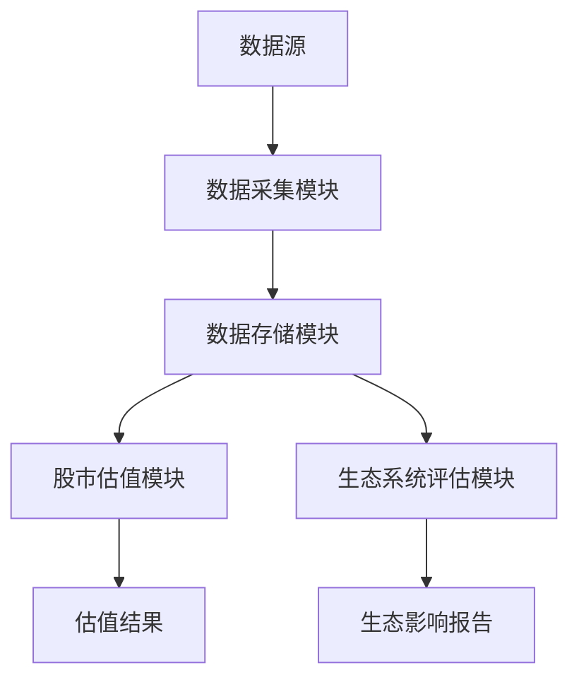

                 

# 全球股市估值与生物燃料与生态系统平衡的策略

## 关键词：
全球股市估值、生物燃料、生态系统平衡、算法模型、系统架构

## 摘要：
本文探讨了全球股市估值、生物燃料生产和生态系统平衡之间的复杂关系。通过分析传统与现代估值方法、生态系统数学模型以及系统架构设计，提出了一种综合策略，以实现经济与环境的可持续发展。

---

## 第一部分：背景与核心概念

### 第1章：全球股市估值的背景与挑战

#### 1.1 全球股市估值的基本概念
股市估值是评估公司价值的过程，常用指标包括市盈率（P/E）、市净率（P/B）和现金流折现模型（DCF）。这些指标帮助投资者判断股票的合理价格，影响市场整体走势。

#### 1.2 生物燃料与生态系统的关系
生物燃料如乙醇和生物柴油，由植物或藻类制成，是可再生能源的重要来源。然而，大规模生产可能破坏生态系统，导致物种多样性减少和土地退化。

#### 1.3 问题背景与研究意义
全球股市估值与生物燃料密切相关，尤其是在能源价格波动时。生态系统平衡的破坏会增加企业成本，影响股市表现。研究这一关系有助于制定可持续发展策略，平衡经济增长与环境保护。

---

## 第二部分：核心概念与系统分析

### 第2章：全球股市估值的核心算法与模型

#### 2.1 股市估值的传统方法
- **市盈率（P/E）模型**：计算股票价格与每股收益的比率，用于评估股票的合理价值。
- **市净率（P/B）模型**：比较股票价格与每股净资产，适用于评估价值型股票。
- **现金流折现模型（DCF）**：预测未来现金流，按贴现率计算现值，评估企业内在价值。

#### 2.2 基于大数据与AI的现代估值方法
- **时间序列分析**：使用ARIMA模型预测股票价格走势。
- **机器学习模型**：训练神经网络识别市场模式，预测价格波动。
- **群智算法**：利用群体智慧预测市场趋势，提高估值准确性。

#### 2.3 生物燃料对股市估值的影响
- 生物燃料价格波动影响能源公司股价，进而影响整体股市。
- 生态系统破坏导致企业生产成本增加，影响利润和股票估值。

### 第3章：生态系统平衡的数学模型

#### 3.1 生态系统平衡的核心原理
- **能量流动**：生态系统中能量从生产者到消费者单向流动，支撑生态系统的稳定性。
- **物质循环**：碳、氮等元素在生态系统中的循环维持平衡。
- **生态系统服务**：如 pollination 和分解，对经济活动至关重要。

#### 3.2 生态系统平衡的数学模型
- **Lotka-Volterra方程**：描述捕食者与猎物种群动态，应用于生态平衡分析。
- **生态网络模型**：展示物种间相互作用，评估生态系统的复杂性。

#### 3.3 生物燃料对生态系统平衡的数学分析
- 生物燃料生产导致土地使用变化，影响生态系统的碳汇能力。
- 模型模拟显示，大规模生物燃料生产可能导致生态系统崩溃，需平衡生产与保护。

---

## 第三部分：系统架构与项目实战

### 第4章：系统架构设计

#### 4.1 系统功能模块划分
- **数据采集模块**：收集全球股市数据、生物燃料生产和生态系统指标。
- **股市估值模块**：应用算法模型进行股票估值。
- **生态系统评估模块**：分析生态系统的健康状况，评估生物燃料影响。

#### 4.2 系统架构图（Mermaid）

#### 4.3 算法实现与案例分析
- 使用Python编写时间序列分析代码，预测股票价格。
- 应用机器学习模型训练神经网络，预测生物燃料价格波动。
- 通过案例分析，如某地区的生物燃料项目，展示如何应用这些策略实现生态与经济平衡。

---

## 第四部分：总结与展望

### 第5章：总结与展望

#### 5.1 主要内容回顾
本文探讨了全球股市估值、生物燃料与生态系统平衡的关系，分析了传统与现代估值方法，提出了生态系统平衡的数学模型，设计了系统架构，并通过案例展示了实际应用。

#### 5.2 研究意义与未来展望
研究结果为投资者提供了新的视角，帮助他们在考虑经济利益的同时，关注环境保护。未来研究可进一步优化算法，扩展模型的应用范围，推动可持续发展。

---

## 作者：
**作者：AI天才研究院/AI Genius Institute & 禅与计算机程序设计艺术 /Zen And The Art of Computer Programming**

---

本文通过系统分析和详细案例，探讨了全球股市估值、生物燃料与生态系统平衡的策略。希望为读者提供深入的见解，帮助他们在复杂环境中做出明智决策。

