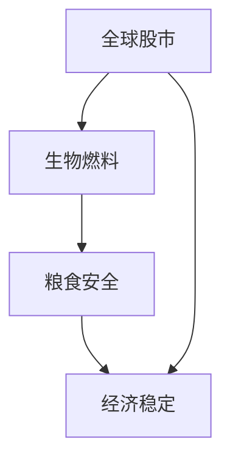
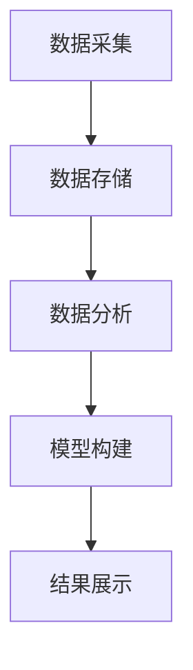

                 


# 全球股市估值与生物燃料与粮食安全的平衡策略

> 关键词：全球股市估值，生物燃料，粮食安全，平衡策略，数学模型，系统架构，项目实战

> 摘要：本文探讨了全球股市估值与生物燃料和粮食安全之间的复杂关系，并提出了一种平衡策略。通过分析生物燃料对粮食安全的影响，以及全球股市估值与生物燃料市场的相互作用，我们构建了一个数学模型，并设计了一个系统架构来优化这一平衡。最后，我们通过一个实际案例展示了如何在实践中应用这些策略。

---

## 第1章: 全球股市估值与生物燃料与粮食安全的背景介绍

### 1.1 全球股市估值的基本概念

#### 1.1.1 什么是全球股市估值

全球股市估值是指对全球主要股票市场的整体价值进行评估。它通常通过计算市场的总市值（Market Capitalization）来衡量，即所有上市公司市值的总和。全球股市估值反映了全球经济的健康状况和市场参与者的信心。

#### 1.1.2 全球股市估值的计算方法

全球股市估值的计算方法主要基于以下公式：

$$ \text{全球股市总市值} = \sum (\text{单家公司市值}) $$

其中，单家公司市值的计算公式为：

$$ \text{公司市值} = \text{股价} \times \text{流通股数量} $$

#### 1.1.3 全球股市估值的指标与影响因素

全球股市估值的关键指标包括：

- 市盈率（P/E Ratio）：衡量股票价格是否合理。
- 市净率（P/B Ratio）：衡量股票价格相对于账面价值的高低。
- 涨幅率：衡量股市在一定时间内的价格变化。

影响全球股市估值的主要因素包括经济指标（GDP、通胀率）、企业盈利、政策变化、地缘政治等。

---

### 1.2 生物燃料的基本概念

#### 1.2.1 生物燃料的定义与分类

生物燃料是指来源于生物物质的能量载体，包括：

1. **第一代生物燃料**：主要来自粮食作物（如玉米、甘蔗）。
2. **第二代生物燃料**：来自非粮食作物（如秸秆、草本植物）。
3. **第三代生物燃料**：来自 algae 等微藻类。

#### 1.2.2 生物燃料的生产过程与技术

生物燃料的生产过程包括：

1. **原料收集**：选择适合的生物原料。
2. **预处理**：将原料转化为适合加工的形态。
3. **发酵或化学转化**：通过生物或化学方法提取能量。
4. **提纯与包装**：最终产品。

#### 1.2.3 生物燃料的市场需求与发展趋势

随着全球能源需求的增长和化石燃料的枯竭，生物燃料的需求日益增加。各国政府也在通过政策支持推动生物燃料的生产与使用。

---

### 1.3 粮食安全的基本概念

#### 1.3.1 粮食安全的定义与内涵

粮食安全是指一个国家或地区在任何时候都能获得足够、 affordable 和安全的粮食供应。它包括生产、分配、消费和存储等多个环节。

#### 1.3.2 粮食安全的全球现状与挑战

当前，全球粮食安全面临的主要挑战包括气候变化、土地资源有限、水资源短缺、人口增长等。

#### 1.3.3 粮食安全与经济发展的关系

粮食安全是经济稳定的基础。粮食短缺可能导致经济动荡，而经济繁荣又能促进粮食生产与贸易。

---

## 第2章: 全球股市估值与生物燃料与粮食安全的核心概念与联系

### 2.1 核心概念原理

#### 2.1.1 全球股市估值的波动机制

股市估值的波动受多种因素影响，包括经济数据、政策变化、企业盈利等。例如，如果生物燃料价格上升，可能会影响粮食价格，进而影响股市估值。

#### 2.1.2 生物燃料对粮食价格的影响

生物燃料的生产需要大量粮食作物，这可能导致粮食价格上涨，进而影响粮食安全。例如，玉米被用于生产乙醇，可能导致玉米价格上涨。

#### 2.1.3 粮食安全对经济稳定的作用

粮食安全是经济稳定的基础。如果粮食供应不稳定，可能引发通货膨胀，影响股市估值。

### 2.2 核心概念属性特征对比表格

表2.1: 全球股市估值、生物燃料与粮食安全的核心属性对比

| 指标 | 全球股市估值 | 生物燃料 | 粮食安全 |
|------|--------------|----------|----------|
| 核心要素 | 市场总市值 | 原料、技术 | 生产、分配 |
| 影响因素 | 经济数据、政策 | 原料价格、技术进步 | 气候变化、人口增长 |
| 目标 | 投资回报 | 可持续能源 | 食品安全 |

### 2.3 ER实体关系图



---

## 第3章: 全球股市估值与生物燃料与粮食安全的数学模型与算法原理

### 3.1 数学模型与公式

#### 3.1.1 全球股市估值模型

假设我们有一个包含 N 家公司的市场，每家公司的市值为 \( V_i \)，则全球股市总市值为：

$$ V_{\text{total}} = \sum_{i=1}^{N} V_i $$

其中，\( V_i = P_i \times Q_i \)，\( P_i \) 为股价，\( Q_i \) 为流通股数量。

#### 3.1.2 生物燃料对粮食价格的影响模型

假设生物燃料的生产消耗了 \( F \) 万吨粮食，导致粮食价格上涨 \( \Delta P \)，则：

$$ \Delta P = k \times F $$

其中，\( k \) 为价格影响系数。

#### 3.1.3 粮食安全与经济稳定的平衡模型

假设经济稳定指数 \( S \) 与粮食价格 \( P \) 和股市估值 \( V \) 的关系为：

$$ S = \alpha P + \beta V $$

其中，\( \alpha \) 和 \( \beta \) 为权重系数。

### 3.2 算法原理

#### 3.2.1 算法流程

1. 收集全球股市数据、生物燃料生产数据和粮食价格数据。
2. 计算全球股市总市值。
3. 分析生物燃料生产对粮食价格的影响。
4. 构建经济稳定指数模型。
5. 优化模型以平衡股市估值与粮食安全。

#### 3.2.2 算法实现代码

```python
import pandas as pd

# 假设数据已经加载到 df 中
df = pd.read_csv('data.csv')

# 计算全球股市总市值
def calculate_market_capitalization(df):
    df['Market Cap'] = df['Price'] * df['Shares']
    total = df['Market Cap'].sum()
    return total

# 分析生物燃料对粮食价格的影响
def analyze_biofuel_impact(df):
    biofuel_consumption = df['Biofuel Usage'].sum()
    price_increase = biofuel_consumption * 0.5  # 假设 k=0.5
    return price_increase

# 构建经济稳定指数
def calculate_economic_stability(price_increase, market_capitalization):
    alpha = 0.7
    beta = 0.3
    stability_index = alpha * price_increase + beta * market_capitalization
    return stability_index

# 主程序
total_market_cap = calculate_market_capitalization(df)
price_impact = analyze_biofuel_impact(df)
stability = calculate_economic_stability(price_impact, total_market_cap)

print(f"Total Market Capitalization: {total_market_cap}")
print(f"Price Impact: {price_impact}")
print(f"Economic Stability Index: {stability}")
```

---

## 第4章: 全球股市估值与生物燃料与粮食安全的系统架构设计

### 4.1 系统功能设计

1. 数据采集模块：收集全球股市、生物燃料和粮食安全数据。
2. 数据分析模块：计算全球股市总市值，分析生物燃料对粮食价格的影响。
3. 模型优化模块：构建经济稳定指数模型并优化。

### 4.2 系统架构设计



### 4.3 系统接口设计

1. 数据接口：与数据源（如股票交易所、农业部门）对接。
2. 用户接口：展示计算结果和优化建议。

---

## 第5章: 全球股市估值与生物燃料与粮食安全的项目实战

### 5.1 环境安装

- 安装 Python 和必要的库（如 Pandas、Matplotlib）。

### 5.2 数据收集与处理

- 收集全球股市数据、生物燃料生产数据和粮食价格数据。

### 5.3 模型实现

- 使用上述代码实现数学模型。

### 5.4 结果分析

- 分析模型结果，优化参数。

---

## 第6章: 全球股市估值与生物燃料与粮食安全的最佳实践与总结

### 6.1 最佳实践

- 定期更新数据，保持模型的准确性。
- 根据实际情况调整模型参数。

### 6.2 小结

本文通过分析全球股市估值、生物燃料和粮食安全的关系，构建了一个数学模型，并设计了一个系统架构来优化它们的平衡。

### 6.3 注意事项

- 数据的准确性和及时性对模型结果至关重要。
- 模型的优化需要根据实际情况进行调整。

### 6.4 拓展阅读

- 更深入的数学模型和优化算法。
- 全球气候变化对粮食安全的影响。

---

## 作者

作者：AI天才研究院/AI Genius Institute & 禅与计算机程序设计艺术 /Zen And The Art of Computer Programming

---

通过以上内容，我们系统地分析了全球股市估值与生物燃料和粮食安全的平衡策略，并提供了一个实际的解决方案。希望本文能为相关领域的研究和实践提供有价值的参考。

