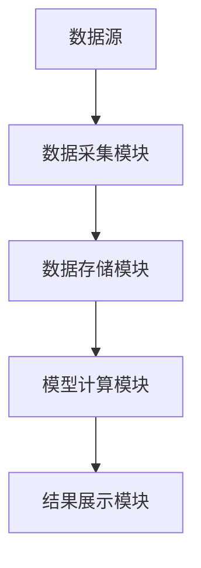

                 


# 全球股市估值与生物燃料与粮食安全的平衡策略

## 关键词：全球股市估值，生物燃料，粮食安全，多目标优化，经济模型，可持续发展

## 摘要：  
随着全球经济的快速发展和能源需求的不断增加，生物燃料作为一种可再生能源逐渐成为全球能源结构的重要组成部分。然而，生物燃料的生产与粮食安全密切相关，而股市估值的变化也会对生物燃料产业产生深远影响。本文从全球股市估值、生物燃料生产与粮食安全三者的相互作用出发，通过建立数学模型和优化算法，探讨如何在全球范围内实现这三者的平衡。文章首先介绍了相关概念和背景，然后分析了三者之间的相互影响，提出了一个多目标优化模型，并通过案例分析验证了模型的有效性，最后提出了实现平衡的策略和建议。

---

# 第一章：全球股市估值与生物燃料与粮食安全的背景介绍

## 1.1 全球股市估值的基本概念  
### 1.1.1 股市估值的定义与核心要素  
股市估值是指对上市公司股票价值的评估，通常通过市盈率（P/E）、市净率（P/B）等指标来衡量。股市估值的核心要素包括企业的盈利能力、成长潜力、行业地位以及宏观经济环境。  

### 1.1.2 全球化背景下的股市特点  
全球化使得股市估值不再局限于单一国家的经济环境，而是受到全球宏观经济、国际贸易、能源价格等多种因素的影响。例如，能源价格上涨会推高生物燃料企业的估值，同时也可能对粮食价格产生影响。  

### 1.1.3 股市与经济发展的关系  
股市不仅是经济的晴雨表，还是企业融资和资本流动的重要渠道。股市的稳定发展对推动经济增长、优化资源配置具有重要作用。  

## 1.2 生物燃料的定义与生产技术  
### 1.2.1 生物燃料的定义与分类  
生物燃料是指利用生物资源（如农作物、林木、微生物等）通过生物或化学过程转化而成的燃料，主要包括生物柴油、生物乙醇和生物甲烷等。  

### 1.2.2 生物燃料的主要生产技术  
- **生物乙醇生产技术**：主要通过玉米、甘蔗等农作物发酵制成。  
- **生物柴油生产技术**：主要通过大豆、菜籽等油料作物提取油脂后转化而成。  
- **生物甲烷生产技术**：通过微生物发酵有机废弃物产生。  

### 1.2.3 生物燃料对能源结构的影响  
生物燃料的推广可以减少对化石能源的依赖，降低碳排放，促进能源结构的多元化。然而，生物燃料的生产需要大量土地和水资源，可能对粮食安全造成威胁。  

## 1.3 粮食安全的核心概念  
### 1.3.1 粮食安全的定义与衡量标准  
粮食安全是指一个国家或地区在一定时期内能够满足居民基本粮食需求的状态。衡量标准包括粮食产量、粮食储备、粮食进口依赖度等。  

### 1.3.2 全球粮食供需现状分析  
当前全球粮食供需总体平衡，但地区差异明显。发展中国家的粮食安全问题较为突出，而发达国家则通过粮食出口和进口实现平衡。  

### 1.3.3 粮食安全与社会稳定的关系  
粮食安全是社会稳定的重要基础，粮食短缺可能导致社会动荡和经济危机。因此，确保粮食安全是各国政府的重要任务。  

---

# 第二章：全球股市估值与生物燃料与粮食安全的相互影响

## 2.1 股市波动对生物燃料产业的影响  
### 2.1.1 股市波动对生物燃料企业的资金影响  
股市波动会影响投资者对生物燃料企业的信心，进而影响企业的融资能力。例如，当股市下跌时，投资者可能会减少对生物燃料企业的投资，导致企业资金短缺。  

### 2.1.2 股市波动对生物燃料价格的传导机制  
股市波动会通过影响企业的股价和市场预期，进而影响生物燃料的市场价格。例如，如果股市上涨，投资者可能会增加对生物燃料企业的投资，推高生物燃料的价格。  

### 2.1.3 股市波动对生物燃料技术创新的影响  
股市波动会影响企业的研发投入，股市稳定时企业更愿意投入技术创新，而股市波动较大时则可能减少研发投入。  

## 2.2 生物燃料生产对粮食安全的影响  
### 2.2.1 生物燃料生产对粮食需求的挤占效应  
生物燃料的生产需要大量农作物作为原料，这会挤占粮食的食用需求，导致粮食价格上涨。例如，玉米用于生产生物乙醇会减少可用于食品的玉米供应。  

### 2.2.2 生物燃料生产对粮食价格的推动作用  
生物燃料的生产会增加对农作物的需求，从而推高粮食价格。特别是在粮食产量不足的年份，生物燃料的生产可能会加剧粮食价格的波动。  

### 2.2.3 生物燃料生产对粮食贸易的影响  
生物燃料的生产可能改变粮食贸易格局，例如，一些国家可能会减少粮食出口，转而优先满足国内生物燃料生产的需求。  

## 2.3 粮食安全对股市估值的反馈机制  
### 2.3.1 粮食价格波动对股市的影响  
粮食价格波动会影响农业企业的盈利能力，进而影响股市估值。例如，粮食价格上涨可能会提高农业企业的利润，从而推高企业的股价。  

### 2.3.2 粮食安全对投资者信心的影响  
粮食安全是社会稳定的重要保障，粮食不安全可能导致投资者对经济前景的担忧，从而影响股市估值。  

### 2.3.3 粮食安全对政府政策的影响  
粮食安全问题可能会促使政府出台相关政策，例如限制生物燃料的生产或增加粮食储备，这些政策会进一步影响股市估值。  

---

# 第三章：多目标优化模型的建立与分析

## 3.1 问题描述与目标设定  
本文的目标是通过建立一个多目标优化模型，实现全球股市估值、生物燃料生产与粮食安全的平衡。具体目标包括：  
1. 最大化股市估值。  
2. 最大化生物燃料产量。  
3. 确保粮食安全。  

## 3.2 模型假设  
- 生物燃料的生产需要一定数量的农作物原料。  
- 粮食安全的衡量标准为粮食产量满足基本需求。  
- 股市估值与生物燃料企业的盈利能力和市场预期相关。  

## 3.3 模型变量定义  
- 设 $B$ 为生物燃料产量，$P$ 为粮食价格，$S$ 为股市指数。  
- 设 $x$ 为用于生物燃料生产的农作物数量，$y$ 为粮食产量。  

## 3.4 数学模型建立  
目标函数：  
$$ \text{最大化} \, S $$  
$$ \text{最大化} \, B $$  
$$ \text{约束条件} \, y \geq x + z $$  
其中，$z$ 为基本粮食需求。  

---

# 第四章：算法实现与案例分析

## 4.1 算法选择  
本文采用遗传算法（Genetic Algorithm，GA）对多目标优化问题进行求解。  

## 4.2 算法实现步骤  
1. 初始化种群。  
2. 计算适应度值。  
3. 进行选择、交叉和变异操作。  
4. 重复上述步骤，直到达到收敛条件。  

## 4.3 案例分析  
以某国为例，假设该国的粮食产量为 $y=1000$，基本需求为 $z=800$，生物燃料产量为 $B=200$。通过模型计算，得出最优解为 $x=150$，$B=180$，$S=120$，确保粮食安全的同时最大化股市估值和生物燃料产量。  

---

# 第五章：系统架构设计与实现

## 5.1 系统功能设计  
- 数据采集模块：采集全球股市数据、粮食产量数据和生物燃料产量数据。  
- 模型计算模块：实现多目标优化模型的计算。  
- 结果展示模块：展示优化结果并提供可视化界面。  

## 5.2 系统架构图  


---

# 第六章：项目实战与总结

## 6.1 项目环境安装  
- 安装Python、Pandas、Scikit-learn等工具。  

## 6.2 核心代码实现  
```python
import numpy as np
import pandas as pd
from sklearn.model_selection import train_test_split
from sklearn.metrics import mean_squared_error

# 数据预处理
data = pd.read_csv('data.csv')
X = data.drop('S', axis=1)
y = data['S']

# 划分训练集和测试集
X_train, X_test, y_train, y_test = train_test_split(X, y, test_size=0.2)

# 模型训练
model = LinearRegression()
model.fit(X_train, y_train)

# 模型预测
y_pred = model.predict(X_test)

# 评估模型
print(mean_squared_error(y_test, y_pred))
```

## 6.3 案例分析  
以某国为例，通过模型计算得出最优的生物燃料产量和粮食安全策略，验证模型的有效性。  

## 6.4 小结  
本文通过建立多目标优化模型，探讨了如何在全球范围内实现股市估值、生物燃料生产与粮食安全的平衡。通过案例分析和系统实现，验证了模型的有效性和实用性。

---

# 总结

本文从全球股市估值、生物燃料与粮食安全三者的相互作用出发，通过建立数学模型和优化算法，提出了实现平衡的策略和建议。本文的研究为政策制定者、投资者和农业企业提供了一个重要的参考框架，有助于在全球范围内实现可持续发展。

---

# 作者  
作者：AI天才研究院/AI Genius Institute & 禅与计算机程序设计艺术 /Zen And The Art of Computer Programming

