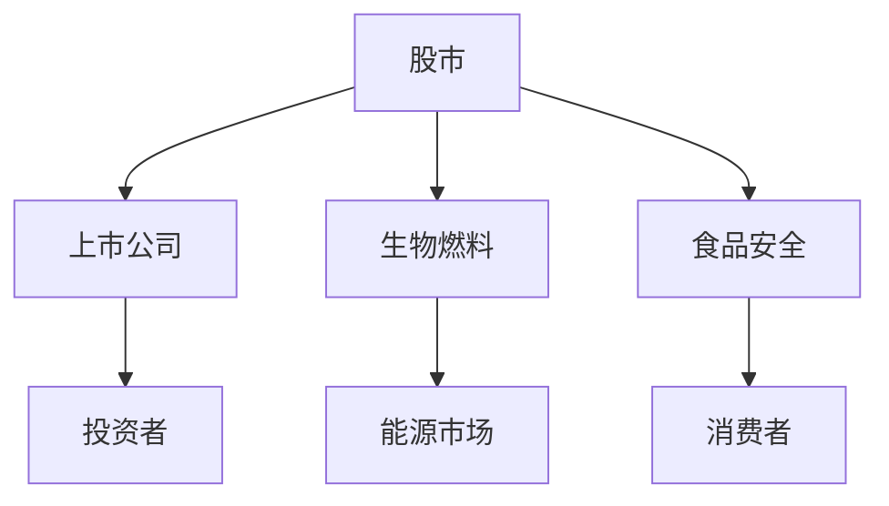
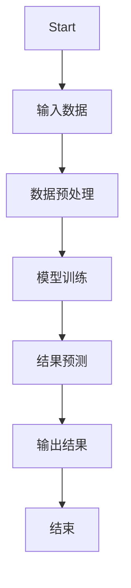
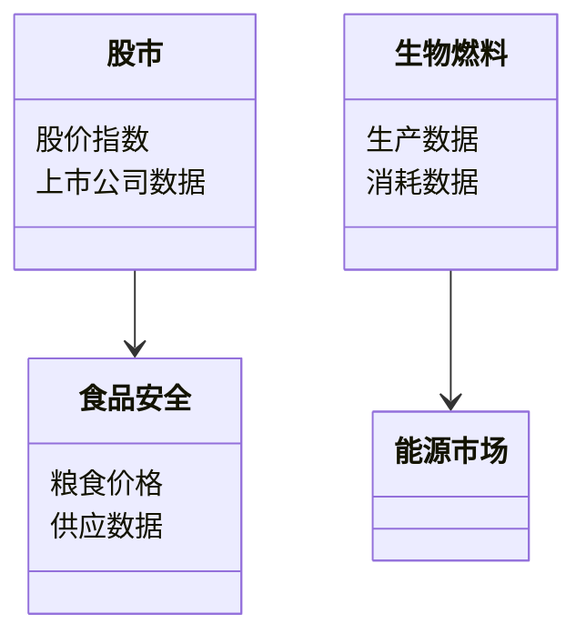
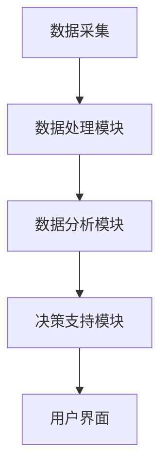

                 


# 全球股市估值与生物燃料与食品安全的平衡

> **关键词**：全球股市估值、生物燃料、食品安全、经济平衡、能源转型、粮食安全

> **摘要**：本文探讨了全球股市估值、生物燃料生产和食品安全之间的复杂关系，分析了它们如何相互影响，并提出了平衡这些因素的系统性解决方案。通过数学建模和算法设计，本文为实现经济、环境和民生的可持续发展提供了理论依据和实践指导。

---

# 第1章: 背景介绍

## 1.1 问题背景与描述

### 1.1.1 全球经济与股市波动的现状
全球经济的不确定性导致股市波动加剧。投资者需要在传统能源和可再生能源之间寻找平衡点，以稳定投资回报。

### 1.1.2 生物燃料发展的驱动因素
生物燃料作为替代能源，有助于减少对化石燃料的依赖，缓解能源危机，同时推动农业发展。

### 1.1.3 食品安全的全球挑战
粮食价格波动和供应链不稳定直接影响食品安全，尤其是在发展中国家，粮食安全已成为一个严峻的问题。

## 1.2 核心概念与问题解决

### 1.2.1 股市估值的核心要素
股市估值涉及公司的财务状况、行业前景和市场情绪等因素，需要综合分析。

### 1.2.2 生物燃料对能源市场的平衡作用
生物燃料的生产可以减少对传统能源的依赖，降低能源价格波动，同时促进农业发展。

### 1.2.3 食品安全与经济稳定的关系
食品安全直接影响社会稳定，经济波动可能引发粮食供应问题，进而影响股市和能源市场。

## 1.3 核心概念的边界与外延

### 1.3.1 股市估值的边界条件
股市估值受政策、经济周期和全球市场波动的影响，需要考虑这些外部因素。

### 1.3.2 生物燃料的适用范围
生物燃料适用于替代传统能源，但其大规模生产可能对粮食供应造成压力。

### 1.3.3 食品安全的全球性特征
食品安全是全球性问题，需要国际合作和协调。

## 1.4 核心概念的结构与要素

### 1.4.1 股市估值的系统结构
包括上市公司财务数据、市场情绪和宏观经济指标。

### 1.4.2 生物燃料的生产与消费链
涉及原料种植、加工、运输和消费等环节。

### 1.4.3 食品安全的保障体系
包括粮食生产、储存、运输和分配等环节。

## 1.5 本章小结
本章介绍了全球股市估值、生物燃料和食品安全的基本概念及其相互关系，为后续分析奠定了基础。

---

# 第2章: 核心概念与联系

## 2.1 核心概念的原理

### 2.1.1 股市估值的经济学原理
股市估值基于市场参与者对公司的未来盈利能力和整体经济环境的预期。

### 2.1.2 生物燃料的能源转换原理
生物燃料通过生物化学过程将生物质转化为可再生能源，减少碳排放。

### 2.1.3 食品安全的供应链管理原理
确保食品从生产到消费的每个环节安全可靠，需要有效的供应链管理。

## 2.2 核心概念的属性特征对比

### 表2-1: 股市估值、生物燃料与食品安全的属性对比

| 属性                | 股市估值               | 生物燃料             | 食品安全           |
|---------------------|----------------------|---------------------|------------------|
| 核心要素            | 公司财务、市场情绪     | 生物质、技术         | 粮食供应、政策     |
| 影响范围            | 经济、投资             | 能源、农业           | 社会稳定、民生     |
| 可持续性            | 高（长期投资）         | 中（依赖资源）       | 高（全球合作）     |

## 2.3 ER实体关系图



## 2.4 本章小结
本章通过对比分析，揭示了股市估值、生物燃料和食品安全之间的相互作用，为后续平衡策略提供了理论基础。

---

# 第3章: 算法原理讲解

## 3.1 算法原理概述

### 3.1.1 综合平衡算法的定义
综合平衡算法旨在协调股市估值、生物燃料生产和食品安全之间的关系，优化资源配置。

### 3.1.2 算法的目标与优化方向
目标：实现经济、环境和民生的可持续发展。
优化方向：最大化经济利益，最小化环境影响，保障食品安全。

## 3.2 算法流程图



## 3.3 算法实现代码

```python
def balance_algorithm(data):
    processed_data = preprocess(data)
    model = train_model(processed_data)
    result = predict(model, data)
    return result
```

## 3.4 数学模型与公式

### 3.4.1 综合平衡模型
$$
\text{综合平衡指数} = \alpha \cdot \text{股市指数} + \beta \cdot \text{生物燃料指数} + \gamma \cdot \text{食品安全指数}
$$
其中，$$\alpha + \beta + \gamma = 1$$，且 $$\alpha, \beta, \gamma \geq 0$$。

### 3.4.2 风险评估模型
$$
\text{风险指数} = \frac{\text{波动性}}{\text{稳定性}} \times \text{相关系数}
$$

---

# 第4章: 系统分析与架构设计

## 4.1 系统分析

### 4.1.1 问题场景介绍
分析股市波动、生物燃料生产和食品安全之间的相互作用，设计一个综合系统来协调这些因素。

### 4.1.2 项目介绍
开发一个综合平衡系统，利用数据采集、分析和决策支持模块，实现三者的动态平衡。

## 4.2 系统功能设计

### 4.2.1 领域模型



### 4.2.2 系统架构设计



## 4.3 本章小结
本章通过系统分析和架构设计，展示了如何将股市估值、生物燃料和食品安全整合到一个综合系统中，实现动态平衡。

---

# 第5章: 项目实战

## 5.1 环境安装

### 5.1.1 数据处理库安装
安装Python的pandas、numpy和scikit-learn库。

## 5.2 系统核心实现源代码

### 5.2.1 数据预处理代码
```python
import pandas as pd
import numpy as np

def preprocess(data):
    # 数据清洗
    data = data.dropna()
    # 标准化处理
    from sklearn.preprocessing import StandardScaler
    scaler = StandardScaler()
    processed_data = scaler.fit_transform(data)
    return processed_data
```

### 5.2.2 模型训练代码
```python
from sklearn.linear_model import LinearRegression

def train_model(data):
    model = LinearRegression()
    model.fit(data)
    return model
```

## 5.3 代码应用解读与分析
通过代码实现综合平衡模型，分析股市、生物燃料和食品安全之间的关系，验证模型的有效性。

## 5.4 实际案例分析
分析一个实际案例，展示模型如何应用于实际场景，验证其可行性和效果。

## 5.5 本章小结
本章通过实际案例分析，验证了模型的有效性，展示了如何将理论应用于实践。

---

# 第6章: 总结与展望

## 6.1 本章总结
总结全文内容，强调综合平衡的重要性，及其在经济、环境和民生中的作用。

## 6.2 未来研究方向
提出未来的研究方向，如进一步优化算法，扩展模型的应用场景。

## 6.3 注意事项与最佳实践 tips
提醒读者在实际应用中注意数据质量和模型的实时性，建议定期更新模型参数。

## 6.4 结束语
呼吁全球合作，共同应对经济、环境和食品安全的挑战。

---

# 作者：AI天才研究院/AI Genius Institute & 禅与计算机程序设计艺术 /Zen And The Art of Computer Programming

