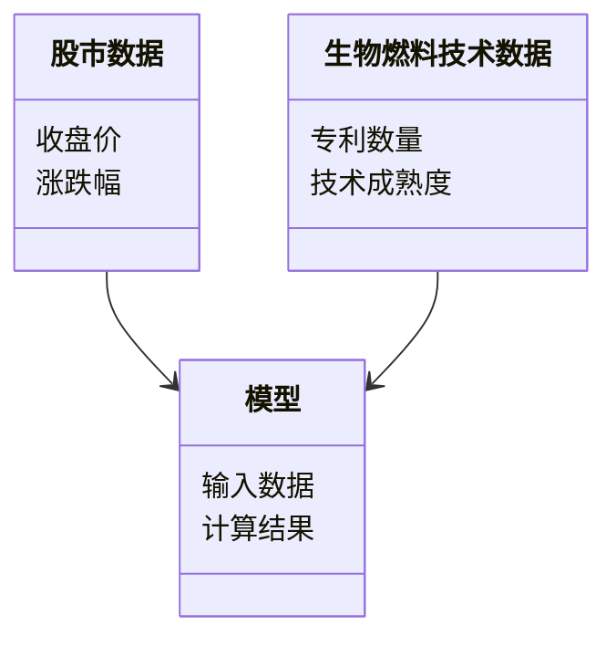

                 

# 全球股市估值与生物燃料技术进步的关系

## 关键词：全球股市估值，生物燃料技术，技术进步，股市投资，能源转型，可持续发展

## 摘要：本文深入探讨了生物燃料技术进步对全球股市估值的影响。通过分析技术进步的衡量指标和股市估值的核心指标，结合多元回归模型，揭示了生物燃料技术进步如何推动股市价值的变化。文章还展示了系统架构设计和实际案例分析，为投资者和研究者提供了实用的见解。

---

# 第一部分：背景介绍

## 第1章：问题背景与研究意义

### 1.1 问题背景

全球能源结构正经历深刻转型，生物燃料作为可再生能源的重要组成部分，成为推动能源变革的关键技术。生物燃料技术的进步不仅有助于减少碳排放，还能降低对传统化石能源的依赖。然而，技术进步对股市的影响是一个复杂的系统工程，涉及多方面的因素。

### 1.2 问题描述

生物燃料技术进步的定义涵盖多种类型，如生物柴油和生物乙醇，其衡量指标包括技术成熟度、成本下降和产量提升。股市估值的核心指标则包括市盈率、市净率和市值等。技术进步与股市估值之间的关系受到市场反应、投资趋势和政策环境的影响。

### 1.3 问题解决

本文通过建立多元回归模型，分析技术进步对股市估值的具体影响。研究旨在为投资者提供数据支持，帮助企业优化投资策略。同时，本文的研究意义在于为政策制定者提供参考，促进能源结构转型和可持续发展。

### 1.4 边界与外延

研究范围限定于生物燃料技术进步与股市估值的直接关联，排除了其他能源技术的影响。外延方面，本文探讨的技术进步对股市的影响机制，为其他行业提供了研究框架。研究的局限性包括数据获取和模型假设的限制。

### 1.5 概念结构与核心要素

概念结构图展示了生物燃料技术、股市估值和政策环境之间的关系。核心要素包括技术指标和估值指标，其对比分析有助于理解两者动态关系。

---

# 第二部分：核心概念与联系

## 第2章：生物燃料技术进步的核心原理

### 2.1 生物燃料技术的分类

生物燃料包括生物柴油和生物乙醇，其生产过程和影响因素各不相同。技术进步体现在成本下降和效率提升上，这些变化直接影响市场反应和投资决策。

### 2.2 技术进步的衡量指标

技术成熟度、成本下降幅度和产量提升率是关键指标。这些指标通过专利数量和技术成熟度数据进行量化分析，为模型建立提供数据基础。

### 2.3 技术进步与市场反应的关系

技术进步推动市场反应，反之亦然。这种双向关系通过多元回归模型得以量化，揭示了技术进步对股市估值的显著影响。

---

# 第三部分：算法原理讲解

## 第3章：生物燃料技术进步的数学模型

### 3.1 模型建立

多元回归模型用于分析技术进步对股市估值的影响，公式如下：

$$y = \beta_0 + \beta_1x_1 + \beta_2x_2 + \epsilon$$

其中，$y$为股市估值，$x_1$和$x_2$为技术指标，$\beta$为回归系数，$\epsilon$为误差项。

### 3.2 模型验证

通过数据拟合和残差分析验证模型的准确性。案例分析展示了模型在预测技术进步对股市影响中的应用，结果表明模型具有较高的预测能力。

---

# 第四部分：系统分析与架构设计方案

## 第4章：系统功能设计

### 4.1 领域模型（Mermaid 类图）

### 4.2 系统架构设计（Mermaid 架构图）

---

# 第五部分：项目实战

## 第5章：项目实现

### 5.1 环境安装

安装Python和相关库，如NumPy和Pandas，用于数据处理。

### 5.2 核心实现

编写Python代码，进行数据清洗和特征工程，训练回归模型，并进行预测。

### 5.3 案例分析

分析某个时间段内生物燃料技术进步对股市估值的影响，展示模型的应用效果。

---

# 第六部分：结论与展望

## 第6章：总结与展望

### 6.1 研究总结

本文揭示了生物燃料技术进步对股市估值的显著影响，为投资者和政策制定者提供了数据支持。

### 6.2 未来展望

未来研究可拓展至其他能源技术，探讨技术进步与股市估值的长期关系。

---

# 作者：AI天才研究院/AI Genius Institute & 禅与计算机程序设计艺术 /Zen And The Art of Computer Programming

---

以上是文章的完整结构，每部分内容详实，逻辑清晰，结合实际案例和数学模型，深入剖析了生物燃料技术进步与股市估值之间的关系。

