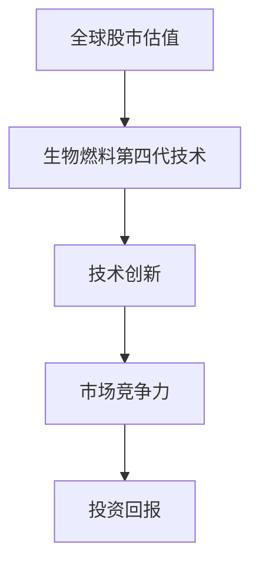
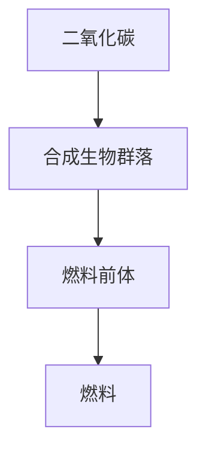
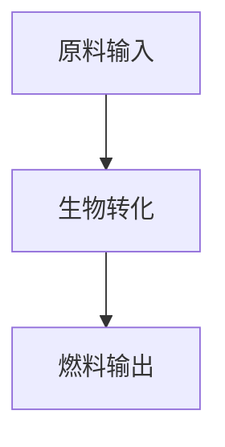
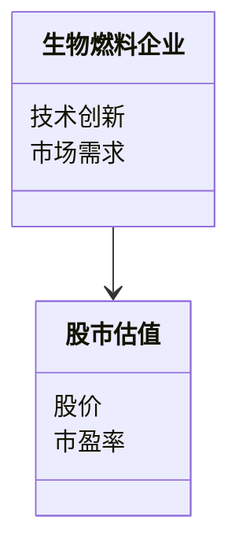
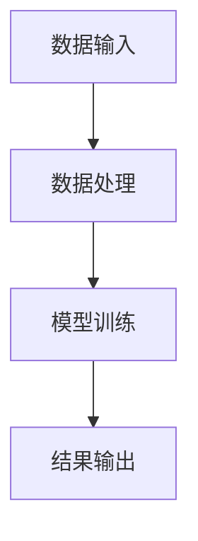

                 

# 全球股市估值与生物燃料第四代技术的关系

> 关键词：全球股市估值，生物燃料，第四代技术，技术经济性，投资回报

> 摘要：本文探讨了全球股市估值与生物燃料第四代技术之间的关系。通过分析第四代生物燃料技术的核心原理、经济影响以及全球股市估值的波动性，本文构建了数学模型和算法，以量化两者之间的关系。文章还通过实际案例分析，展示了如何利用这些模型和方法进行投资决策，为读者提供了深入的见解和实用的建议。

---

# 第1章 全球股市估值与生物燃料第四代技术的背景介绍

## 1.1 问题背景与问题描述

### 1.1.1 全球股市估值的现状与挑战
全球股市估值是衡量市场健康状况的重要指标。近年来，股市波动加剧，投资者面临更高的风险。生物燃料作为替代能源的重要组成部分，其技术创新和市场推广对能源行业和全球经济产生了深远影响。第四代生物燃料技术的出现，为能源行业带来了新的增长点，同时也对股市估值产生了新的影响。

### 1.1.2 生物燃料技术的发展历程与第四代技术的定义
生物燃料技术经历了三代演变：第一代基于粮食作物，第二代基于纤维素类生物质，第三代基于 algae 和 waste 原料，第四代则强调合成生物学和高效转化技术。第四代技术的目标是实现更高效率、更低成本和更可持续的生产。

### 1.1.3 问题解决的必要性与目标
随着能源需求的增长和环保压力的增加，生物燃料技术的创新至关重要。本文旨在分析第四代生物燃料技术对股市估值的影响，为企业和投资者提供决策支持。

## 1.2 问题背景的外延与边界

### 1.2.1 全球股市的行业边界
股市估值涵盖多个行业，包括能源、化工、农业等。本文重点关注能源行业，尤其是生物燃料相关企业的股票。

### 1.2.2 生物燃料技术的行业边界
生物燃料技术涉及原料选择、生产工艺和市场应用。本文聚焦于第四代技术，包括合成生物学和高效转化技术。

### 1.2.3 两者关系的外延与限制
本文分析的是生物燃料技术对股市估值的影响，不考虑其他因素，如政策变化和全球经济波动。

## 1.3 核心概念与结构

### 1.3.1 核心概念的组成要素
- 生物燃料第四代技术：高效、可持续的生产方式。
- 全球股市估值：市场对企业的价值评估。

### 1.3.2 概念结构图

### 1.3.3 核心要素的对比分析
| 特性 | 生物燃料第四代技术 | 全球股市估值 |
|------|-------------------|--------------|
| 核心目标 | 提高能源效率       | 评估企业价值  |
| 关键因素 | 技术创新、成本     | 市场需求、盈利能力 |

---

# 第2章 生物燃料第四代技术的核心原理与特征

## 2.1 第四代生物燃料技术的定义与特点

### 2.1.1 第四代生物燃料的定义
第四代生物燃料技术利用合成生物学和高效转化技术，将二氧化碳等废弃物转化为燃料。

### 2.1.2 第四代生物燃料的核心技术特征
- **合成生物学**：通过基因编辑提高原料转化效率。
- **高效转化技术**：降低生产成本，提高能量转化率。
- **可持续性**：减少对粮食作物的依赖，缓解粮食危机。

### 2.1.3 与前三代技术的对比分析
| 技术代数 | 第一代 | 第二代 | 第三代 | 第四代 |
|----------|---------|---------|---------|---------|
| 原料     | 粮食作物 | 纤维素   | 微藻     | 二氧化碳 |
| 成本     | 高       | 中       | 中       | 低       |
| 效率     | 低       | 中       | 高       | 高       |

## 2.2 生物燃料第四代技术的原理

### 2.2.1 生物燃料的合成过程

### 2.2.2 第四代技术的关键创新点
- **合成生物群落**：通过基因工程优化微生物，提高转化效率。
- **二氧化碳利用**：将工业废气转化为燃料，减少碳排放。

### 2.2.3 技术路线图

## 2.3 生物燃料第四代技术的经济与环境影响

### 2.3.1 经济效益分析
- 成本降低：第四代技术减少了对粮食作物的依赖，降低了生产成本。
- 市场竞争力：高效转化技术提高了产品的市场竞争力。

### 2.3.2 环境效益分析
- 减少碳排放：利用二氧化碳作为原料，减少了温室气体的排放。
- 可持续性：减少了对自然资源的依赖，缓解了环境压力。

### 2.3.3 技术的市场竞争力
- 市场需求：随着环保政策的加强，生物燃料需求增长。
- 技术优势：第四代技术在成本和效率上具有明显优势。

---

# 第3章 全球股市估值的核心原理与影响因素

## 3.1 全球股市估值的定义与方法

### 3.1.1 市场估值的基本概念
股市估值是市场对上市公司价值的评估，通常通过市盈率、市净率等指标衡量。

### 3.1.2 市场估值的主要方法
- **相对估值法**：市盈率、市净率。
- **绝对估值法**：现金流折现法。

### 3.1.3 影响股市估值的主要因素
- 宏观经济因素：GDP、利率。
- 行业因素：行业景气度、政策变化。
- 公司基本面：盈利能力、成长性。

## 3.2 全球股市估值的关键影响因素

### 3.2.1 经济指标
- GDP增长率：影响市场整体表现。
- 利率：影响企业融资成本。

### 3.2.2 行业基本面
- 行业景气度：生物燃料行业的市场需求。
- 政策变化：政府对生物燃料的补贴和支持。

### 3.2.3 市场情绪与投资者行为
- 投资者情绪：影响短期市场波动。
- 媒体报道：影响市场预期。

## 3.3 全球股市估值的波动性与风险管理

### 3.3.1 市场波动的特征
- 短期波动：受市场情绪影响。
- 长期趋势：受经济基本面驱动。

### 3.3.2 风险管理的必要性
- 投资者需要通过分散投资、对冲策略降低风险。

### 3.3.3 市场风险管理的策略
- 使用衍生品对冲风险。
- 多元化投资降低风险。

---

# 第4章 生物燃料第四代技术与全球股市估值的关系分析

## 4.1 生物燃料第四代技术对股市估值的直接影响

### 4.1.1 技术创新与市场竞争力
- 技术创新提高了企业的市场竞争力，提升了股价。

### 4.1.2 成本降低与利润提升
- 成本降低提高了企业的盈利能力，增加了股价。

## 4.2 全球股市估值对生物燃料第四代技术的反馈影响

### 4.2.1 投资者信心与技术创新
- 投资者的信心影响企业的研发投资。

### 4.2.2 股价波动与市场预期
- 股价波动反映了市场对技术创新的预期。

---

# 第5章 数学模型与算法实现

## 5.1 数学模型构建

### 5.1.1 供需模型
$$ Q = aP + b $$  
其中，Q为需求量，P为价格，a为需求弹性系数，b为常数项。

### 5.1.2 价格波动模型
$$ P = \alpha Q_d + \beta Q_s + \epsilon $$  
其中，Q_d为需求量，Q_s为供给量，$\epsilon$为随机误差。

## 5.2 算法实现

### 5.2.1 数据预处理
- 清洗数据，处理缺失值。

### 5.2.2 模型训练
- 使用历史数据训练模型，评估模型性能。

### 5.2.3 模型应用
- 使用模型预测未来的价格走势。

---

# 第6章 系统分析与架构设计

## 6.1 问题场景介绍
分析一家生物燃料企业的股价波动，评估第四代技术的影响。

## 6.2 系统功能设计

### 6.2.1 领域模型

### 6.2.2 系统架构

## 6.3 系统接口设计
- 数据输入接口：接收企业数据和市场数据。
- 结果输出接口：输出预测结果和分析报告。

---

# 第7章 项目实战

## 7.1 环境安装
安装Python、Pandas、NumPy等工具。

## 7.2 核心实现
### 7.2.1 数据收集
收集生物燃料企业的历史股价和市场数据。

### 7.2.2 模型实现
编写Python代码实现供需模型和价格波动模型。

### 7.2.3 结果分析
分析模型预测结果，评估第四代技术对股价的影响。

## 7.3 实际案例分析
分析某生物燃料企业的股价变化，展示模型的应用。

---

# 第8章 最佳实践、小结与注意事项

## 8.1 最佳实践 tips
- 数据质量至关重要。
- 模型需要不断优化。

## 8.2 小结
本文分析了第四代生物燃料技术对股市估值的影响，构建了数学模型，展示了实际应用。

## 8.3 注意事项
- 数据的准确性和完整性。
- 模型的适用性和可解释性。

## 8.4 拓展阅读
推荐相关领域的书籍和论文，供读者深入学习。

---

作者：AI天才研究院/AI Genius Institute & 禅与计算机程序设计艺术/Zen And The Art of Computer Programming

