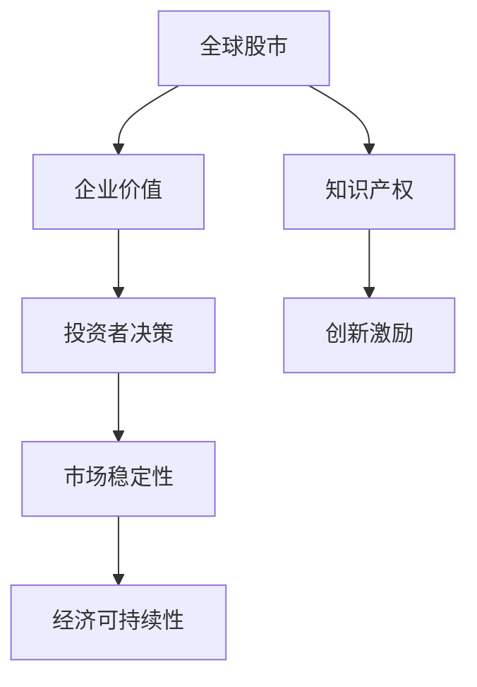
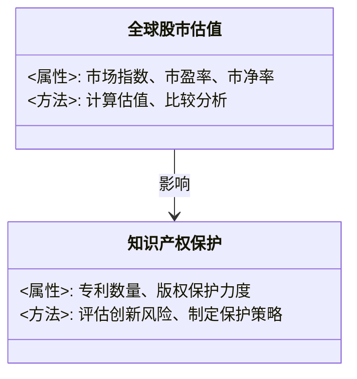
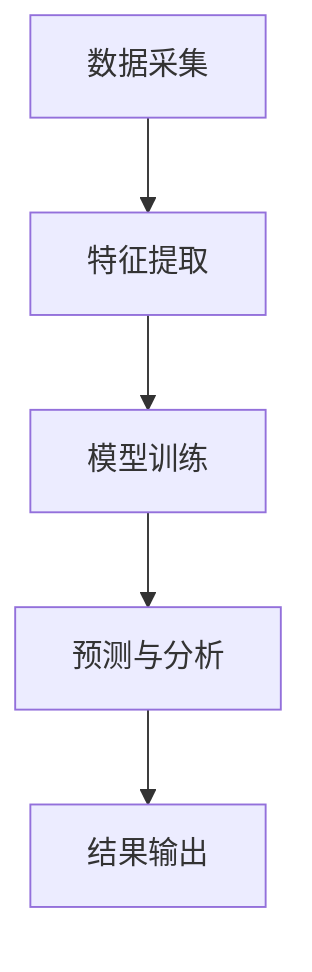
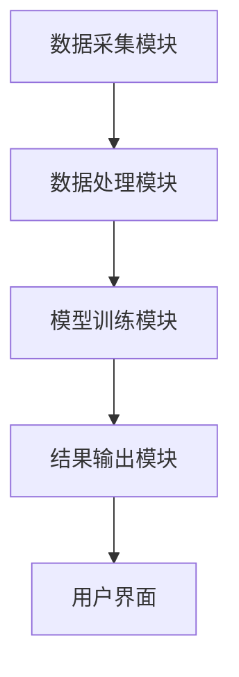
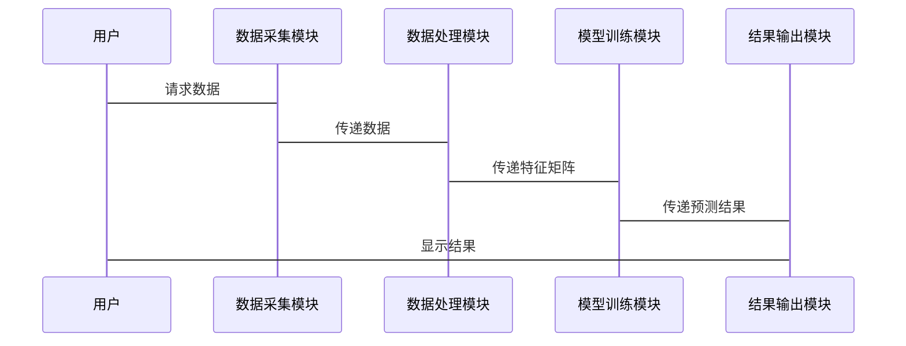

                 


# 全球股市估值与知识产权保护的关联

> 关键词：全球股市估值、知识产权保护、投资策略、经济模型、数据分析

> 摘要：本文探讨了全球股市估值与知识产权保护之间的内在联系，通过理论分析、系统架构设计、算法模型构建以及实际案例分析，揭示知识产权保护如何影响企业价值和股市表现，为投资者和政策制定者提供参考。

---

# 第一部分：全球股市估值与知识产权保护的背景与概念

## 第1章：全球股市估值与知识产权保护的背景介绍

### 1.1 问题背景与概念界定

#### 1.1.1 全球股市估值的核心问题
- 全球股市估值是衡量企业价值的重要指标，涉及市盈率、市净率、EV/EBITDA等关键指标。
- 企业价值的核心驱动因素包括盈利能力、成长性、资产质量等，而知识产权作为无形资产，对这些因素有重要影响。

#### 1.1.2 知识产权保护的基本概念
- 知识产权包括专利、商标、版权、商业秘密等，是企业核心竞争力的重要组成部分。
- 知识产权保护通过法律手段确保创新成果的合法性和排他性，激励企业加大研发投入。

#### 1.1.3 问题背景的边界与外延
- 本研究仅关注知识产权保护对股市估值的直接影响，不涉及其他因素（如货币政策、宏观经济指标）。
- 研究范围包括全球主要股市（如纳斯达克、纽交所、港交所）和重点行业（如科技、制药、软件）。

#### 1.1.4 核心概念结构与要素组成
- 核心概念：企业价值（EV）、知识产权保护强度（IP保护强度）、市场风险（Market Risk）。
- 关联因素：技术创新、法律环境、行业竞争格局。

### 1.2 问题解决路径

#### 1.2.1 问题解决的逻辑框架
1. 理论分析：揭示知识产权保护与企业价值之间的关系。
2. 数据分析：利用历史数据验证假设。
3. 模型构建：建立数学模型，量化知识产权保护对股市估值的影响。
4. 实证研究：通过实际案例验证模型的有效性。

#### 1.2.2 可行性分析与方法论选择
- 数据可行性：全球股市数据和知识产权保护指数（如WIPO指标）均可获取。
- 方法论：采用回归分析和机器学习算法（如随机森林）进行建模。

---

# 第二部分：全球股市估值与知识产权保护的核心理论

## 第2章：全球股市估值与知识产权保护的核心概念与联系

### 2.1 核心概念的原理分析

#### 2.1.1 全球股市估值的理论基础
- 市盈率（P/E）= 股价 / 每股净利润。
- 市净率（P/B）= 股价 / 每股净资产。
- 企业价值（EV）= 企业市值 + 债务 - 现金。

#### 2.1.2 知识产权保护的法律与经济属性
- 法律属性：通过专利法、版权法等保护创新成果。
- 经济属性：知识产权保护影响企业的研发投入和市场竞争力。

#### 2.1.3 两者的核心联系与区别
- 联系：知识产权保护影响企业的技术创新能力，进而影响企业价值和股市估值。
- 区别：股市估值是结果，知识产权保护是驱动因素。

### 2.2 核心概念的属性特征对比

#### 2.2.1 对比分析表格

| 属性 | 全球股市估值 | 知识产权保护 |
|------|------------|-------------|
| 核心目标 | 评估企业价值 | 保护创新成果 |
| 主要影响因素 | 市场需求、财务状况 | 法律政策、技术门槛 |
| 实施主体 | 投资者、机构 | 政府、企业 |

#### 2.2.2 图表化展示（Mermaid）



---

# 第三部分：全球股市估值与知识产权保护的系统分析

## 第3章：全球股市估值与知识产权保护的系统架构

### 3.1 问题场景介绍

#### 3.1.1 全球化视角下的股市特点
- 美国股市（如纳斯达克）以高科技企业为主，知识产权保护力度强。
- 中国股市（如创业板）近年来加大对创新企业的支持。

#### 3.1.2 知识产权保护的区域差异
- 美国、欧盟的知识产权保护体系完善，新兴市场（如印度、东南亚）还在完善中。

### 3.2 系统功能设计

#### 3.2.1 领域模型（Mermaid）



### 3.3 算法原理讲解

#### 3.3.1 算法流程（Mermaid）



#### 3.3.2 算法实现（Python代码）

```python
import numpy as np
import pandas as pd
from sklearn.ensemble import RandomForestRegressor
from sklearn.metrics import mean_squared_error

# 示例数据：假设我们有专利数量、市盈率、市净率等特征
data = pd.DataFrame({
    '专利数量': [100, 200, 150, 300],
    '市盈率': [20, 30, 25, 35],
    '市净率': [5, 6, 4, 7],
    'EV': [1000, 1500, 1200, 1800]
})

# 特征矩阵和标签
X = data[['专利数量', '市盈率', '市净率']]
y = data['EV']

# 模型训练
model = RandomForestRegressor(n_estimators=100)
model.fit(X, y)

# 预测
y_pred = model.predict(X)
print(f"预测EV: {y_pred}")
print(f"均方误差: {mean_squared_error(y, y_pred)}")
```

#### 3.3.3 数学模型与公式

- 线性回归模型：
$$ EV = \beta_0 + \beta_1 \times \text{专利数量} + \epsilon $$
- 随机森林模型：
$$ EV = \sum_{i=1}^{n} \text{特征权重} \times \text{特征值} $$

---

# 第四部分：全球股市估值与知识产权保护的解决方案

## 第4章：解决方案与实施策略

### 4.1 问题解决策略

#### 4.1.1 数据采集与处理
- 数据源：全球主要股市的历史数据和知识产权保护指数。
- 数据清洗：处理缺失值、异常值。

#### 4.1.2 模型构建与验证
- 采用回归分析和机器学习算法（如随机森林）进行建模。
- 通过交叉验证评估模型性能。

### 4.2 技术实现

#### 4.2.1 系统架构设计（Mermaid）



#### 4.2.2 系统交互设计（Mermaid）



---

# 第五部分：结论与展望

## 第5章：结论与展望

### 5.1 核心结论

- 知识产权保护对全球股市估值有显著影响，尤其是在科技和制药行业。
- 通过数学模型可以量化知识产权保护对股市估值的贡献。

### 5.2 未来展望

- 进一步研究不同地区的知识产权保护政策对股市估值的影响。
- 结合更多数据源（如企业研发投入、专利质押融资）进行更深入的分析。

---

# 附录

## 附录A：相关术语解释

- EV：企业价值（Enterprise Value）。
- EBITDA：息税折旧及摊销前利润（Earnings Before Interest, Taxes, Depreciation, and Amortization）。

## 附录B：代码实现

```python
import numpy as np
import pandas as pd
from sklearn.ensemble import RandomForestRegressor
from sklearn.metrics import mean_squared_error

# 示例数据：假设我们有专利数量、市盈率、市净率等特征
data = pd.DataFrame({
    '专利数量': [100, 200, 150, 300],
    '市盈率': [20, 30, 25, 35],
    '市净率': [5, 6, 4, 7],
    'EV': [1000, 1500, 1200, 1800]
})

# 特征矩阵和标签
X = data[['专利数量', '市盈率', '市净率']]
y = data['EV']

# 模型训练
model = RandomForestRegressor(n_estimators=100)
model.fit(X, y)

# 预测
y_pred = model.predict(X)
print(f"预测EV: {y_pred}")
print(f"均方误差: {mean_squared_error(y, y_pred)}")
```

---

作者：AI天才研究院/AI Genius Institute & 禅与计算机程序设计艺术 /Zen And The Art of Computer Programming

