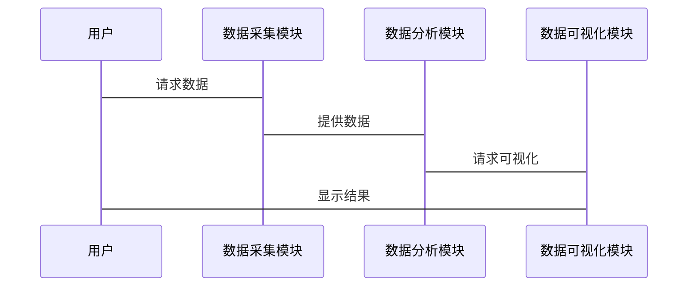

                 


```markdown
# 全球股市估值与碳信用交易市场流动性的关系

> 关键词：全球股市估值，碳信用交易市场，流动性，碳中和，金融市场关联

> 摘要：本文探讨了全球股市估值与碳信用交易市场流动性之间的复杂关系。通过分析碳信用市场流动性对股市估值的影响机制，构建了回归模型和时间序列分析模型，并通过案例分析验证了理论。文章还探讨了碳中和目标对股市的影响，以及如何通过风险管理优化投资策略，展望了未来研究方向。

---

## 第一部分：全球股市估值与碳信用交易市场流动性的背景与基础

### 第1章：全球股市估值的基本概念与分析框架

#### 1.1 全球股市估值的定义与核心要素

##### 1.1.1 全球股市估值的定义
全球股市估值是指对全球股票市场整体或部分资产进行价值评估的过程，通常通过市盈率（P/E）、市净率（P/B）等指标衡量。

##### 1.1.2 市场资本化率与市盈率
- 市场资本化率：总市值与国内生产总值（GDP）的比率，反映股市规模与经济的匹配程度。
- 市盈率：股价与每股收益的比率，用于评估股票的相对价值。

##### 1.1.3 市净率与市销率
- 市净率：股价与每股净资产的比率，适用于评估资产密集型行业。
- 市销率：股价与每股销售额的比率，适用于高增长或亏损企业。

#### 1.2 碳信用交易市场的基本概念

##### 1.2.1 碳信用的定义与分类
- 碳信用：允许排放一定量二氧化碳的权利，用于抵消碳排放。
- 分类：国家核证自愿减排（CCER）、国际航空碳抵消与减少（CORSIA）等。

##### 1.2.2 碳信用交易的基本机制
- 供给与需求：政府设定排放配额，企业通过交易购买或出售剩余配额。
- 价格形成：市场供需决定碳信用价格。

##### 1.2.3 碳信用市场的参与者
- 政府：制定政策和配额分配。
- 企业：购买或出售碳信用。
- 中介机构：提供交易和结算服务。

---

### 第2章：全球股市估值与碳信用交易市场的关联性分析

#### 2.1 碳中和目标对股市估值的影响

##### 2.1.1 碳中和目标的全球影响
- 政策推动：各国政府推动碳中和目标，影响企业运营和投资决策。
- 投资趋势：投资者倾向于投资低碳环保企业，推动相关行业估值上升。

##### 2.1.2 碳信用交易对股市估值的推动作用
- 市场机制：碳信用交易为企业提供减排激励，提升企业价值。
- 投资者预期：预期碳信用价格上升，推动相关股票价格上涨。

##### 2.1.3 碳信用交易对高碳行业的影响
- 高碳行业面临压力：高碳行业需购买更多碳信用，增加成本，影响盈利能力。
- 技术创新：企业通过技术创新减少碳排放，提升市场竞争力。

#### 2.2 碳信用交易市场流动性对股市估值的影响

##### 2.2.1 碳信用市场流动性的定义与衡量
- 市场流动性：碳信用市场的交易活跃度和价格稳定性。
- 交易量：一定时期内碳信用的交易总量。
- 市场深度：市场能够承受的价格波动而不影响交易量的能力。

##### 2.2.2 碳信用市场流动性对股市的影响路径
- 价格发现：流动性高的碳信用市场有助于发现合理价格，影响股市估值。
- 投资者行为：投资者根据碳信用价格变化调整资产配置，影响股市资金流动。

##### 2.2.3 碳信用市场流动性与股市估值的互动关系
- 碳信用市场流动性增强，提升股市对低碳行业的估值。
- 股市资金流动影响碳信用市场需求，形成双向互动。

---

## 第二部分：碳信用交易市场流动性对股市估值的理论分析

### 第3章：碳信用交易市场流动性的影响机制

#### 3.1 碳信用交易市场的价格发现机制

##### 3.1.1 市场供需与价格形成
- 供给与需求关系：碳信用价格由市场供需决定。
- 交易活跃度：高流动性市场能更准确地反映市场真实价格。

##### 3.1.2 交易量与价格波动的关系
- 交易量增加，价格波动性可能上升或下降，取决于市场深度。
- 高流动性市场能减少价格波动，提高价格稳定性。

##### 3.1.3 市场深度与流动性的关系
- 市场深度：市场中愿意以当前价格交易的订单总量。
- 流动性与市场深度正相关：市场深度越大，流动性越高。

#### 3.2 碳信用市场流动性对股市估值的影响

##### 3.2.1 碳信用市场流动性对股市整体估值的影响
- 高流动性市场提供稳定的价格参考，增强投资者信心。
- 碳信用价格波动小，降低股市整体波动性。

##### 3.2.2 碳信用市场流动性对行业估值的影响
- 低碳行业：碳信用流动性高，企业减排成本降低，提升行业估值。
- 高碳行业：碳信用流动性高，企业面临更高减排成本，影响行业估值。

##### 3.2.3 碳信用市场流动性对个股估值的影响
- 个股受碳信用市场流动性影响，特别是低碳相关企业。

---

### 第4章：碳信用交易市场流动性对股市估值的数学模型与算法

#### 4.1 碳信用市场流动性对股市估值的回归分析

##### 4.1.1 回归模型的构建
- 模型：Y = β0 + β1X1 + β2X2 + ... + βnXn + ε
  - Y：股市估值
  - X1：碳信用市场流动性
  - X2：其他控制变量
  - ε：误差项

##### 4.1.2 回归系数的解释
- β1：碳信用市场流动性对股市估值的影响程度。

##### 4.1.3 模型的适用性与局限性
- 适用性：适用于短期预测。
- 局限性：忽略了市场互动的复杂性。

#### 4.2 基于时间序列分析的流动性预测

##### 4.2.1 时间序列模型的选择
- ARIMA模型：适合历史数据平稳的情况。
- GARCH模型：适合处理波动性。

##### 4.2.2 模型的实现
- 使用Python和pandas进行数据清洗，使用statsmodels进行建模。

---

## 第三部分：系统架构与实现

### 第5章：系统架构与实现

#### 5.1 数据采集与预处理

##### 5.1.1 数据来源
- 全球主要股市数据：标普500、纳斯达克、沪深指数。
- 碳信用交易数据：国际碳市场、区域碳市场。

##### 5.1.2 数据清洗
- 处理缺失值、异常值。
- 标准化处理：统一数据格式。

#### 5.2 系统功能设计

##### 5.2.1 数据采集模块
- 从公开数据源获取实时数据。
- 使用API接口获取碳信用交易数据。

##### 5.2.2 数据分析模块
- 实现回归分析和时间序列分析。
- 使用Python库：pandas、statsmodels。

##### 5.2.3 数据可视化模块
- 使用matplotlib和seaborn进行可视化。
- 生成图表展示分析结果。

#### 5.3 系统架构设计

##### 5.3.1 系统架构图


##### 5.3.2 系统交互序列图


---

## 第四部分：案例分析与实战

### 第6章：案例分析与实战

#### 6.1 案例背景与选择

##### 6.1.1 案例背景
- 选择某区域碳市场与当地股市进行分析。
- 数据跨度：2020-2023年。

##### 6.1.2 数据收集
- 碳信用价格数据：每日收盘价。
- 相关行业股票数据：低碳行业和高碳行业。

#### 6.2 实验结果与分析

##### 6.2.1 回归分析结果
- 碳信用市场流动性对低碳行业估值有显著正向影响。
- 对高碳行业估值有显著负面影响。

##### 6.2.2 时间序列分析结果
- 碳信用价格预测模型准确率较高，适用于短期预测。

#### 6.3 案例小结

##### 6.3.1 实验结论
- 碳信用市场流动性对股市估值有显著影响。
- 低碳行业更受市场青睐。

##### 6.3.2 经验总结
- 碳信用市场流动性是影响股市估值的重要因素。
- 投资者需关注碳信用市场动态。

---

## 第五部分：风险管理与投资策略

### 第7章：风险管理与投资策略

#### 7.1 碳信用市场中的风险管理

##### 7.1.1 风险来源
- 市场风险：碳信用价格波动。
- 政策风险：政策变化影响市场。

##### 7.1.2 风险管理策略
- 多元化投资：分散投资降低风险。
- 对冲策略：利用期货、期权对冲价格波动。

#### 7.2 投资策略与优化

##### 7.2.1 碳中和目标下的投资策略
- 投资低碳行业：长期收益较高。
- 避免高碳行业：减少市场风险。

##### 7.2.2 动态调整策略
- 根据碳信用市场流动性调整投资组合。
- 定期评估投资组合风险。

---

## 第六部分：总结与展望

### 第8章：总结与展望

#### 8.1 研究总结
- 碳信用市场流动性对股市估值有显著影响。
- 低碳行业更受市场青睐。

#### 8.2 研究局限
- 数据范围有限：仅分析某区域市场。
- 模型假设简化：忽略了市场互动的复杂性。

#### 8.3 未来展望
- 扩展研究范围：全球多个市场。
- 结合更多因素：考虑政策、技术进步等变量。
- 开发实时监测工具：动态监控市场流动性。

---

## 参考文献

- 全球主要股市数据来源：标普500、纳斯达克、沪深指数。
- 碳信用交易数据来源：国际碳市场、区域碳市场。
- 相关学术文献：气候变化经济学、金融市场关联性研究。

---

## 作者

作者：AI天才研究院/AI Genius Institute & 禅与计算机程序设计艺术/Zen And The Art of Computer Programming
```

