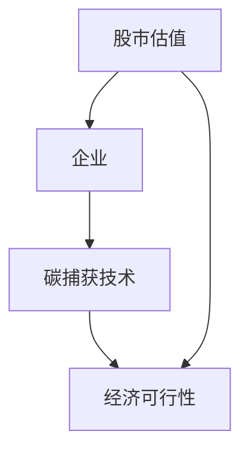
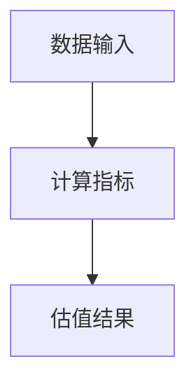

                 

# 全球股市估值与碳捕获与封存技术的经济可行性

> **关键词**：股市估值、碳捕获、碳封存、经济可行性、技术经济分析

> **摘要**：  
本文探讨了全球股市估值与碳捕获与封存技术的经济可行性之间的关系。通过对股市估值的核心概念和碳捕获技术的经济分析，本文构建了一个综合框架，分析碳捕获技术如何影响股市估值，并为企业投资和政策制定提供参考。

---

## 第一部分: 全球股市估值与碳捕获与封存技术的背景介绍

### 第1章: 全球股市估值与碳捕获技术的背景介绍

#### 1.1 全球股市估值的基本概念
- **股市估值**是通过对企业的财务数据和市场指标进行分析，评估企业股票的合理价格范围。常用指标包括市盈率（P/E）、市净率（P/B）等。
- 股市估值受到宏观经济环境、行业趋势、企业盈利能力等多种因素的影响。
- 股市估值的核心是预测企业的未来现金流，评估其内在价值。

#### 1.2 碳捕获与封存技术的基本概念
- **碳捕获与封存技术**（Carbon Capture and Storage，CCS）是指将二氧化碳从工业或能源生产过程中分离出来，并将其封存在地下或转化为其他用途的技术。
- 碳捕获技术的核心是通过化学反应或物理分离方法捕获二氧化碳，封存技术则涉及将二氧化碳储存于地质构造中，避免其释放到大气中。
- 碳捕获技术的应用有助于减少温室气体排放，支持全球碳中和目标的实现。

#### 1.3 问题背景与问题描述
- 碳捕获技术的经济可行性是实现全球碳中和目标的关键因素。高成本和技术不确定性是当前的主要挑战。
- 全球股市估值与碳捕获技术密切相关，碳捕获技术的商业化将影响相关企业的股票价值和市场表现。

### 第2章: 全球股市估值与碳捕获技术的核心概念与联系

#### 2.1 核心概念原理
- 股市估值的原理是通过分析企业的财务状况和市场环境，评估其股票的内在价值。
- 碳捕获技术的原理是通过物理或化学方法捕获二氧化碳，并将其封存或再利用。

#### 2.2 核心概念属性特征对比
| 属性       | 股市估值                          | 碳捕获技术                      |
|------------|-----------------------------------|---------------------------------|
| 核心目标    | 评估企业股票价值                  | 减少二氧化碳排放                |
| 主要影响因素 | 宏观经济、行业趋势、企业盈利      | 技术成本、政策支持、市场需求  |
| 应用领域    | 投资决策、风险管理              | 工业生产、能源领域、环境保护  |

#### 2.3 ER实体关系图

---

## 第二部分: 全球股市估值的算法原理与数学模型

### 第3章: 股市估值的算法原理与数学模型

#### 3.1 股市估值的算法原理

#### 3.2 数学模型与公式
- **市盈率（P/E）模型**  
  $$ P/E = \frac{\text{股价}}{\text{每股收益}} $$
- **市净率（P/B）模型**  
  $$ P/B = \frac{\text{股价}}{\text{每股净资产}} $$
- **现金流折现模型（DCF）**  
  $$ \text{企业价值} = \sum_{t=1}^{n} \frac{\text{自由现金流}}{(1 + r)^t} $$

---

## 第三部分: 碳捕获与封存技术的经济可行性分析

### 第4章: 碳捕获与封存技术的经济可行性分析

#### 4.1 碳捕获技术的经济可行性框架
- 碳捕获技术的成本包括捕获、运输和封存三个环节。
- 碳捕获技术的收益主要来自政府补贴、碳交易市场和潜在的商业化应用。

#### 4.2 碳捕获技术的经济模型
- **总成本模型**  
  $$ \text{总成本} = \text{捕获成本} + \text{运输成本} + \text{封存成本} $$
- **净收益模型**  
  $$ \text{净收益} = \text{收益} - \text{总成本} $$

#### 4.3 经济可行性分析的案例
- 某公司碳捕获项目案例：捕获成本为每吨二氧化碳50美元，政府补贴为每吨30美元，碳交易价格为每吨40美元。
- 净收益 = (40 - 50) + 30 = 20美元/吨，项目具有经济可行性。

---

## 第四部分: 全球股市估值与碳捕获技术的综合分析

### 第5章: 综合分析与投资策略

#### 5.1 碳捕获技术对股市估值的影响
- 碳捕获技术的商业化将提升相关企业的市场竞争力，提高其股票估值。
- 政府政策支持和碳交易市场的活跃将推动碳捕获技术相关股票的上涨。

#### 5.2 投资策略建议
- 投资者应关注碳捕获技术的商业化进展和政策支持。
- 优先选择具有技术优势和成本优势的企业。

---

## 第五部分: 结论与展望

### 第6章: 结论与展望

#### 6.1 主要结论
- 碳捕获技术的经济可行性是实现全球碳中和目标的关键。
- 全球股市估值与碳捕获技术密切相关，投资者应关注技术进展和政策变化。

#### 6.2 未来展望
- 碳捕获技术的成本将进一步降低，应用场景将更加广泛。
- 全球股市将更加关注企业的碳排放表现和技术创新能力。

---

## 作者：AI天才研究院/AI Genius Institute & 禅与计算机程序设计艺术 /Zen And The Art of Computer Programming

