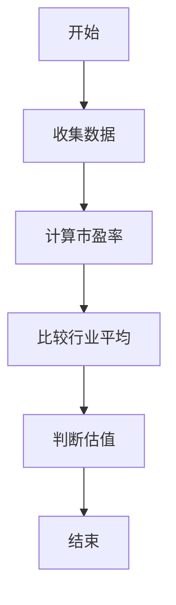
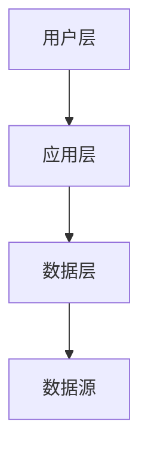

                 


# 全球股市估值与碳捕获与封存技术的经济可行性

> 关键词：全球股市估值、碳捕获与封存、经济可行性、股市模型、碳技术经济性

> 摘要：本文探讨全球股市估值与碳捕获与封存技术的经济可行性，分析股市估值的核心概念与影响因素，构建股市估值的数学模型与算法，探讨碳捕获与封存技术的原理与经济性，构建经济模型，分析两者之间的关系，并提出政策建议。

---

# 第一部分: 全球股市估值与碳捕获与封存技术的经济可行性概述

## 第1章: 全球股市估值的基本概念与影响因素

### 1.1 股市估值的基本概念

#### 1.1.1 股市估值的定义与核心要素

股市估值是指对股票或整个股市的价值进行评估的过程。其核心要素包括：

- **股票价格**：反映市场对公司的价值预期。
- **市场指数**：如道琼斯指数、标普500等，反映整体市场表现。
- **市盈率（P/E）**：衡量股票价格与每股收益的比例。
- **市净率（P/B）**：衡量股票价格与每股净资产的比例。

#### 1.1.2 股市估值的常见指标

| 指标名称   | 定义                                                                 |
|------------|----------------------------------------------------------------------|
| 市盈率（P/E）| 股票价格 / 每股收益                                               |
| 市净率（P/B）| 股票价格 / 每股净资产                                             |
| 市销率（P/S）| 股票价格 / 每股收入                                               |

#### 1.1.3 股市估值的分类与应用场景

- **绝对估值**：基于公司基本面数据计算内在价值，如现金流折现法（DCF）。
- **相对估值**：通过比较同类股票的估值指标，如市盈率、市净率等。

---

### 1.2 股市估值的影响因素

#### 1.2.1 宏观经济因素

- **GDP增长**：GDP增长通常带动股市上涨。
- **利率水平**：低利率环境通常有利于股市估值上升。
- **通货膨胀**：高通胀可能导致股市估值下降。

#### 1.2.2 行业因素

- **行业周期**：周期性行业（如能源、制造业）的估值受行业周期影响较大。
- **行业政策**：政府政策对行业估值有重要影响。

#### 1.2.3 公司基本面因素

- **盈利能力**：净利润率、ROE等指标影响估值。
- **成长性**：高成长性公司通常有更高的估值。

---

## 第2章: 碳捕获与封存技术的基本原理与经济性

### 2.1 碳捕获与封存技术的定义

#### 2.1.1 碳捕获技术的原理

碳捕获技术通过化学或物理方法从工业排放中分离二氧化碳，主要技术包括：

- **吸收法**：利用化学吸收剂（如MEA）吸收二氧化碳。
- **吸附法**：利用活性炭或分子筛吸附二氧化碳。
- **膜分离法**：通过特殊膜分离二氧化碳。

#### 2.1.2 碳封存技术的原理

碳封存技术将捕获的二氧化碳储存在地下（如油田、天然气田或深海中），防止其释放到大气中。

#### 2.1.3 碳捕获与封存技术的分类

| 技术类型       | 描述                                                                 |
|----------------|----------------------------------------------------------------------|
| 吸收法         | 通过化学吸收剂捕获二氧化碳                                             |
| 吸附法         | 通过物理吸附材料捕获二氧化碳                                           |
| 膜分离法       | 通过特殊膜分离二氧化碳                                                 |

---

### 2.2 碳捕获与封存技术的经济性分析

#### 2.2.1 技术成本分析

碳捕获与封存技术的成本较高，主要包括：

- **设备成本**：捕获和封存设备的投资。
- **能源消耗**：捕获过程中需要额外能源。
- **运维成本**：设备维护和人员成本。

#### 2.2.2 经济效益分析

- **减少碳排放**：降低企业碳足迹，符合政策要求。
- **碳交易**：企业可以通过碳交易获利。

#### 2.2.3 政策支持与经济激励

- **政府补贴**：许多国家提供碳捕获技术的补贴。
- **碳税**：通过碳税政策推动企业采用碳捕获技术。

---

# 第二部分: 全球股市估值的系统分析与建模

## 第3章: 股市估值的数学模型与算法原理

### 3.1 常用的股市估值模型

#### 3.1.1 市盈率模型

市盈率模型通过比较股票的市盈率与行业平均市盈率来评估股票的估值。

公式：$$ P/E = \text{股票价格} / \text{每股收益} $$

#### 3.1.2 市净率模型

市净率模型通过比较股票的市净率与行业平均市净率来评估股票的估值。

公式：$$ P/B = \text{股票价格} / \text{每股净资产} $$

#### 3.1.3 现金流折现模型

现金流折现模型（DCF）通过预测未来现金流并折现到当前价值来评估股票的内在价值。

公式：$$ \text{企业价值} = \sum_{t=1}^{n} \frac{\text{现金流}_t}{(1 + r)^t} $$

---

### 3.2 股市估值的算法实现

#### 3.2.1 算法原理

以市盈率模型为例，算法步骤如下：

1. 收集目标公司过去三年的每股收益数据。
2. 计算目标公司的平均市盈率。
3. 比较目标公司的市盈率与行业平均市盈率，判断其估值是否合理。

#### 3.2.2 算法流程图



#### 3.2.3 算法实现代码示例

```python
def calculate_pe_ratio(ticker, years=3):
    # 获取历史数据
    data = get_historical_data(ticker, years)
    # 计算平均每股收益
    avg_eps = sum(data['eps']) / years
    # 计算当前股价
    current_price = data['price'][-1]
    # 计算市盈率
    pe_ratio = current_price / avg_eps
    return pe_ratio
```

---

## 第4章: 股市估值系统的架构设计

### 4.1 系统功能设计

#### 4.1.1 数据采集模块

- 数据来源：股票市场数据接口（如Yahoo Finance API）。
- 数据类型：股价、EPS、BPS等。

#### 4.1.2 数据处理模块

- 数据清洗：处理缺失值、异常值。
- 数据转换：计算市盈率、市净率等指标。

#### 4.1.3 估值计算模块

- 使用多种模型（如市盈率、现金流折现模型）进行估值计算。

---

### 4.2 系统架构设计

#### 4.2.1 分层架构设计



#### 4.2.2 模块化设计

- 用户层：提供用户界面，展示估值结果。
- 应用层：处理用户请求，调用数据处理模块。
- 数据层：存储股票数据，提供数据接口。

---

# 第三部分: 碳捕获与封存技术的经济可行性分析

## 第5章: 碳捕获与封存技术的经济模型与成本分析

### 5.1 碳捕获与封存技术的经济模型

碳捕获与封存技术的经济模型包括成本模型和收益模型。

#### 5.1.1 成本模型

公式：$$ \text{总成本} = \text{设备成本} + \text{能源消耗} + \text{运维成本} $$

#### 5.1.2 收益模型

公式：$$ \text{净收益} = \text{碳交易收入} - \text{总成本} $$

---

## 第6章: 碳捕获与封存技术的经济性分析

### 6.1 碳捕获与封存技术的经济效益

- **碳交易收入**：企业通过出售碳信用获得收入。
- **政策支持**：政府补贴和税收优惠降低技术成本。

---

## 第7章: 全球股市估值与碳捕获与封存技术的经济可行性综合分析

### 7.1 综合经济模型

构建综合经济模型，分析股市估值与碳捕获技术之间的关系。

公式：$$ \text{综合经济价值} = \text{股市估值} + \text{碳技术经济性} $$

---

## 第8章: 项目实战与案例分析

### 8.1 项目实战

以某能源公司为例，分析其碳捕获技术的经济可行性。

---

## 第9章: 最佳实践与政策建议

### 9.1 最佳实践

- **技术优化**：降低碳捕获技术的成本。
- **政策支持**：政府应加大对碳捕获技术的政策支持。

---

## 第10章: 小结与展望

总结全文，展望未来的研究方向。

---

## 参考文献

- 全球股市估值相关文献
- 碳捕获与封存技术相关文献

---

作者：AI天才研究院/AI Genius Institute & 禅与计算机程序设计艺术/Zen And The Art of Computer Programming

