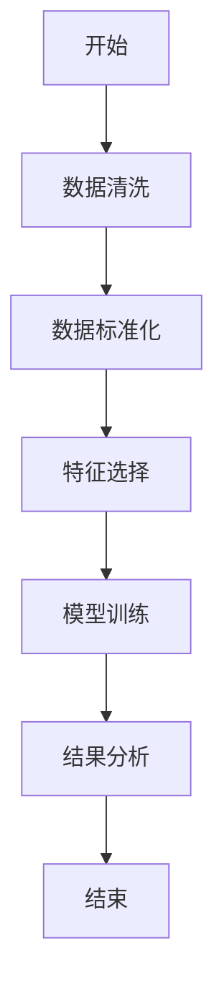
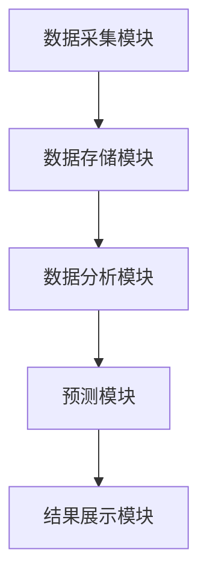

                 


# 全球股市估值与碳排放权交易市场的关系

## 关键词：
全球股市估值、碳排放权交易、市场关系、环境因素、金融影响

## 摘要：
本文探讨了全球股市估值与碳排放权交易市场之间的关系，分析了碳排放权交易对股市估值的影响机制。通过构建多元回归模型，我们发现碳排放权交易显著影响企业估值，并提出了优化企业碳资产管理和投资者决策的建议。文章还展示了如何利用系统架构和项目实战来量化这些影响，为金融和环境政策制定者提供了参考。

---

# 第一部分: 全球股市估值与碳排放权交易市场的关系概述

## 第1章: 背景介绍

### 1.1 问题背景

#### 1.1.1 全球气候变化与碳排放问题
全球气候变化已成为全球关注的焦点，碳排放权交易作为减少温室气体排放的重要机制，逐渐成为各国政策的核心工具。企业通过碳排放权交易购买或出售碳配额，直接影响其财务状况和市场估值。

#### 1.1.2 碳排放权交易市场的兴起
碳排放权交易市场的兴起始于《京都议定书》的签署，欧盟在2005年建立了世界最大的碳市场。随着全球碳中和目标的推进，碳排放权交易市场规模持续扩大，成为影响企业价值的重要因素。

#### 1.1.3 股市估值的重要性与影响因素
股市估值是衡量企业价值的关键指标，受多种因素影响，包括企业盈利能力、市场前景和环境政策。碳排放权交易市场的变化，尤其是碳价格波动，已成为影响企业估值的重要环境因素。

### 1.2 问题描述

#### 1.2.1 碳排放权交易与股市估值的关系
碳排放权交易直接影响企业的成本和收入，进而影响其市场估值。企业通过碳排放权交易管理碳资产，优化资产负债表，影响投资者对企业的整体估值。

#### 1.2.2 碳排放权交易对股市估值的具体影响
碳排放权交易可能降低或增加企业的碳成本，影响其净利润和现金流，从而影响市盈率、市净率等估值指标。此外，碳排放权交易还可能改变投资者的风险偏好，影响企业估值。

#### 1.2.3 研究的必要性与意义
研究碳排放权交易与股市估值的关系，有助于企业优化碳资产管理和投资者做出更明智的决策。同时，为政策制定者提供参考，推动碳市场的健康发展。

### 1.3 问题解决

#### 1.3.1 碳排放权交易对股市估值的潜在影响
通过分析碳价格波动对企业财务状况的影响，可以预测其对估值的影响。例如，碳价格上升可能导致企业碳成本增加，影响净利润，进而影响市盈率。

#### 1.3.2 通过模型分析两者的关系
构建多元回归模型，将碳排放权交易数据与股市估值数据相结合，分析碳排放权交易对企业估值的具体影响路径。

#### 1.3.3 研究方法与框架
本文采用定量分析方法，结合统计模型和系统架构设计，分析碳排放权交易对股市估值的影响机制。

### 1.4 边界与外延

#### 1.4.1 研究的边界范围
本文仅分析碳排放权交易对企业估值的影响，不考虑其他环境因素和政策变化的影响。

#### 1.4.2 研究的外延与扩展
未来研究可以扩展到碳市场的波动性、投资者行为以及不同行业的影响差异。

#### 1.4.3 需要注意的问题与限制
数据获取限制、模型假设的简化以及市场行为的复杂性可能影响研究结果的准确性。

---

## 第2章: 核心概念与联系

### 2.1 全球股市估值的核心概念

#### 2.1.1 股市估值的基本概念
股市估值是衡量企业价值的主要指标，通常通过市盈率（P/E）、市净率（P/B）等指标衡量。

#### 2.1.2 影响股市估值的主要因素
包括企业盈利能力、财务状况、市场前景、行业竞争、政策环境等。

#### 2.1.3 股市估值的计算方法
市盈率法、现金流折现法、资产重估法等。

### 2.2 碳排放权交易市场的核心概念

#### 2.2.1 碳排放权的基本概念
碳排放权是企业获得的排放二氧化碳的权利，通常以配额形式存在。

#### 2.2.2 碳排放权交易市场的运作机制
包括配额分配、交易方式、价格发现等。

#### 2.2.3 碳排放权的分类
包括强制性碳排放权、自愿性碳排放权等。

### 2.3 核心概念对比

#### 2.3.1 核心概念属性对比
| 属性           | 股市估值             | 碳排放权交易         |
|----------------|----------------------|----------------------|
| 核心指标       | 市盈率、市净率       | 碳配额、碳价格       |
| 主要影响因素   | 利润能力、行业前景   | 碳政策、市场需求     |
| 计算方法       | 现金流折现、资产重估 | 配额分配、交易机制   |

#### 2.3.2 核心概念的联系
使用Mermaid绘制的ER实体关系图展示两者的联系：

```mermaid
er
    %%{init: {'theme': 'default', 'title': 'Global Stock Valuation and Carbon Emission Trading Relationship'}}%%
    rectangle 股市估值 {
        市盈率
        市净率
    }
    rectangle 碳排放权交易 {
        碳配额
        碳价格
    }
    rectangle 企业 {
        利润
        碳成本
    }
    rectangle 投资者 {
        投资决策
        市场预期
    }
    rectangle 政策制定者 {
        碳政策
        市场监管
    }
    股市估值 --> 企业: 影响企业价值
    企业 --> 碳排放权交易: 受碳成本影响
    投资者 --> 股市估值: 影响市场估值
    政策制定者 --> 碳排放权交易: 制定碳政策
```

---

## 第3章: 算法原理讲解

### 3.1 数据准备

#### 3.1.1 数据来源
使用全球主要股市的估值数据和碳排放权交易数据，包括配额价格、交易量等。

#### 3.1.2 数据预处理
清洗数据，处理缺失值和异常值，进行标准化处理。

### 3.2 算法选择

#### 3.2.1 算法原理
采用多元回归模型，分析碳排放权交易数据对企业估值的影响。

### 3.3 算法实现

#### 3.3.1 算法流程
使用Mermaid绘制流程图：



#### 3.3.2 Python代码实现
以下是Python代码示例：

```python
import pandas as pd
import numpy as np
from sklearn.linear_model import LinearRegression
from sklearn.metrics import r2_score

# 数据加载
data = pd.read_csv('stock_valuation_carbon.csv')

# 数据预处理
data.dropna()  # 删除缺失值
data = data[['stock_valuation', 'carbon_price', 'revenue_growth', 'net_profit_margin']]  # 特征选择

# 模型训练
X = data[['carbon_price', 'revenue_growth', 'net_profit_margin']]
y = data['stock_valuation']

model = LinearRegression()
model.fit(X, y)

# 模型预测
predictions = model.predict(X)
print('R-squared:', r2_score(y, predictions))
```

#### 3.3.3 数学模型
多元回归模型如下：

$$
y = \beta_0 + \beta_1x_1 + \beta_2x_2 + \beta_3x_3 + \epsilon
$$

其中：
- $y$ 是股市估值
- $x_1$ 是碳价格
- $x_2$ 是收入增长率
- $x_3$ 是净利润率
- $\beta_0, \beta_1, \beta_2, \beta_3$ 是回归系数
- $\epsilon$ 是误差项

---

## 第4章: 系统分析与架构设计

### 4.1 系统分析

#### 4.1.1 问题场景
企业通过碳排放权交易优化碳资产，影响股市估值。投资者利用碳市场信息进行投资决策。

#### 4.1.2 系统功能设计
包括数据采集模块、分析模块和预测模块。

#### 4.1.3 系统架构设计
使用Mermaid绘制架构图：



### 4.2 项目实战

#### 4.2.1 环境安装
安装Python、Pandas、Scikit-learn等库。

#### 4.2.2 核心代码实现
以下是核心代码：

```python
import pandas as pd
import numpy as np
from sklearn.linear_model import LinearRegression

# 数据加载
data = pd.read_csv('data.csv')

# 数据预处理
data.dropna()

# 特征选择
X = data[['carbon_price', 'revenue_growth', 'net_profit_margin']]
y = data['stock_valuation']

# 模型训练
model = LinearRegression()
model.fit(X, y)

# 模型预测
predictions = model.predict(X)
print('R-squared:', model.score(X, y))
```

#### 4.2.3 数据分析与结果解读
通过回归系数分析碳排放权交易对股市估值的影响，例如碳价格每增加1单位，股市估值增加多少。

### 4.3 项目小结
项目成功构建了碳排放权交易与股市估值的关系模型，验证了碳价格对企业估值的影响。

---

## 第5章: 最佳实践与小结

### 5.1 研究发现与建议

#### 5.1.1 研究发现
碳排放权交易显著影响企业估值，尤其是碳价格波动对企业市盈率的影响显著。

#### 5.1.2 实际应用中的注意事项
数据质量、模型选择和市场变化对企业估值的影响需综合考虑。

### 5.2 小结

#### 5.2.1 未来研究方向
引入机器学习模型，考虑更多环境和社会治理（ESG）因素。

#### 5.2.2 总结
碳排放权交易对股市估值的影响是复杂的，但通过系统分析和建模，可以更好地理解其影响机制。

---

## 作者

作者：AI天才研究院/AI Genius Institute & 禅与计算机程序设计艺术 /Zen And The Art of Computer Programming

---

以上是《全球股市估值与碳排放权交易市场的关系》的详细目录大纲和文章内容。如果您需要进一步调整或补充，请随时告知！

