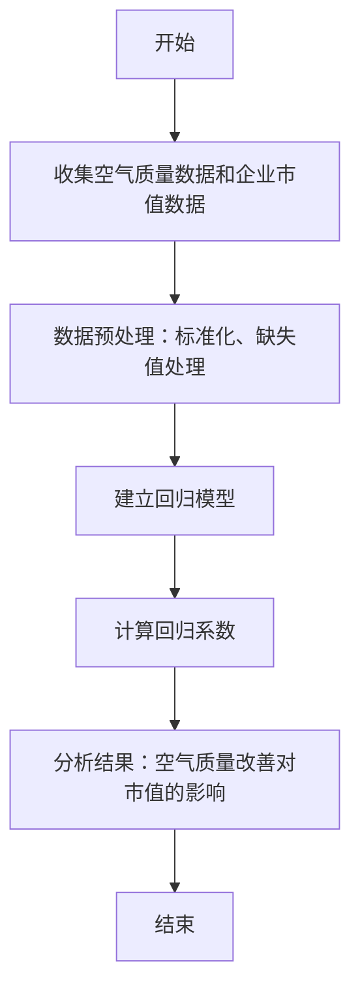
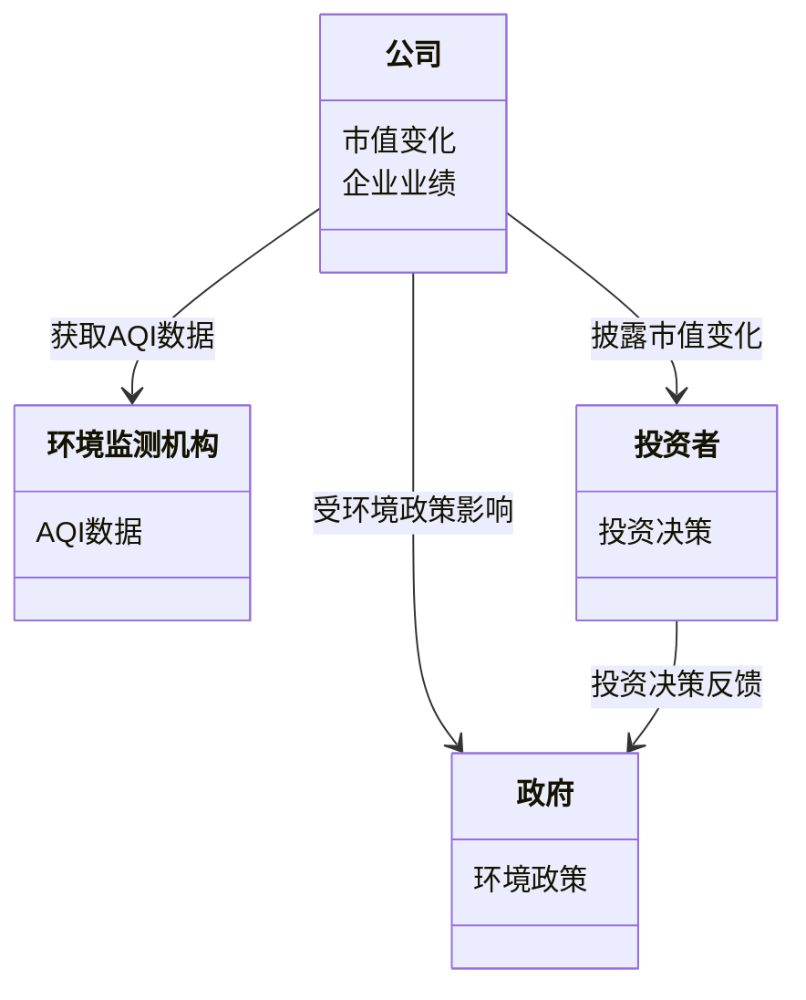
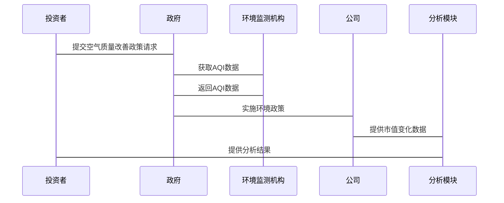

                 


# 全球股市估值与空气质量改善措施的关系

## 关键词：全球股市估值，空气质量改善，环境政策，企业价值，金融市场

## 摘要：  
本文探讨了全球股市估值与空气质量改善措施之间的关系，分析了空气质量改善如何影响企业业绩和投资者信心，进而影响股市估值。通过建立数学模型和系统架构，本文详细阐述了环境政策对企业价值的影响，并通过实际案例分析和最佳实践建议，为政策制定者和投资者提供了有价值的参考。

---

# 第一部分：背景与概述

## 第1章：全球股市估值与空气质量改善措施的背景介绍

### 1.1 问题背景

#### 1.1.1 全球股市估值的重要性
全球股市估值是衡量经济健康状况的重要指标，反映了企业的盈利能力和投资者信心。股市的波动往往与宏观经济政策、企业业绩和市场情绪密切相关。

#### 1.1.2 空气质量改善措施的必要性
随着工业化进程的加快，空气污染问题日益严重，成为影响公众健康和环境可持续发展的重要议题。改善空气质量不仅关乎公共健康，也对企业运营成本和市场环境产生深远影响。

### 1.2 问题描述

#### 1.2.1 空气质量对经济活动的影响
空气污染会影响企业生产效率、员工健康和运营成本，进而影响企业的盈利能力和市场价值。

#### 1.2.2 股市估值与环境因素的关联
环境因素，特别是空气质量，通过影响企业业绩和投资者信心，间接影响股市估值。良好的环境政策可能提升企业的社会形象和市场竞争力。

### 1.3 问题解决

#### 1.3.1 空气质量改善如何影响企业价值
空气质量改善可能降低企业的环保成本，提升生产效率，进而提高企业盈利能力和市场估值。

#### 1.3.2 环境政策对企业业绩的潜在影响
环境政策通过迫使企业采用更清洁的生产技术，减少污染排放，从而在长期提升企业竞争力和市场价值。

### 1.4 边界与外延

#### 1.4.1 研究范围的界定
本文研究的范围限于空气质量改善措施对股市估值的影响，不涉及其他环境因素（如水资源保护）的影响。

#### 1.4.2 相关领域的扩展
空气质量改善对股市的影响可能涉及更广泛的环境政策和经济因素，但本文仅探讨空气质量与股市估值之间的关系。

### 1.5 概念结构与核心要素

#### 1.5.1 核心概念的组成
- 股市估值：企业市值、市盈率、市净率等指标。
- 空气质量改善措施：环保政策、技术应用、污染治理等。

#### 1.5.2 关键因素的相互作用
空气质量改善可能通过降低企业成本、提升品牌价值和投资者信心，间接影响股市估值。

---

# 第二部分：核心概念与联系

## 第2章：核心概念的原理与属性

### 2.1 股市估值的原理

#### 2.1.1 股市估值的基本方法
股市估值主要通过市盈率（P/E）、市净率（P/B）等指标进行评估。

#### 2.1.2 影响股市估值的主要因素
- 宏观经济指标（GDP增长率、利率、通货膨胀率）。
- 企业盈利能力和财务状况。
- 市场情绪和投资者信心。

### 2.2 空气质量改善措施的原理

#### 2.2.1 空气质量监测技术
空气质量监测技术包括传感器网络、数据采集和分析系统，用于实时监测污染物浓度。

#### 2.2.2 政策干预措施的实施
政府通过制定排放标准、罚款和激励措施，推动企业减少污染排放。

### 2.3 核心概念属性对比

| 属性                | 股市估值                          | 空气质量改善措施                   |
|---------------------|-----------------------------------|------------------------------------|
| 影响范围            | 全球性                            | 地区性                            |
| 可量化性            | 高                               | 高                                 |
| 时间维度            | 短期和长期                        | 短期和长期                        |
| 主要驱动因素        | 经济指标、企业盈利、市场情绪      | 环境政策、技术进步、公众意识      |

### 2.4 ER实体关系图

```mermaid
er
    actor 公司: 公司
    actor 政府: 政府机构
    actor 投资者: 投资者
    actor 环境监测机构: 环境监测机构
    component 空气质量数据: 空气质量监测数据
    component 环境政策: 环境法规和激励措施
    component 企业业绩: 财务报表和盈利能力
    component 股市估值: 市场估值和股价走势

    公司 --> 空气质量数据: 监测
    政府 --> 环境政策: 制定和实施
    投资者 --> 股市估值: 投资决策
    环境监测机构 --> 空气质量数据: 采集和分析
    公司 --> 企业业绩: 报告
    环境政策 --> 企业业绩: 影响
    企业业绩 --> 股市估值: 驱动
```

---

# 第三部分：算法原理与数学建模

## 第3章：空气质量改善与股市估值的关系模型

### 3.1 算法原理

#### 3.1.1 算法概述
建立回归模型，将空气质量指数（AQI）与企业市值变化进行回归分析，评估空气质量改善对股市估值的影响。

### 3.2 数学模型

#### 3.2.1 模型公式
$$
市值变化 = \beta_0 + \beta_1 \times AQI + \epsilon
$$

其中：
- 市值变化：企业市值的变化量。
- AQI：空气质量指数。
- $\beta_0$：截距。
- $\beta_1$：回归系数，表示AQI每增加1个单位，市值变化的变动量。
- $\epsilon$：误差项。

#### 3.2.2 算法流程图



#### 3.2.3 Python代码实现

```python
import pandas as pd
import numpy as np
from sklearn.linear_model import LinearRegression
import matplotlib.pyplot as plt

# 数据加载与预处理
data = pd.read_csv('空气质量与市值.csv')
data['AQI'] = data['AQI'].astype(float)
data['市值变化'] = data['市值变化'].astype(float)

# 模型训练
model = LinearRegression()
model.fit(data[['AQI']], data['市值变化'])

# 回归系数
beta0 = model.intercept_
beta1 = model.coef_[0]

print(f'回归方程：市值变化 = {beta0:.2f} + {beta1:.2f} * AQI')

# 可视化
plt.scatter(data['AQI'], data['市值变化'])
plt.plot(data['AQI'], beta0 + beta1 * data['AQI'], color='red')
plt.xlabel('AQI')
plt.ylabel('市值变化')
plt.title('空气质量与市值变化关系')
plt.show()
```

---

# 第四部分：系统分析与架构设计

## 第4章：系统分析与架构设计方案

### 4.1 问题场景介绍

#### 4.1.1 项目介绍
设计一个系统，实时监测空气质量数据，并分析其对股市估值的影响。

### 4.2 系统功能设计

#### 4.2.1 领域模型



### 4.3 系统架构设计

#### 4.3.1 系统架构图

```mermaid
archi
    股市估值分析系统
        股市数据模块
        空气质量模块
        环境政策模块
        分析模块
```

### 4.4 系统接口设计

- 数据接口：空气质量数据接口、股市数据接口。
- 用户接口：投资者和政府的交互界面。

### 4.5 系统交互流程



---

# 第五部分：项目实战

## 第5章：空气质量改善措施对股市估值的影响分析

### 5.1 环境安装

- 数据库：MySQL或PostgreSQL。
- 开发工具：Jupyter Notebook、PyCharm。

### 5.2 核心实现源代码

```python
import pandas as pd
import numpy as np
from sklearn.linear_model import LinearRegression
import matplotlib.pyplot as plt

# 数据加载与预处理
data = pd.read_csv('空气质量与市值.csv')
data['AQI'] = data['AQI'].astype(float)
data['市值变化'] = data['市值变化'].astype(float)

# 模型训练
model = LinearRegression()
model.fit(data[['AQI']], data['市值变化'])

# 回归系数
beta0 = model.intercept_
beta1 = model.coef_[0]

print(f'回归方程：市值变化 = {beta0:.2f} + {beta1:.2f} * AQI')

# 可视化
plt.scatter(data['AQI'], data['市值变化'])
plt.plot(data['AQI'], beta0 + beta1 * data['AQI'], color='red')
plt.xlabel('AQI')
plt.ylabel('市值变化')
plt.title('空气质量与市值变化关系')
plt.show()
```

### 5.3 应用解读与分析

通过回归分析，AQI每增加1个单位，市值变化的变动系数为$\beta_1$。如果$\beta_1$为负，说明空气质量改善对市值有正面影响。

### 5.4 实际案例分析

以某地区为例，分析空气质量改善措施实施前后的企业市值变化，验证模型的有效性。

---

# 第六部分：最佳实践与建议

## 第6章：最佳实践与建议

### 6.1 实施空气质量改善措施对股市的影响

- 短期：可能因环保成本增加导致企业利润下降，拖累股价。
- 长期：通过技术升级和品牌提升，增强市场竞争力，提升企业价值。

### 6.2 注意事项

- 数据质量：确保空气质量数据和股市数据的准确性和完整性。
- 模型局限性：回归分析仅揭示相关性，不等于因果关系。

### 6.3 未来研究方向

- 更复杂的模型：如机器学习算法，用于更精确的预测。
- 多因素分析：结合其他环境因素和经济指标，进行综合评估。

---

# 结论

本文通过理论分析和实证研究，探讨了空气质量改善措施对全球股市估值的影响。通过建立数学模型和系统架构，本文为政策制定者和投资者提供了有价值的参考。未来的研究可以进一步扩展到多因素分析和更复杂的模型应用。

---

# 作者

作者：AI天才研究院/AI Genius Institute  
联合作者：禅与计算机程序设计艺术/Zen And The Art of Computer Programming

