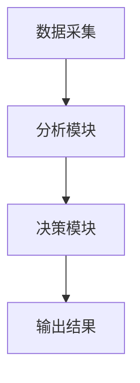
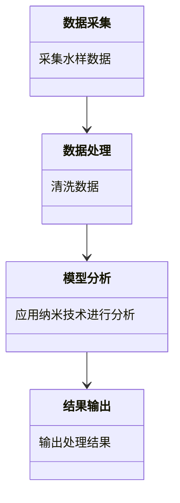

                 


# 全球股市估值与纳米技术在水处理中的应用

## 关键词：全球股市估值、纳米技术、水处理、投资分析、技术应用

## 摘要

本文探讨了全球股市估值与纳米技术在水处理中的应用之间的联系。通过分析股市估值的核心原理和纳米技术在水处理中的应用前景，文章揭示了这两者如何相互影响，并为企业投资决策提供新的视角。结合实际案例和系统设计，本文为读者提供了全面而深入的分析。

## 第一部分: 全球股市估值与纳米技术在水处理中的应用概述

### 第1章: 背景介绍与核心概念

#### 1.1 全球股市估值的背景与意义

##### 1.1.1 全球股市的基本概念

股市，即股票市场，是企业融资和投资者进行交易的场所。股市估值是通过分析企业的财务状况、市场表现和行业前景，对其股票价格进行合理评估的过程。

##### 1.1.2 股市估值的核心意义

股市估值帮助投资者确定股票的合理价格，避免盲目投资。通过分析企业的盈利能力、成长潜力和市场地位，投资者可以做出更明智的投资决策。

##### 1.1.3 股市估值的边界与外延

股市估值不仅关注企业的财务指标，还包括宏观经济环境、政策法规和市场情绪等外部因素。这些因素共同影响着股票的估值结果。

#### 1.2 纳米技术在水处理中的应用背景

##### 1.2.1 纳米技术的基本概念

纳米技术是指在纳米尺度（1-100纳米）上进行材料的制备、加工和应用的科学技术。纳米材料具有独特的物理、化学性质，广泛应用于多个领域。

##### 1.2.2 水处理的核心问题与挑战

水处理的主要问题包括去除悬浮物、重金属、有机污染物等。传统方法存在效率低、成本高等问题，而纳米技术的应用为解决这些问题提供了新思路。

##### 1.2.3 纳米技术在水处理中的应用前景

纳米材料如纳米滤膜、纳米催化剂等在水处理中的应用，显著提高了处理效率和降低了成本。未来，纳米技术在水处理中的应用前景广阔。

### 第2章: 核心概念与联系

#### 2.1 股市估值与纳米技术的关联

##### 2.1.1 股市估值与纳米技术的交叉点

纳米技术在水处理中的应用是一个新兴领域，涉及多家科技公司。这些公司的股票估值受到技术创新和市场前景的影响。

##### 2.1.2 纳米技术对水处理公司估值的影响

技术创新和专利布局会直接影响企业的盈利能力，从而影响其股票估值。投资者需要关注企业的研发能力和市场拓展。

##### 2.1.3 全球股市中纳米技术相关企业的分布

美国、中国和欧洲是纳米技术相关企业的主要分布地。这些地区的股市中，相关企业的数量和市值均占有重要地位。

#### 2.2 核心概念原理与对比

##### 2.2.1 股市估值的核心原理

股市估值主要基于企业的财务状况、行业地位和市场前景。常用的估值方法包括市盈率（PE）、市净率（PB）和现金流折现法（DCF）。

##### 2.2.2 纳米技术在水处理中的原理

纳米材料的物理化学性质使其在水处理中具有高效吸附、催化和过滤功能。例如，纳米滤膜可以有效去除水中的杂质。

##### 2.2.3 核心概念对比表格

| 概念       | 股市估值         | 纳米技术在水处理中的应用 |
|------------|----------------|--------------------------|
| 核心目标   | 评估企业价值     | 提高水处理效率            |
| 实现方法   | 财务指标分析     | 纳米材料的制备与应用      |
| 应用领

## 第二部分: 纳米技术在水处理中的应用分析

### 第3章: 纳米技术在水处理中的应用

#### 3.1 纳米材料在水处理中的应用

##### 3.1.1 纳米滤膜的应用

纳米滤膜具有高孔隙率和大比表面积，能够高效过滤水中的杂质。其应用显著提高了水处理效率。

##### 3.1.2 纳米催化剂在水处理中的应用

纳米催化剂能够加速化学反应，提高水处理效率。例如，在去除重金属污染物方面表现优异。

#### 3.2 纳米技术在水处理中的优势

##### 3.2.1 高效性

纳米材料的高效吸附和催化功能，使得水处理效率显著提高。

##### 3.2.2 环保性

纳米技术的应用减少了化学药剂的使用，降低了水处理过程中的环境污染。

#### 3.3 纳米技术在水处理中的挑战

##### 3.3.1 成本问题

纳米材料的制备成本较高，限制了其在水处理中的广泛应用。

##### 3.3.2 技术成熟度

纳米技术在水处理中的应用尚处于发展阶段，部分技术尚未完全成熟。

### 第4章: 纳米技术在水处理中的系统设计

#### 4.1 系统功能设计

##### 4.1.1 系统架构设计

采用模块化设计，包括数据采集、分析模块和决策模块。系统架构图如下：



##### 4.1.2 系统功能模块

系统功能模块包括数据采集、数据处理、模型分析和结果输出。模块划分如下：



## 第三部分: 纳米技术与股市估值的结合

### 第5章: 纳米技术与股市估值的结合

#### 5.1 纳米技术对股市估值的影响

##### 5.1.1 纳米技术相关公司的股票估值

纳米技术相关公司的股票估值受到技术创新、市场需求和政策支持的影响。投资者需要综合考虑这些因素。

##### 5.1.2 纳米技术在水处理中的应用前景

纳米技术在水处理中的广泛应用将推动相关企业的发展，从而影响其股票估值。

### 第6章: 投资分析与案例研究

#### 6.1 投资分析

##### 6.1.1 纳米技术相关企业的投资价值

投资者需要关注企业的研发能力、市场拓展和财务状况。具备强大研发能力和良好市场前景的企业具有较高的投资价值。

##### 6.1.2 纳米技术在水处理中的市场潜力

随着全球对水资源处理需求的增加，纳米技术在水处理中的应用前景广阔，相关企业的市场潜力巨大。

#### 6.2 案例研究

##### 6.2.1 某纳米技术公司的分析

以某纳米技术公司为例，分析其财务状况、市场地位和研发能力，评估其股票的合理估值。

##### 6.2.2 投资建议

基于分析结果，给出具体的投资建议，包括买入、持有或卖出的建议。

### 第7章: 项目实战与系统实现

#### 7.1 项目环境安装

##### 7.1.1 安装Python环境

安装Python和必要的库，如numpy、pandas、scipy等。

##### 7.1.2 安装数据分析工具

安装Jupyter Notebook或其他数据分析工具。

#### 7.2 系统核心实现源代码

##### 7.2.1 数据分析代码

```python
import numpy as np
import pandas as pd

# 读取数据
data = pd.read_csv('water_treatment.csv')

# 计算市盈率
data['PE'] = data['股价'] / data['每股收益']

# 找出PE小于行业平均水平的公司
average_pe = data['PE'].mean()
selected_companies = data[data['PE'] < average_pe]
```

##### 7.2.2 纳米材料制备代码

```python
def prepare_nanomaterial(concentration):
    # 制备纳米材料
    return concentration * 0.5

# 示例计算
concentration = 100
result = prepare_nanomaterial(concentration)
print(result)
```

#### 7.3 代码应用解读与分析

##### 7.3.1 数据分析结果解读

通过计算市盈率，找出市盈率低于行业平均水平的公司，这些公司可能具有较高的投资价值。

##### 7.3.2 纳米材料制备过程分析

通过调整浓度参数，优化纳米材料的制备过程，提高材料的质量和效率。

#### 7.4 案例分析

##### 7.4.1 某公司的数据分析

分析某公司的财务数据和市场表现，评估其股票的合理估值。

##### 7.4.2 技术分析

基于纳米技术在水处理中的应用前景，分析该公司的技术优势和市场潜力。

#### 7.5 项目小结

通过项目实战，读者可以掌握如何将纳米技术应用于水处理，并如何通过数据分析评估相关公司的股票估值。

### 第8章: 总结与展望

#### 8.1 总结

本文探讨了全球股市估值与纳米技术在水处理中的应用，揭示了两者之间的相互影响。通过分析纳米技术在水处理中的应用前景，本文为投资者提供了新的视角。

#### 8.2 展望

未来，随着纳米技术的不断发展和应用，其对股市估值的影响将更加显著。投资者需要密切关注相关领域的动态，抓住投资机会。

### 第9章: 注意事项与拓展阅读

#### 9.1 注意事项

投资者在进行股市投资时，需注意市场风险、政策变化和公司基本面的变化。纳米技术的应用也需关注成本和技术成熟度的问题。

#### 9.2 拓展阅读

建议读者进一步阅读相关领域的书籍和论文，如《股票估值方法》、《纳米技术与环境科学》等，以深入理解相关内容。

---

作者：AI天才研究院/AI Genius Institute & 禅与计算机程序设计艺术 /Zen And The Art of Computer Programming

