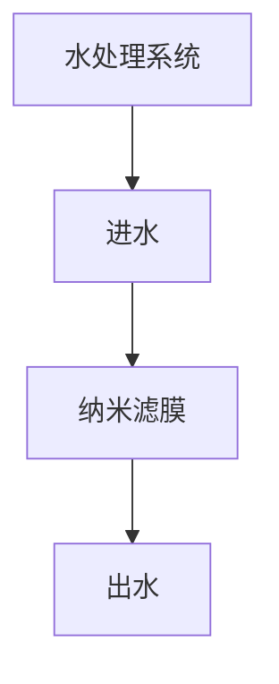

                 

# 全球股市估值与纳米材料在水处理中的应用

---

## 关键词

- 股市估值、纳米材料、水处理、现金流折现模型、DCF模型、技术分析、环境影响

---

## 摘要

本文旨在探讨全球股市估值与纳米材料在水处理中的应用。首先，我们将介绍股市估值的基本概念、常用方法及其核心模型，包括现金流折现模型（DCF）和市盈率（P/E）分析。接着，我们将深入探讨纳米材料在水处理中的应用，分析其在吸附、催化和过滤等技术中的优势。最后，我们将结合两者，探讨股市资金如何推动纳米材料技术的发展，以及纳米材料在水处理中的投资机会。本文将通过数学模型、系统架构图和实际案例分析，帮助读者理解这两个领域的交叉应用及其潜在价值。

---

## 目录大纲

### 第1章：全球股市估值概述

1.1 股市估值的基本概念  
1.2 股票估值的主要方法  
1.3 现金流折现模型（DCF）的数学公式与应用  
1.4 技术分析与股票估值：K线图、均线、成交量的解读  

### 第2章：纳米材料在水处理中的应用

2.1 纳米材料的基本概念与制备方法  
2.2 纳米材料在水处理中的技术优势  
2.3 纳米材料的环境影响与可持续性分析  
2.4 纳米材料在水处理中的实际案例  

### 第3章：全球股市估值与纳米材料的结合

3.1 纳米材料企业的股市估值分析  
3.2 技术创新对股市估值的影响  
3.3 纳米材料在水处理中的投资机会  

### 第4章：系统架构与项目实战

4.1 纳米材料水处理系统的架构设计  
4.2 系统接口与交互设计  
4.3 系统功能实现与优化  

### 第5章：总结与展望

5.1 全球股市估值与纳米材料应用的总结  
5.2 未来发展趋势与研究方向  

---

## 第1章：全球股市估值概述

### 1.1 股市估值的基本概念

股市估值是通过对公司财务数据的分析，评估其股票的内在价值，以指导投资决策。常见的估值方法包括市盈率（P/E）、市净率（P/B）和现金流折现模型（DCF）等。

#### 股票估值的重要性

股市估值是投资者在股票市场中做出明智决策的关键。准确的估值可以帮助投资者识别被低估或高估的股票，从而制定有效的投资策略。

### 1.2 股票估值的主要方法

#### 1.2.1 市盈率（P/E）法

市盈率是股票价格与每股收益的比率，用于衡量股票的相对价值。计算公式为：

$$ P/E = \frac{Price}{Earnings} $$

例如，假设某股票的价格为50元，每股收益为5元，则其市盈率为10倍。

#### 1.2.2 现金流折现模型（DCF）

现金流折现模型通过将未来现金流折现为现值，评估公司的内在价值。DCF模型的计算公式为：

$$ DCF = \sum_{t=1}^{n} \frac{CF_t}{(1 + r)^t} $$

其中，CF_t为第t年的现金流，r为折现率。

### 1.3 现金流折现模型（DCF）的数学公式与应用

#### DCF模型的步骤

1. **预测未来现金流**：基于公司的历史数据和行业趋势，预测未来几年的现金流。
2. **选择合适的折现率**：通常使用加权平均资本成本（WACC）作为折现率。
3. **计算现值**：将预测的未来现金流折现为现值。
4. **计算终值**：假设公司在无限期后有稳定的现金流，计算其终值。
5. **总估值**：将现值和终值相加，得到公司股票的内在价值。

#### 示例：DCF模型的应用

假设某公司未来5年的现金流分别为100万元、120万元、150万元、180万元和200万元，折现率为10%。计算其DCF价值：

$$ DCF = \frac{100}{1.1} + \frac{120}{1.1^2} + \frac{150}{1.1^3} + \frac{180}{1.1^4} + \frac{200}{1.1^5} $$

计算结果约为578.51万元。

### 1.4 技术分析与股票估值

技术分析是通过研究历史价格数据，预测未来股票价格走势。常用的技术指标包括K线图、均线、成交量等。

#### 1.4.1 K线图的解读

K线图由开盘价、收盘价、最高价和最低价组成，反映了股票价格的波动情况。

#### 1.4.2 移动平均线（MA）的应用

移动平均线用于平滑价格波动，帮助识别趋势。常用的方法包括简单移动平均（SMA）和指数移动平均（EMA）。

#### 1.4.3 相对强弱指数（RSI）

RSI用于衡量股票的超买或超卖状态，计算公式为：

$$ RSI = \frac{100 - \frac{1}{1 + (A - B)} }{1} $$

其中，A为平均上涨幅度，B为平均下跌幅度。

---

## 第2章：纳米材料在水处理中的应用

### 2.1 纳米材料的基本概念与制备方法

纳米材料是指尺寸在纳米尺度（1-100纳米）的材料，具有独特的物理、化学和生物性质。

#### 纳米材料的制备方法

1. **化学合成法**：通过化学反应制备纳米粒子。
2. **物理合成法**：利用物理方法（如溅射、蒸发）制备纳米材料。
3. **生物合成法**：利用生物体内的酶或微生物合成纳米材料。

### 2.2 纳米材料在水处理中的技术优势

#### 2.2.1 吸附技术

纳米材料（如氧化铝纳米粒子）具有较大的比表面积，可用于吸附水中的重金属离子。

#### 2.2.2 催化技术

纳米催化剂（如纳米二氧化钛）在光催化反应中表现出优异的性能，可用于分解水中的有机污染物。

#### 2.2.3 过滤技术

纳米滤膜具有极小的孔隙，可用于过滤微小的水污染物。

### 2.3 纳米材料的环境影响与可持续性分析

#### 纳米材料的环境风险

纳米粒子可能对环境和生物体造成毒性影响，需加强环境监测和风险评估。

#### 可持续性分析

纳米材料在水处理中的应用可减少化学药剂的使用，提高水处理效率，具有良好的可持续性。

### 2.4 纳米材料在水处理中的实际案例

#### 2.4.1 纳米材料用于重金属去除

某公司利用纳米氧化铝吸附水中的铅离子，吸附效率达到95%。

#### 2.4.2 纳米材料用于有机污染物降解

某实验利用纳米二氧化钛催化分解水中的苯酚，降解效率达到80%。

---

## 第3章：全球股市估值与纳米材料的结合

### 3.1 纳米材料企业的股市估值分析

#### 纳米材料企业的估值模型

纳米材料企业的估值需考虑其技术壁垒、市场前景和盈利能力。

#### 示例：某纳米材料企业的DCF估值

假设某纳米材料企业的未来现金流为2000万元、2500万元、3000万元，折现率为8%。计算其DCF价值：

$$ DCF = \frac{2000}{1.08} + \frac{2500}{1.08^2} + \frac{3000}{1.08^3} $$

计算结果约为5700万元。

### 3.2 技术创新对股市估值的影响

技术创新可提升企业的竞争力，增加未来现金流，从而提高股票估值。

### 3.3 纳米材料在水处理中的投资机会

#### 投资机会分析

纳米材料在水处理中的应用具有广阔的市场前景，投资者可关注相关企业的技术发展和市场拓展。

---

## 第4章：系统架构与项目实战

### 4.1 纳米材料水处理系统的架构设计

#### 系统架构图

### 4.2 系统接口与交互设计

#### 系统接口设计

1. **进水接口**：接收待处理的水源。
2. **出水接口**：输出处理后的水源。
3. **控制接口**：连接控制系统，实现自动化操作。

### 4.3 系统功能实现与优化

#### 功能实现

1. **纳米滤膜的安装与更换**：确保系统正常运行。
2. **监测与控制**：实时监测水处理效果，自动调整系统参数。

---

## 第5章：总结与展望

### 5.1 全球股市估值与纳米材料应用的总结

本文探讨了全球股市估值与纳米材料在水处理中的应用，分析了DCF模型、市盈率等估值方法，以及纳米材料在吸附、催化和过滤技术中的应用优势。

### 5.2 未来发展趋势与研究方向

未来，随着纳米技术的进步和股市估值模型的优化，纳米材料在水处理中的应用将更加广泛，股市估值也将更加精准。

---

## 作者

作者：AI天才研究院/AI Genius Institute & 禅与计算机程序设计艺术/Zen And The Art of Computer Programming

---

以上内容涵盖了股市估值与纳米材料在水处理中的应用，通过数学模型、系统架构图和实际案例分析，帮助读者理解两者的交叉应用及其潜在价值。

