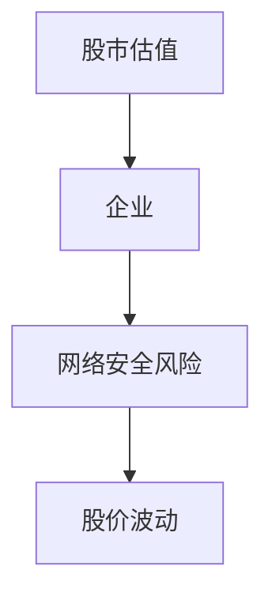
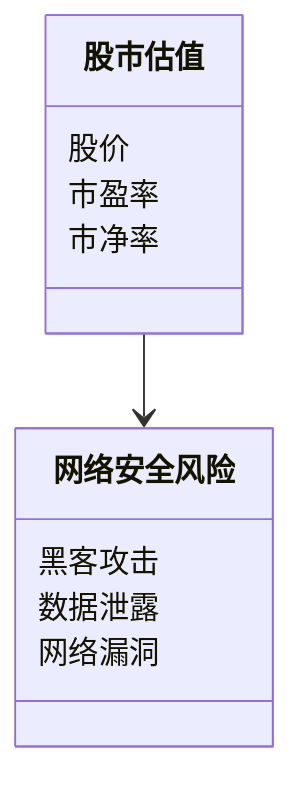
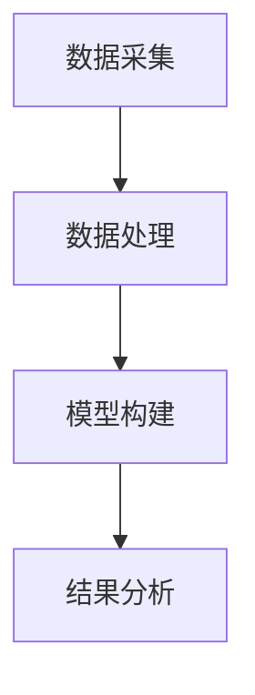

                 


# 全球股市估值与网络安全风险的关联

## 关键词
全球股市估值, 网络安全风险, 数据分析, 机器学习, 安全漏洞, 金融模型, 风险评估

## 摘要
本文深入探讨了全球股市估值与网络安全风险之间的复杂关联，从理论分析到实践应用，详细阐述了如何通过数据分析和机器学习方法量化这两者的关系。文章首先介绍了核心概念，包括股市估值和网络安全风险的定义与分类，然后通过构建数学模型和系统架构，分析了网络安全事件如何影响股市估值。最后，通过具体案例和项目实战，展示了如何在实际中应用这些模型和方法，为投资者和企业提供了重要的参考和指导。

---

# 第1章: 全球股市估值与网络安全风险的关联概述

## 1.1 问题背景

### 1.1.1 全球股市估值的重要性
全球股市估值是衡量市场健康程度的重要指标，反映了投资者对市场的信心和企业的盈利能力。然而，近年来，网络安全事件频发，对企业财务状况和市场声誉造成了重大影响，进而影响股市估值。

### 1.1.2 网络安全风险的日益突出
网络安全风险是指由于黑客攻击、数据泄露等事件可能导致的经济损失和声誉损失。随着数字化转型的加速，网络安全风险对企业和整个市场的冲击越来越大。

### 1.1.3 两者关联的现实意义
网络安全事件可能引发股价波动，甚至导致市场崩盘。因此，研究股市估值与网络安全风险的关联，有助于企业和投资者更好地应对潜在风险。

---

## 1.2 核心概念

### 1.2.1 股市估值的定义与方法
股市估值通常通过市盈率（P/E）、市净率（P/B）等指标来衡量。这些指标反映了市场对企业的整体评价。

### 1.2.2 网络安全风险的定义与分类
网络安全风险可以分为内部风险（如员工误操作）和外部风险（如黑客攻击）。

### 1.2.3 两者的关联机制
网络安全事件可能导致企业财务数据泄露，影响投资者信心，从而影响股市估值。

---

# 第2章: 核心概念与联系

## 2.1 核心概念原理

### 2.1.1 股市估值的核心要素
- 股价
- 市盈率
- 市净率

### 2.1.2 网络安全风险的特征
- 攻击频率
- 损失程度
- 影响范围

### 2.1.3 两者的相互作用
网络安全事件可能引发股价波动，而股价波动也可能加剧市场对网络安全的关注。

---

## 2.2 概念属性对比

### 2.2.1 概念属性对比表
| 属性       | 股市估值       | 网络安全风险   |
|------------|---------------|----------------|
| 定义       | 市场对企业的整体评价 | 可能对企业或市场造成损失的威胁 |
| 主要影响因素 | 财务数据、市场情绪 | 黑客攻击、数据泄露 |
| 测度方式     | 市盈率、市净率 | 损失金额、事件频率 |

### 2.2.2 ER实体关系图


---

# 第3章: 数学模型与关联分析

## 3.1 数学模型构建

### 3.1.1 数据来源与预处理
- 数据来源：历史股价数据、网络安全事件记录。
- 数据预处理：清洗、标准化。

### 3.1.2 模型假设
- 假设网络安全事件会影响股价。
- 假设影响程度与事件的严重性相关。

### 3.1.3 模型构建
使用线性回归模型，将网络安全事件的严重性作为自变量，股价波动作为因变量。

$$ y = \beta_0 + \beta_1 x + \epsilon $$

其中：
- $y$：股价波动
- $x$：网络安全事件严重性
- $\beta_0$：截距
- $\beta_1$：回归系数
- $\epsilon$：误差项

---

## 3.2 关联分析方法

### 3.2.1 统计分析法
通过相关性分析，验证网络安全事件与股价波动之间的相关性。

### 3.2.2 机器学习方法
使用随机森林或支持向量机（SVM）进行分类，预测网络安全事件对股价的影响。

### 3.2.3 深度学习模型
使用LSTM（长短期记忆网络）预测股价波动，结合网络安全事件的特征。

---

## 3.3 案例分析

### 3.3.1 典型案例
2021年某公司因数据泄露事件导致股价下跌10%。

### 3.3.2 案例分析与解读
通过分析该案例，验证模型的有效性，并提出改进建议。

---

# 第4章: 系统分析与架构设计

## 4.1 问题场景介绍

### 4.1.1 问题描述
设计一个系统，实时监控网络安全事件，并预测其对股市估值的影响。

### 4.1.2 项目目标
构建一个实时监控和预测系统。

### 4.1.3 项目范围
涵盖数据采集、分析、预测和可视化。

---

## 4.2 系统功能设计

### 4.2.1 领域模型


---

## 4.3 系统架构设计

### 4.3.1 系统架构图


---

# 第5章: 项目实战

## 5.1 环境安装

### 5.1.1 数据采集工具安装
- 使用爬虫工具（如BeautifulSoup、Scrapy）采集数据。

### 5.1.2 数据分析工具安装
- 使用Python和Pandas进行数据处理。

### 5.1.3 模型训练环境配置
- 使用TensorFlow或PyTorch进行模型训练。

---

## 5.2 核心实现

### 5.2.1 数据预处理代码
```python
import pandas as pd

# 读取数据
data = pd.read_csv('stock_data.csv')

# 数据清洗
data.dropna(inplace=True)
data = data[数据清洗后的列名]
```

### 5.2.2 模型训练代码
```python
from sklearn.linear_model import LinearRegression

# 数据分割
X = data[['网络安全事件严重性']]
y = data['股价波动']

# 模型训练
model = LinearRegression()
model.fit(X, y)

# 预测
predictions = model.predict(X)
```

---

## 5.3 案例分析

### 5.3.1 实际案例
分析某公司因网络安全事件导致的股价波动，验证模型的准确性。

---

## 5.4 项目小结

### 5.4.1 项目总结
通过本项目，我们验证了网络安全事件对股市估值的影响，并构建了一个实时监控和预测系统。

---

# 第6章: 总结与展望

## 6.1 总结
本文通过理论分析和实践应用，深入探讨了全球股市估值与网络安全风险的关联，并提出了有效的解决方案。

## 6.2 展望
未来，可以进一步研究更复杂的模型，如基于深度学习的预测模型，以提高预测精度。

---

# 作者

作者：AI天才研究院/AI Genius Institute & 禅与计算机程序设计艺术 /Zen And The Art of Computer Programming

---

以上是《全球股市估值与网络安全风险的关联》的完整目录大纲和内容概述，涵盖了从理论分析到实践应用的各个方面。

