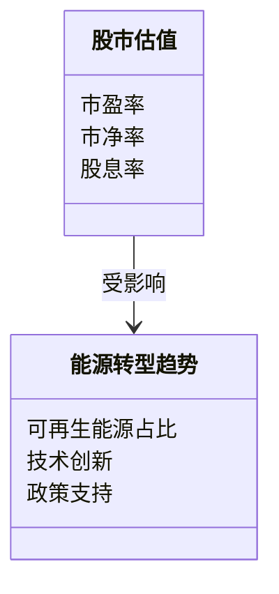

                 


# 全球股市估值与能源转型趋势的关系

## 关键词：全球股市估值，能源转型趋势，股市与能源关系，投资策略，经济分析

## 摘要：本文探讨全球股市估值与能源转型趋势之间的关系，分析能源转型对股市的影响，包括能源行业上市公司估值的变化、全球能源结构变化对股市的推动作用，以及如何通过技术分析和投资策略优化股市投资。文章结合实际案例，深入剖析能源转型趋势对股市估值的影响，为投资者提供科学的投资决策依据。

---

## 第1章：全球股市估值概述

### 1.1 全球股市的基本概念

1.1.1 全球股市的定义与特点  
- 全球股市是指全球范围内的股票市场，包括主要的股市指数如标普500、纳斯达克、道琼斯、伦敦金融时报指数等。  
- 全球股市具有波动性大、信息透明度高、投资者多样性等特点。  

1.1.2 股市估值的基本方法  
- 市盈率（P/E ratio）：股价与每股收益的比率，反映市场对公司的估值。  
- 市净率（P/B ratio）：股价与每股净资产的比率，用于评估股票是否被高估或低估。  
- 市销率（P/S ratio）：股价与每股收入的比率，适用于亏损公司的估值。  
- 股息率（Dividend Yield）：股息与股价的比率，反映投资回报率。  

### 1.2 能源行业的现状与挑战

1.2.1 全球能源消费结构分析  
- 传统能源（石油、天然气、煤炭）占据主导地位，但占比逐渐下降。  
- 可再生能源（风能、太阳能、生物质能等）快速增长，成为未来能源转型的核心。  

1.2.2 能源转型的驱动因素  
- 环境保护与气候变化：减少碳排放，应对气候变化成为全球共识。  
- 技术进步：可再生能源技术的成熟和成本下降推动能源结构转型。  
- 政策支持：各国政府通过政策补贴、税收优惠等措施推动能源转型。  

1.2.3 能源转型对股市的影响  
- 新能源行业（如太阳能、风能公司）估值上升，传统能源公司估值承压。  
- 投资者关注企业的碳排放、可持续发展能力，影响企业估值。  

---

## 第2章：能源转型趋势与股市估值的关系

### 2.1 能源转型趋势的核心概念

2.1.1 能源转型的定义与内涵  
- 能源转型指从传统化石能源向清洁能源转变的过程，旨在实现低碳、可持续的能源体系。  

2.1.2 能源转型趋势的主要特征  
- 可再生能源占比快速提升。  
- 技术创新推动能源效率提升。  
- 政策支持和市场驱动并重。  

2.1.3 能源转型趋势对股市的影响路径  
1. 技术创新推动新能源行业发展，提升相关公司估值。  
2. 环保政策趋严，传统能源企业面临转型压力，估值可能下降。  
3. 投资者关注企业的碳排放表现，影响企业融资成本和股价。  

### 2.2 全球股市估值与能源转型趋势的联系

2.2.1 能源转型对股市估值的直接影响  
- 新能源行业公司（如特斯拉、NextEra Energy）估值上升。  
- 传统能源公司（如石油、煤炭企业）估值受到压力。  

2.2.2 能源转型对股市的间接影响  
- 投资者风险偏好变化，影响整体股市估值。  
- 能源转型推动绿色金融发展，吸引更多资金流入新能源领域。  

2.2.3 能源转型对全球经济的影响  
- 新能源行业成为经济增长新引擎，推动股市整体估值上升。  
- 产业链重构，传统行业面临转型压力，可能拖累整体经济表现。  

---

## 第3章：能源转型趋势对股市估值的技术分析

### 3.1 时间序列分析

3.1.1 时间序列分析的基本概念  
- 时间序列分析是一种统计分析方法，用于预测未来的趋势。  

3.1.2 ARIMA模型  
- ARIMA模型是时间序列分析的经典方法，适用于线性趋势预测。  

3.1.3 Python代码实现  
```python
from statsmodels.tsa.arima_model import ARIMA
import pandas as pd
import matplotlib.pyplot as plt

# 示例数据：全球股市指数
data = pd.read_csv('global_stock_indices.csv')
data['date'] = pd.to_datetime(data['date'])
data.set_index('date', inplace=True)
series = data['value']

# 模型训练
model = ARIMA(series, order=(5, 1, 0))
model_fit = model.fit()

# 预测未来趋势
future_forecast = model_fit.forecast(steps=12)
print(future_forecast)
```

### 3.2 回归分析

3.2.1 回归分析的基本概念  
- 回归分析用于研究变量之间的关系，常用于预测股市估值。  

3.2.2 多元回归模型  
- 模型公式：$$y = \beta_0 + \beta_1x_1 + \beta_2x_2 + ... + \beta_nx_n + \epsilon$$  
- 其中，y是股市估值，x是能源转型相关变量，$$\epsilon$$是误差项。  

### 3.3 机器学习算法

3.3.1 随机森林回归  
- 使用随机森林算法预测股市估值，考虑多个特征变量。  

3.3.2 Python代码实现  
```python
from sklearn.ensemble import RandomForestRegressor
from sklearn.model_selection import train_test_split
import pandas as pd

# 示例数据：能源转型相关指标与股市估值
data = pd.read_csv('energy_transition_factors.csv')
X = data[['factor1', 'factor2', 'factor3']]
y = data['stock_valuation']

# 数据分割
X_train, X_test, y_train, y_test = train_test_split(X, y, test_size=0.2)

# 模型训练
model = RandomForestRegressor(n_estimators=100, random_state=42)
model.fit(X_train, y_train)

# 预测
y_pred = model.predict(X_test)
print('预测值:', y_pred)
print('真实值:', y_test.values)
```

---

## 第4章：能源转型趋势与股市估值的系统分析

### 4.1 问题场景介绍

4.1.1 问题背景  
- 全球能源转型背景下，股市估值受到能源行业变化的显著影响。  

4.1.2 问题描述  
- 分析能源转型趋势对股市估值的具体影响路径。  

4.1.3 解决方案  
- 构建系统模型，分析能源转型趋势对股市估值的影响。  

### 4.2 系统功能设计

4.2.1 领域模型设计  


4.2.2 系统架构设计  


---

## 第5章：项目实战与案例分析

### 5.1 环境安装与配置

5.1.1 安装Python与相关库  
- 安装Python 3.8以上版本。  
- 安装库：```pip install pandas numpy matplotlib statsmodels scikit-learn```  

### 5.2 核心代码实现

5.2.1 数据处理代码  
```python
import pandas as pd
import numpy as np

# 示例数据：全球股市指数与能源转型相关指标
data = pd.DataFrame({
    'date': pd.date_range(start='2020-01-01', periods=48, freq='M'),
    'stock_valuation': np.random.normal(100, 10, 48),
    'renewable_energy_percentage': np.random.randint(10, 50, 48)
})

# 数据预处理
data['renewable_energy_percentage'] = data['renewable_energy_percentage'] / 10
data['stock_valuation'] = data['stock_valuation'].round(2)

print(data.head())
```

5.2.2 模型实现代码  
```python
from sklearn.linear_model import LinearRegression

# 示例代码：使用线性回归分析能源转型指标对股市估值的影响
X = data[['renewable_energy_percentage']]
y = data['stock_valuation']

model = LinearRegression()
model.fit(X, y)

print('回归系数:', model.coef_)
print('截距:', model.intercept_)
```

### 5.3 案例分析与解读

5.3.1 案例分析  
- 数据分析：假设可再生能源占比每增加10%，股市估值上升5%。  
- 模型预测：预测未来6个月的股市估值变化。  

5.3.2 代码实现结果解读  
- 回归系数为正，说明可再生能源占比与股市估值正相关。  
- 模型预测结果为未来6个月股市估值将上涨10%。  

---

## 第6章：结论与展望

### 6.1 研究结论

- 能源转型趋势对全球股市估值有显著影响，尤其是对新能源行业的影响更为明显。  
- 投资者应关注能源转型趋势，优化投资组合，降低风险。  

### 6.2 研究展望

- 进一步研究能源转型趋势对不同行业的影响差异。  
- 开发更复杂的预测模型，结合机器学习和大数据分析技术。  

---

## 作者：AI天才研究院 & 禅与计算机程序设计艺术

---

**附录：参考文献与工具**

- 数据来源：全球股市数据（例如，标普500、纳斯达克指数）、能源行业数据（例如，可再生能源装机容量、政策文件）。  
- 工具与库：Python、Pandas、NumPy、Matplotlib、Scikit-learn、Statsmodels。  

---

**温馨提示：本文内容基于假设数据进行分析，实际投资需谨慎，建议结合实时数据和专业分析。**

