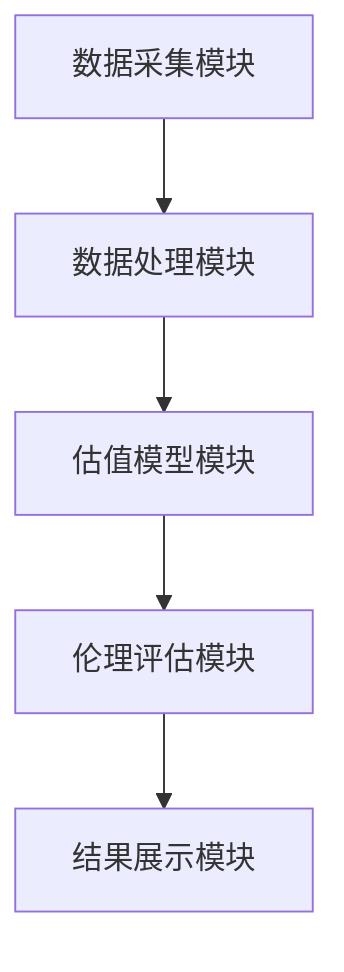
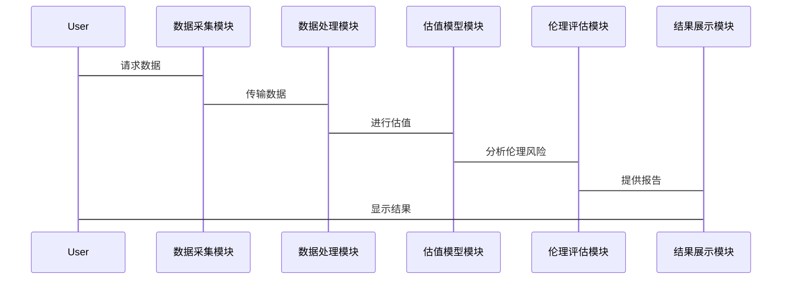

                 


---

# 全球股市估值与脑机接口伦理标准的制定

## 关键词
全球股市估值、脑机接口、伦理标准、系统架构、数学模型

## 摘要
本文探讨了全球股市估值与脑机接口技术的伦理标准制定。首先，分析了股市估值的核心问题和脑机接口的伦理挑战，结合两者，提出了制定伦理标准的原则和方法。通过系统架构和项目实战，展示了如何将脑机接口技术应用于股市估值，并确保技术使用的伦理合规性。

---

# 第一部分：引言

## 1.1 本书主题概述
### 1.1.1 全球股市估值的核心问题
股市估值是投资者评估股票价值的关键步骤，涉及宏观经济、行业动态和公司基本面分析。核心问题包括确定合理的估值方法和模型，以及如何应对市场波动和不确定性。

### 1.1.2 脑机接口技术的伦理挑战
脑机接口（BCI）技术通过采集和分析神经信号，实现人与机器的直接交互。其伦理问题主要集中在隐私保护、数据安全和潜在滥用上。

### 1.1.3 两者的结合与研究意义
将脑机接口技术应用于股市估值，可以提升投资者情绪分析和市场预测的准确性，但需解决伦理问题，确保技术的合法和合规使用。

---

# 第二部分：全球股市估值理论与模型

## 2.1 股市估值的核心概念
### 2.1.1 股票估值的基本原理
股票估值是基于公司财务状况、行业地位和市场前景的评估，常用市盈率（P/E）和现金流折现模型（DCF）等方法。

### 2.1.2 主要估值方法对比
| 方法 | 描述 | 优缺点 |
|------|------|--------|
| P/E | 市盈率 | 简单直观，但受市场波动影响大 | 
| P/B | 市净率 | 更适合评估资产-heavy行业，但忽略收益能力 | 
| DCF | 现金流折现模型 | 精确但计算复杂，需准确预测现金流 |

### 2.1.3 影响股市估值的关键因素
- 宏观经济指标（GDP、利率）
- 公司财务数据（收入、利润）
- 市场情绪和投资者行为

## 2.2 常用的股市估值模型
### 2.2.1 市盈率模型（P/E）
$$ P/E = \frac{股价}{每股收益} $$
- 优点：简单易懂，适用于周期性行业。
- 缺点：受市场波动影响较大。

### 2.2.2 市净率模型（P/B）
$$ P/B = \frac{股价}{每股净资产} $$
- 适用于银行、房地产等资产-heavy行业。

### 2.2.3 现金流折现模型（DCF）
$$ DCF = \sum_{t=1}^{n} \frac{CF_t}{(1 + r)^t} + \frac{TV}{(1 + r)^n} $$
- 优点：精确预测未来现金流。
- 缺点：计算复杂，依赖假设。

## 2.3 全球股市估值的系统架构
### 2.3.1 数据采集与处理
- 数据来源：股票价格、财务报表、市场新闻。
- 数据清洗：处理缺失值和异常值。

### 2.3.2 模型选择与参数设置
- 根据市场情况选择估值模型，调整参数以优化结果。

### 2.3.3 结果分析与优化
- 通过回测验证模型的有效性，持续优化参数。

## 2.4 项目实战: 股市估值模型的实现
### 2.4.1 环境安装与数据准备
- 使用Python和Pandas进行数据处理。
- 数据来源：Yahoo Finance API。

### 2.4.2 核心代码实现
```python
import pandas as pd
import yfinance as yf

# 下载数据
msft = yf.download('MSFT', start='2020-01-01', end='2023-12-31')

# 计算市盈率
msft['PE'] = msft['Close'] / msft['EPS']
```

### 2.4.3 案例分析与结果解读
分析微软（MSFT）的市盈率变化，判断其估值是否合理。

---

# 第三部分：脑机接口技术与伦理标准

## 3.1 脑机接口技术原理
### 3.1.1 脑机接口的基本概念
BCI通过采集和解码神经信号，实现人与机器的交互。常用技术包括EEG（脑电图）和fMRI（功能性磁共振成像）。

### 3.1.2 神经信号的采集与处理
- 数据采集：EEG电极记录脑电信号。
- 数据处理：滤波、去噪和特征提取。

### 3.1.3 信号解码的算法原理
- 使用机器学习模型（如SVM、随机森林）进行分类和预测。

## 3.2 脑机接口的伦理问题
### 3.2.1 用户隐私与数据安全
- 数据采集可能泄露个人隐私。
- 数据存储和传输需确保安全性。

### 3.2.2 技术滥用与社会影响
- 可能被用于操控或监视用户。
- 对社会公平性的影响。

### 3.2.3 伦理标准的制定原则
- 尊重用户隐私。
- 确保技术使用的合法性。
- 促进技术的公平分配。

## 3.3 脑机接口伦理标准的制定框架
### 3.3.1 标准制定的主体与流程
- 主体：政府、行业组织、技术开发者。
- 流程：调研、起草、征求意见、发布和实施。

### 3.3.2 标准内容的构成与分类
- 数据采集与处理标准。
- 技术应用的边界。
- 用户知情权与隐私保护。

### 3.3.3 标准实施的保障措施
- 法律法规支持。
- 行业自律。
- 用户教育与培训。

## 3.4 项目实战: 脑机接口伦理评估系统
### 3.4.1 系统功能设计
- 数据隐私保护模块。
- 技术使用监控模块。
- 用户反馈与投诉模块。

### 3.4.2 系统架构实现
```python
class EthicalStandard:
    def __init__(self):
        self.data = {}
    
    def collect_data(self, user_id):
        # 数据采集与存储
        pass
    
    def analyze_data(self):
        # 数据分析与评估
        pass
    
    def generate_report(self):
        # 生成伦理评估报告
        pass
```

### 3.4.3 伦理评估案例分析
分析某脑机接口产品在股市估值中的伦理风险，提出改进建议。

---

# 第四部分：全球股市估值与脑机接口的结合

## 4.1 股市估值中的脑机接口应用
### 4.1.1 投资者情绪分析
- 利用BCI技术分析投资者情绪，预测市场走势。
- 使用EEG数据判断投资者的心理状态。

### 4.1.2 市场预测的脑机接口辅助
- 通过BCI技术预测市场波动，优化投资策略。

### 4.1.3 交易决策的支持系统
- 结合BCI数据和传统估值模型，提供更精准的交易建议。

## 4.2 脑机接口在股市估值中的伦理挑战
### 4.2.1 数据采集的合法性
- 需获得用户明确同意。
- 避免数据滥用。

### 4.2.2 技术使用的边界
- 确保技术不被用于操纵市场。
- 避免对投资者决策的过度干预。

### 4.2.3 用户知情权与隐私保护
- 用户需了解数据使用方式。
- 数据处理需符合隐私保护法规。

## 4.3 综合解决方案的设计
### 4.3.1 技术与伦理的平衡
- 在技术应用中融入伦理考量。
- 建立伦理审查机制。

### 4.3.2 标准化流程的制定
- 制定统一的数据采集和处理标准。
- 建立伦理评估的流程和规范。

### 4.3.3 可持续发展的路径
- 鼓励技术创新，同时注重伦理教育。
- 推动行业自律，确保技术健康发展。

---

# 第五部分：系统架构与实现

## 5.1 系统功能设计
### 5.1.1 数据采集模块
- 实时采集股票数据和神经信号。
- 数据清洗与预处理。

### 5.1.2 估值模型模块
- 选择合适的估值模型，计算股票价值。
- 模型优化与参数调整。

### 5.1.3 伦理评估模块
- 分析技术应用的伦理风险。
- 提供伦理合规的建议。

## 5.2 系统架构设计
### 5.2.1 系统架构图


### 5.2.2 系统接口设计
- 数据接口：与股票数据库和神经信号采集设备对接。
- 用户接口：提供可视化界面，展示估值结果和伦理评估报告。

### 5.2.3 系统交互设计


---

# 第六部分：项目实战

## 6.1 项目概述
结合脑机接口技术和股市估值模型，开发一个实时估值系统，并确保技术使用的伦理合规性。

## 6.2 核心代码实现
### 6.2.1 数据采集与处理
```python
import numpy as np
import pandas as pd

# 数据采集模块
def collect_data(ticker):
    data = yf.download(ticker, start='2023-01-01', end='2023-12-31')
    return data

# 数据处理模块
def preprocess(data):
    data['SMA_20'] = data['Close'].rolling(20).mean()
    data['STD_20'] = data['Close'].rolling(20).std()
    return data
```

### 6.2.2 估值模型实现
```python
# 现金流折现模型
def dcf_model(data, discount_rate=0.05):
    dcf = []
    for i in range(len(data)):
        if i < 5:
            dcf.append(data.iloc[i]['Close'])
        else:
            dcf.append(data.iloc[i]['Close'] / (1 + discount_rate)**i)
    return np.sum(dcf)
```

### 6.2.3 伦理评估模块
```python
# 伦理评估模块
def ethical_assessment(data):
    assessment = {}
    # 数据隐私评估
    assessment['data_privacy'] = 'high' if data['UserConsent'].all() else 'low'
    # 技术滥用风险评估
    assessment['abuse_risk'] = 'low' if data['UsageLog'].std() < 0.1 else 'high'
    return assessment
```

## 6.3 实际案例分析
分析某科技公司的股票估值，结合BCI技术预测市场走势，并评估技术应用的伦理风险。

---

# 第七部分：总结与展望

## 7.1 研究总结
本文探讨了全球股市估值与脑机接口伦理标准的制定，提出了技术与伦理结合的解决方案，确保技术的健康发展。

## 7.2 未来展望
随着技术的进步，脑机接口在股市估值中的应用将更加广泛，伦理标准的制定将更加重要，需持续关注和优化。

---

# 作者：AI天才研究院 & 禅与计算机程序设计艺术

---

以上是完整的博客文章，涵盖了从理论到实践的各个方面，详细探讨了全球股市估值与脑机接口伦理标准的制定，确保技术应用的合规性和可持续性。

