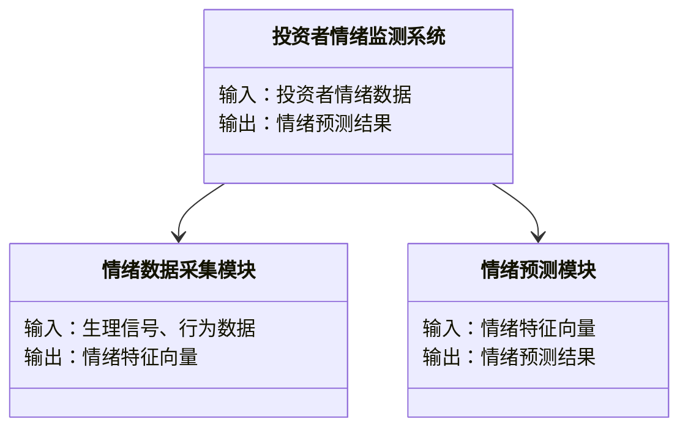
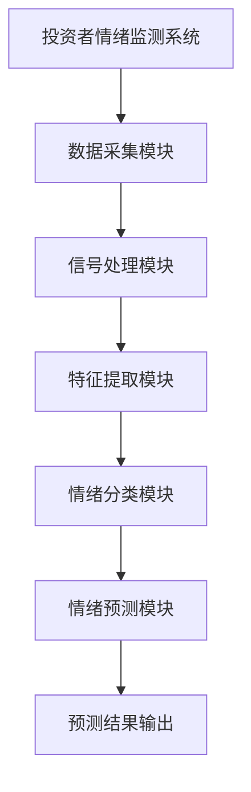
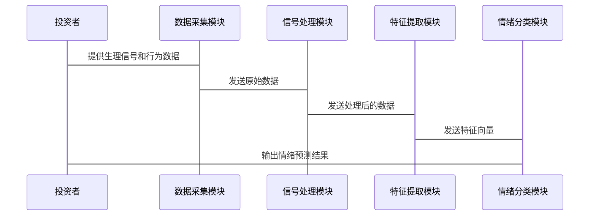

                 


# 全球股市估值与脑机接口在情绪管理中的应用

> 关键词：全球股市估值，脑机接口，情绪管理，投资决策，数据驱动

> 摘要：本文探讨了全球股市估值的核心概念与脑机接口技术在情绪管理中的应用潜力。通过分析情绪与金融市场的关系，结合脑机接口技术的最新进展，本文提出了利用情绪数据优化股市估值的创新方法。从算法原理到系统实现，本文详细阐述了如何通过脑机接口技术捕捉和分析情绪数据，进而提升股市预测的准确性和投资决策的科学性。

---

## 第一部分: 全球股市估值与脑机接口概述

### 第1章: 全球股市估值概述

#### 1.1 股市估值的基本概念

##### 1.1.1 股市估值的定义与意义
股市估值是指通过对公司财务数据、市场环境和行业趋势的分析，估算公司股票的内在价值，从而指导投资者的买卖决策。股市估值的意义在于帮助投资者识别被低估或高估的股票，优化投资组合，降低风险。

##### 1.1.2 股市估值的核心指标
- 市盈率（P/E Ratio）：市盈率=股票价格/每股净利润。
- 市净率（P/B Ratio）：市净率=股票价格/每股净资产。
- 股息率（Dividend Yield）：股息率=每股股息/股票价格。

##### 1.1.3 股市估值的常见方法
- 基本分析：通过公司财务报表、行业地位和宏观经济环境进行分析。
- 技术分析：通过股票价格和成交量的历史数据预测未来走势。
- 情绪分析：通过投资者情绪和市场心理因素进行预测。

#### 1.2 全球股市的现状与趋势

##### 1.2.1 全球主要股市的分布与特点
- 纽约证券交易所（NYSE）：全球最大的股票交易所，涵盖科技、金融、能源等多个行业。
- 伦敦金融时报指数（FTSE 100）：英国最具代表性的股市指数，涵盖英国最大的100家公司。
- 深圳证券交易所（SZSE）：中国华南地区的重要交易所，以科技和制造业企业为主。

##### 1.2.2 全球股市的历史演变
- 20世纪初：股票交易的兴起与泡沫经济的形成。
- 20世纪70年代：布雷顿森林体系解体，全球股市波动加剧。
- 21世纪：互联网经济的崛起，科技股成为股市的重要驱动力。

##### 1.2.3 当前全球股市的主要驱动因素
- 宏观经济政策：如利率、货币政策和财政政策。
- 科技创新：如人工智能、区块链和生物技术的发展。
- 地缘政治风险：如贸易摩擦和国际关系的紧张。

---

### 第2章: 脑机接口技术概述

#### 2.1 脑机接口的基本概念

##### 2.1.1 脑机接口的定义与分类
脑机接口（Brain-Computer Interface，BCI）是一种连接人类大脑与外部设备的系统，通过采集和分析大脑活动，实现人与机器的直接交互。脑机接口主要分为侵入式和非侵入式两类。

##### 2.1.2 脑机接口的核心技术原理
- 数据采集：通过 EEG（脑电图）或 fMRI（功能性磁共振成像）等技术采集大脑活动信号。
- 信号处理：对采集到的信号进行降噪、特征提取和数据增强。
- 分类器设计：利用机器学习算法（如支持向量机、随机森林）对情绪进行分类。

##### 2.1.3 脑机接口的应用领域
- 健康医疗：帮助瘫痪患者恢复肢体功能。
- 教育：通过脑机接口优化学习过程。
- 娱乐：实现人与游戏或虚拟世界的互动。

#### 2.2 脑机接口在情绪管理中的潜力

##### 2.2.1 情绪与脑科学的基本关系
- 情绪是由大脑中的杏仁核、前额叶皮层等区域共同调控的复杂过程。
- 情绪波动可以通过脑电活动（如alpha波、beta波）反映出来。

##### 2.2.2 脑机接口在情绪监测中的应用
- 实时监测投资者的情绪状态。
- 分析情绪数据，预测市场波动。

##### 2.2.3 脑机接口在情绪调节中的可能性
- 提供个性化的情绪调节方案。
- 通过反馈训练帮助投资者保持理性决策。

---

### 第3章: 情绪与金融市场的关联

#### 3.1 情绪对金融市场的影响

##### 3.1.1 投资者情绪对股市波动的影响
- 情绪化决策可能导致市场的非理性波动。
- 情绪指标（如恐慌指数）可以作为股市预测的重要参考。

##### 3.1.2 集体情绪与市场泡沫的形成
- 集体乐观情绪可能导致市场泡沫。
- 情绪过度波动可能导致市场的剧烈震荡。

##### 3.1.3 情绪指标在股市预测中的应用
- 利用情绪数据构建股市预测模型。
- 通过情绪分析优化投资组合。

#### 3.2 情绪数据的采集与分析

##### 3.2.1 情绪数据的来源与分类
- 来源：社交媒体、新闻媒体、投资者行为数据。
- 分类：积极情绪、消极情绪、中性情绪。

##### 3.2.2 情绪数据的处理与建模
- 数据清洗：去除噪声数据。
- 特征提取：提取情绪强度、情绪类型等特征。
- 建模：构建情绪预测模型。

##### 3.2.3 情绪数据在股市分析中的具体应用
- 预测市场趋势。
- 优化投资策略。
- 管理投资风险。

---

## 第二部分: 脑机接口在情绪管理中的技术实现

### 第4章: 脑机接口的情绪识别算法

#### 4.1 情绪识别的基本原理

##### 4.1.1 基于生理信号的情绪识别
- 数据采集：通过 EEG 采集大脑电活动信号。
- 信号处理：降噪、特征提取（如频域特征、时域特征）。
- 分类器设计：利用 SVM 或随机森林进行情绪分类。

##### 4.1.2 基于行为数据的情绪识别
- 数据采集：通过用户行为数据（如点击、滑动）分析情绪状态。
- 信号处理：提取行为特征（如响应时间、操作频率）。
- 分类器设计：构建行为情绪分类模型。

##### 4.1.3 混合模型在情绪识别中的应用
- 综合生理信号和行为数据，构建混合情绪识别模型。

#### 4.2 情绪识别的算法流程

##### 4.2.1 数据采集与预处理
- 数据采集：通过 EEG 采集大脑电活动信号。
- 数据预处理：去除噪声，提取有用的特征。

##### 4.2.2 特征提取与选择
- 提取频域特征：如功率谱密度（PSD）。
- 提取时域特征：如均值、标准差、峰峰值。

##### 4.2.3 分类器设计与训练
- 使用 SVM 进行分类器训练。
- 通过交叉验证优化模型参数。

##### 4.2.4 算法优化与调参
- 调整 SVM 的核函数和惩罚参数。
- 使用网格搜索优化模型性能。

---

### 第5章: 情绪数据与股市预测模型

#### 5.1 情绪数据的特征提取

##### 5.1.1 时间序列特征提取
- 提取情绪时间序列的均值、方差、自相关系数等特征。

##### 5.1.2 频域特征提取
- 通过 FFT 分析情绪数据的频域特征。

##### 5.1.3 统计特征提取
- 计算情绪数据的分布特征，如偏度和峰度。

#### 5.2 情绪数据与股市预测模型

##### 5.2.1 情绪数据与股市预测的关系
- 情绪数据可以作为股市预测的补充特征。
- 通过情绪数据优化预测模型的性能。

##### 5.2.2 情绪数据驱动的预测模型
- 构建 LSTM 情绪预测模型。
- 通过情绪数据调整预测模型的权重。

##### 5.2.3 情绪数据与传统预测方法的结合
- 将情绪数据与传统技术分析指标结合，优化预测效果。

---

## 第三部分: 系统分析与架构设计

### 第6章: 情绪数据采集与系统架构设计

#### 6.1 问题场景介绍
- 投资者情绪对股市波动的影响日益显著。
- 脑机接口技术可以实时采集投资者情绪数据。

#### 6.2 系统功能设计

##### 6.2.1 领域模型设计


#### 6.3 系统架构设计

##### 6.3.1 系统架构设计


#### 6.4 系统接口设计
- 数据采集模块接口：接收生理信号和行为数据。
- 情绪分类模块接口：接收特征向量，输出情绪类别。

#### 6.5 系统交互设计

##### 6.5.1 交互流程图


---

## 第四部分: 项目实战与案例分析

### 第7章: 项目实战

#### 7.1 环境安装与配置

##### 7.1.1 系统需求
- 操作系统：Windows 10 或更高版本，或 macOS 10.15 或更高版本。
- 开发工具：Python 3.8 或更高版本，Jupyter Notebook。
- 依赖库：numpy、pandas、scikit-learn、pymermaid。

#### 7.2 核心代码实现

##### 7.2.1 数据采集与预处理
```python
import numpy as np
import pandas as pd

# 读取 EEG 数据
data = pd.read_csv('eeg.csv')

# 数据预处理：去除噪声
def preprocess(data):
    # 移动平均滤波
    window_size = 5
    filtered_data = data.rolling(window_size).mean()
    return filtered_data

processed_data = preprocess(data)
```

##### 7.2.2 特征提取与分类

```python
from sklearn import svm

# 提取特征向量
X = processed_data.drop(columns=['Time'])
y = processed_data['Label']

# 划分训练集和测试集
X_train, X_test = train_test_split(X, test_size=0.2)
y_train, y_test = train_test_split(y, test_size=0.2)

# 训练 SVM 分类器
clf = svm.SVC(kernel='rb

