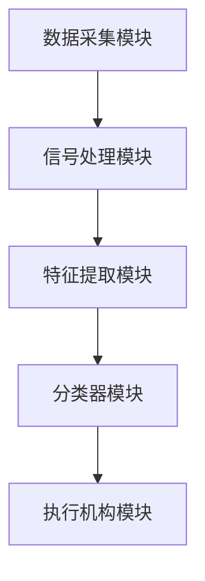
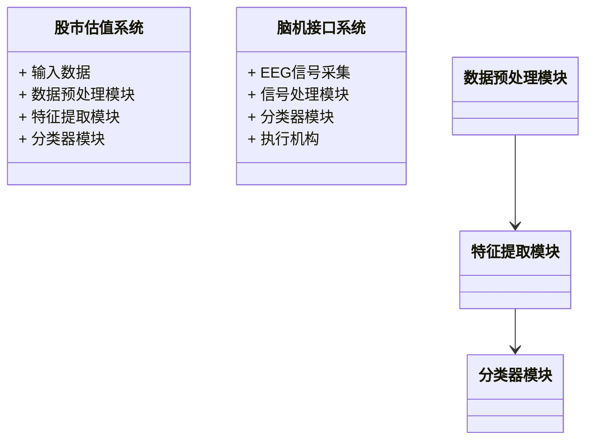

                 


# 全球股市估值与脑机接口在残疾人辅助中的应用

## 关键词：
- 全球股市估值
- 脑机接口
- 残疾人辅助
- 大数据分析
- 机器学习
- 人工智能

## 摘要：
本文探讨了全球股市估值的方法和技术，以及脑机接口技术在帮助残疾人的应用。通过分析股市数据和脑机接口技术的结合，展示了如何利用先进的技术手段解决实际问题，为投资者和残疾人提供创新的解决方案。

---

## 第1章：全球股市估值的背景与方法

### 1.1 股市估值的基本概念
股市估值是通过对股票内在价值的评估，判断其市场价格是否合理。股票代表了公司的一部分所有权，投资者通过购买股票成为公司的股东。股市估值的核心在于分析公司的财务状况、行业地位、盈利能力等因素，从而确定股票的合理价格。

#### 1.1.1 常用估值指标
- **市盈率（PE）**：股价与每股收益的比率。计算公式为：
  $$ PE = \frac{\text{股价}}{\text{每股收益}} $$
- **市净率（PB）**：股价与每股净资产的比率。计算公式为：
  $$ PB = \frac{\text{股价}}{\text{每股净资产}} $$
- **股息率**：每年派发的股息与股价的比率。计算公式为：
  $$ \text{股息率} = \frac{\text{股息}}{\text{股价}} \times 100\% $$

### 1.2 技术分析在股市估值中的应用
技术分析通过研究历史价格和成交量数据，预测未来的价格走势。常用的技术指标包括：
- **K线图**：显示股票的价格走势，包括开盘价、收盘价、最高价和最低价。
- **移动平均线（MA）**：一定时间段内价格的平均值，用于判断趋势。
- **相对强弱指数（RSI）**：衡量价格超买或超卖状态的指标。

### 1.3 大数据与机器学习在股市分析中的应用
- **数据收集与清洗**：通过爬虫技术获取历史数据，并进行数据清洗。
- **特征提取**：从数据中提取有用的特征，如开盘价、收盘价、成交量等。
- **模型训练**：使用机器学习算法（如LSTM）进行时间序列预测，预测未来的价格走势。

## 第2章：脑机接口技术的基本原理

### 2.1 脑机接口的概念与组成
脑机接口（BCI）是一种将大脑信号转化为计算机可识别指令的技术。其主要组成部分包括：
- **信号采集**：通过 EEG 电极采集大脑电信号。
- **信号处理**：对采集到的信号进行滤波、降噪等处理。
- **特征提取**：提取有用的特征，如脑电波的频率和幅度。
- **分类器设计**：利用机器学习算法对特征进行分类，生成控制指令。

### 2.2 脑机接口在医疗领域的应用
脑机接口技术在帮助残疾人恢复运动功能方面具有重要作用。例如：
- **控制机械臂**：通过EEG信号控制机械臂完成抓取动作。
- **康复训练**：通过实时反馈帮助患者恢复肌肉控制能力。

## 第3章：脑机接口在残疾人辅助中的具体应用

### 3.1 系统设计与实现
- **系统架构**：包括信号采集模块、信号处理模块、分类器模块和执行机构模块。
- **算法实现**：使用支持向量机（SVM）或随机森林（RF）进行分类。

### 3.2 项目实战
#### 3.2.1 环境配置
- 安装必要的库：numpy、scipy、sklearn、pyEEG。
#### 3.2.2 数据采集与处理
```python
import numpy as np
import pandas as pd

# 数据采集
data = pd.read_csv('eeg_data.csv')
# 数据处理
from scipy.signal import butterworth
def apply_filter(data, cutoff_freq):
    # Butterworth滤波器设计
    nyq = 0.5 * data.shape[0]
    norm_cutoff = cutoff_freq / nyq
    b, a = butterworth(2, norm_cutoff, 'low')
    filtered_data = np.convolve(data, b, mode='same')
    return filtered_data
```

## 第4章：脑机接口与股市分析的结合

### 4.1 脑机接口在股市预测中的应用
- **情绪分析**：通过分析投资者的情绪波动，预测市场走势。
- **实时反馈**：利用脑机接口技术，为投资者提供实时的决策支持。

### 4.2 系统架构设计


## 第5章：系统架构设计

### 5.1 系统功能设计
- **数据采集**：采集EEG信号。
- **信号处理**：对信号进行滤波和降噪。
- **特征提取**：提取有用的特征。
- **分类器设计**：使用机器学习算法进行分类。

### 5.2 系统架构图


## 第6章：项目实战

### 6.1 环境配置
- **安装必要的库**：numpy、scipy、sklearn、pyEEG。

### 6.2 核心实现
```python
from sklearn import svm
from sklearn.metrics import accuracy_score

# 训练模型
model = svm.SVC()
model.fit(X_train, y_train)

# 模型预测
y_pred = model.predict(X_test)
print("准确率：", accuracy_score(y_test, y_pred))
```

## 第7章：最佳实践、小结与注意事项

### 7.1 最佳实践
- 在股市分析中，建议结合多种指标进行综合判断。
- 在脑机接口设计中，选择合适的传感器和算法是关键。

### 7.2 小结
本文详细探讨了全球股市估值和脑机接口技术在残疾人辅助中的应用，展示了如何通过技术手段解决实际问题。

### 7.3 注意事项
- 股市投资存在风险，需谨慎操作。
- 脑机接口技术仍处于发展阶段，需进一步优化。

---

## 作者：AI天才研究院/AI Genius Institute & 禅与计算机程序设计艺术 /Zen And The Art of Computer Programming

