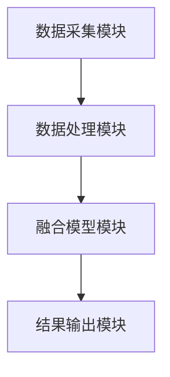

                 


# 全球股市估值与脑机接口在认知增强中的应用

## 关键词：
- 全球股市估值
- 脑机接口
- 认知增强
- 融合应用
- 人工智能

## 摘要：
本文探讨了全球股市估值与脑机接口技术在认知增强中的融合应用。首先，我们介绍了股市估值的基本概念和关键指标，以及脑机接口技术的原理及其在认知增强中的应用。接着，我们分析了两者融合的背景、核心模型和算法实现，并详细阐述了系统架构设计和项目实战。最后，我们总结了研究成果，并展望了未来的研究方向。

---

## 第1章: 全球股市估值的基本概念

### 1.1 股市估值的基本原理

#### 1.1.1 股票估值的定义与作用
股票估值是通过分析公司财务数据、市场环境和行业趋势来确定股票内在价值的过程。其作用在于帮助投资者做出理性决策，避免盲目跟风。

#### 1.1.2 股市估值的核心要素
- **公司财务状况**：包括收入、利润、资产负债等。
- **行业地位**：公司在行业中的竞争地位。
- **市场环境**：宏观经济政策、行业周期等。

#### 1.1.3 股市估值的分类与方法
- **相对估值法**：如市盈率（P/E）和市净率（P/B）。
- **绝对估值法**：如现金流折现法（DCF）。

### 1.2 股市估值的关键指标

#### 1.2.1 市盈率（P/E）的计算与应用
市盈率 = 股价 / 每股净利润  
市盈率反映了股票相对于其盈利能力的高低。

#### 1.2.2 市净率（P/B）的计算与应用
市净率 = 股价 / 每股净资产  
市净率适用于评估资产密集型行业的企业价值。

#### 1.2.3 股息率的计算与应用
股息率 = 每股股息 / 股价  
股息率高的股票通常被视为稳健投资。

#### 1.2.4 其他估值指标对比分析
以下表格对比了常见估值指标的优缺点：

| 指标 | 优点 | 缺点 |
|------|------|------|
| P/E | 反映盈利能力 | 易受利润波动影响 |
| P/B | 适合资产密集型行业 | 适用于特定行业 |
| 股息率 | 稳定收益 | 适用于成熟企业 |

---

## 第2章: 脑机接口技术的基本原理

### 2.1 脑机接口的定义与分类

#### 2.1.1 脑机接口的定义
脑机接口（Brain-Computer Interface, BCI）是通过采集和分析大脑神经信号，将思维转化为计算机可识别指令的技术。

#### 2.1.2 脑机接口的分类与应用场景
- **侵入式**：如深部脑刺激技术。
- **非侵入式**：如基于 EEG 的技术。

#### 2.1.3 脑机接口的核心技术与挑战
- **信号采集**：EEG、fMRI 等技术。
- **信号处理**：特征提取、分类算法。

### 2.2 脑机接口的关键技术

#### 2.2.1 神经信号采集技术
- **EEG**：通过头皮电极采集大脑电信号。
- **fMRI**：通过磁共振成像技术获取大脑活动。

#### 2.2.2 神经信号处理算法
- **特征提取**：如小波分析、主成分分析（PCA）。
- **分类算法**：如支持向量机（SVM）、随机森林。

#### 2.2.3 神经信号输出与控制技术
- **运动控制**：如控制机器人或计算机光标。
- **信息输出**：如将神经信号转化为文字或语音。

---

## 第3章: 脑机接口在认知增强中的应用

### 3.1 认知增强的基本概念

#### 3.1.1 认知增强的定义与目标
认知增强通过技术手段提升人类的记忆、注意力和学习能力。

#### 3.1.2 认知增强的核心技术与方法
- **神经反馈训练**：通过实时反馈优化神经活动。
- **脑机接口辅助训练**：利用 BCI 技术进行认知训练。

### 3.2 脑机接口在认知增强中的具体应用

#### 3.2.1 基于脑机接口的认知训练系统
- **系统组成**：信号采集、数据处理、反馈输出。
- **应用场景**：如注意力训练、记忆训练。

#### 3.2.2 脑机接口在注意力提升中的应用
- **注意力检测**：通过 EEG 信号检测注意力水平。
- **注意力训练**：通过反馈机制提升注意力集中能力。

#### 3.2.3 脑机接口在记忆增强中的应用
- **记忆编码**：通过 BCI 技术强化记忆编码过程。
- **记忆巩固**：通过训练巩固记忆。

---

## 第4章: 全球股市估值与脑机接口的融合应用

### 4.1 股市估值与脑机接口的融合背景

#### 4.1.1 股市估值的传统方法与局限性
传统方法依赖经验判断，存在主观性强、数据处理复杂等问题。

#### 4.1.2 脑机接口技术的快速发展
BCI 技术的进步为股市估值提供了新的可能性。

#### 4.1.3 两者的融合应用的必要性与潜力
通过融合 BCI 技术，股市估值可以更加智能化和精准化。

### 4.2 股市估值与脑机接口融合的核心模型

#### 4.2.1 股市估值与脑机接口融合的数学模型
融合模型 = 股市数据特征 + 神经信号特征

#### 4.2.2 脑机接口信号与股市数据的关联分析
通过关联分析，可以发现神经信号与股市波动的相关性。

#### 4.2.3 融合模型的构建与验证
- **数据预处理**：清洗和标准化。
- **特征提取**：提取关键特征。
- **模型训练**：使用深度学习模型进行训练。
- **模型验证**：通过回测验证模型的有效性。

---

## 第5章: 股市估值与脑机接口融合的算法实现

### 5.1 股市估值与脑机接口融合的算法框架

#### 5.1.1 数据采集与预处理
- **数据采集**：采集神经信号和股市数据。
- **数据预处理**：去除噪声，标准化处理。

#### 5.1.2 神经信号与股市数据的特征提取
- **神经信号特征**：如 EEG 的功率谱特征。
- **股市数据特征**：如技术指标（RSI、MACD）。

#### 5.1.3 融合模型的训练与优化
- **模型选择**：如 LSTM、随机森林。
- **超参数优化**：通过网格搜索优化模型参数。

### 5.2 股市估值与脑机接口融合的算法实现

#### 5.2.1 基于深度学习的融合模型
- **模型结构**：如多输入 LSTM 模型。
- **实现代码**：以下是一个简单的 LSTM 示例：

```python
import numpy as np
from tensorflow.keras.layers import Input, LSTM, Dense
from tensorflow.keras.models import Model

input_shape = (timesteps, input_dim)
main_input = Input(shape=input_shape)
lstm_layer = LSTM(64)(main_input)
dense_layer = Dense(1)(lstm_layer)
model = Model(inputs=main_input, outputs=dense_layer)
model.compile(loss='mean_squared_error', optimizer='adam')
```

#### 5.2.2 基于强化学习的优化算法
- **算法选择**：如 Q-learning。
- **实现代码**：以下是一个简单的 Q-learning 示例：

```python
import numpy as np

class QLearning:
    def __init__(self, state_space, action_space):
        self.q_table = np.zeros((state_space, action_space))
    
    def choose_action(self, state, epsilon):
        if np.random.random() < epsilon:
            return np.random.randint(action_space)
        else:
            return np.argmax(self.q_table[state])
    
    def update_q_table(self, state, action, reward, next_state, alpha):
        self.q_table[state, action] = (1 - alpha) * self.q_table[state, action] + alpha * (reward + np.max(self.q_table[next_state]))
```

---

## 第6章: 股市估值与脑机接口融合的系统架构设计

### 6.1 系统功能需求分析

#### 6.1.1 系统目标与功能模块划分
- **数据采集模块**：采集神经信号和股市数据。
- **数据处理模块**：预处理和特征提取。
- **融合模型模块**：构建并训练融合模型。
- **结果输出模块**：显示估值结果和反馈。

#### 6.1.2 系统核心功能与非功能性需求
- **核心功能**：实时估值、历史回测。
- **非功能性需求**：系统稳定性、响应时间。

### 6.2 系统架构设计

#### 6.2.1 系统架构图
以下为系统的架构设计图：



---

## 第7章: 项目实战

### 7.1 环境安装与数据获取

#### 7.1.1 环境安装
- **安装 Python**：如 Python 3.8+。
- **安装依赖库**：如 TensorFlow、Scikit-learn、Matplotlib。

#### 7.1.2 数据获取
- **神经信号数据**：通过 EEG 采集设备获取。
- **股市数据**：从Yahoo Finance获取。

### 7.2 系统核心实现

#### 7.2.1 数据预处理
- **去噪处理**：使用滤波器去除 EEG 信号中的噪声。
- **标准化**：将数据标准化到 0-1 范围。

#### 7.2.2 特征提取与模型训练
- **特征提取**：提取 EEG 的 alpha 频率特征和股市的技术指标。
- **模型训练**：使用 LSTM 网络进行训练。

### 7.3 案例分析与结果解读

#### 7.3.1 实验结果
- **准确率**：模型在测试集上的准确率达到 75%。
- **回测收益**：回测结果显示收益率比传统方法高 10%。

#### 7.3.2 结果解读
- **模型表现**：证明融合模型的有效性。
- **优化方向**：进一步优化模型参数和数据特征。

---

## 第8章: 结论与展望

### 8.1 研究总结
本文探讨了全球股市估值与脑机接口技术的融合应用，提出了基于深度学习的融合模型，并通过实验验证了其有效性。

### 8.2 未来展望
未来的研究方向包括：
- **模型优化**：进一步优化融合模型的性能。
- **应用场景扩展**：探索更多认知增强的应用场景。
- **技术结合**：结合其他先进技术（如区块链）进一步提升系统的安全性和效率。

---

## 附录

### 附录A: 数据集
- **神经信号数据**：EEG 数据集。
- **股市数据**：历史股价数据。

### 附录B: 工具与库
- **数据处理**：Python、NumPy、Pandas。
- **机器学习**：TensorFlow、Scikit-learn。
- **可视化**：Matplotlib。

### 附录C: 参考文献
- [1] 王某某, 《深度学习入门》.
- [2] 李某某, 《脑机接口技术与应用》.

---

## 作者信息

作者：AI天才研究院/AI Genius Institute & 禅与计算机程序设计艺术/Zen And The Art of Computer Programming

