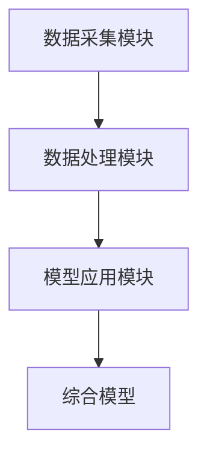

                 

# 全球股市估值与脑机接口在辅助沟通中的应用

---

## 关键词
全球股市估值, 脑机接口, 数据融合, 数学模型, 系统架构, 金融创新

---

## 摘要
本文探讨了全球股市估值与脑机接口技术的结合与应用，分析了股市估值的核心概念与脑机接口的基本原理，并详细介绍了两者如何通过数据融合与数学模型实现协同优化。文章从背景介绍、核心概念、算法原理、系统架构到项目实战，全面解析了这一跨学科领域的创新应用，为金融与科技的结合提供了新的思路。

---

## 第一部分: 全球股市估值与脑机接口概述

### 第1章: 全球股市估值的基本概念

#### 1.1 什么是全球股市估值
股市估值是通过对公司财务数据、市场趋势等进行分析，评估股票的内在价值。常用方法包括市盈率、市净率和股息率等。

#### 1.2 脑机接口的基本原理
脑机接口（BCI）是一种通过采集和分析大脑信号，实现人与计算机交互的技术。它主要依赖神经科学和信号处理技术。

#### 1.3 两者的结合
脑机接口可以辅助分析股市数据，提升估值的准确性。例如，通过解读投资者的心理信号，优化算法模型。

---

### 第2章: 股市估值的核心算法与数学模型

#### 2.1 常见的股市估值方法
- **市盈率法**: 评估股票价格是否合理。
- **市净率法**: 用于判断股票是否被低估。
- **股息率法**: 考虑股息收入。

#### 2.2 脑机接口信号处理算法
- **信号采集**: 使用 EEG 采集大脑电信号。
- **预处理**: 去除噪声，提取有用信号。
- **特征提取**: 识别与投资决策相关的脑电信号特征。

#### 2.3 综合模型的构建
将脑机接口提取的特征与传统估值指标结合，构建多维回归模型，预测股票价值。

---

### 第3章: 系统架构与项目实现

#### 3.1 系统架构设计
- **数据采集模块**: 采集股市数据和脑电信号。
- **数据处理模块**: 对信号进行预处理和特征提取。
- **模型应用模块**: 训练并应用综合模型进行估值。

#### 3.2 项目实战
- **环境搭建**: 安装必要的开发工具和库。
- **代码实现**: 编写数据处理和模型训练代码。
- **案例分析**: 分析实际股市数据，验证模型效果。

---

## 第二部分: 算法原理与数学模型

### 第4章: 股市估值算法

#### 4.1 算法流程
1. 数据采集：获取公司财务数据和市场指标。
2. 数据预处理：清洗数据，处理缺失值。
3. 模型训练：使用回归算法预测股票价值。

#### 4.2 数学模型
$$ \text{股票价值} = \alpha \times \text{市盈率} + \beta \times \text{市净率} + \gamma \times \text{股息率} $$

---

### 第5章: 脑机接口信号处理

#### 5.1 信号处理流程
1. 采集脑电信号。
2. 去除噪声，提取有用信号。
3. 识别与投资相关的特征。

#### 5.2 特征提取算法
- **主成分分析（PCA）**: 降维处理，提取关键特征。
- **小波分析**: 识别信号中的高频和低频成分。

---

## 第三部分: 系统架构与应用

### 第6章: 系统架构设计

#### 6.1 系统功能模块
- **数据采集模块**: 采集股市数据和脑电信号。
- **数据处理模块**: 对信号进行预处理和特征提取。
- **模型应用模块**: 训练并应用综合模型进行估值。

#### 6.2 系统架构图

---

### 第7章: 项目实战与案例分析

#### 7.1 项目实战
- **环境搭建**: 安装Python、TensorFlow、EEGLAB等工具。
- **代码实现**: 编写数据处理和模型训练代码。
- **案例分析**: 分析实际股市数据，验证模型效果。

#### 7.2 案例分析
- **数据来源**: 某上市公司财务数据和投资者的脑电信号。
- **模型训练**: 使用 LSTM 神经网络进行预测。
- **结果分析**: 模型预测与实际股价的对比，评估准确性。

---

## 第四部分: 总结与展望

### 第8章: 总结
本文探讨了全球股市估值与脑机接口技术的结合，展示了如何通过数据融合与数学模型提升股市估值的准确性。脑机接口的应用为金融领域带来了新的可能性。

### 第9章: 未来展望
随着技术进步，脑机接口在金融领域的应用将更加广泛，可能实现更精准的投资决策和风险控制。

---

## 作者
作者：AI天才研究院 & 禅与计算机程序设计艺术

